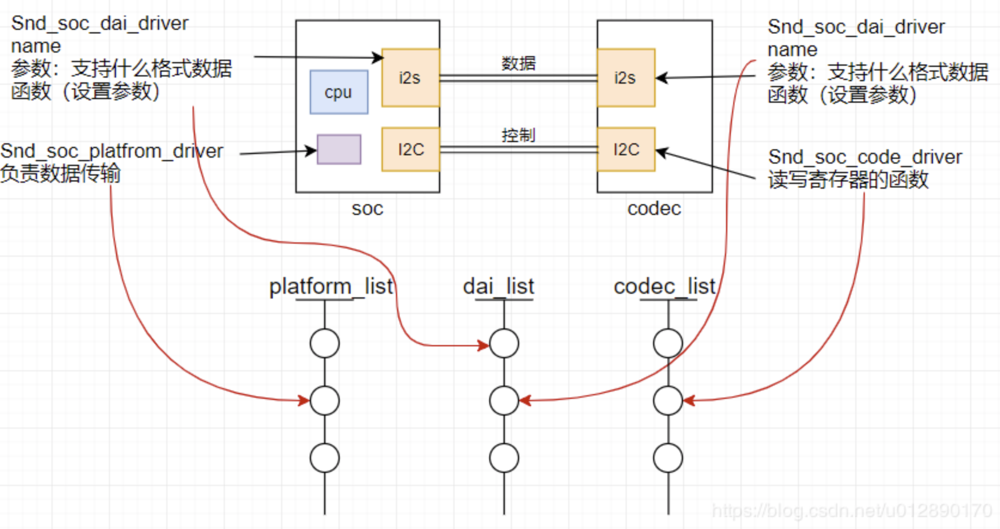
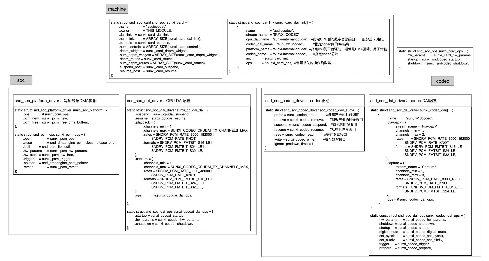
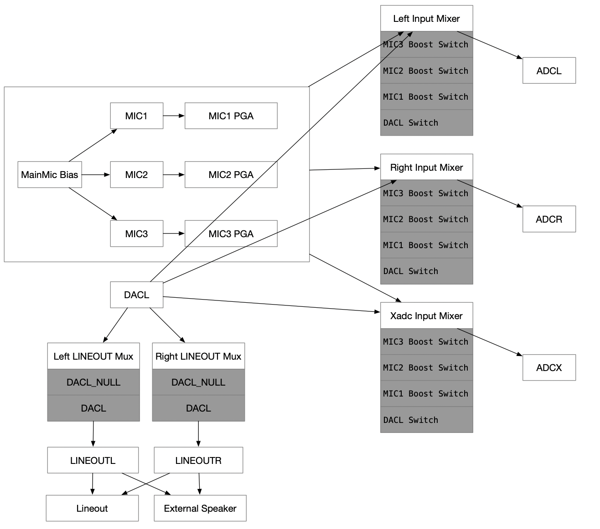

1.12 alsa基本框架和内部codec使用
======================================

1.12.1 alsa基本框架
--------------------------------------

ALSA(Advanced Linux Sound Architecture)是linux上主流的音频结构，\
在没有出现ALSA架构之前，一直使用的是OSS(Open Sound System)音频架构主要的区别就是在OSS架构下，\
App访问底层是直接通过Sound设备节点访问的。而在ALSA音频架构下，App是通过ALSA提供的alsa-lib库访问底层硬件的操作，\
不再访问Sound设备节点了。这样做的好处可以简化App实现的难度。

1.12.1.1 从proc文件系统开始入手分析alsa
`````````````````````````````````````````````
.. code-block:: shell
    :linenos:

    cd /proc/asound 
    ls

    card0   //声卡0
    cards   //系统可用的声卡
    devices //alsa下所有注册的声卡子设备，包括 control pcm timer seq等等
    version //ALSA版本信息
    ...等等


    cd /dev/snd
    ls
    controlC0 //用于声卡的控制，比如通道选择，混音，麦克风控制等等
    midiC0D0  //用于播放midi音频
    pcmC0D0c  //用于录音的pcm设备
    pcmC0D0p  //用于播放的pcm设备
    seq       //音序器
    timer     //定时器

alsa的proc接口信息在sound/core/sound.c中实现，主要工作：

* 注册声卡字符设备
* 在proc下创建声卡相关文件
* 为声卡子设备创建设备节点

1.12.1.2 asoc框架
``````````````````````````````````````
ASOC(Alsa System on Chip) 用于实现那些集成了声音控制器 的CPU，\
是建立在标准ALSA驱动层上，为了更好的支持嵌入式处理器和移动设备的音频Codec的一套软件体系，\
在ASoc出现之前，内核对SOC中的音频已经有了部分的支持，不过会有一些局限性：

* 局限性1：Codec驱动与SoC CPU的底层耦合过于紧密，这种不理想会导致代码的重复，例如，仅是wm8731的驱动，\
  当时Linux中有分别针对4个平台的驱动代码。
* 局限性2：音频事件没有标准的方法来通知用户，例如耳机、麦克风的插拔和检测，这些事件在移动设备中是非常普通的，\
  而且通常都需要特定于机器的代码进行重新对音频路劲进行配置。
* 局限性3：当进行播放或录音时，驱动会让整个codec处于上电状态，这对于PC没问题，但对于移动设备来说，这意味着浪费大量的电量。\
  同时也不支持通过改变过取样频率和偏置电流来达到省电的目的。





1.12.1.3 asoc数据流
``````````````````````````````````````

**alsa打开数据流程**：

.. code-block:: c
    :linenos:

    soc_pcm_open => 
    cpu_dai->driver->ops->startup => 
    platform->driver->ops->open => 
    codec_dai->driver->ops->startup => 
    rtd->dai_link->ops->startup    
    
**alsa的HW_param流程**：

.. code-block:: c
    :linenos:

    soc_pcm_hw_params => 
    rtd->dai_link->ops->hw_params => 
    codec_dai->driver->ops->hw_params => 
    cpu_dai->driver->ops->hw_params => 
    platform->driver->ops->hw_params    

**alsa的Prepare流程**：

.. code-block:: c
    :linenos:

    snd_pcm_prepare => 
    snd_pcm_action_nonatomic =>
    snd_pcm_action_group => 
    snd_pcm_do_prepare => 
    substream->ops->prepare => 
    soc_pcm_prepare => 
    rtd->dai_link->ops->prepare => 
    platform->driver->ops->prepare => 
    codec_dai->driver->ops->prepare => 
    cpu_dai->driver->ops->prepare   

**alsa的Write流程**：

.. code-block:: c
    :linenos:

    snd_pcm_playback_ioctl => 
    snd_pcm_playback_ioctl1 => 
    SNDRV_PCM_IOCTL_WRITEN_FRAMES => 
    snd_pcm_lib_writev => 
    snd_pcm_lib_write1 => 
    |||| =>  
    snd_pcm_lib_writev_transfer => 
    copy_from_user [copy user speace data to dma]  
    snd_pcm_start => 
    snd_pcm_action => 
    snd_pcm_action_group => 
    snd_pcm_do_start => 
    substream->ops->trigger

**alsa的Trigger流程**：

.. code-block:: c
    :linenos:

    substream->ops->trigger => 
    soc_pcm_trigger => 
    codec_dai->driver->ops->trigger => 
    platform->driver->ops->trigger => 
    cpu_dai->driver->ops->trigger     

1.12.2 内部Codec代码分析
--------------------------------------

R328内部Codec支持3路ADC和一路DAC。

1.12.2.1 配置文件
``````````````````````````````````````

**相关源代码**：

.. code-block:: text
    :linenos:

    lichee/linux-4.9/sound/soc/sunxi
    lichee/linux-4.9/sound/soc/codec

    sun8iw18-codec.c     codec驱动
    sun8iw18-sndcodec.c  codec machine驱动
    sunxi-cpudai.c       codec platform驱动

    sunxi-pcm.c          通用文件，提供注册platform驱动的接口及相关函数集
    sunxi_rw_func.c      通用文件，读写模拟/数字寄存器的接口    

**makefile配置**：

.. code-block:: makefile
    :linenos:

    obj-$(CONFIG_SND_SUN8IW18_CODEC) += sun8iw18-codec.o
    obj-$(CONFIG_SND_SUNXI_SOC_SUN8IW18_CODEC) += sun8iw18-sndcodec.o
    obj-$(CONFIG_SND_SUNXI_SOC_CPUDAI) += snd-soc-sunxi-cpudai.o
    obj-$(CONFIG_SND_SUNXI_SOC_RWFUNC) += snd-soc-sunxi-rwfunc.o

    snd-soc-sunxi-objs := sunxi-pcm.o
    snd-soc-sunxi-rwfunc-objs := sunxi_rw_func.o
    snd-soc-sunxi-cpudai-objs := sunxi-cpudai.o
    
**kernel配置**：

.. code-block:: text
    :linenos:

    config SND_SUNXI_SOC_SUN8IW11_CODEC
        tristate "Allwinner Sun8iw11 Codec Support"
        select SND_SUNXI_SOC
        select SND_SOC_GENERIC_DMAENGINE_PCM
        select REGMAP_MMIO
        select SND_SUN8IW11_CODEC
        select SND_SUNXI_SOC_CPUDAI
        select SND_SUNXI_SOC_RWFUNC
        depends on ARCH_SUN8IW11
        help
            Select Y or M to add support for the Codec embedded in the Allwinner
            SUN8IW11 and affiliated SoCs. 

**fex配置**：

.. code-block:: text
    :linenos:

    [sndcodec]
    sndcodec_used = 0x1
    ;------------------------------------------------------------------------------
    [cpudai]
    cpudai_used = 0x1
    ;-------------------------------------------------------------------------------
    [codec]
    codec_used = 0x1
    digital_vol = 0x0
    lineout_vol =0x1a
    mic1gain = 0x4
    mic2gain = 0x4
    mic3gain = 0x0
    adcgain = 0x3
    adcagc_cfg = 0x0
    adcdrc_cfg = 0x0
    adchpf_cfg = 0x0
    dacdrc_cfg = 0x0
    dachpf_cfg = 0x0
    pa_ctl_level = 0x1
    pa_msleep_time = 160
    gpio-spk = port:PH9<1><1><1><1>

**dts配置**：

.. code-block:: text
    :linenos:

    codec@0x05096000 {
        compatible = "allwinner,sunxi-internal-codec";
        reg = <0x0 0x5096000 0x0 0x2c0 0x0 0x5096300 0x0 0x4 0x0 0x5090000 0x0 0x7c 0x0 0x5091000 0x0 0x7c 0x0 0x5092000 0x0 0x7c>;
        clocks = <0x4 0x24 0x38 0x25 0x29 0x2d>;
        pa_ctl_level = <0x1>;
        digital_vol = <0x0>;
        lineout_vol = <0x1a>;
        mic1gain = <0x4>;
        mic2gain = <0x4>;
        mic3gain = <0x0>;
        adcgain = <0x3>;
        adcdrc_cfg = <0x0>;
        adchpf_cfg = <0x0>;
        dacdrc_cfg = <0x0>;
        dachpf_cfg = <0x0>;
        pa_msleep_time = <0xa0>;
        status = "okay";
        linux,phandle = <0x3f>;
        phandle = <0x3f>;
        device_type = "codec";
        adcagc_cfg = <0x0>;
        gpio-spk = <0x39 0x7 0x9 0x1 0x1 0x1 0x1>;
    };

    cpudai-controller@0x05096000 {
        compatible = "allwinner,sunxi-internal-cpudai";
        reg = <0x0 0x5096000 0x0 0x2c0>;
        status = "okay";
        linux,phandle = <0x3e>;
        phandle = <0x3e>;
        device_type = "cpudai";
    };

    sound@0 {
        compatible = "allwinner,sunxi-codec-machine";
        interrupts = <0x0 0x3d 0x4 0x0 0x3e 0x4>;
        sunxi,cpudai-controller = <0x3e>;
        sunxi,audio-codec = <0x3f>;
        status = "okay";
        device_type = "sndcodec";
    };

1.12.2.2 sunxi-internal-codec
``````````````````````````````````````

**入口函数**：

.. code-block:: c
    :linenos:

    #define	DRV_NAME	"sunxi-internal-codec"

    static const struct of_device_id sunxi_internal_codec_of_match[] = {
        { .compatible = "allwinner,sunxi-internal-codec", },
        {},
    };

    static struct platform_driver sunxi_internal_codec_driver = {
        .driver = {
            .name = DRV_NAME,
            .owner = THIS_MODULE,
            .of_match_table = sunxi_internal_codec_of_match,
        },
        .probe = sunxi_codec_dev_probe,
        .remove = __exit_p(sunxi_codec_dev_remove),
    };    

**sunxi_codec_dev_probe**：

.. code-block:: text
    :linenos:

    1.建立sunxi_codec结构体
    dev_set_drvdata(&pdev->dev, sunxi_codec);
    sunxi_codec->dev = &pdev->dev;

    2.获取dts中clocks信息并使能对应的时钟
    clocks = <0x4 0x24 0x38 0x25 0x29 0x2d>;

    sunxi_codec->pllclk = of_clk_get(np, 0);
    sunxi_codec->pllclkx4 = of_clk_get(np, 1);
    sunxi_codec->moduleclk = of_clk_get(np, 2);
    clk_prepare_enable(sunxi_codec->pllclk)
    clk_prepare_enable(sunxi_codec->pllclkx4)
    clk_prepare_enable(sunxi_codec->moduleclk)

    3.获取dts中的reg信息并做iomap
    reg = <0x0 0x5096000 0x0 0x2c0     //digital baseaddress
        0x0 0x5096300 0x0 0x4       //analog baseaddress
        0x0 0x5090000 0x0 0x7c      //i2s0
        0x0 0x5091000 0x0 0x7c      //i2s1
        0x0 0x5092000 0x0 0x7c>;    //i2s2

    of_address_to_resource(np, 0, &res);
    memcpy(&(sunxi_codec->digital_res), &res, sizeof(struct resource));
    sunxi_codec->addr_dbase = of_iomap(np, 0);

    sunxi_codec->regmap = devm_regmap_init_mmio(&pdev->dev, sunxi_codec->addr_dbase, &sunxi_codec_regmap_config);
    //MMIO(Memory mapping I/O)			

    of_address_to_resource(np, 1, &res);
    memcpy(&(sunxi_codec->analog_res), &res, sizeof(struct resource));
    sunxi_codec->addr_abase = of_iomap(np, 1);

    //of_address_to_resource:分析reg属性以获取内存基地址、大小等信息并填充到struct resource结构体中
    //of_iomap:过设备结点直接进行设备内存区间的ioremap
    //ioreamp:将一个IO地址空间映射到内核的虚拟地址空间上去，便于访问。参数为要映射的起始的IO地址和大小。

    4.获取设置参数
    pa_ctl_level = <0x1>;
    digital_vol = <0x0>;
    lineout_vol = <0x1a>;
    mic1gain = <0x4>;
    mic2gain = <0x4>;
    mic3gain = <0x0>;
    adcgain = <0x3>;
    adcdrc_cfg = <0x0>;
    adchpf_cfg = <0x0>;
    dacdrc_cfg = <0x0>;
    dachpf_cfg = <0x0>;

    of_property_read_u32(np, "lineout_vol", &temp_val);
    sunxi_codec->gain_cfg.lineout_vol = temp_val;

    of_property_read_u32(np, "mic1gain", &temp_val);
    sunxi_codec->gain_cfg.mic1gain = temp_val;

    of_property_read_u32(np, "mic2gain", &temp_val);
    sunxi_codec->gain_cfg.mic2gain = temp_val;

    of_property_read_u32(np, "mic3gain", &temp_val);
    sunxi_codec->gain_cfg.mic3gain = temp_val;

    of_property_read_u32(np, "adcgain", &temp_val);
    sunxi_codec->gain_cfg.adcgain = temp_val;

    of_property_read_u32(np, "pa_msleep_time", &temp_val);
    sunxi_codec->spk_cfg.pa_msleep_time = temp_val;

    of_property_read_u32(np, "pa_ctl_level", &temp_val);
    sunxi_codec->spk_cfg.pa_ctl_level = temp_val;

    of_property_read_u32(np, "adcdrc_cfg", &temp_val);
    sunxi_codec->hw_cfg.adcdrc_cfg = temp_val;

    of_property_read_u32(np, "adchpf_cfg", &temp_val);
    sunxi_codec->hw_cfg.adchpf_cfg = temp_val;

    of_property_read_u32(np, "dacdrc_cfg", &temp_val);
    sunxi_codec->hw_cfg.dacdrc_cfg = temp_val;

    of_property_read_u32(np, "dachpf_cfg", &temp_val);
    sunxi_codec->hw_cfg.dachpf_cfg = temp_val;

    5.获取控制外部功放的gpio并使能
    gpio-spk = port:PH9<1><1><1><1>
    复用类型 上下拉 驱动能力 电平

    gpio-spk = <0x39 0x7 0x9 0x1 0x1 0x1 0x1>;

    sunxi_codec->spk_cfg.gpio = of_get_named_gpio_flags(np, "gpio-spk", 0,
                        (enum of_gpio_flags *)&config_gpio);

    devm_gpio_request(&pdev->dev, sunxi_codec->spk_cfg.gpio, "SPK");
    gpio_direction_output(sunxi_codec->spk_cfg.gpio, 1);
    gpio_set_value(sunxi_codec->spk_cfg.gpio, !(sunxi_codec->spk_cfg.pa_ctl_level));

    6.注册codec到alsa，添加到codec list和dai list
    snd_soc_register_codec(&pdev->dev, &soc_codec_dev_sunxi,sunxi_codec_dai, ARRAY_SIZE(sunxi_codec_dai));

    7.调试接口
    sysfs_create_group(&pdev->dev.kobj, &audio_debug_attr_group);

    static DEVICE_ATTR(audio_reg, 0644, show_audio_reg, store_audio_reg);

    static struct attribute *audio_debug_attrs[] = {
        &dev_attr_audio_reg.attr,
        NULL,
    };

    static struct attribute_group audio_debug_attr_group = {
        .name   = "audio_reg_debug",
        .attrs  = audio_debug_attrs,
    };  

**soc_codec_dev_sunxi**：内部codec设备驱动

.. code-block:: text
    :linenos:

    static struct snd_soc_codec_driver soc_codec_dev_sunxi = {
        .probe = sunxi_codec_probe,        //创建声卡的时候调用
        .remove = sunxi_codec_remove,      //卸载声卡的时候调用
        .suspend = sunxi_codec_suspend,    //待机的时候调用
        .resume = sunxi_codec_resume,      //从待机恢复调用
        .read = sunxi_codec_read,          //寄存器读接口
        .write = sunxi_codec_write,        //寄存器写接口
        .ignore_pmdown_time = 1,
    };

    ;-------------------------------------------------------------------------------
    sunxi_codec_probe：machine创建声卡的时候会调用，硬件初始化。

    1.获取对应的结构体
    struct snd_soc_dapm_context *dapm = &codec->component.dapm;
    struct sunxi_codec_info *sunxi_codec = snd_soc_codec_get_drvdata(codec);
    sunxi_codec->codec = codec;

    2.control操作创建
    snd_soc_add_codec_controls(codec, sunxi_codec_controls,ARRAY_SIZE(sunxi_codec_controls));
    snd_soc_dapm_new_controls(dapm, sunxi_codec_dapm_widgets,ARRAY_SIZE(sunxi_codec_dapm_widgets));
    snd_soc_dapm_add_routes(dapm, sunxi_codec_dapm_routes,ARRAY_SIZE(sunxi_codec_dapm_routes));

    3.根据配置相关硬件寄存器初始化
    sunxi_codec_init()

    4.创建信号量
    mutex_init(&(sunxi_codec->dac_mutex));
    mutex_init(&(sunxi_codec->adc_mutex));

    ;-------------------------------------------------------------------------------
    sunxi_codec_remove：声卡卸载的时候会调用

    1.获取对应的结构体
    struct sunxi_codec_info *sunxi_codec = snd_soc_codec_get_drvdata(codec);

    2.销毁信号量
    mutex_destroy(&(sunxi_codec->adc_mutex));
    mutex_destroy(&(sunxi_codec->dac_mutex));

    ;-------------------------------------------------------------------------------
    sunxi_codec_suspend：待机时候的操作

    1.获取对应的结构体
    struct sunxi_codec_info *sunxi_codec = snd_soc_codec_get_drvdata(codec);

    2.保存寄存器
    save_audio_reg(sunxi_codec);

    3.关闭PA控制GPIO功能
    gpio_set_value(sunxi_codec->spk_cfg.gpio, !(sunxi_codec->spk_cfg.pa_ctl_level));
    sunxi_gpio_iodisable(sunxi_codec->spk_cfg.gpio);

    4.关闭时钟
    clk_disable_unprepare(sunxi_codec->moduleclk);
    clk_disable_unprepare(sunxi_codec->pllclkx4);
    clk_disable_unprepare(sunxi_codec->pllclk);

    ;-------------------------------------------------------------------------------
    sunxi_codec_resume：从待机恢复时调用

    1.获取对应的结构体
    struct sunxi_codec_info *sunxi_codec = snd_soc_codec_get_drvdata(codec);

    2.打开时钟并等待时钟稳定
    clk_prepare_enable(sunxi_codec->pllclk);
    clk_prepare_enable(sunxi_codec->pllclkx4);
    clk_prepare_enable(sunxi_codec->moduleclk);
    msleep(20);

    3.重新初始化gpio，不使能PA
    gpio_direction_output(sunxi_codec->spk_cfg.gpio, 1);
    gpio_set_value(sunxi_codec->spk_cfg.gpio, !sunxi_codec->spk_cfg.pa_ctl_level);

    4.重新初始化codec寄存器
    sunxi_codec_init(codec);

    5.寄存器恢复
    echo_audio_reg(sunxi_codec);

**sunxi_codec_dai**：

.. code-block:: text
    :linenos:

    static struct snd_soc_dai_driver sunxi_codec_dai[] = {
        {
            .name	= "sun8iw18codec",
            .playback = {
                .stream_name = "Playback",
                .channels_min = 1,
                .channels_max = 2,
                .rates	= SNDRV_PCM_RATE_8000_192000
                    | SNDRV_PCM_RATE_KNOT,
                .formats = SNDRV_PCM_FMTBIT_S16_LE
                    | SNDRV_PCM_FMTBIT_S24_LE
                    | SNDRV_PCM_FMTBIT_S32_LE,
            },
            .capture = {
                .stream_name = "Capture",
                .channels_min = 1,
                .channels_max = 3,
                .rates = SNDRV_PCM_RATE_8000_48000
                    | SNDRV_PCM_RATE_KNOT,
                .formats = SNDRV_PCM_FMTBIT_S16_LE
                    | SNDRV_PCM_FMTBIT_S24_LE,
            },
            .ops = &sunxi_codec_dai_ops,
        },
    };

    static const struct snd_soc_dai_ops sunxi_codec_dai_ops = {
        .hw_params	= sunxi_codec_hw_params,
        .shutdown	= sunxi_codec_shutdown,
        .startup	= sunxi_codec_startup,
        .digital_mute	= sunxi_codec_digital_mute,
        .set_sysclk	= sunxi_codec_set_sysclk,
        .set_clkdiv	= sunxi_codec_set_clkdiv,
        .trigger	= sunxi_codec_trigger,
        .prepare	= sunxi_codec_prepare,
    };

    ;-------------------------------------------------------------------------------
    sunxi_codec_hw_params：硬件参数设定

    1.format设定
    SNDRV_PCM_FORMAT_S16_LE/SNDRV_PCM_FORMAT_S32_LESNDRV_PCM_FORMAT_S24_LE
    播放和录音设置对应的寄存器

    2.采样率设定
    设定对应的寄存器，录音最大到48k

    3.channel设定
    设定对应的寄存器，放音可以设置单/双通道，录音可以最多设置3通道

    ;-------------------------------------------------------------------------------
    sunxi_codec_shutdown：关闭声卡的操作

    1.获取对应的结构体
    struct sunxi_codec_info *sunxi_codec = snd_soc_codec_get_drvdata(codec);

    2.关闭drc和hpf
    dacdrc_enable(codec, 0);
    dachpf_enable(codec, 0);

    adcdrc_enable(codec, 0);
    adchpf_enable(codec, 0);

    ;-------------------------------------------------------------------------------
    sunxi_codec_startup：打开声卡的操作

    1.获取对应的结构体
    struct snd_soc_codec *codec = dai->codec;
    struct sunxi_codec_info *sunxi_codec = snd_soc_codec_get_drvdata(codec);

    2.打开drc和hpf
    dacdrc_enable(codec, 1);
    dachpf_enable(codec, 1);

    adcdrc_enable(codec, 1);
    adchpf_enable(codec, 1);

    ;-------------------------------------------------------------------------------
    sunxi_codec_digital_mute：静音操作

    这里为空，抗pop声，由soc-core调用

    ;-------------------------------------------------------------------------------
    sunxi_codec_set_sysclk：设置主时钟

    1.获取对应的结构体
    struct snd_soc_codec *codec = dai->codec;
    struct sunxi_codec_info *sunxi_codec = snd_soc_codec_get_drvdata(codec);

    2.设置主时钟频率
    clk_set_rate(sunxi_codec->pllclk, freq)

    ;-------------------------------------------------------------------------------
    sunxi_codec_set_clkdiv：设置分频系数

    这里为空

    ;-------------------------------------------------------------------------------
    sunxi_codec_trigger：数据传送的开始，暂停，恢复和停止时，该函数会被调用

    1.获取对应的结构体
    struct snd_soc_codec *codec = dai->codec;
    struct sunxi_codec_info *sunxi_codec = snd_soc_codec_get_drvdata(codec);

    2.对fifo的操作
    SNDRV_PCM_TRIGGER_START/SNDRV_PCM_TRIGGER_RESUME/SNDRV_PCM_TRIGGER_PAUSE_RELEASE
    regmap_update_bits(sunxi_codec->regmap, SUNXI_DAC_FIFO_CTL, (1<<DAC_DRQ_EN), (1<<DAC_DRQ_EN));
    regmap_update_bits(sunxi_codec->regmap, SUNXI_ADC_FIFO_CTL, (1<<ADC_DRQ_EN), (1<<ADC_DRQ_EN));

    SNDRV_PCM_TRIGGER_STOP/SNDRV_PCM_TRIGGER_SUSPEND/SNDRV_PCM_TRIGGER_PAUSE_PUSH
    regmap_update_bits(sunxi_codec->regmap, SUNXI_DAC_FIFO_CTL, (1<<DAC_DRQ_EN), (0<<DAC_DRQ_EN));
    regmap_update_bits(sunxi_codec->regmap, SUNXI_ADC_FIFO_CTL, (1<<ADC_DRQ_EN), (0<<ADC_DRQ_EN));

    ;-------------------------------------------------------------------------------
    sunxi_codec_prepare：正式开始数据传送之前会调用该函数，该函数通常会完成dma操作的必要准备工作

    1.获取对应的结构体
    struct snd_soc_codec *codec = dai->codec;

    2.对fifo的操作
    snd_soc_update_bits(codec, SUNXI_DAC_FIFO_CTL, (1<<FIFO_FLUSH), (1<<FIFO_FLUSH));
    snd_soc_write(codec, SUNXI_DAC_FIFO_STA, (1 << DAC_TXE_INT | 1 << DAC_TXU_INT | 1 << DAC_TXO_INT));
    snd_soc_write(codec, SUNXI_DAC_CNT, 0);

    snd_soc_update_bits(codec, SUNXI_ADC_FIFO_CTL, (1<<ADC_FIFO_FLUSH), (1<<ADC_FIFO_FLUSH));
    snd_soc_write(codec, SUNXI_ADC_FIFO_STA, (1 << ADC_RXA_INT | 1 << ADC_RXO_INT));
    snd_soc_write(codec, SUNXI_ADC_CNT, 0);   

    
**相关的寄存器操作**：

.. code-block:: text
    :linenos:

    1.digital register part

    sunxi_codec->addr_dbase = of_iomap(np, 0);
    sunxi_codec->regmap = devm_regmap_init_mmio(&pdev->dev, sunxi_codec->addr_dbase, &sunxi_codec_regmap_config);
    //MMIO(Memory mapping I/O)

    digtial部分相关的寄存器可以通过readl writel regmap_write regmap_read来操作寄存器

    2.Analog register part, not using regmap
    sunxi_codec->addr_abase = of_iomap(np, 1);

    analog部分相关寄存器通过readl writel来操作

    3.snd_soc_write/snd_soc_read/snd_soc_update_bits
    该驱动大部分时候都调用上述三个函数操作寄存器
    这三个函数属于标准函数，通过下面的回掉完成操作
    .read = sunxi_codec_read,          //寄存器读接口
    .write = sunxi_codec_write,        //寄存器写接口

    static int sunxi_codec_write(struct snd_soc_codec *codec,unsigned int reg, unsigned int val)
    {
        struct sunxi_codec_info *sunxi_codec = snd_soc_codec_get_drvdata(codec);
        if (reg >= SUNXI_PR_CFG) {
            /* Analog part */
            reg = reg - SUNXI_PR_CFG;
            write_prcm_wvalue(reg, val, sunxi_codec->addr_abase);
        } else {
            regmap_write(sunxi_codec->regmap, reg, val);
        }
        return 0;
    };

    static unsigned int sunxi_codec_read(struct snd_soc_codec *codec,unsigned int reg)
    {
        struct sunxi_codec_info *sunxi_codec = snd_soc_codec_get_drvdata(codec);
        unsigned int reg_val;

        if (reg >= SUNXI_PR_CFG) {
            /* Analog part */
            reg = reg - SUNXI_PR_CFG;
            return read_prcm_wvalue(reg, sunxi_codec->addr_abase);
        } else {
            regmap_read(sunxi_codec->regmap, reg, &reg_val);
        }
        return reg_val;
    }

    //为什么anlog寄存器的操作这么复杂
    //SUNXI_PR_CFG is to tear the acreg and dcreg, it is of no real meaning
    void write_prcm_wvalue(u32 addr, u32 val, void __iomem *ADDA_PR_CFG_REG)
    {
        u32 reg;

        reg = readl(ADDA_PR_CFG_REG);
        reg |= (0x1 << 28);
        writel(reg, ADDA_PR_CFG_REG);

        reg = readl(ADDA_PR_CFG_REG);
        reg &= ~(ADDR_WIDTH << 16);
        reg |= (addr << 16);
        writel(reg, ADDA_PR_CFG_REG);

        reg = readl(ADDA_PR_CFG_REG);
        reg &= ~(0xff << 8);
        reg |= (val << 8);
        writel(reg, ADDA_PR_CFG_REG);

        reg = readl(ADDA_PR_CFG_REG);
        reg |= (0x1 << 24);
        writel(reg, ADDA_PR_CFG_REG);

        reg = readl(ADDA_PR_CFG_REG);
        reg &= ~(0x1 << 24);
        writel(reg, ADDA_PR_CFG_REG);
    }

**普通的SOC音频控件**：\
一个kcontrol代表着一个mixer，或者是一个mux，又或者是一个音量控制器。\
mixer控件可以由多个简单控件组合而成。通过为每个mixer的输入端都单独定义一个简单的控件来控制该路输入的开启和关闭。\
用户空间通过amixer或tinymix等工具查看和设定这些控件的状态。

.. code-block:: c
    :linenos:

    static const struct snd_kcontrol_new sunxi_codec_controls[] = {
        SOC_ENUM_EXT("codec hub mode", sunxi_codec_hub_mode_enum[0],
                    sunxi_codec_get_hub_mode,
                    sunxi_codec_set_hub_mode),

        SOC_SINGLE_TLV("digital volume", SUNXI_DAC_DPC,
                    DVOL, 0x3F, 1, digital_tlv),
        SOC_SINGLE_TLV("MIC1 gain volume", SUNXI_MIC1_CTL,
                    MIC1BOOST, 0x7, 0, mic_gain_tlv),
        SOC_SINGLE_TLV("MIC2 gain volume", SUNXI_MIC2_MIC3_CTL,
                    MIC2BOOST, 0x7, 0, mic_gain_tlv),
        SOC_SINGLE_TLV("MIC3 gain volume", SUNXI_MIC2_MIC3_CTL,
                    MIC3BOOST, 0x7, 0, mic_gain_tlv),
        SOC_SINGLE_TLV("LINEOUT volume", SUNXI_LINEOUT_CTL1,
                    LINEOUT_VOL, 0x1F, 0, lineout_tlv),
        SOC_SINGLE_TLV("ADC gain volume", SUNXI_ADC_CTL,
                    ADCG, 0x7, 0, adc_gain_tlv),
        SOC_SINGLE_BOOL_EXT("Spk PA Switch", 0,
                sunxi_pashdn_get_data, sunxi_pashdn_put_data),
    }; 

SOC_SINGLE_TLV选项：

.. code-block:: text
    :linenos:

    SOC_SINGLE定义最简单的控件，这种控件只有一个控制量，
    比如一个开关，或者是数值的变化(比如codec中的某个频率，FIFO大小等) 
    参数：
    xname(该控件的名字)，
    reg(该控件对应的寄存器的地址)，
    shift(控制位在寄存器中的位移)，
    max(控件可设置的最大值)，
    invert(设定值是否取反)

    SOC_SINGLE_VALUE宏定义private_value字段，目的主要是为了填充struct soc_mixer_control结构体 
    当上层调用info, get, put函数的时候可以将kcontrol->private_value强制转换为struct soc_mixer_control类型，然后使用这个结构体中的reg, shift, max等数据。

    #define SOC_DOUBLE_VALUE(xreg, shift_left, shift_right, xmax, xinvert, xautodisable) \
        ((unsigned long)&(struct soc_mixer_control) \
        {.reg = xreg, .rreg = xreg, .shift = shift_left, \
        .rshift = shift_right, .max = xmax, .platform_max = xmax, \
        .invert = xinvert, .autodisable = xautodisable})
        
    #define SOC_SINGLE_VALUE(xreg, xshift, xmax, xinvert, xautodisable) \
        SOC_DOUBLE_VALUE(xreg, xshift, xshift, xmax, xinvert, xautodisable)
        
    #define SOC_SINGLE(xname, reg, shift, max, invert) \
    {	.iface = SNDRV_CTL_ELEM_IFACE_MIXER, .name = xname, \
        .info = snd_soc_info_volsw, .get = snd_soc_get_volsw,\
        .put = snd_soc_put_volsw, \
        .private_value = SOC_SINGLE_VALUE(reg, shift, max, invert, 0) }
        
    //snd_soc_put_volsw 	snd_soc_get_volsw操作寄存器的函数调用的依然是snd_soc_write和snd_soc_read
        
    该宏和SOC_SINGLE类似，唯一不同的是增加了tlv.p字段，适用于那些以dB为单位的kcontrol。

    #define SOC_SINGLE_TLV(xname, reg, shift, max, invert, tlv_array) \
    {	.iface = SNDRV_CTL_ELEM_IFACE_MIXER, .name = xname, \
        .access = SNDRV_CTL_ELEM_ACCESS_TLV_READ |\
            SNDRV_CTL_ELEM_ACCESS_READWRITE,\
        .tlv.p = (tlv_array), \
        .info = snd_soc_info_volsw, .get = snd_soc_get_volsw,\
        .put = snd_soc_put_volsw, \
        .private_value = SOC_SINGLE_VALUE(reg, shift, max, invert, 0) }	   

选取ADC gain volume选项进行分析：

.. code-block:: text
    :linenos:

    static const DECLARE_TLV_DB_SCALE(adc_gain_tlv, -450, 150, 0);
    //DECLARE_TLV_DB_SCALE(name, min, step, mute)宏来构造变量tlv_array。 
    //参数name是变量的名字，min是最小值，step是步进值，如果mute=1，当该kcontrol处于最小值时会mute。
    //步进值是0.01*150=1.5db 最小值为-450*0.01=-4.5db 最大值为7*1.5+(-4.5)=6db

    SOC_SINGLE_TLV("ADC gain volume", SUNXI_ADC_CTL, ADCG, 0x7, 0, adc_gain_tlv),
    //在SUNXI_ADC_CTL寄存器偏移ADCG bit处定义了ADC gain volume，寄存器最大值为7。

    //寄存器的值与实际增益控制就有一个映射关系了。
    //0 ～ -4.5 db  
    //1 ～ -3.0 db
    //2 ～ -1.5 db
    //7 ～  6.0 db

选取LINEOUT volume选项进行分析：

.. code-block:: text
    :linenos:

    tinymix -D 0 get 'LINEOUT volume'    //获取card0当前音量
    tinymix -D 0 set 'LINEOUT volume' 25 //设置card0当前音量

    SOC_SINGLE_TLV("LINEOUT volume", SUNXI_LINEOUT_CTL1, LINEOUT_VOL, 0x1F, 0, lineout_tlv),
    //在SUNXI_LINEOUT_CTL1寄存器偏移LINEOUT_VOL bit处定义了LINEOUT volume，寄存器最大值为31

    static const unsigned int lineout_tlv[] = {
        TLV_DB_RANGE_HEAD(2),
        0, 0, TLV_DB_SCALE_ITEM(0, 0, 1),
        1, 31, TLV_DB_SCALE_ITEM(-4350, 150, 1),
    };
    //当寄存器为0时，步进值为0db，最小值为0db
    //当寄存器值为1～31时，步进值为150*0.01=1.5db，最小值为-4350*0.01=-43.5db 最大值为-43.5+30*1.5db = 0db

SOC_ENUM选项：

.. code-block:: text
    :linenos:

    SOC_ENUM常用来做mux选择

    在内核里找到一处相关代码：
    SOC_ENUM("Mono Channel Select", spdif_mono_select_enum),

    static SOC_ENUM_SINGLE_DECL(spdif_mono_select_enum, CS4265_SPDIF_CTL2, 0, mono_select_text);
    //操作寄存器CS4265_SPDIF_CTL2偏移0bit的位置进行Mono Channel Select

    static const char * const mono_select_text[] = {
        "Channel A", "Channel B"
    };    

SOC_ENUM_EXT选项：

.. code-block:: text
    :linenos:

    SOC_ENUM操作的是寄存器，而SOC_ENUM_EXT操作的是特定的函数

    SOC_ENUM_EXT("codec hub mode", sunxi_codec_hub_mode_enum[0], sunxi_codec_get_hub_mode, sunxi_codec_set_hub_mode)

    static const char * const sunxi_codec_hub_function[] = {"null", "hub_disable", "hub_enable"};

    static const struct soc_enum sunxi_codec_hub_mode_enum[] = {
        SOC_ENUM_SINGLE_EXT(ARRAY_SIZE(sunxi_codec_hub_function),
                sunxi_codec_hub_function),
    };

    static int sunxi_codec_get_hub_mode(struct snd_kcontrol *kcontrol,
                struct snd_ctl_elem_value *ucontrol)
    {
        struct snd_soc_component *component = snd_kcontrol_chip(kcontrol);
        struct snd_soc_codec *codec = snd_soc_component_to_codec(component);
        unsigned int reg_val;

        reg_val = snd_soc_read(codec, SUNXI_DAC_DPC);

        ucontrol->value.integer.value[0] = ((reg_val & (1<<DAC_HUB_EN)) ? 2 : 1);
        return 0;
    }

    static int sunxi_codec_set_hub_mode(struct snd_kcontrol *kcontrol,
                struct snd_ctl_elem_value *ucontrol)
    {
        struct snd_soc_component *component = snd_kcontrol_chip(kcontrol);
        struct snd_soc_codec *codec = snd_soc_component_to_codec(component);

        switch (ucontrol->value.integer.value[0]) {
        case	0:
        case	1:
            snd_soc_update_bits(codec, SUNXI_DAC_DPC,
                    (0x1 << DAC_HUB_EN), (0x0 << DAC_HUB_EN));
            break;
        case	2:
            snd_soc_update_bits(codec, SUNXI_DAC_DPC,
                    (0x1 << DAC_HUB_EN), (0x1 << DAC_HUB_EN));
            break;
        default:
            return -EINVAL;
        }
        return 0;
    }			       

SOC_SINGLE_BOOL_EXT选项：

.. code-block:: c
    :linenos:

    SOC_SINGLE_BOOL_EXT("Spk PA Switch", 0, sunxi_pashdn_get_data, sunxi_pashdn_put_data)
    //可以看出Spk PA Switch选项的操作不是通过寄存器，而是通过函数

**具备路径和电源管理信息的SOC音频控件**：\
通过kcontrol，我们可以完成对音频系统中的mixer，mux、音量控制、音效控制、以及各种开关量的控制。\
通过对各种control的控制，使得音频硬件能够按照我们预想的结果进行工作。\
同时可以看到，kcontrol还是有几点不足：\

* 只能描述自身，无法描述各个kcontrol之间的连接关系。
* 没有相应的电源管理机制。
* 没有相应的时间处理机制来响应播放、停止、上电、下电等音频事件。
* 为了防止pop声，需要对用户程序关注各个kcontrol上电和下电的顺序。
* 当一个音频路径不在有效时，不能自动关闭该路经上电所有的kcontrol。

DAMP（Dynamic Audio Power Management）框架正是为了要解决以上问题而诞生的。\
DAMP目前已是Asoc中的重要组成部分。



DAMP基本单位widget：

.. code-block:: c
    :linenos:

    static const struct snd_soc_dapm_widget sunxi_codec_dapm_widgets[] = {
        SND_SOC_DAPM_AIF_IN_E("DACL", "Playback", 0,
                SUNXI_MIX_DAC_CTL, DACALEN, 0,
                sunxi_playback_event,
                SND_SOC_DAPM_POST_PMU | SND_SOC_DAPM_POST_PMD),
        SND_SOC_DAPM_AIF_OUT_E("ADCL", "Capture", 0,
                SUNXI_ADC_CTL, ADCLEN, 0,
                sunxi_capture_event,
                SND_SOC_DAPM_POST_PMU | SND_SOC_DAPM_POST_PMD),
        SND_SOC_DAPM_AIF_OUT_E("ADCR", "Capture", 0,
                SUNXI_ADC_CTL, ADCREN, 0,
                sunxi_capture_event,
                SND_SOC_DAPM_POST_PMU | SND_SOC_DAPM_POST_PMD),
        SND_SOC_DAPM_AIF_OUT_E("ADCX", "Capture", 0,
                SUNXI_ADC_CTL, ADCXEN, 0,
                sunxi_capture_event,
                SND_SOC_DAPM_POST_PMU | SND_SOC_DAPM_POST_PMD),

        SND_SOC_DAPM_MIXER("Left Input Mixer", SND_SOC_NOPM, 0, 0,
                left_input_mixer, ARRAY_SIZE(left_input_mixer)),
        SND_SOC_DAPM_MIXER("Right Input Mixer", SND_SOC_NOPM, 0, 0,
                right_input_mixer, ARRAY_SIZE(right_input_mixer)),
        SND_SOC_DAPM_MIXER("Xadc Input Mixer", SND_SOC_NOPM, 0, 0,
                xadc_input_mixer, ARRAY_SIZE(xadc_input_mixer)),

        SND_SOC_DAPM_MUX("Left LINEOUT Mux", SND_SOC_NOPM,
                0, 0, &left_lineout_mux),
        SND_SOC_DAPM_MUX("Right LINEOUT Mux", SND_SOC_NOPM,
                0, 0, &right_lineout_mux),

        SND_SOC_DAPM_PGA("MIC1 PGA", SUNXI_MIC1_CTL,
                MIC1AMPEN, 0, NULL, 0),
        SND_SOC_DAPM_PGA("MIC2 PGA", SUNXI_MIC2_MIC3_CTL,
                MIC2AMPEN, 0, NULL, 0),

        SND_SOC_DAPM_PGA("MIC3 PGA", SUNXI_MIC2_MIC3_CTL,
                MIC3AMPEN, 0, NULL, 0),

        SND_SOC_DAPM_MICBIAS("MainMic Bias", SUNXI_MBIAS_CTL,
                MMICBIASEN, 0),

        SND_SOC_DAPM_INPUT("MIC1"),
        SND_SOC_DAPM_INPUT("MIC2"),
        SND_SOC_DAPM_INPUT("MIC3"),

        SND_SOC_DAPM_OUTPUT("LINEOUTL"),
        SND_SOC_DAPM_OUTPUT("LINEOUTR"),

        SND_SOC_DAPM_LINE("Lineout", sunxi_lineout_event),
        SND_SOC_DAPM_SPK("External Speaker", sunxi_spk_event),  //sunxi_spk_event会去操作PA使能引脚
    };

DAMP widget route：

.. code-block:: c
    :linenos:

    static const struct snd_soc_dapm_route sunxi_codec_dapm_routes[] = {
        /* input route */
        {"MIC1 PGA", NULL, "MIC1"},
        {"MIC2 PGA", NULL, "MIC2"},
        {"MIC3 PGA", NULL, "MIC3"},

        {"MIC1", NULL, "MainMic Bias"},
        {"MIC2", NULL, "MainMic Bias"},
        {"MIC3", NULL, "MainMic Bias"},

        {"Left Input Mixer", "DACL Switch", "DACL"},
        {"Left Input Mixer", "MIC3 Boost Switch", "MIC3 PGA"},
        {"Left Input Mixer", "MIC2 Boost Switch", "MIC2 PGA"},
        {"Left Input Mixer", "MIC1 Boost Switch", "MIC1 PGA"},

        {"Right Input Mixer", "DACL Switch", "DACL"},
        {"Right Input Mixer", "MIC3 Boost Switch", "MIC3 PGA"},
        {"Right Input Mixer", "MIC2 Boost Switch", "MIC2 PGA"},
        {"Right Input Mixer", "MIC1 Boost Switch", "MIC1 PGA"},

        {"Xadc Input Mixer", "DACL Switch", "DACL"},
        {"Xadc Input Mixer", "MIC3 Boost Switch", "MIC3 PGA"},
        {"Xadc Input Mixer", "MIC2 Boost Switch", "MIC2 PGA"},
        {"Xadc Input Mixer", "MIC1 Boost Switch", "MIC1 PGA"},

        {"ADCL", NULL, "Left Input Mixer"},
        {"ADCR", NULL, "Right Input Mixer"},
        {"ADCX", NULL, "Xadc Input Mixer"},

        /* output route */
        {"Left LINEOUT Mux", "DACL", "DACL"},
        {"Right LINEOUT Mux", "DACL", "DACL"},

        {"Left LINEOUT Mux", "DAC_NULL", "DACL"},
        {"Right LINEOUT Mux", "DAC_NULL", "DACL"},

        {"LINEOUTL", NULL, "Left LINEOUT Mux"},
        {"LINEOUTR", NULL, "Right LINEOUT Mux"},
    };    

SND_SOC_DAPM_AIF_IN_E选项：

.. code-block:: c
    :linenos:

    /*
    AIF IN     - Audio Interface Input (with TDM slot mask).
    SND_SOC_DAPM_AIF_IN(name, stream, slot, reg, shift, invert)
    The audio interface input. This defines the connection to the host that receives the audio to be passed into the DAC(s).
    */

    SND_SOC_DAPM_AIF_IN_E("DACL", "Playback", 0,
            SUNXI_MIX_DAC_CTL, DACALEN, 0,
            sunxi_playback_event,
            SND_SOC_DAPM_POST_PMU | SND_SOC_DAPM_POST_PMD)
    //widget name:DACL
    //associated audio data stream name:Playback
    //NOTE: the stream name must match the corresponding stream name in your codec snd_soc_codec_dai.
    //wreg:	Register to modify when turn the aif on or off SUNXI_MIX_DAC_CTL
    //Bit in register to modify:DACALEN
    //event:sunxi_playback_event
    //SND_SOC_DAPM_POST_PMU:widget要上电后发出的事件
    //SND_SOC_DAPM_POST_PMD:widget要下电后发出的事件
            
    static int sunxi_playback_event(struct snd_soc_dapm_widget *w,
                    struct snd_kcontrol *k, int event)
    {
        struct snd_soc_codec *codec = snd_soc_dapm_to_codec(w->dapm);
        struct sunxi_codec_info *sunxi_codec = snd_soc_codec_get_drvdata(codec);

        mutex_lock(&sunxi_codec->dac_mutex);
        switch (event) {
        case	SND_SOC_DAPM_POST_PMU:
            if (sunxi_codec->dac_enable++ == 0) {
                snd_soc_update_bits(codec, SUNXI_DAC_DPC,
                    (0x1 << EN_DAC), (0x1 << EN_DAC));
                /* time delay to wait digital dac work fine */
                msleep(dac_msleep);
            }
            break;
        case	SND_SOC_DAPM_POST_PMD:
            if (--sunxi_codec->dac_enable == 0)
                snd_soc_update_bits(codec, SUNXI_DAC_DPC,
                    (0x1 << EN_DAC), (0x0 << EN_DAC));
            break;
        default:
            break;
        }
        mutex_unlock(&sunxi_codec->dac_mutex);

        return 0;
    }		    

SND_SOC_DAPM_MIXER选项：

.. code-block:: c
    :linenos:

    SND_SOC_DAPM_MIXER("Left Input Mixer", SND_SOC_NOPM, 0, 0, left_input_mixer, ARRAY_SIZE(left_input_mixer))
    //SND_SOC_NOPM表示没有电源控制寄存器

    static const struct snd_kcontrol_new left_input_mixer[] = {
        SOC_DAPM_SINGLE("MIC3 Boost Switch", SUNXI_LADCMIX_SRC,
                        LADC_MIC3_STAGE, 1, 0),
        SOC_DAPM_SINGLE("MIC2 Boost Switch", SUNXI_LADCMIX_SRC,
                        LADC_MIC2_STAGE, 1, 0),
        SOC_DAPM_SINGLE("MIC1 Boost Switch", SUNXI_LADCMIX_SRC,
                        LADC_MIC1_STAGE, 1, 0),
        SOC_DAPM_SINGLE("DACL Switch", SUNXI_LADCMIX_SRC,
                        LADC_DACL, 1, 0),
    };

    /*
    从音频控制流可以看出，Left Input Mixer会接收Mic1、Mic2、Mic3、DACL四个通路的数据，
    分别通过MIC1 Boost Switch、MIC2 Boost Switch、MIC3 Boost Switch、DACL Switch四个控制选项进行寄存器操作，
    选择通路。    
    */

SND_SOC_DAPM_MUX选项：

.. code-block:: c
    :linenos:

    ND_SOC_DAPM_MUX("Left LINEOUT Mux", SND_SOC_NOPM, 0, 0, &left_lineout_mux)

    const char * const left_lineout_text[] = {
        "DACL", "DAC_NULL",
    };

    static const struct soc_enum left_lineout_enum =
    SOC_ENUM_SINGLE(SUNXI_LINEOUT_CTL0, LINEOUTL_SRC,
    ARRAY_SIZE(left_lineout_text), left_lineout_text);

    static const struct snd_kcontrol_new left_lineout_mux =
    SOC_DAPM_ENUM("Left LINEOUT Mux", left_lineout_enum);

    //从音频控制流可以看出，DACL的输出到 LEFT/RIGHT LINEOUT Mux，通过mux寄存器选择输出选项。

其他选项：

.. code-block:: text
    :linenos:

    SND_SOC_DAPM_PGA：该widget对应一个pga控件（可编程增益控件）
    SND_SOC_DAPM_MICBIAS：该widget对应一个麦克风偏置电压控件
    SND_SOC_DAPM_INPUT：该widget对应一个输入引脚
    SND_SOC_DAPM_OUTPUT：该widget对应一个输出引脚
    SND_SOC_DAPM_LINE：该widget对应一个线路输入
    SND_SOC_DAPM_SPK：该widget对应一个扬声器    

1.12.2.3 sunxi-internal-cpudai
``````````````````````````````````````

.. code-block:: c
    :linenos:

    static const struct of_device_id sunxi_asoc_cpudai_of_match[] = {
        { .compatible = "allwinner,sunxi-internal-cpudai", },
        {},
    };

    static struct platform_driver sunxi_asoc_cpudai_driver = {
        .driver = {
            .name = DRV_NAME,
            .owner = THIS_MODULE,
            .of_match_table = sunxi_asoc_cpudai_of_match,
        },
        .probe = sunxi_asoc_cpudai_dev_probe,
        .remove = __exit_p(sunxi_asoc_cpudai_dev_remove),
    };

**sunxi_asoc_cpudai_dev_probe**：

.. code-block:: text
    :linenos:

    1.建立sunxi_cpudai_info结构体
    devm_kzalloc(&pdev->dev, sizeof(struct sunxi_cpudai_info), GFP_KERNEL);

    2.获取dts设备数中的reg信息，并设置发送和接收dma
    reg = <0x0 0x5096000 0x0 0x2c0>;
    of_address_to_resource(np, 0, &res);

    sunxi_cpudai->playback_dma_param.dma_addr = res.start+SUNXI_DAC_TXDATA;
    sunxi_cpudai->playback_dma_param.dma_drq_type_num = DRQDST_AUDIO_CODEC;
    sunxi_cpudai->playback_dma_param.dst_maxburst = 4;
    sunxi_cpudai->playback_dma_param.src_maxburst = 4;

    sunxi_cpudai->capture_dma_param.dma_addr = res.start+SUNXI_ADC_RXDATA;
    sunxi_cpudai->capture_dma_param.dma_drq_type_num = DRQSRC_AUDIO_CODEC;
    sunxi_cpudai->capture_dma_param.src_maxburst = 4;
    sunxi_cpudai->capture_dma_param.dst_maxburst = 4;

    3.将struct snd_soc_dai添加进dai_list链表中
    snd_soc_register_component(&pdev->dev, &sunxi_asoc_cpudai_component, &sunxi_cpudai_dai, 1);

    #define DRV_NAME "sunxi-internal-cpudai"

    static const struct snd_soc_component_driver sunxi_asoc_cpudai_component = {
        .name = DRV_NAME,
    };

    4.注册一个snd_soc_platform到platform list，只有注册以后，它才可以被Machine驱动使用
    snd_soc_register_platform(dev, &sunxi_soc_platform);

**sunxi_cpudai_dai**：\
snd_soc_dai_driver： 完成cpu一侧的dai的参数配置，\
同时也会通过一定的途径把必要的dma等参数与snd_soc_platform_driver进行交互。\
代表cpu侧的dai驱动，其中包括dai的配置(音频格式，clock，音量等)。

.. code-block:: text
    :linenos:

    static struct snd_soc_dai_driver sunxi_cpudai_dai = {
        .suspend = sunxi_cpudai_suspend,
        .resume = sunxi_cpudai_resume,
        .playback = {
            .channels_min = 1,
            .channels_max = SUNXI_CODEC_CPUDAI_TX_CHANNELS_MAX,
            .rates = SNDRV_PCM_RATE_8000_192000 |
                SNDRV_PCM_RATE_KNOT,
            .formats = SNDRV_PCM_FMTBIT_S16_LE |
                SNDRV_PCM_FMTBIT_S24_LE |
                SNDRV_PCM_FMTBIT_S32_LE,
        },
        .capture = {
            .channels_min = 1,
            .channels_max = SUNXI_CODEC_CPUDAI_RX_CHANNELS_MAX,
            .rates = SNDRV_PCM_RATE_8000_48000 |
                SNDRV_PCM_RATE_KNOT,
            .formats = SNDRV_PCM_FMTBIT_S16_LE |
                SNDRV_PCM_FMTBIT_S24_LE |
                SNDRV_PCM_FMTBIT_S32_LE,
        },
        .ops		= &sunxi_cpudai_dai_ops,

    };

    static struct snd_soc_dai_ops sunxi_cpudai_dai_ops = {
        .startup = sunxi_cpudai_startup,
        .hw_params = sunxi_cpudai_hw_params,
        .shutdown = sunxi_cpudai_shutdown,
    };

    //--------------------------------------------------------------------------------
    sunxi_cpudai_startup：打开声卡的操作

    1.设置dma data
    snd_soc_dai_set_dma_data(dai, substream, &sunxi_cpudai->playback_dma_param);
    snd_soc_dai_set_dma_data(dai, substream, &sunxi_cpudai->capture_dma_param);

    //--------------------------------------------------------------------------------
    sunxi_cpudai_hw_params：参数设置

    这里为空，难道不支持单声道？

    //--------------------------------------------------------------------------------
    sunxi_cpudai_shutdown：关闭声卡的操作

    这里为空

**sunxi_soc_platform**：\
snd_soc_platform_driver ： 负责管理音频数据，把音频数据通过dma或其他操作从内存传送至cpu dai中，\
代表平台使用的dma驱动，主要是数据的传输等。

.. code-block:: text
    :linenos:

    static struct snd_soc_platform_driver sunxi_soc_platform = {
        .ops		= &sunxi_pcm_ops,
        .pcm_new	= sunxi_pcm_new,
        .pcm_free	= sunxi_pcm_free_dma_buffers,
    };

    sunxi_pcm_new：创建dma buffer
    sunxi_pcm_preallocate_dma_buffer(pcm, SNDRV_PCM_STREAM_PLAYBACK);
    sunxi_pcm_preallocate_dma_buffer(pcm, SNDRV_PCM_STREAM_CAPTURE);

    sunxi_pcm_free_dma_buffers：释放dma buffer
    dma_free_coherent(pcm->card->dev, buf->bytes, buf->area, buf->addr);

    pcm的相关操作：
    static struct snd_pcm_ops sunxi_pcm_ops = {
        .open		= sunxi_pcm_open,
        .close		= snd_dmaengine_pcm_close_release_chan,
        .ioctl		= snd_pcm_lib_ioctl,
        .hw_params	= sunxi_pcm_hw_params,
        .hw_free	= sunxi_pcm_hw_free,
        .trigger	= sunxi_pcm_trigger,
        .pointer	= snd_dmaengine_pcm_pointer,
        .mmap		= sunxi_pcm_mmap,
    };

    sunxi_pcm_open:
    //申请dma通道
    snd_dmaengine_pcm_open_request_chan
        dma_request_channel

1.12.2.4 sunxi-codec-machine
``````````````````````````````````````

.. code-block:: c
    :linenos:

    static const struct of_device_id sunxi_card_of_match[] = {
        { .compatible = "allwinner,sunxi-codec-machine", },
        {},
    };

    static struct platform_driver sunxi_machine_driver = {
        .driver = {
            .name = "sunxi-codec-machine",
            .owner = THIS_MODULE,
            .pm = &snd_soc_pm_ops,
            .of_match_table = sunxi_card_of_match,
        },
        .probe = sunxi_card_dev_probe,
        .remove = __exit_p(sunxi_card_dev_remove),
    };

**sunxi_card_dev_probe**：

.. code-block:: text
    :linenos:

    1.创建sunxi_sndcodec_priv结构体
    devm_kzalloc(&pdev->dev, sizeof(struct sunxi_sndcodec_priv), GFP_KERNEL);

    2.分析sunxi,cpudai-controller = <0x3e>并找到对应的节点，更新sunxi_card_dai_link信息
    sunxi_card_dai_link[0].cpu_dai_name = NULL;
    sunxi_card_dai_link[0].cpu_of_node = of_parse_phandle(np, "sunxi,cpudai-controller", 0);

    3.分析sunxi,audio-codec = <0x3f>并找到对应的节点
    sunxi_card_dai_link[0].codec_name = NULL;
    sunxi_card_dai_link[0].codec_of_node = of_parse_phandle(np, "sunxi,audio-codec", 0);

    4.设置card对应的私有数据并注册card
    static struct snd_soc_card snd_soc_sunxi_card = {
        .name		= "audiocodec",
        .owner		= THIS_MODULE,
        .dai_link	= sunxi_card_dai_link,
        .num_links	= ARRAY_SIZE(sunxi_card_dai_link),
        .controls	= sunxi_card_controls,
        .num_controls	= ARRAY_SIZE(sunxi_card_controls),
        .dapm_widgets	= sunxi_card_dapm_widgets,
        .num_dapm_widgets = ARRAY_SIZE(sunxi_card_dapm_widgets),
        .dapm_routes = sunxi_card_routes,
        .num_dapm_routes = ARRAY_SIZE(sunxi_card_routes),
        .suspend_post	= sunxi_card_suspend,
        .resume_post	= sunxi_card_resume,
    };

    snd_soc_card_set_drvdata(card, sndcodec_priv)
    snd_soc_register_card(card)
    //调用platform和codec的prob函数
    //调用了codec_dai和cpu_dai的probe函数

**card dapm**：

.. code-block:: c
    :linenos:

    static const struct snd_kcontrol_new sunxi_card_controls[] = {
        SOC_DAPM_PIN_SWITCH("External Speaker"),
        SOC_DAPM_PIN_SWITCH("Lineout"),
    };
    //当打开了External Speaker或者Lineout选项时，整个dapm相关的widget才会开始工作

    static const struct snd_soc_dapm_widget sunxi_card_dapm_widgets[] = {
        SND_SOC_DAPM_MIC("Main Mic", NULL),
    };

    static const struct snd_soc_dapm_route sunxi_card_routes[] = {
        {"MainMic Bias", NULL, "Main Mic"},

        {"External Speaker", NULL, "LINEOUTL"},
        {"External Speaker", NULL, "LINEOUTR"},

        {"Lineout", NULL, "LINEOUTL"},
        {"Lineout", NULL, "LINEOUTR"},
    };

**sunxi_card_dai_link**：

.. code-block:: text
    :linenos:

    sunxi_card_dai_link[0].cpu_dai_name = NULL;
    sunxi_card_dai_link[0].cpu_of_node = of_parse_phandle(np, "sunxi,cpudai-controller", 0);

    sunxi_card_dai_link[0].codec_name = NULL;
    sunxi_card_dai_link[0].codec_of_node = of_parse_phandle(np, "sunxi,audio-codec", 0);

    static struct snd_soc_dai_link sunxi_card_dai_link[] = {
        {
            .name		= "audiocodec",
            .stream_name	= "SUNXI-CODEC",
            .cpu_dai_name	= "sunxi-internal-cpudai",   //指定CPU侧的数字音频接口，一般都是I2S接口
            .codec_dai_name = "sun8iw18codec",         //指定codec侧的dai名称
            .platform_name	= "sunxi-internal-cpudai", //指定cpu侧平台驱动，通常是DMA驱动，用于传输
            .codec_name	= "sunxi-internal-codec",      //指定codec芯片
            .init		= sunxi_card_init,
            .ops		= &sunxi_card_ops,  //音频相关的操作函数集
        },
    };

    //machine根据codec和platform信息建立连接关系

    static struct snd_soc_ops sunxi_card_ops = {
        .hw_params	= sunxi_card_hw_params,
        .startup = sunxi_sndcodec_startup,
        .shutdown = sunxi_sndcodec_shutdown,
    };

    static int sunxi_card_init(struct snd_soc_pcm_runtime *rtd)
    {
        struct snd_soc_codec *codec = rtd->codec;

    //关闭链路上的widget关闭电源
        snd_soc_dapm_disable_pin(&codec->component.dapm, "External Speaker");
        snd_soc_dapm_disable_pin(&codec->component.dapm, "Lineout");

        snd_soc_dapm_sync(&codec->component.dapm);
        return 0;
    }

    sunxi_card_hw_params：设置采样率
    snd_soc_dai_set_sysclk(codec_dai, 0, freq, 0);
    snd_soc_dai_set_clkdiv(codec_dai, div_id, clk_div);

1.12.3 使用与测试
--------------------------------------

**查看声卡**：

.. code-block:: shell
    :linenos:

    root@TinaLinux:/# cat /proc/asound/cards 
    0 [audiocodec     ]: audiocodec - audiocodec
                        audiocodec
    1 [snddmic        ]: snddmic - snddmic
                        snddmic
    2 [snddaudio2     ]: snddaudio2 - snddaudio2
                        snddaudio2

**control查看**：

.. code-block:: shell
    :linenos:

    root@TinaLinux:/# amixer -c 0
    Simple mixer control 'Lineout',0
    Capabilities: pswitch pswitch-joined
    Playback channels: Mono
    Mono: Playback [off]
    Simple mixer control 'ADC gain volume',0
    Capabilities: volume volume-joined
    Playback channels: Mono
    Capture channels: Mono
    Limits: 0 - 7
    Mono: 3 [43%]
    Simple mixer control 'External Speaker',0
    Capabilities: pswitch pswitch-joined
    Playback channels: Mono
    Mono: Playback [on]
    Simple mixer control 'LINEOUT volume',0
    Capabilities: volume volume-joined
    Playback channels: Mono
    Capture channels: Mono
    Limits: 0 - 31
    Mono: 25 [81%]
    Simple mixer control 'Left Input Mixer DACL',0
    Capabilities: pswitch pswitch-joined
    Playback channels: Mono
    Mono: Playback [off]
    Simple mixer control 'Left Input Mixer MIC1 Boost',0
    Capabilities: pswitch pswitch-joined
    Playback channels: Mono
    Mono: Playback [off]
    Simple mixer control 'Left Input Mixer MIC2 Boost',0
    Capabilities: pswitch pswitch-joined
    Playback channels: Mono
    Mono: Playback [off]
    Simple mixer control 'Left Input Mixer MIC3 Boost',0
    Capabilities: pswitch pswitch-joined
    Playback channels: Mono
    Mono: Playback [on]
    Simple mixer control 'Left LINEOUT Mux',0
    Capabilities: enum
    Items: 'DACL' 'DAC_NULL'
    Item0: 'DACL'
    Simple mixer control 'MIC1 gain volume',0
    Capabilities: volume volume-joined
    Playback channels: Mono
    Capture channels: Mono
    Limits: 0 - 7
    Mono: 4 [57%]
    Simple mixer control 'MIC2 gain volume',0
    Capabilities: volume volume-joined
    Playback channels: Mono
    Capture channels: Mono
    Limits: 0 - 7
    Mono: 4 [57%]
    Simple mixer control 'MIC3 gain volume',0
    Capabilities: volume volume-joined
    Playback channels: Mono
    Capture channels: Mono
    Limits: 0 - 7
    Mono: 0 [0%]
    Simple mixer control 'Right Input Mixer DACL',0
    Capabilities: pswitch pswitch-joined
    Playback channels: Mono
    Mono: Playback [off]
    Simple mixer control 'Right Input Mixer MIC1 Boost',0
    Capabilities: pswitch pswitch-joined
    Playback channels: Mono
    Mono: Playback [off]
    Simple mixer control 'Right Input Mixer MIC2 Boost',0
    Capabilities: pswitch pswitch-joined
    Playback channels: Mono
    Mono: Playback [off]
    Simple mixer control 'Right Input Mixer MIC3 Boost',0
    Capabilities: pswitch pswitch-joined
    Playback channels: Mono
    Mono: Playback [off]
    Simple mixer control 'Right LINEOUT Mux',0
    Capabilities: enum
    Items: 'DAC_NULL' 'DACL'
    Item0: 'DACL'
    Simple mixer control 'Spk PA',0
    Capabilities: pswitch pswitch-joined
    Playback channels: Mono
    Mono: Playback [off]
    Simple mixer control 'Xadc Input Mixer DACL',0
    Capabilities: pswitch pswitch-joined
    Playback channels: Mono
    Mono: Playback [off]
    Simple mixer control 'Xadc Input Mixer MIC1 Boost',0
    Capabilities: pswitch pswitch-joined
    Playback channels: Mono
    Mono: Playback [off]
    Simple mixer control 'Xadc Input Mixer MIC2 Boost',0
    Capabilities: pswitch pswitch-joined
    Playback channels: Mono
    Mono: Playback [off]
    Simple mixer control 'Xadc Input Mixer MIC3 Boost',0
    Capabilities: pswitch pswitch-joined
    Playback channels: Mono
    Mono: Playback [off]
    Simple mixer control 'codec hub mode',0
    Capabilities: enum
    Items: 'null' 'hub_disable' 'hub_enable'
    Item0: 'hub_disable'
    Simple mixer control 'digital volume',0
    Capabilities: volume volume-joined
    Playback channels: Mono
    Capture channels: Mono
    Limits: 0 - 63
    Mono: 63 [100%]    

**播放与录音**：

.. code-block:: shell
    :linenos:

    //External Speaker Switch 会去拉pa引脚
    amixer -D hw:audiocodec cset name='External Speaker Switch' 1

    //设置音量
    amixer -D hw:audiocodec cset name='LINEOUT volume' 20
    amixer -D hw:audiocodec cset name='digital volume' 63

    //播放
    aplay -D hw:audiocodec 2.wav    

    //MIC1/MIC2录音，MIC3接AEC回采

    //ADC选择对应的麦克风
    //ADC1 --> MIC1
    //ADC2 --> MIC2
    //ADC3 --->MIC3(AEC)
    amixer -D hw:audiocodec cset name='Left Input Mixer MIC1 Boost Switch' 1 
    amixer -D hw:audiocodec cset name='Right Input Mixer MIC2 Boost Switch' 1
    amixer -D hw:audiocodec cset name='Xadc Input Mixer MIC3 Boost Switch' 1

    //三个通道的录音 第一个通道是aec信号
    arecord -D hw:audiocodec -f S16_LE -r 44100 -c 3 > 3.wav 
    //单通道录音
    arecord -D hw:audiocodec -f S16_LE -r 44100 -c 1 > 3.wav 

**注意**：\
内部codec只有一个adc，所以在播放两路数据时，硬件上会将第二个通道的数据丢掉，\
如果想要两路数据都播放出来，需要在借助alsa插件进行混音操作。

.. code-block:: text
    :linenos:

    pcm.playback{
    type plug
    slave{
        pcm "hw:audiocodec,0"
        rate 48000
        channels 1
    }
    }