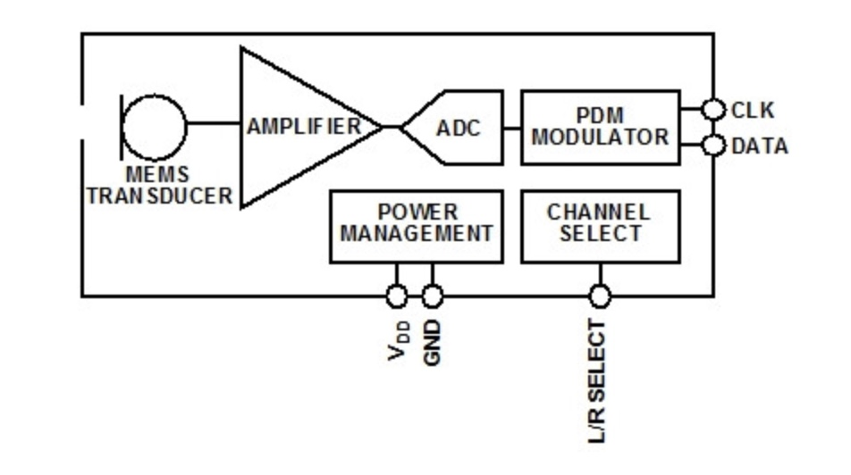
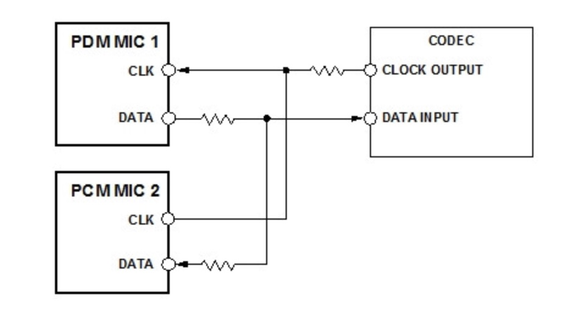
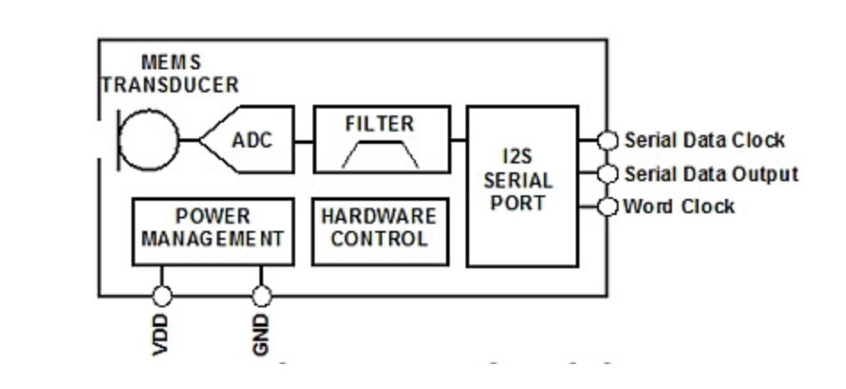
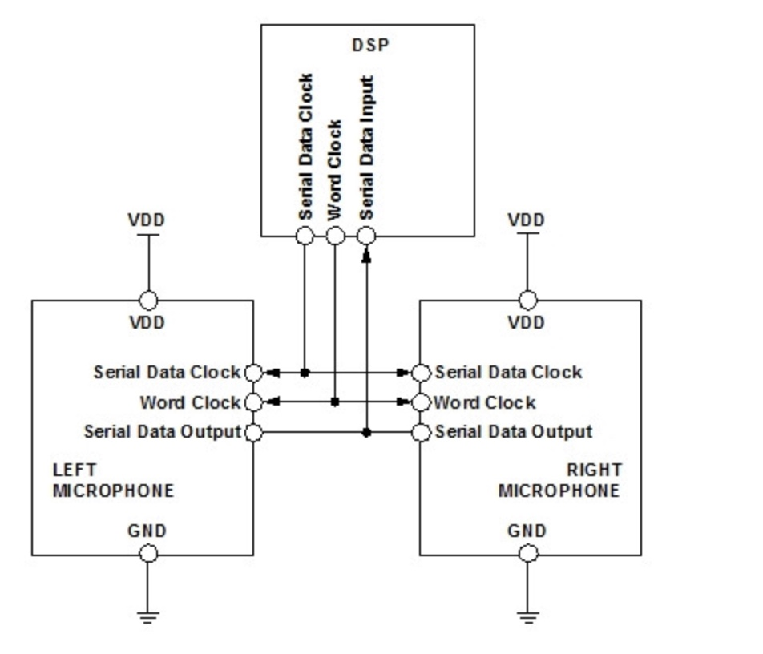

1.14 dmic使用
======================================

1.14.1 配置文件
--------------------------------------

在R328中 DMIC和I2S1共用GPIO。

**sys_config.fex**：

.. code-block:: text
    :linenos:

    [dmic]
    dmic_used = 1
    [snddmic]
    snddmic_used = 1

**设备树文件**：

.. code-block:: text
    :linenos:

    sound@5 {
        compatible = "allwinner,sunxi-dmic-machine";
        sunxi,dmic-controller = <0x44>;
        status = "okay";
        device_type = "snddmic";
    };

    dmic-controller@0x05095000 {
        compatible = "allwinner,sunxi-dmic";
        reg = <0x0 0x5095000 0x0 0x50>;
        clocks = <0x4 0x24 0x35>;
        pinctrl-names = "default", "sleep";
        pinctrl-0 = <0x36>;
        pinctrl-1 = <0x37>;
        status = "okay";
        linux,phandle = <0x44>;
        phandle = <0x44>;
        device_type = "dmic";
    };

    dmic@0 {
        allwinner,pins = "PB8", "PB9", "PB10", "PB11", "PB12";
        allwinner,function = "dmic";
        allwinner,muxsel = <0x3>;
        allwinner,drive = <0x1>;
        allwinner,pull = <0x0>;
        linux,phandle = <0x36>;
        phandle = <0x36>;
    };

    dmic_sleep@1 {
        allwinner,pins = "PB8", "PB9", "PB10", "PB11", "PB12";
        allwinner,function = "io_disabled";
        allwinner,muxsel = <0x7>;
        allwinner,drive = <0x1>;
        allwinner,pull = <0x0>;
        linux,phandle = <0x37>;
        phandle = <0x37>;
    };    

**相关源代码位置**：

.. code-block:: text
    :linenos:

    lichee/linux-4.9/sound/soc/sunxi/sunxi-snddmic.c 
    lichee/linux-4.9/sound/soc/sunxi/sunxi-dmic.c
    lichee/linux-4.9/sound/soc/codecs/dmic.c

    # DMIC Machine Select
    config SND_SUNXI_SOC_SUNXI_DMIC
        tristate "Allwinner DMIC Support"
        select SND_SUNXI_SOC
        select SND_SOC_GENERIC_DMAENGINE_PCM
        select SND_SUNXI_SOC_DMIC
        select REGMAP_MMIO
        select SND_SOC_DMIC
        depends on ARCH_SUN50IW3 || ARCH_SUN50IW6 || ARCH_SUN8IW15 || ARCH_SUN8IW16 || ARCH_SUN8IW17 || ARCH_SUN8IW18 || ARCH_SUN50IW8
        help
            Select Y or M to add support DMIC Module in Allwinner
            SoCs.

    obj-$(CONFIG_SND_SUNXI_SOC_DMIC) += snd-soc-sunxi-dmic.o
    obj-$(CONFIG_SND_SUNXI_SOC_SUNXI_DMIC) += sunxi-snddmic.o

1.14.2 代码分析
--------------------------------------

1.14.2.1 allwinner,sunxi-dmic
``````````````````````````````````````

**入口函数**：

.. code-block:: c
    :linenos:

    #define	DRV_NAME	"sunxi-dmic"

    static const struct of_device_id sunxi_dmic_of_match[] = {
        { .compatible = "allwinner,sunxi-dmic", },
        { },
    };
    MODULE_DEVICE_TABLE(of, sunxi_dmic_of_match);

    static struct platform_driver sunxi_dmic_driver = {
        .probe = sunxi_dmic_dev_probe,
        .remove = __exit_p(sunxi_dmic_dev_remove),
        .driver = {
            .name = DRV_NAME,
            .owner = THIS_MODULE,
            .of_match_table = sunxi_dmic_of_match,
        },
    };

    module_platform_driver(sunxi_dmic_driver);        

**sunxi_dmic_dev_probe**：\
先获取设备树相关信息并进行设置。

.. code-block:: c
    :linenos:

    //dmic私有变量
    sunxi_dmic = devm_kzalloc(&pdev->dev, sizeof(struct sunxi_dmic_info), GFP_KERNEL);
    dev_set_drvdata(&pdev->dev, sunxi_dmic);

    sunxi_dmic->dev = &pdev->dev;
    sunxi_dmic->dai = sunxi_dmic_dai;
    sunxi_dmic->dai.name = dev_name(&pdev->dev);

    //获取寄存器地址并设置regmap
    of_address_to_resource(np, 0, &res);
    sunxi_dmic->memregion = devm_request_mem_region(&pdev->dev, res.start, resource_size(&res), DRV_NAME);
    sunxi_dmic->regmap = devm_regmap_init_mmio(&pdev->dev,sunxi_dmic->membase, &sunxi_dmic_regmap_config);

    //设置pinctrl
    sunxi_dmic->pinctrl = devm_pinctrl_get(&pdev->dev);
    sunxi_dmic->pinstate = pinctrl_lookup_state(sunxi_dmic->pinctrl,PINCTRL_STATE_DEFAULT);
    sunxi_dmic->pinstate_sleep = pinctrl_lookup_state(sunxi_dmic->pinctrl,PINCTRL_STATE_SLEEP);
    pinctrl_select_state(sunxi_dmic->pinctrl, sunxi_dmic->pinstate);

    //设置时钟
    sunxi_dmic->pllclk = of_clk_get(np, 0);
    sunxi_dmic->moduleclk = of_clk_get(np, 1);
    clk_prepare_enable(sunxi_dmic->pllclk);
    clk_prepare_enable(sunxi_dmic->moduleclk);

    //调整dma参数
    sunxi_dmic->capture_dma_param.dma_addr = res.start + SUNXI_DMIC_DATA;
    sunxi_dmic->capture_dma_param.dma_drq_type_num = DRQSRC_DMIC;
    sunxi_dmic->capture_dma_param.src_maxburst = 8;
    sunxi_dmic->capture_dma_param.dst_maxburst = 8;

**注册alsa codec**：

.. code-block:: c
    :linenos:

    static const struct snd_soc_component_driver sunxi_dmic_component = {
        .name = DRV_NAME,
    };

    static struct snd_soc_dai_ops sunxi_dmic_dai_ops = {
        .startup = sunxi_dmic_startup,
        .trigger = sunxi_dmic_trigger,
        .prepare = sunxi_dmic_prepare,
        .hw_params = sunxi_dmic_hw_params,
        .set_sysclk = sunxi_dmic_set_sysclk,
        .shutdown = sunxi_dmic_shutdown,
    };

    static struct snd_soc_dai_driver sunxi_dmic_dai = {
        .probe = sunxi_dmic_probe,
        .suspend = sunxi_dmic_suspend,
        .resume = sunxi_dmic_resume,
        .capture = {
            .channels_min = 1,
            .channels_max = 8,
            .rates = SUNXI_DMIC_RATES,
            .formats = SNDRV_PCM_FMTBIT_S16_LE | SNDRV_PCM_FMTBIT_S24_LE,
        },
        .ops = &sunxi_dmic_dai_ops,
    };

    snd_soc_register_component(&pdev->dev, &sunxi_dmic_component, &sunxi_dmic->dai, 1);

1.14.2.2 dmic-codec
``````````````````````````````````````

**入口函数**：

.. code-block:: c
    :linenos:

    static struct platform_driver dmic_driver = {
        .driver = {
            .name = "dmic-codec",
        },
        .probe = dmic_dev_probe,
        .remove = dmic_dev_remove,
    };

    module_platform_driver(dmic_driver);

**dmic_dev_probe**：

.. code-block:: c
    :linenos:

    static struct snd_soc_codec_driver soc_dmic = {
        .component_driver = {
            .dapm_widgets		= dmic_dapm_widgets,
            .num_dapm_widgets	= ARRAY_SIZE(dmic_dapm_widgets),
            .dapm_routes		= intercon,
            .num_dapm_routes	= ARRAY_SIZE(intercon),
        },
    };

    static struct snd_soc_dai_driver dmic_dai = {
        .name = "dmic-hifi",
        .capture = {
            .stream_name = "Capture",
            .channels_min = 1,
            .channels_max = 8,
            .rates = SNDRV_PCM_RATE_CONTINUOUS,
            .formats = SNDRV_PCM_FMTBIT_S32_LE
                | SNDRV_PCM_FMTBIT_S24_LE
                | SNDRV_PCM_FMTBIT_S16_LE,
        },
    };

    snd_soc_register_codec(&pdev->dev,&soc_dmic, &dmic_dai, 1);    

1.14.2.3 allwinner,sunxi-dmic-machine
``````````````````````````````````````````

**入口函数**：

.. code-block:: c
    :linenos:

    static const struct of_device_id sunxi_dmic_of_match[] = {
        { .compatible = "allwinner,sunxi-dmic-machine", },
        {},
    };

    static struct platform_driver sunxi_dmic_driver = {
        .driver = {
            .name = "snddmic",
            .owner = THIS_MODULE,
            .of_match_table = sunxi_dmic_of_match,
            .pm = &snd_soc_pm_ops,
        },
        .probe = sunxi_snddmic_dev_probe,
        .remove = sunxi_snddmic_dev_remove,
    };

**sunxi_snddmic_dev_probe**：

.. code-block:: c
    :linenos:

    static struct snd_soc_ops sunxi_snddmic_ops = {
        .hw_params	= sunxi_snddmic_hw_params,
    };

    static struct snd_soc_dai_link sunxi_snddmic_dai_link = {
        .name		= "DMIC",
        .stream_name	= "SUNXI-DMIC",
        .cpu_dai_name	= "sunxi-dmic",
        .platform_name	= "sunxi-dmic",
        .codec_name	= "dmic-codec",
        .codec_dai_name = "dmic-hifi",
        .ops		= &sunxi_snddmic_ops,
    };

    static struct snd_soc_card snd_soc_sunxi_snddmic = {
        .name		= "snddmic",
        .owner		= THIS_MODULE,
        .dai_link	= &sunxi_snddmic_dai_link,
        .num_links	= 1,
    };

    struct sunxi_snddmic_priv *snddmic_priv;
    snddmic_priv = devm_kzalloc(&pdev->dev,sizeof(struct sunxi_snddmic_priv), GFP_KERNEL);
    snddmic_priv->card = card;
    card->dev = &pdev->dev;

    sunxi_snddmic_dai_link.cpu_dai_name = NULL;
    sunxi_snddmic_dai_link.cpu_of_node = of_parse_phandle(np, "sunxi,dmic-controller", 0);
    sunxi_snddmic_dai_link.platform_name = NULL;
    sunxi_snddmic_dai_link.platform_of_node = sunxi_snddmic_dai_link.cpu_of_node;

    snddmic_priv->codec_device = platform_device_alloc("dmic-codec", -1);
    platform_device_add(snddmic_priv->codec_device);

    snd_soc_card_set_drvdata(card, snddmic_priv);

    //注册alsa声卡
    snd_soc_register_card(card);    

1.14.3 麦克风种类
--------------------------------------

**模拟麦克风**：

.. image:: images/alsa/模拟麦克风.jpg

**PDM麦克风**：\
PDM是一种最常见的数字麦克风接口。这种接口允许两个麦克风共享一个公共的时钟与数据线。\
每个麦克风被配置为在时钟信号的不同沿产生各自的输出。\
这样两个麦克风的输出就能保持相互同步，设计师就能确保来自每个通道的数据被同时捕获到。





**PCM/I2S麦克风**：\

I2S麦克风拥有与PDM麦克风相同的系统设计优势，但不再输出高采样速率的PDM信号，它输出的数字数据采用抽取过的基带音频采样率。\
在PDM麦克风方案中，这种抽取是在编解码器或DSP中实现的，但在I2S麦克风方案中，这个抽取过程直接在麦克风中完成，\
因此在某些系统中可以完全取消ADC或编解码器。

I2S麦克风可以直接连接具有这种标准接口的DSP或微控制器。\
与PDM麦克风一样，两个I2S麦克风可以连接到一条公共的数据线上，不过与PDM不同的是，I2S格式使用两个时钟信号——一个字时钟和一个位时钟。






