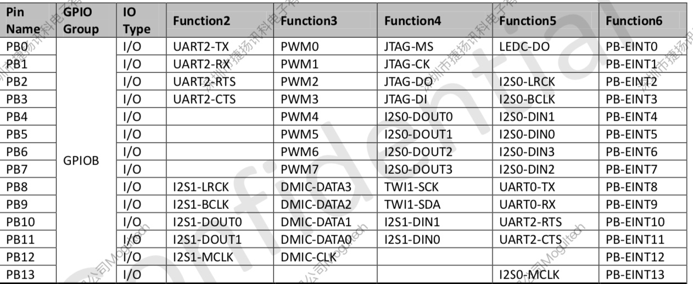

1.3 gpio操作与复用
======================================

1.3.1 pinctrl和gpio子系统的注册
--------------------------------------

1.3.1.1 配置文件
``````````````````````````````````````
**设备树描述**：

.. code-block:: text
    :linenos:

    pinctrl@0300b000 {
        compatible = "allwinner,sun8iw18p1-pinctrl";
        reg = <0x0 0x300b000 0x0 0x400>;
        interrupts = <0x0 0x2b 0x4 0x0 0x2c 0x4 0x0 0x2e 0x4 0x0 0x2f 0x4>;
        device_type = "pio";
        clocks = <0x9>;
        gpio-controller;
        interrupt-controller;
        #interrupt-cells = <0x3>;
        #size-cells = <0x0>;
        #gpio-cells = <0x6>;
        linux,phandle = <0x39>;
        phandle = <0x39>;
        ...
    };

**内核配置与相关源代码**:

.. code-block:: text
    :linenos:

    //内核配置
    Device Drivers
    Pin controllers
        Allwinner SOC PINCTRL DRIVER
        Pinctrl sun8iw18p1 PIO controller

    //kconfig      
    config PINCTRL_SUN8IW18P1
        def_bool ARCH_SUN8IW18
        depends on ARCH_SUN8IW18
        bool "Pinctrl sun8iw18p1 PIO controller"
        select PINCTRL_SUNXI_COMMON
        
    //makefile
    obj-y					+= pinctrl-sunxi.o
    obj-$(CONFIG_PINCTRL_SUN8IW18P1)	+= pinctrl-sun8iw18p1.o

    //源码
    lichee/linux-4.9/pinctrl/sunxi/pinctrl-sun8iw18p1.c
    lichee/linux-4.9/pinctrl/sunxi/pinctrl-sunxi.c 

1.3.1.2 pinctrl-sun8iw18p1源码分析
``````````````````````````````````````

**入口函数**：

.. code-block:: c
    :linenos:

    static struct platform_driver sun8iw18p1_pinctrl_driver = {
        .probe	= sun8iw18p1_pinctrl_probe,
        .driver	= {
            .name		= "sun8iw18p1-pinctrl",
            .owner		= THIS_MODULE,
            .of_match_table	= sun8iw18p1_pinctrl_match,
            .pm		= &sunxi_pinctrl_pm_ops,
        },
    };

    static int __init sun8iw18p1_pio_init(void)
    {
        int ret;

        ret = platform_driver_register(&sun8iw18p1_pinctrl_driver);
        if (ret) {
            pr_err("register sun8iw18p1 pio controller failed\n");
            return -EINVAL;
        }
        return 0;
    }

**sun8iw18p1_pinctrl_probe**：

.. code-block:: c
    :linenos:

    static const struct sunxi_pinctrl_desc sun8iw18p1_pinctrl_data = {
        .pins = sun8iw18p1_pins,
        .npins = ARRAY_SIZE(sun8iw18p1_pins),
        .pin_base = 0,
        .banks = ARRAY_SIZE(sun8iw18p1_bank_base),
        .bank_base = sun8iw18p1_bank_base,
        .irq_banks = ARRAY_SIZE(sun8iw18p1_irq_bank_base),
        .irq_bank_base = sun8iw18p1_irq_bank_base,
    };

    static int sun8iw18p1_pinctrl_probe(struct platform_device *pdev)
    {
        return sunxi_pinctrl_init(pdev, &sun8iw18p1_pinctrl_data);
    }    

**sun8iw18p1_pinctrl_data**：

sun8iw18p1_pins定义了所有gpio的设置。

.. code-block:: c
    :linenos:

    SUNXI_PIN(SUNXI_PINCTRL_PIN(B, 0),
        SUNXI_FUNCTION(0x0, "gpio_in"),
        SUNXI_FUNCTION(0x1, "gpio_out"),
        SUNXI_FUNCTION(0x2, "uart2"),		/* TX */
        SUNXI_FUNCTION(0x3, "pwm0"),
        SUNXI_FUNCTION(0x4, "jtag0"),		/* MS0 */
        SUNXI_FUNCTION(0x5, "ledc"),
        SUNXI_FUNCTION(0x7, "io_disabled"),
        SUNXI_FUNCTION_IRQ_BANK(0x6, 0, 0)),	/* PB_EINT0 */
    SUNXI_PIN(SUNXI_PINCTRL_PIN(B, 1),
        SUNXI_FUNCTION(0x0, "gpio_in"),
        SUNXI_FUNCTION(0x1, "gpio_out"),
        SUNXI_FUNCTION(0x2, "uart2"),		/* RX */
        SUNXI_FUNCTION(0x3, "pwm1"),
        SUNXI_FUNCTION(0x4, "jtag0"),		/* CK0 */
        SUNXI_FUNCTION(0x7, "io_disabled"),
        SUNXI_FUNCTION_IRQ_BANK(0x6, 0, 1)),	/* PB_EINT1 */
    ...
        SUNXI_PIN(SUNXI_PINCTRL_PIN(H, 9),
        SUNXI_FUNCTION(0x0, "gpio_in"),
        SUNXI_FUNCTION(0x1, "gpio_out"),
        SUNXI_FUNCTION(0x4, "cpu_cur_w"),
        SUNXI_FUNCTION(0x7, "io_disabled"),
        SUNXI_FUNCTION_IRQ_BANK(0x6, 3, 9)),    



sun8iw18p1_bank_base定义了该IC有5个bank。

.. code-block:: c
    :linenos:

    static const unsigned int sun8iw18p1_bank_base[] = {
        SUNXI_PIO_BANK_BASE(PB_BASE, 0),
        SUNXI_PIO_BANK_BASE(PC_BASE, 1),
        SUNXI_PIO_BANK_BASE(PE_BASE, 2),
        SUNXI_PIO_BANK_BASE(PG_BASE, 3),
        SUNXI_PIO_BANK_BASE(PH_BASE, 4),
    };    

sun8iw18p1_irq_bank_base定义了该IC能产生中断的bank有4个，其中PC bank没有中断。

.. code-block:: c
    :linenos:

    static const unsigned int sun8iw18p1_irq_bank_base[] = {
        SUNXI_PIO_BANK_BASE(PB_BASE, 0),
        SUNXI_PIO_BANK_BASE(PE_BASE, 1),
        SUNXI_PIO_BANK_BASE(PG_BASE, 2),
        SUNXI_PIO_BANK_BASE(PH_BASE, 3),
    };

**sunxi_pinctrl_init**：这个函数主要完成pinctrl子系统和gpio子系统的注册。

.. code-block:: c
    :linenos:

    //pinctrl子系统的注册
    /**
    * struct pinctrl_desc - pin controller descriptor, register this to pin
    * control subsystem
    * @name: name for the pin controller
    * @pins: an array of pin descriptors describing all the pins handled by
    *	this pin controller
    * @npins: number of descriptors in the array, usually just ARRAY_SIZE()
    *	of the pins field above
    * @pctlops: pin control operation vtable, to support global concepts like
    *	grouping of pins, this is optional.
    * @pmxops: pinmux operations vtable, if you support pinmuxing in your driver
    * @confops: pin config operations vtable, if you support pin configuration in
    *	your driver
    * @owner: module providing the pin controller, used for refcounting
    * @num_custom_params: Number of driver-specific custom parameters to be parsed
    *	from the hardware description
    * @custom_params: List of driver_specific custom parameters to be parsed from
    *	the hardware description
    * @custom_conf_items: Information how to print @params in debugfs, must be
    *	the same size as the @custom_params, i.e. @num_custom_params
    */
    struct pinctrl_desc {
        const char *name;
        const struct pinctrl_pin_desc *pins;
        unsigned int npins;
        const struct pinctrl_ops *pctlops;
        const struct pinmux_ops *pmxops;
        const struct pinconf_ops *confops;
        struct module *owner;
    #ifdef CONFIG_GENERIC_PINCONF
        unsigned int num_custom_params;
        const struct pinconf_generic_params *custom_params;
        const struct pin_config_item *custom_conf_items;
    #endif
    };

    struct pinctrl_desc *pctrl_desc;

    pctrl_desc = devm_kzalloc(&pdev->dev, sizeof(*pctrl_desc), GFP_KERNEL);
                    
    pctrl_desc->name = dev_name(&pdev->dev);
    pctrl_desc->owner = THIS_MODULE;
    pctrl_desc->pins = pins;
    pctrl_desc->npins = pctl->desc->npins;
    pctrl_desc->confops = &sunxi_pconf_ops;
    pctrl_desc->pctlops = &sunxi_pctrl_ops;
        
    pmxops = devm_kmemdup(&pdev->dev, &sunxi_pmx_ops, sizeof(sunxi_pmx_ops), GFP_KERNEL);
    pctrl_desc->pmxops = pmxops;

    pctl->pctl_dev = pinctrl_register(pctrl_desc, &pdev->dev, pctl);

    //gpio子系统的注册
    //struct gpio_chip		*chip;
    pctl->chip = devm_kzalloc(&pdev->dev, sizeof(*pctl->chip), GFP_KERNEL);
    pctl->chip->owner = THIS_MODULE;
    pctl->chip->request = gpiochip_generic_request,
    pctl->chip->free = gpiochip_generic_free,
    pctl->chip->direction_input = sunxi_pinctrl_gpio_direction_input,
    pctl->chip->direction_output = sunxi_pinctrl_gpio_direction_output,
    pctl->chip->get = sunxi_pinctrl_gpio_get,
    pctl->chip->set = sunxi_pinctrl_gpio_set,
    pctl->chip->set_debounce = sunxi_pinctrl_gpio_set_debounce,
    pctl->chip->of_xlate = sunxi_pinctrl_gpio_of_xlate,
    pctl->chip->to_irq = sunxi_pinctrl_gpio_to_irq,
    pctl->chip->of_gpio_n_cells = 6,
    pctl->chip->can_sleep = false,
    pctl->chip->ngpio = round_up(last_pin + 1, PINS_PER_BANK) -
                pctl->desc->pin_base;
    pctl->chip->label = dev_name(&pdev->dev);
    pctl->chip->parent = &pdev->dev;
    pctl->chip->base = pctl->desc->pin_base;

    ret = gpiochip_add(pctl->chip);

1.3.2 gpio的使用
--------------------------------------

**修改fex**：

.. code-block:: text
    :linenos:

    [gpiotest]
    gpiotest_used = 1
    compatible	= "gpio_test"
    gpio-output-key = port:PH4<1><1><1><1>
    gpio-input-key = port:PH5<0><default><default><default>

**设备驱动**：

* gpio的输入和输出设置
* gpio的输出电平设置
* gpio的输入电平读取
* 中断的申请和callback
* 字符设备的添加

.. code-block:: c
    :linenos:

    #include <linux/module.h>
    #include <linux/platform_device.h>
    #include <linux/of_gpio.h>
    #include <linux/sunxi-gpio.h>
    #include <linux/interrupt.h>
    #include <linux/fs.h>
    #include <linux/device.h>
    #include <linux/cdev.h>
    #include <linux/types.h>
    #include <linux/kdev_t.h>


    struct cdev devm; //字符设备
    int major = 0;

    static struct class *gpio_test_class;

    static ssize_t gpio_test_read(struct file *file, char __user *buf, size_t count,loff_t *ppos){
        printk("gpio_test_read:%d\n",*buf);
        return 0;
    }
    static ssize_t gpio_test_write(struct file *file, const char __user *buf, size_t count,loff_t *ppos){
        printk("gpio_test_write\n");
        return 0;
    }

    static int gpio_test_open(struct inode *inode, struct file *file){
        printk("gpio_test_open\n");
        return 0;
    }

    static int gpio_test_release(struct inode *inode, struct file *file){
        printk("gpio_test_release\n");	
        return 0;
    }

    static long gpio_test_ioctl(struct file *file, unsigned int cmd,unsigned long arg){
        printk("gpio_test_ioctl\n");
        return 0;
    }

    static const struct file_operations gpio_test_fops = {
        .owner		= THIS_MODULE,
        .read		= gpio_test_read,
        .write		= gpio_test_write,
        .open		= gpio_test_open,	
        .unlocked_ioctl	= gpio_test_ioctl,
        .release	= gpio_test_release,
    };

    static irqreturn_t gpio_test_irq(int irq, void *dev_id){
        printk("gpio_test_irq:%d\n",irq);
        return IRQ_HANDLED;
    }

    static int gpio_test_probe(struct platform_device *pdev){
        int ret;
        struct gpio_config config_gpio;
        u32 gpio_out;
        u32 gpio_in;
        int virq;

        struct device_node *np = pdev->dev.of_node;

        gpio_out = of_get_named_gpio_flags(np, "gpio-output-key", 0, (enum of_gpio_flags *)&config_gpio);
        if (gpio_is_valid(gpio_out)) {
            ret = devm_gpio_request(&pdev->dev, gpio_out, "gpio_out");
            if(!ret){
                printk("output %d %d %d %d\n",config_gpio.data,config_gpio.mul_sel,config_gpio.pull,config_gpio.drv_level);
                /*
                * @gpio:      gpio global index, must be unique
                * @mul_sel:   multi sel val: 0 - input, 1 - output.
                * @pull:      pull val: 0 - pull up/down disable, 1 - pull up
                * @drv_level: driver level val: 0 - level 0, 1 - level 1
                * @data:      data val: 0 - low, 1 - high, only valid when mul_sel is input/output	
                */	
                if(config_gpio.mul_sel)
                {
                    gpio_direction_output(gpio_out, config_gpio.data);
                    gpio_set_value(gpio_out,config_gpio.data);
                }
            }
            else{
                printk("devm_gpio_request fail\n");
            }
        }
        
        gpio_in = of_get_named_gpio_flags(np, "gpio-input-key", 0, (enum of_gpio_flags *)&config_gpio);
        if (gpio_is_valid(gpio_in)) {
            ret = devm_gpio_request(&pdev->dev, gpio_in, "gpio_in");
            if(!ret){
                printk("input %d %d %d %d\n",config_gpio.data,config_gpio.mul_sel,config_gpio.pull,config_gpio.drv_level);
                if(!config_gpio.mul_sel)
                {
                    gpio_direction_input(gpio_in);
                    printk("input value:%d\n",gpio_get_value(gpio_in));
                    virq = gpio_to_irq(gpio_in);
                    ret = devm_request_irq(&pdev->dev, virq, gpio_test_irq, IRQF_TRIGGER_FALLING, "GPIO TEST", NULL);
                    if(IS_ERR_VALUE(ret)){
                        printk("request irq failed\n");
                    }	
                }
            }
        }	
        printk("gpio_test_probe\n");

        //创建字符设备
        dev_t dev = MKDEV(major, 0);
        int result = 0;
        
        if(major)
        {
            //静态申请设备编号
            result = register_chrdev_region(dev, 1, "gpio_test");
        }
        else
        {
            //动态分配设备号
            result = alloc_chrdev_region(&dev, 0, 1, "gpio_test");
            major = MAJOR(dev);
        }
        
        if(result < 0){
            return result;
        }

        //注册字符设备驱动，设备号和file_operations结构体进行绑定
        cdev_init(&devm, &gpio_test_fops);
        //向内核里面添加一个驱动，注册驱动
        result = cdev_add(&devm, dev, 1);
        if(result){
            printk(KERN_INFO "Error %d adding gpio_test device", result);
            return result;
        }
        
        gpio_test_class = class_create(THIS_MODULE, "gpio_test");
        if (IS_ERR(gpio_test_class)) {
            return -ENODEV;
        }

        device_create(gpio_test_class, NULL, dev, NULL, "gpio_test");
        
        return 0;
    }

    static int gpio_test_remove(struct platform_device *pdev){
        device_destroy(gpio_test_class, MKDEV(major, 0));
        class_destroy(gpio_test_class);
        cdev_del(&devm);
        unregister_chrdev_region(MKDEV(major, 0), 1);//注销设备
        
        printk("gpio_test_remove\n");
        return 0;
    }

    static const struct of_device_id gpio_test_dt_ids[] = {
        {.compatible = "gpio_test"},
        {},
    };

    static struct platform_driver gpio_test_driver = {
        .probe		= gpio_test_probe,
        .remove		= gpio_test_remove,
        .driver		= {
            .name	= "gpio_test",
            .owner	= THIS_MODULE,
            .pm	= NULL,
            .of_match_table = gpio_test_dt_ids,
        },
    };

    module_platform_driver(gpio_test_driver);

    MODULE_AUTHOR("jay <jay@emeet.ai>");
    MODULE_DESCRIPTION("eMeet gpio test driver");
    MODULE_LICENSE("GPL v2");

**内核kconfig和makefile的配置**：

.. code-block:: text
    :linenos:

    config GPIO_TEST
        tristate "GPIO_TEST"
        default n
        help
        this is GPIO_TEST

    obj-$(CONFIG_GPIO_TEST)         += gpio_test.o

**驱动调试的方法**：

直接编译到内核

.. code-block:: shell
    :linenos:

    make menuconfig选择GPIO_TEST为y
    编译pack后烧录

ko方式加载

.. code-block:: shell
    :linenos:

    make menuconfig选择GPIO_TEST为m
    mkernel在源文件目录会生成gpio_test.ko
    adb push gpio_test.ko /tmp
    insmod /tmp/gpio_test.ko
    rmmod /tmp/gpio_test.ko

**挂载后，查询是否成功命令**：

.. code-block:: shell
    :linenos:
    
    生成对应的文件和目录
    /sys/class/gpio_test/gpio_test/
    /dev/gpio_test

    cat /proc/devices 
    Character devices:
    250 gpio_test

    cat /proc/interrupts 
    127:          2          0  sunxi_pio_edge 101 Edge      GPIO TEST        

**应用程序**：

.. code-block:: c
    :linenos:

    int main(void)
    {
        int fd  = open("/dev/gpio_test",O_RDWR);
        char buf = 0;
        write(fd,&buf,1);
        printf("%d\n",fd);
    }

1.3.3 gpio复用功能选择
--------------------------------------

大部分gpio口会存在复用功能，如果使用这些复用功能呢？\
以uart为例：PH0 PH1有两个状态default和sleep。

**设备树相关描述**:

.. code-block:: text
    :linenos:

    uart@05000000 {
        compatible = "allwinner,sun8i-uart";
        device_type = "uart0";
        reg = <0x0 0x5000000 0x0 0x400>;
        interrupts = <0x0 0x4c 0x4>;
        clocks = <0xd>;
        pinctrl-names = "default", "sleep";
        uart0_port = <0x0>;
        uart0_type = <0x2>;
        status = "okay";
        uart_used = <0x1>;
        uart_port = <0x0>;
        uart_type = <0x2>;
        pinctrl-0 = <0x8d>;
        pinctrl-1 = <0x8e>;
    };

    uart0@0 {
        linux,phandle = <0x8d>;
        phandle = <0x8d>;
        allwinner,pins = "PH0", "PH1";
        allwinner,function = "uart0";
        allwinner,pname = "uart_tx", "uart_rx";
        allwinner,muxsel = <0x3>;
        allwinner,pull = <0x1>;
        allwinner,drive = <0xffffffff>;
        allwinner,data = <0xffffffff>;
    };

    uart0@2 {
        linux,phandle = <0x8e>;
        phandle = <0x8e>;
        allwinner,pins = "PH0", "PH1";
        allwinner,function = "uart0";
        allwinner,pname = "uart0_tx", "uart0_rx";
        allwinner,muxsel = <0x7>;
        allwinner,pull = <0x1>;
        allwinner,drive = <0xffffffff>;
        allwinner,data = <0xffffffff>;
    };

**相关操作代码**：

.. code-block:: c
    :linenos:

    //struct pinctrl *pctrl;
    sw_uport->pctrl = devm_pinctrl_get(sw_uport->port.dev);

    struct pinctrl_state *pctrl_state = NULL;
    pinctrl_lookup_state(pctrl, name);      //name为default或sleep
    pinctrl_select_state(pctrl, pctrl_state); 

**内核中是如何处理设备树中的描述呢？**

.. code-block:: c
    :linenos:

    static const struct pinctrl_ops sunxi_pctrl_ops = {
        .dt_node_to_map		= sunxi_pctrl_dt_node_to_map,
        .dt_free_map		= sunxi_pctrl_dt_free_map,
        .get_groups_count	= sunxi_pctrl_get_groups_count,
        .get_group_name		= sunxi_pctrl_get_group_name,
        .get_group_pins		= sunxi_pctrl_get_group_pins,
    };

    sunxi_pctrl_dt_node_to_map
    sunxi_pctrl_parse_muxsel_prop
    of_property_read_u32(node, "muxsel", muxsel);  

1.3.4 待机与中断唤醒
--------------------------------------

待机命令：

.. code-block:: shell
    :linenos:

    echo mem > /sys/power/state

待机和唤醒驱动调用的操作，我们增加如下函数：

.. code-block:: c
    :linenos:

    static int gpio_test_suspend(struct device *dev){
        printk("gpio_test_suspend\n");
        return 0;
    }

    static int gpio_test_resume(struct device *dev){
        printk("gpio_test_resume\n");
        return 0;
    }

    static const struct dev_pm_ops gpio_test_pm_ops = {
        .suspend = gpio_test_suspend,
        .resume = gpio_test_resume,
    };

    static struct platform_driver gpio_test_driver = {
        .probe		= gpio_test_probe,
        .remove		= gpio_test_remove,
        .driver		= {
            .name	= "gpio_test",
            .owner	= THIS_MODULE,
            .pm	= &gpio_test_pm_ops,
            .of_match_table = gpio_test_dt_ids,
        },
    }; 

在待机和唤醒的时候分别调用gpio_test_suspend和gpio_test_resume。

待机唤醒中断源设置：

.. code-block:: c
    :linenos:

    //wake up
    device_init_wakeup(&pdev->dev,1);
    dev_pm_set_wake_irq(&pdev->dev,virq);

这样待机后，输入下降沿触发会唤醒。\
有时候需要在待机前才会打开唤醒中断源的设置，在唤醒的时候关闭唤醒中断源。

.. code-block:: c
    :linenos:

    //suspend
    enable_irq_wake(key_data->irq_num);

    //resume
    disable_irq_wake(key_data->irq_num);

1.3.5 获取中断号的两种方式
--------------------------------------    

.. code-block:: c
    :linenos:

    //gpio对应的外部中断
    of_get_named_gpio_flags(np, "gpio-input-key", 0, (enum of_gpio_flags *)&config_gpio);
    gpio_to_irq(gpio_in);

    //设备树中直接指定
    interrupts = <0x0 0x47 0x4>;
    port->irq = platform_get_irq(pdev, 0);    
