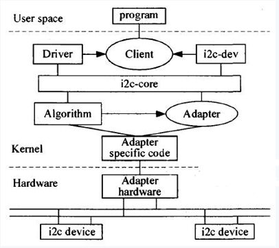
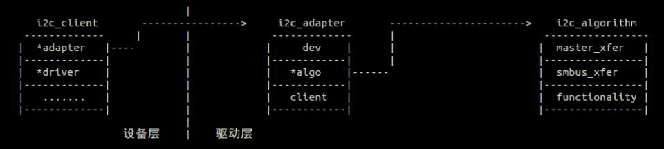

1.6 i2c子系统
======================================

1.6.1 i2c子系统框图和配置文件
--------------------------------------





**sys_config.fex**：

.. code-block:: text
    :linenos:

    ;----------------------------------------------------------------------------------
    ;i2c configuration
    ;----------------------------------------------------------------------------------
    [twi1]
    twi1_used        = 0
    twi1_scl         = port:PB8<4><default><default><default>
    twi1_sda         = port:PB9<4><default><default><default>
    twi_regulator    = ""

    [twi1_suspend]
    twi1_scl         = port:PB8<7><default><default><default>
    twi1_sda         = port:PB9<7><default><default><default>

**设备树描述**：

.. code-block:: text
    :linenos:
    
    twi1@0 {
        linux,phandle = <0x8b>;
        phandle = <0x8b>;
        allwinner,pins = "PB8", "PB9";
        allwinner,function = "twi1";
        allwinner,pname = "twi1_scl", "twi1_sda";
        allwinner,muxsel = <0x4>;
        allwinner,pull = <0xffffffff>;
        allwinner,drive = <0xffffffff>;
        allwinner,data = <0xffffffff>;
    };

    twi1@1 {
        linux,phandle = <0x8c>;
        phandle = <0x8c>;
        allwinner,pins = "PB8", "PB9";
        allwinner,function = "twi1";
        allwinner,pname = "twi1_scl", "twi1_sda";
        allwinner,muxsel = <0x7>;
        allwinner,pull = <0xffffffff>;
        allwinner,drive = <0xffffffff>;
        allwinner,data = <0xffffffff>;
    };

    twi@0x05002400 {
        #address-cells = <0x1>;
        #size-cells = <0x0>;
        compatible = "allwinner,sun8i-twi";
        device_type = "twi1";
        reg = <0x0 0x5002400 0x0 0x400>;
        interrupts = <0x0 0x47 0x4>;
        clocks = <0x1b>;
        clock-frequency = <0x186a0>;
        pinctrl-names = "default", "sleep";
        status = "disabled";
        pinctrl-0 = <0x8b>;
        twi_regulator;
        pinctrl-1 = <0x8c>;

        es7243@0 {
            compatible = "mi,es7243";
            reg = <0x13>;
            status = "okay";
        };
    };        

**源码位置**：

.. code-block:: text
    :linenos:

    lichee/linux-4.9/drivers/i2c/busses/i2c-sunxi.c

    obj-$(CONFIG_I2C_SUNXI)		+= i2c-sunxi.o

    config I2C_SUNXI
        tristate "SUNXI I2C controller"
        depends on ARCH_SUNXI
        default y if MACH_SUNXI
        help
        If you say yes to this option, support will be included for the
        I2C interface from Allwinner Technology SUNXI platform.

        This driver can also be built as a module. If so, the module
        will be called i2c-sunxi. 

1.6.2 代码分析
--------------------------------------

1.6.2.1 i2c_adapter
``````````````````````````````````````

**入口函数**：

.. code-block:: c
    :linenos:

    #define SUNXI_TWI_DEV_NAME		"twi"

    static const struct of_device_id sunxi_i2c_match[] = {
        { .compatible = "allwinner,sun8i-twi", },
        { .compatible = "allwinner,sun50i-twi", },
        {},
    };
    MODULE_DEVICE_TABLE(of, sunxi_i2c_match);

    static struct platform_driver sunxi_i2c_driver = {
        .probe		= sunxi_i2c_probe,
        .remove		= sunxi_i2c_remove,
        .driver		= {
            .name	= SUNXI_TWI_DEV_NAME,
            .owner	= THIS_MODULE,
            .pm		= SUNXI_I2C_DEV_PM_OPS,
            .of_match_table = sunxi_i2c_match,
        },
    };

    static int __init sunxi_i2c_adap_init(void)
    {
        dprintk(DEBUG_INIT, "init\n");
        return platform_driver_register(&sunxi_i2c_driver);
    }

**sunxi_i2c_probe**：

.. code-block:: c
    :linenos:

    //私有数据
    struct sunxi_i2c *i2c = NULL;
    i2c = kzalloc(sizeof(struct sunxi_i2c), GFP_KERNEL);

    struct sunxi_i2c_platform_data *pdata = NULL;
    pdata = kzalloc(sizeof(struct sunxi_i2c_platform_data), GFP_KERNEL);

    pdev->dev.platform_data = pdata;
    pdev->dev.driver_data = i2c;

    //获取设备树相关信息
    //获取i2c序号
    pdev->id = of_alias_get_id(np, "twi");
    pdata->bus_num  = pdev->id;

    //获取寄存器信息
    mem_res = platform_get_resource(pdev, IORESOURCE_MEM, 0);
    request_mem_region(mem_res->start, resource_size(mem_res),mem_res->name)
    i2c->base_addr = ioremap(mem_res->start, resource_size(mem_res));

    //获取中断相关信息
    irq = platform_get_irq(pdev, 0);

    //获取时钟频率
    of_property_read_u32(np, "clock-frequency", &pdata->frequency);
    of_property_read_string(np, "twi_regulator",&str_vcc_twi);

    //struct i2c_adapter	adap;
    //i2c adapter信息
    i2c->adap.owner   = THIS_MODULE;
    i2c->adap.nr      = pdata->bus_num;
    i2c->adap.retries = 3;
    i2c->adap.timeout = 5*HZ;
    i2c->adap.class   = I2C_CLASS_HWMON | I2C_CLASS_SPD;
    i2c->bus_freq     = pdata->frequency;
    i2c->irq          = irq;
    i2c->bus_num      = pdata->bus_num;
    i2c->status       = I2C_XFER_IDLE;
    snprintf(i2c->adap.name, sizeof(i2c->adap.name),SUNXI_TWI_DEV_NAME"%u", i2c->adap.nr);

    //真正的i2c传输函数
    static const struct i2c_algorithm sunxi_i2c_algorithm = {
        .master_xfer	  = sunxi_i2c_xfer,
        .functionality	  = sunxi_i2c_functionality,
    };
    i2c->adap.algo = &sunxi_i2c_algorithm;
    i2c->adap.algo_data  = i2c;

    //申请i2c中断
    request_irq(irq, sunxi_i2c_handler, int_flag, i2c->adap.name, i2c);

    //i2c硬件初始化
    sunxi_i2c_hw_init(i2c, pdata);

    //完成该i2c_adapter和i2c_client的注册
    i2c_add_numbered_adapter(&i2c->adap);    

**I2C设备配置**：

.. code-block:: text
    :linenos:

    es7243@0 {
        compatible = "mi,es7243";
        reg = <0x13>;      //i2c地址
        status = "okay";
    };

    of_i2c_register_device
        addr_be = of_get_property(node, "reg", &len);

1.6.2.2 i2c_driver
``````````````````````````````````````

这里以es7243为例，描述i2c的相关操作。(实际上该驱动在开发板中并未选上，仅参考代码)

**入口函数**：

.. code-block:: c
    :linenos:

    static const struct i2c_device_id es7243_i2c_id[] = {
        { "es7243", 0 },
        {}
    };

    static const struct of_device_id es7243_of_id[] = {
        {.compatible = "mi,es7243",},
    };

    MODULE_DEVICE_TABLE(of, es7243_of_id);
    static struct  i2c_driver es7243_i2c_driver = {
        .driver = {
            .name = "es7243",
            .of_match_table = es7243_of_id,
            .owner = THIS_MODULE,
        },
        .probe = es7243_i2c_probe,
        .remove = es7243_i2c_remove,
        .id_table = es7243_i2c_id,
    };
    module_i2c_driver(es7243_i2c_driver);    

**es7243_i2c_probe**：当i2c_client和i2c_driver的名称匹配上，触发probe函数。

.. code-block:: c
    :linenos:

    //匹配成功后，会将i2c_client结构体传递进来
    static int es7243_i2c_probe(struct i2c_client *client, const struct i2c_device_id *id){
        ...
        //借助i2c_client可以进行i2c的操作
        //i2c操作的寄存器地址已经包含在i2c_client中了
        es7243->regmap = devm_regmap_init_i2c(client, &es7243_regmap);
        ...
    }

    //这个时候可以调用regmap_write和regmap_read进行寄存器的读写
    //也可以采用古老一点的方式进行i2c操作
    int i2c_master_send(const struct i2c_client *client, const char *buf, int count)
    int i2c_master_recv(const struct i2c_client *client, char *buf, int count)

1.6.3 测试
--------------------------------------

配置sys_config.fex打开i2c1。

.. code-block:: text
    :linenos:
    
    twi1_used        = 1

操作如下指令查询i2c是否配置成功：

.. code-block:: shell
    :linenos:

    /dev/i2c-1

    //platform device
    //1-0013表示es7243 i2c地址为13
    root@TinaLinux:/sys/devices/platform/soc/twi1/i2c-1# ls
    1-0013         device         name           of_node        subsystem
    delete_device  i2c-dev        new_device     power          uevent

    ./sys/devices/platform/soc/twi1
    ./sys/bus/platform/devices/twi1 -> ../../../devices/platform/soc/twi1
    ./sys/firmware/devicetree/base/clocks/twi1
    ./sys/firmware/devicetree/base/aliases/twi1

    //platform driver
    ./sys/devices/platform/soc/twi1/driver -> ../../../../bus/platform/drivers/twi
    ./sys/bus/platform/drivers/twi

    //es7243 driver
    ./sys/bus/i2c/drivers/es7243