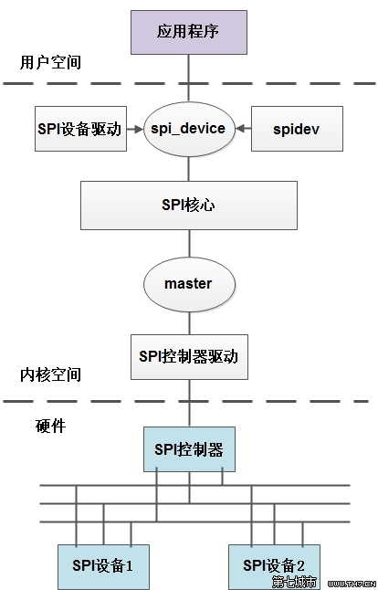

1.7 spi子系统
======================================

1.7.1 spi子系统框图与配置文件
--------------------------------------



**sys_config.fex**：R328的spi0用于spi flash，系统默认加载的是spinandflash节点。

.. code-block:: text
    :linenos:

    ;----------------------------------------------------------------------------------
    ;SPI controller configuration
    ;----------------------------------------------------------------------------------
    ;Please config spi in dts
    ;[spi0]
    ;spi0_used       = 1
    ;spi0_cs_number  = 1
    ;spi0_cs_bitmap  = 1
    ;spi0_cs0        = port:PC03<4><1><default><default>
    ;spi0_sclk       = port:PC00<4><default><default><default>
    ;spi0_mosi       = port:PC02<4><default><default><default>
    ;spi0_miso       = port:PC04<4><default><default><default>
    ;spi0_hold       = port:PC16<4><default><default><default>
    ;spi0_wp         = port:PC15<4><default><default><default>
    ;
    ;
    ;[spi0_suspend]
    ;spi0_cs0        = port:PC03<7><1><default><default>
    ;spi0_sclk       = port:PC00<7><default><default><default>
    ;spi0_mosi       = port:PC02<7><default><default><default>
    ;spi0_miso       = port:PC04<7><default><default><default>
    ;spi0_hold       = port:PC16<7><default><default><default>
    ;spi0_wp         = port:PC15<7><default><default><default>

    ;----------------------------------------------------------------------------------
    ;SPI device configuration
    ;----------------------------------------------------------------------------------
    [spi0/spi_board0]
    compatible        = "m25p80"
    spi-max-frequency = 1000000
    reg               = 0
    spi-rx-bus-width  = 1
    spi-tx-bus-width  = 1
    ;spi-cpha
    ;spi-cpol
    ;spi-cs-high    

**设备树描述**：

.. code-block:: text
    :linenos:

    spi0@0 {
        allwinner,pins = "PC0", "PC2", "PC4", "PC16", "PC15";
        allwinner,pname = "spi0_sclk", "spi0_mosi", "spi0_miso", "spi0_hold", "spi0_wp";
        allwinner,function = "spi0";
        allwinner,muxsel = <0x4>;
        allwinner,drive = <0x1>;
        allwinner,pull = <0x0>;
        linux,phandle = <0x46>;
        phandle = <0x46>;
    };

    spi0@1 {
        allwinner,pins = "PC3";
        allwinner,pname = "spi0_cs0";
        allwinner,function = "spi0";
        allwinner,muxsel = <0x4>;
        allwinner,drive = <0x1>;
        allwinner,pull = <0x1>;
        linux,phandle = <0x47>;
        phandle = <0x47>;
    };

    spi0@2 {
        allwinner,pins = "PC0", "PC2", "PC3", "PC4", "PC15", "PC16";
        allwinner,function = "io_disabled";
        allwinner,muxsel = <0x7>;
        allwinner,drive = <0x1>;
        allwinner,pull = <0x0>;
        linux,phandle = <0x48>;
        phandle = <0x48>;
    };

    spi@05010000 {
        #address-cells = <0x1>;
        #size-cells = <0x0>;
        compatible = "allwinner,sun8i-spi";
        device_type = "spi0";
        reg = <0x0 0x5010000 0x0 0x1000>;
        interrupts = <0x0 0x51 0x4>;
        clocks = <0x2 0x45>;
        clock-frequency = <0x5f5e100>;
        pinctrl-names = "default", "sleep";
        pinctrl-0 = <0x46 0x47>;
        pinctrl-1 = <0x48>;
        spi0_cs_number = <0x2>;
        spi0_cs_bitmap = <0x3>;
        status = "okay";

        spi_board0 {
            device_type = "spi_board0";
            compatible = "m25p80";
            spi-max-frequency = <0xf4240>;
            reg = <0x0>;
            spi-rx-bus-width = <0x1>;
            spi-tx-bus-width = <0x1>;
        };
    };    

**源码位置**：

.. code-block:: text
    :linenos:

    lichee/linux-4.9/drivers/spi/spi-sunxi.c

    obj-$(CONFIG_SPI_SUNXI)			+= spi-sunxi.o

    config SPI_SUNXI
        tristate "SUNXI SPI Controller"
        depends on ARCH_SUNXI && OF
        help
        Allwinner Soc SPI controller, present on SUNXI chips.

1.7.2 代码分析
--------------------------------------        

1.7.2.1 spi_master
``````````````````````````````````````

**入口函数**：

.. code-block:: c
    :linenos:

    #define SUNXI_SPI_DEV_NAME	"spi"

    static const struct of_device_id sunxi_spi_match[] = {
        { .compatible = "allwinner,sun8i-spi", },
        { .compatible = "allwinner,sun50i-spi", },
        {},
    };
    MODULE_DEVICE_TABLE(of, sunxi_spi_match);


    static struct platform_driver sunxi_spi_driver = {
        .probe   = sunxi_spi_probe,
        .remove  = sunxi_spi_remove,
        .driver = {
            .name	= SUNXI_SPI_DEV_NAME,
            .owner	= THIS_MODULE,
            .pm		= SUNXI_SPI_DEV_PM_OPS,
            .of_match_table = sunxi_spi_match,
        },
    };

    static int __init sunxi_spi_init(void)
    {
        return platform_driver_register(&sunxi_spi_driver);
    }

**sunxi_spi_probe**：

.. code-block:: c
    :linenos:

    //获取设备描述符相关信息
    pdev->id = of_alias_get_id(np, "spi");  //alias spi number
    mem_res = platform_get_resource(pdev, IORESOURCE_MEM, 0);
    irq = platform_get_irq(pdev, 0);

    //片选线个数
    snprintf(spi_para, sizeof(spi_para), "spi%d_cs_number", pdev->id);
    ret = of_property_read_u32(np, spi_para, &pdata->cs_num);

    //片选bitmap
    snprintf(spi_para, sizeof(spi_para), "spi%d_cs_bitmap", pdev->id);
    ret = of_property_read_u32(np, spi_para, &pdata->cs_bitmap);

    //创建spi_master
    struct spi_master *master;
    master = spi_alloc_master(&pdev->dev, sizeof(struct sunxi_spi));

    //spi私有数据
    struct sunxi_spi *sspi;
    platform_set_drvdata(pdev, master);
    sspi = spi_master_get_devdata(master);

    sspi->master        = master;
    sspi->irq           = irq;
    sspi->cs_control        = sunxi_spi_cs_control; //片选线控制
    sspi->cs_bitmap	        = pdata->cs_bitmap; /* cs0-0x1; cs1-0x2; cs0&cs1-0x3. */
    sspi->busy              = SPI_FREE;
    sspi->mode_type	        = MODE_TYPE_NULL;

    //spi master设置
    master->dev.of_node     = pdev->dev.of_node;
    master->bus_num         = pdev->id;
    master->setup           = sunxi_spi_setup;
    master->cleanup         = sunxi_spi_cleanup;
    master->transfer        = sunxi_spi_transfer;  //实际的传输函数
    master->num_chipselect  = pdata->cs_num;       //片选线个数
    master->mode_bits       = SPI_CPOL | SPI_CPHA | SPI_CS_HIGH | SPI_LSB_FIRST |
                SPI_TX_DUAL | SPI_TX_QUAD | SPI_RX_DUAL | SPI_RX_QUAD;

    //申请中断
    snprintf(sspi->dev_name, sizeof(sspi->dev_name), SUNXI_SPI_DEV_NAME"%d", pdev->id);
    err = request_irq(sspi->irq, sunxi_spi_handler, 0, sspi->dev_name, sspi);

    //寄存器申请
    request_mem_region(mem_res->start,resource_size(mem_res), pdev->name);
    sspi->base_addr = ioremap(mem_res->start, resource_size(mem_res));
    sspi->base_addr_phy = mem_res->start;

    //传输用的work
    sspi->workqueue = create_singlethread_workqueue(dev_name(master->dev.parent));

    //spi硬件初始化
    ret = sunxi_spi_hw_init(sspi, pdata);

    //spi传输work 真正的传输操作
    INIT_WORK(&sspi->work, sunxi_spi_work);/* banding the process handler */

    //注册spi_master并扫描spi board
    spi_register_master(master);

    //创建sysfs调试文件
    device_create_file(&_pdev->dev, &sunxi_spi_info_attr);
    device_create_file(&_pdev->dev, &sunxi_spi_status_attr);    

**SPI设备设置**：

.. code-block:: c
    :linenos:

    spi_board0 {
        device_type = "spi_board0";
        compatible = "m25p80";
        spi-max-frequency = <0xf4240>;
        reg = <0x0>;                //cs使能脚number
        spi-rx-bus-width = <0x1>;   //
        spi-tx-bus-width = <0x1>;
    }; 

除了上述设置，还有如下设置：

.. code-block:: c
    :linenos:

    spi-cpha
    spi-cpol
    spi-cs-high

    of_register_spi_device
    --------------------------------------------------
    if (of_find_property(nc, "spi-cpha", NULL))
        spi->mode |= SPI_CPHA;
    if (of_find_property(nc, "spi-cpol", NULL))
        spi->mode |= SPI_CPOL;
    if (of_find_property(nc, "spi-cs-high", NULL))
        spi->mode |= SPI_CS_HIGH;
    if (of_find_property(nc, "spi-3wire", NULL))
        spi->mode |= SPI_3WIRE;
    if (of_find_property(nc, "spi-lsb-first", NULL))
        spi->mode |= SPI_LSB_FIRST;

当设置了spi-cs-high意味着使能脚为高，代码中对应设置如下：

.. code-block:: c
    :linenos:

    /* spi device on or off control */
    static void sunxi_spi_cs_control(struct spi_device *spi, bool on)
    {
        struct sunxi_spi *sspi = spi_master_get_devdata(spi->master);

        unsigned int cs = 0;

        if (sspi->cs_control) {
            if (on) {
                /* set active */
                cs = (spi->mode & SPI_CS_HIGH) ? 1 : 0;
            } else {
                /* set inactive */
                cs = (spi->mode & SPI_CS_HIGH) ? 0 : 1;
            }
            spi_ss_level(sspi->base_addr, cs);
        }
    } 

1.7.2.2 m25p80驱动
``````````````````````````````````````

**入口函数**：

.. code-block:: c
    :linenos:

    static const struct spi_device_id m25p_ids[] = {
    ...
        {"m25p80"}
    ...
    }

    static const struct of_device_id m25p_of_table[] = {
        { .compatible = "jedec,spi-nor" },
    }

    static struct spi_driver m25p80_driver = {
        .driver = {
            .name	= "m25p80",
            .of_match_table = m25p_of_table,
        },
        .id_table	= m25p_ids,
        .probe	= m25p_probe,
        .remove	= m25p_remove,
    #if defined(CONFIG_ARCH_SUNXI)
        .shutdown = m25p_shutdown,
    #endif

    module_spi_driver(m25p80_driver);

**spi操作**：

.. code-block:: c
    :linenos:

    //spi设备probe后会产生spi_device用于spi传输
    static int m25p_probe(struct spi_device *spi)
    {
        
    }

    static int m25p80_write_reg(struct spi_nor *nor, u8 opcode, u8 *buf, int len)
    {
        struct m25p *flash = nor->priv;
        struct spi_device *spi = flash->spi;

        flash->command[0] = opcode;
        if (buf)
            memcpy(&flash->command[1], buf, len);

        return spi_write(spi, flash->command, len + 1);
    }

    static int m25p80_read_reg(struct spi_nor *nor, u8 code, u8 *val, int len)
    {
        struct m25p *flash = nor->priv;
        struct spi_device *spi = flash->spi;
        int ret;

        ret = spi_write_then_read(spi, &code, 1, val, len);
        if (ret < 0)
            dev_err(&spi->dev, "error %d reading %x\n", ret, code);

        return ret;
    }

    static ssize_t m25p80_write(struct spi_nor *nor, loff_t to, size_t len,
                    const u_char *buf)
    {
        struct m25p *flash = nor->priv;
        struct spi_device *spi = flash->spi;
        struct spi_transfer t[2] = {};
        struct spi_message m;
        int cmd_sz = m25p_cmdsz(nor);
        ssize_t ret;

        spi_message_init(&m);

        if (nor->program_opcode == SPINOR_OP_AAI_WP && nor->sst_write_second)
            cmd_sz = 1;

        flash->command[0] = nor->program_opcode;
        m25p_addr2cmd(nor, to, flash->command);

        t[0].tx_buf = flash->command;
        t[0].len = cmd_sz;
        spi_message_add_tail(&t[0], &m);

        t[1].tx_buf = buf;
        t[1].len = len;
        spi_message_add_tail(&t[1], &m);

        ret = spi_sync(spi, &m);
        if (ret)
            return ret;

        ret = m.actual_length - cmd_sz;
        if (ret < 0)
            return -EIO;
        return ret;
    }


    static ssize_t m25p80_read(struct spi_nor *nor, loff_t from, size_t len,
                u_char *buf)
    {
        struct m25p *flash = nor->priv;
        struct spi_device *spi = flash->spi;
        struct spi_transfer t[2];
        struct spi_message m;
        unsigned int dummy = nor->read_dummy;
        ssize_t ret;

        /* convert the dummy cycles to the number of bytes */
        dummy /= 8;

        if (spi_flash_read_supported(spi)) {
            struct spi_flash_read_message msg;

            memset(&msg, 0, sizeof(msg));

            msg.buf = buf;
            msg.from = from;
            msg.len = len;
            msg.read_opcode = nor->read_opcode;
            msg.addr_width = nor->addr_width;
            msg.dummy_bytes = dummy;
            /* TODO: Support other combinations */
            msg.opcode_nbits = SPI_NBITS_SINGLE;
            msg.addr_nbits = SPI_NBITS_SINGLE;
            msg.data_nbits = m25p80_rx_nbits(nor);

            ret = spi_flash_read(spi, &msg);
            if (ret < 0)
                return ret;
            return msg.retlen;
        }

        spi_message_init(&m);
        memset(t, 0, (sizeof t));

        flash->command[0] = nor->read_opcode;
        m25p_addr2cmd(nor, from, flash->command);

        t[0].tx_buf = flash->command;
        t[0].len = m25p_cmdsz(nor) + dummy;
        spi_message_add_tail(&t[0], &m);

        t[1].rx_buf = buf;
        t[1].rx_nbits = m25p80_rx_nbits(nor);
        t[1].len = min3(len, spi_max_transfer_size(spi),
                spi_max_message_size(spi) - t[0].len);
        spi_message_add_tail(&t[1], &m);

        ret = spi_sync(spi, &m);
        if (ret)
            return ret;

        ret = m.actual_length - m25p_cmdsz(nor) - dummy;
        if (ret < 0)
            return -EIO;
        return ret;
    }    

1.7.3 测试
--------------------------------------

**打开spi1**：

.. code-block:: text
    :linenos:

    [spi1]
    spi1_used       = 1    

**spi1创建的相关sysfs文件**：

.. code-block:: shell
    :linenos:

    //platform device
    ./sys/devices/platform/soc/spi1
    ./sys/bus/platform/devices/spi1 -> ../../../devices/platform/soc/spi1

    //platfrom driver
    ./sys/bus/platform/drivers/spi
    ./sys/devices/platform/soc/spi1/driver -> ../../../../bus/platform/drivers/spi