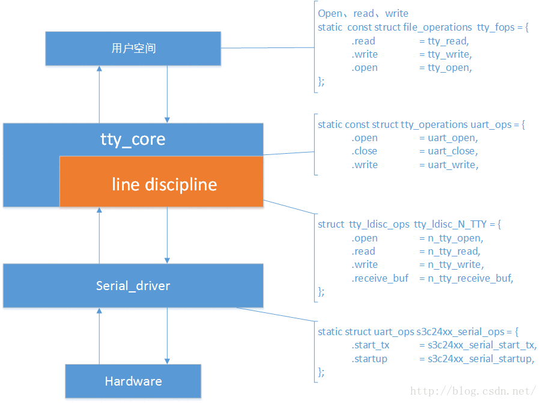
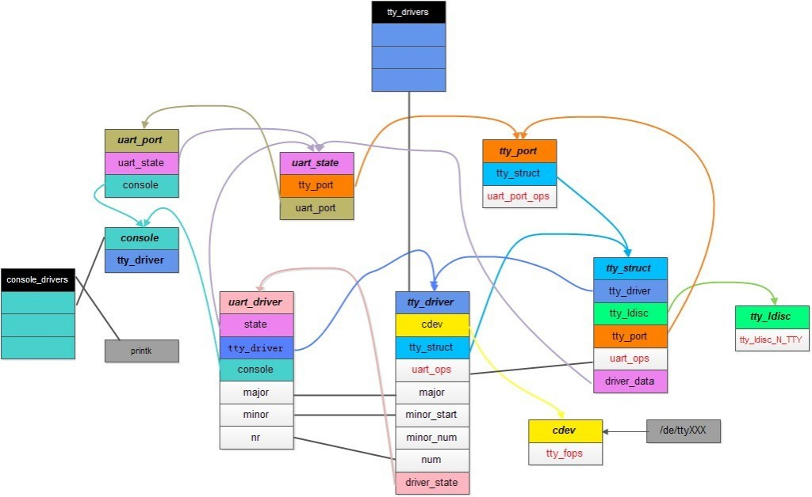
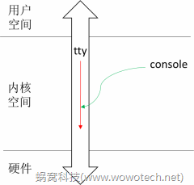
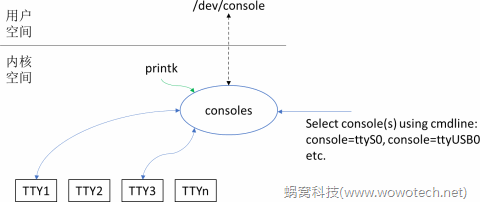

1.8 uart子系统
======================================

1.8.1 uart子系统框图和配置文件
--------------------------------------

**sys_config.fex**：

.. code-block:: text
    :linenos:

    ;----------------------------------------------------------------------------------
    ;uart configuration
    ;uart_type ---  2 (2 wire), 4 (4 wire), 8 (8 wire, full function)
    ;----------------------------------------------------------------------------------
    [uart0]
    uart_used       = 1
    uart_port       = 0
    uart_type       = 2
    uart_tx         = port:PH00<3><1><default><default>
    uart_rx         = port:PH01<3><1><default><default>

    [uart0_suspend]
    uart0_tx         = port:PH00<7><1><default><default>
    uart0_rx         = port:PH01<7><1><default><default>

    [uart1]
    uart1_used       = 1
    uart1_type       = 4
    uart1_tx         = port:PG06<2><1><default><default>
    uart1_rx         = port:PG07<2><1><default><default>
    uart1_rts        = port:PG08<2><1><default><default>
    uart1_cts        = port:PG09<2><1><default><default>

    [uart1_suspend]
    uart1_tx         = port:PG06<7><1><default><default>
    uart1_rx         = port:PG07<7><1><default><default>
    uart1_rts        = port:PG08<7><1><default><default>
    uart1_cts        = port:PG09<7><1><default><default>    

**设备树描述**：

.. code-block:: text
    :linenos:

    uart0@1 {
        allwinner,pins = "PH0", "PH1";
        allwinner,function = "io_disabled";
        allwinner,muxsel = <0x7>;
        allwinner,drive = <0x1>;
        allwinner,pull = <0x0>;
    };

    uart1@0 {
        linux,phandle = <0x8f>;
        phandle = <0x8f>;
        allwinner,pins = "PG6", "PG7", "PG8", "PG9";
        allwinner,function = "uart1";
        allwinner,pname = "uart1_tx", "uart1_rx", "uart1_rts", "uart1_cts";
        allwinner,muxsel = <0x2>;
        allwinner,pull = <0x1>;
        allwinner,drive = <0xffffffff>;
        allwinner,data = <0xffffffff>;
    };

    uart1@1 {
        linux,phandle = <0x90>;
        phandle = <0x90>;
        allwinner,pins = "PG6", "PG7", "PG8", "PG9";
        allwinner,function = "uart1";
        allwinner,pname = "uart1_tx", "uart1_rx", "uart1_rts", "uart1_cts";
        allwinner,muxsel = <0x7>;
        allwinner,pull = <0x1>;
        allwinner,drive = <0xffffffff>;
        allwinner,data = <0xffffffff>;
    };
        
    uart3@0 {
            allwinner,pins = "PH4", "PH5", "PH6", "PH7";
            allwinner,pname = "uart3_tx", "uart3_rx", "uart3_rts", "uart3_cts";
            allwinner,function = "uart3";
            allwinner,muxsel = <0x2>;
            allwinner,drive = <0x1>;
            allwinner,pull = <0x1>;
            linux,phandle = <0x16>;
            phandle = <0x16>;
        };

        uart3@1 {
            allwinner,pins = "PH4", "PH5", "PH6", "PH7";
            allwinner,function = "io_disabled";
            allwinner,muxsel = <0x7>;
            allwinner,drive = <0x1>;
            allwinner,pull = <0x0>;
            linux,phandle = <0x17>;
            phandle = <0x17>;
        };
                
    uart@05000000 {
        compatible = "allwinner,sun8i-uart";
        device_type = "uart0";
        reg = <0x0 0x5000000 0x0 0x400>;
        interrupts = <0x0 0x4c 0x4>;
        clocks = <0xd>;
        pinctrl-names = "default", "sleep";
        uart0_port = <0x0>;
        uart0_type = <0x2>;
        status = "okay";
        uart_used = <0x1>;
        uart_port = <0x0>;
        uart_type = <0x2>;
        pinctrl-0 = <0x8d>;
        pinctrl-1 = <0x8e>;
    };

    uart@05000400 {
        compatible = "allwinner,sun8i-uart";
        device_type = "uart1";
        reg = <0x0 0x5000400 0x0 0x400>;
        interrupts = <0x0 0x4d 0x4>;
        clocks = <0xf>;
        pinctrl-names = "default", "sleep";
        uart1_port = <0x1>;
        uart1_type = <0x4>;
        status = "okay";
        pinctrl-0 = <0x8f>;
        pinctrl-1 = <0x90>;
    };

    uart@05000c00 {
        compatible = "allwinner,sun8i-uart";
        device_type = "uart3";
        reg = <0x0 0x5000c00 0x0 0x400>;
        interrupts = <0x0 0x4f 0x4>;
        clocks = <0x15>;
        pinctrl-names = "default", "sleep";
        pinctrl-0 = <0x16>;
        pinctrl-1 = <0x17>;
        uart3_port = <0x3>;
        uart3_type = <0x4>;
        status = "disabled";
    };

**源码位置和内核配置**：

.. code-block:: text
    :linenos:

    lichee/linux-4.9/drivers/tty/serial/sunxi-uart.c

    obj-$(CONFIG_SERIAL_SUNXI)	+= sunxi-uart.o

    config SERIAL_SUNXI
        tristate "SUNXI UART Controller"
        depends on SERIAL_8250=n
        depends on OF
        select SERIAL_CORE
        default y
        help
        If you have an Allwinner SOC based board and want to use the
        built-in UART of the SoC, say Y to this option.

    config SERIAL_SUNXI_DMA
        bool "SUNXI UART USE DMA"
        depends on SERIAL_SUNXI=y
        depends on OF
        default n
        help
        If you have an Allwinner SOC based board and want to use the
        built-in UART DMA of the SoC, say Y to this option

    config SERIAL_SUNXI_CONSOLE
        bool "Console on SUNXI UART port"
        depends on SERIAL_SUNXI=y
        select SERIAL_CORE_CONSOLE
        default SERIAL_SUNXI
        help
        Enable a built-in UART port of the Allinner SOC to be the system console.

    config SERIAL_SUNXI_EARLYCON
        bool "Enable sunxi earlycon."
        depends on SERIAL_SUNXI=y
        depends on SERIAL_SUNXI_CONSOLE=y
        select SERIAL_EARLYCON
        default n
        help
        Enable earlycon with boot step. If enable earlycon, kernel cmd (earlycon=uart0,addr) must be add.    

1.8.2 代码分析
--------------------------------------        

**入口函数**：

.. code-block:: c
    :linenos:

    static const struct of_device_id sunxi_uart_match[] = {
        { .compatible = "allwinner,sun8i-uart", },
    };
    MODULE_DEVICE_TABLE(of, sunxi_uart_match);

    static struct platform_driver sw_uport_platform_driver = {
        .probe  = sw_uart_probe,
        .remove = sw_uart_remove,
        .driver = {
            .name  = SUNXI_UART_DEV_NAME,
            .pm    = SERIAL_SW_PM_OPS,
            .owner = THIS_MODULE,
            .of_match_table = sunxi_uart_match,
        },
    };

    static int __init sunxi_uart_init(void)
    {
        int ret;

        ret = uart_register_driver(&sw_uart_driver);
        if (unlikely(ret)) {
            SERIAL_MSG("driver initializied\n");
            return ret;
        }

        return platform_driver_register(&sw_uport_platform_driver);
    }

    module_init(sunxi_uart_init);

**sw_uart_probe**：

.. code-block:: c
    :linenos:

    //获取alisa serial id
    //serial0 = "/soc@03000000/uart@05000000", "/soc@03000000/uart@05000000";
    pdev->id = of_alias_get_id(np, "serial");

    //私有数据sw_uart_ports
    #define SUNXI_UART_NUM          4
    static struct sw_uart_port sw_uart_ports[SUNXI_UART_NUM];
    struct uart_port *port;
    port = &sw_uart_ports[pdev->id].port;

    static struct sw_uart_pdata sw_uport_pdata[SUNXI_UART_NUM];
    pdata = &sw_uport_pdata[pdev->id];

    //私有结构体sw_uart_port
    struct sw_uart_port *sw_uport;
    sw_uport = UART_TO_SPORT(port);
    sw_uport->pdata = pdata;
    sw_uport->id = pdev->id;
    sw_uport->ier = 0;
    sw_uport->lcr = 0;
    sw_uport->mcr = 0;
    sw_uport->fcr = 0;
    sw_uport->dll = 0;
    sw_uport->dlh = 0;
    snprintf(sw_uport->name, 16, SUNXI_UART_DEV_NAME"%d", pdev->id);

    //uart_port初始化 串口实体抽象
    port->uartclk = 24000000;

    platform_get_resource(pdev, IORESOURCE_MEM, 0);
    port->mapbase = res->start;

    port->irq = platform_get_irq(pdev, 0);

    snprintf(uart_para, sizeof(uart_para), "uart%d_port", pdev->id);
    of_property_read_u32(np, uart_para, &port->line);

    snprintf(uart_para, sizeof(uart_para), "uart%d_type", pdev->id);
    ret = of_property_read_u32(np, uart_para, &pdata->io_num);

    port->iotype = UPIO_MEM;
    port->type = PORT_SUNXI;
    port->flags = UPF_BOOT_AUTOCONF;
    port->ops = &sw_uart_ops;              //真正的uart操作函数
    port->fifosize = SUNXI_UART_FIFO_SIZE;

    //sysfs调试相关
    device_create_file(&_pdev->dev, &sunxi_uart_dev_info_attr);
    device_create_file(&_pdev->dev, &sunxi_uart_status_attr);
    device_create_file(&_pdev->dev, &sunxi_uart_loopback_attr);
    device_create_file(&_pdev->dev, &sunxi_uart_ctrl_info_attr);

    //添加端口
    uart_add_one_port(&sw_uart_driver, port);    

串口操作函数集：

.. code-block:: c
    :linenos:

    static struct uart_ops sw_uart_ops = {
        .tx_empty = sw_uart_tx_empty,
        .set_mctrl = sw_uart_set_mctrl,
        .get_mctrl = sw_uart_get_mctrl,
        .stop_tx = sw_uart_stop_tx,
        .start_tx = sw_uart_start_tx,
        .stop_rx = sw_uart_stop_rx,
        .enable_ms = sw_uart_enable_ms,
        .break_ctl = sw_uart_break_ctl,
        .startup = sw_uart_startup,
        .shutdown = sw_uart_shutdown,
        .flush_buffer = sw_uart_flush_buffer,
        .set_termios = sw_uart_set_termios,
        .type = sw_uart_type,
        .release_port = sw_uart_release_port,
        .request_port = sw_uart_request_port,
        .config_port = sw_uart_config_port,
        .verify_port = sw_uart_verify_port,
        .ioctl = sw_uart_ioctl,
        .pm = sw_uart_pm,
    };    

**uart_register_driver**：注册uart及端口。

.. code-block:: c
    :linenos:

    #define SUNXI_UART_DEV_NAME			"uart"
    #define SUNXI_UART_NUM          4
    #define SW_CONSOLE	(&sw_console)

    //uart port由同一uart_driver驱动
    static struct uart_driver sw_uart_driver = {
        .owner = THIS_MODULE,
        .driver_name = SUNXI_UART_DEV_NAME,
        .dev_name = "ttyS",
        .nr = SUNXI_UART_NUM,     //最大支持的port数
        .cons = SW_CONSOLE,
    };

**console**：

在嵌入式开发的过程中，我们通常会从SOC上众多串口中选择一个，当作console设备，以方便开发和调试。\
作用：kernel日志信息（printk）的输出。实现基础的、基于控制台的人机交互。

既然已经有了TTY框架，为什么要多出来一个console框架，为什么不能直接使用TTY driver的接口实现console功能？ \
TTY框架的核心功能，就是管理TTY设备，并提供访问TTY设备的API（如数据收发）。\
而console的两个功能需求，“日志输出”就是向TTY设备发送数据，“控制台人机交互”就是标准的TTY功能。因此从功能上看，完全可以直接使用TTY框架的API啊。

不过，既然存在，一定有其意义。内核之所以要抽象出console框架，思路如下：

* Linux kernel有一个很强烈的隐性规则----内核空间的代码不应该直接利用用户空间接口访问某些资源，\
  例如kernel代码不应该直接使用文件系统接口访问文件（虽然它可以）。 \
  回到本文的场景里面，TTY框架通过字符设备（也即文件系统）向用户空间提供接口，\
  那么kernel的代码（如printk），就不能直接使用TTY的接口访问TTY设备，怎么办呢？\
  开一个口子，从kernel里面再拉出一套接口，这就是console框架。
  

  
* console框架构建在TTY框架之上，大部分的实现（特别是访问硬件的部分）都和TTY框架复用。
* 系统中可以有多个TTY设备，只有那些附加了console驱动的设备，才有机会成为kernel日志输出的目的地，\
  有机会成为控制台终端。因此，console框架变相的成为管理TTY设备的一个框架。
* 驱动工程师在为某个TTY设备编写TTY driver的时候，会根据实际的需求，评估该TTY设备是否可能成为控制台设备，\
  如果可能，则同时为其编写system console driver，使其成为候选的控制台设备。\
  系统工程师在系统启动的时候，可以通过kernel命令行参数，决定printk会在哪些候选设备上输出，那个候选设备最终会成为控制台设备。

console实现：

.. code-block:: c
    :linenos:

    static struct console sw_console = {
        .name = "ttyS",              //console名称
        .write = sw_console_write,   
        .device = uart_console_device,
        .setup = sw_console_setup,
        .flags = CON_PRINTBUFFER,
        .index = -1,                 //自动选择uart port
        .data = &sw_uart_driver,
    };

    //write，如果某个console被选中作为printk的输出，则kernel printk模块会调用write回调函数，将日志信息输出到。

    //device，获取该console对应的TTY driver，用于将console和对应的TTY设备绑定，这样控制台终端就可以和console
    //共用同一个TTY设备了。

    //setup，用于初始化console的回调函数，console driver可以在该回调函数中对硬件做出现动作。
    //可以不实现，如果实现，则必须返回0，否则该console不可用。

    //flags，指示属性的flags，常用的包括：
    //CON_BOOT，该console是一个临时console，只在启动的时候使用，kernel会在真正的console注册后，把它注销掉。
    //CON_CONSDEV，表示该console会被用作控制台终端（和/dev/console对应），对应命令行中的最后一个，例如“console=ttyXS0 console=ttyUSB2”中的ttyUSB2。
    //CON_PRINTBUFFER，如果设置了该flag，kernel在该console被注册的时候，会将那些被缓存到buffer中的之前的日志，统统输出到该console上。通常注册的console，如串口console，都会设置该flag，以便可以看到console注册前的日志输出。
    //CON_ENABLED，表示该console正在被使用。    

在add uart port时，serial core会自动比较uart driver---->cons---->index和uart port---->line，如果匹配，则调用register_console帮忙注册console驱动。

1.8.3 应用测试与测试
--------------------------------------  

**打开uart3**：

.. code-block:: text
    :linenos:

    [uart3]
    uart3_used = 1

**产生的sys文件**：

.. code-block:: shell
    :linenos:

    /dev/ttyS3  //应用程序操作的设备节点
    
    ./sys/devices/platform/soc/uart3
    ./sys/bus/platform/devices/uart3 -> ../../../devices/platform/soc/uart3

    ./sys/bus/platform/drivers/uart    

**应用程序：回显**

.. code-block:: c
    :linenos:    

    #include <stdio.h>
    #include <fcntl.h>   /* File Control Definitions           */
    #include <termios.h> /* POSIX Terminal Control Definitions */
    #include <unistd.h>  /* UNIX Standard Definitions 	   */
    #include <errno.h>   /* ERROR Number Definitions           */

    int uart_int(void)
    {
        int fd;/*File Descriptor*/
        /*------------------------------- Opening the Serial Port -------------------------------*/
        fd = open("/dev/ttyS3", O_RDWR | O_NOCTTY | O_NDELAY);	/* ttyUSB0 is the FT232 based USB2SERIAL Converter  |O_NDELAY */
        /* O_RDWR   - Read/Write access to serial port       */
        /* O_NOCTTY - No terminal will control the process   */
        /* Open in blocking mode,read will wait              */
        if(fd == -1)						/* Error Checking */
        {
            printf("\n  Error! in Opening ttyUSB0  ");
            return -1;
        }
        else
        {
            printf("\n  ttyUSB0 Opened Successfully ");
        }

        /*---------- Setting the Attributes of the serial port using termios structure --------- */
        /*RX init*/
        struct termios SerialPortSettings;	/* Create the structure                          */
        tcgetattr(fd, &SerialPortSettings);	/* Get the current attributes of the Serial port */
        
        /* Setting the Baud rate */
        cfsetispeed(&SerialPortSettings, B115200); /* Set Read  Speed as 115200                       */
        cfsetospeed(&SerialPortSettings, B115200); /* Set Write Speed as 115200                       */
        
        /* 8N1 Mode */
        SerialPortSettings.c_cflag &= ~PARENB;   /* Disables the Parity Enable bit(PARENB),So No Parity   */
        SerialPortSettings.c_cflag &= ~CSTOPB;   /* CSTOPB = 2 Stop bits,here it is cleared so 1 Stop bit */
        SerialPortSettings.c_cflag &= ~CSIZE;	 /* Clears the mask for setting the data size             */
        SerialPortSettings.c_cflag |=  CS8;      /* Set the data bits = 8                                 */
        SerialPortSettings.c_cflag &= ~CRTSCTS;       /* No Hardware flow Control                         */
        SerialPortSettings.c_cflag |= CREAD | CLOCAL; /* Enable receiver,Ignore Modem Control lines       */
        SerialPortSettings.c_iflag &= ~(IXON | IXOFF | IXANY);          /* Disable XON/XOFF flow control both i/p and o/p */
        SerialPortSettings.c_lflag &= ~(ICANON | ECHO | ECHOE | ISIG);  /* Non Cannonical mode                            */
        SerialPortSettings.c_oflag &= ~OPOST;/*No Output Processing   raw  format  output*/

        /* Setting Time outs */
        SerialPortSettings.c_cc[VMIN] = 0; /* Read at least 10 characters */
        SerialPortSettings.c_cc[VTIME] = 1; /* Wait indefinetly   */

        if((tcsetattr(fd, TCSANOW, &SerialPortSettings)) != 0) /* Set the attributes to the termios structure*/
            printf("\n  ERROR ! in Setting attributes");
        else
            printf("\n  BaudRate = 115200 \n  StopBits = 1 \n  Parity   = none");

        /*------------------------------- Read data from serial port -----------------------------*/
        tcflush(fd, TCIFLUSH);   /* Discards old data in the rx buffer            */
        close(fd); /* Close the serial port */

        return 0;

    }

    int main(void)
    {
        int fd;/*File Descriptor*/
        printf("\n +----------------------------------+");
        printf("\n |        Serial Port Read          |");
        printf("\n +----------------------------------+");
        
        uart_int();
        /*------------------------------- Opening the Serial Port -------------------------------*/
        fd = open("/dev/ttyS3", O_RDWR | O_NOCTTY | O_NDELAY);	/* ttyS3 is the FT232 based USB2SERIAL Converter   */
        /* O_RDWR   - Read/Write access to serial port       */
        /* O_NOCTTY - No terminal will control the process   */
        /* Open in blocking mode,read will wait              */
        if(fd == -1)						/* Error Checking */
            printf("\n  Error! in Opening ttyUSB0  ");
        else
            printf("\n  ttyS3 Opened Successfully ");

        char read_buffer[32];   /* Buffer to store the data received              */
        int  bytes_read = 0;    /* Number of bytes read by the read() system call */
        int i = 0;
        
        while(1)
        {
            bytes_read = read(fd, &read_buffer, 32); /* Read the data                   */
            if(bytes_read > 0)
            {
                printf("\n\n  Bytes Rxed -%d", bytes_read); /* Print the number of bytes read */
                printf("\n\n  ");

                for(i = 0; i < bytes_read; i++)	 /*printing only the received characters*/
                    printf("%c", read_buffer[i]);

                int  bytes_written  = 0;  	/* Value for storing the number of bytes written to the port */
                bytes_written = write(fd, read_buffer, bytes_read); /* use write() to send data to port                                            */
                /* "fd"                   - file descriptor pointing to the opened serial port */
                /*	"write_buffer"         - address of the buffer containing data	            */
                /* "sizeof(write_buffer)" - No of bytes to write             */
                printf("\n  %d Bytes written to ttyUSB0", bytes_written);
                printf("\n\n  Bytes Rxed -%d", bytes_read); /* Print the number of bytes read */
                printf("\n\n  ");
                printf("\n +----------------------------------+\n\n\n");
            }
            //sleep(1);
        }
    }

