2.1 离散时间信号与系统
======================================

2.1.1 离散时间信号的描述
--------------------------------------

**有限长序列**：

.. code-block:: python
    :linenos:

    import matplotlib.pyplot as plt

    n = [-3,-2,-1,0,1,2,3,4]
    x = [2,1,-1,0,1,4,3,7]

    plt.scatter(n, x)
    plt.show()

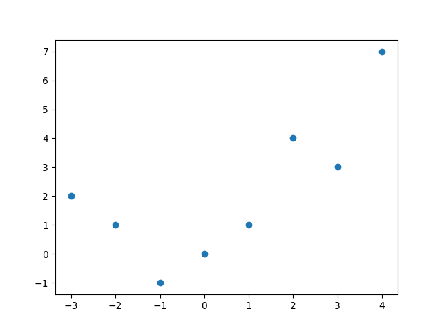

**单位样本序列**：

.. code-block:: python
    :linenos:

    import numpy as np
    import math
    import matplotlib.pyplot as plt

    def impseq(n0,n1,n2):
        assert n0>n1 and n0<n2
        n = np.arange(n1,n2+1)
        x = n.copy()
        x1 = n.copy()
        x[x1-n0 != 0] = 0
        x[x1-n0 == 0] = 1  
        return n,x

    n,x = impseq(2,-1,4)

    plt.scatter(n, x)
    plt.show()

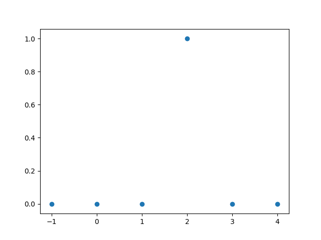
    
**单位阶跃序列**：

.. code-block:: python
    :linenos:

    import numpy as np
    import math
    import matplotlib.pyplot as plt

    def stepseq(n0,n1,n2):
        assert n0>=n1 and n0<=n2
        n = np.arange(n1,n2+1)
        x = n.copy()
        x1 = n.copy()
        x[x1-n0 >= 0] = 1
        x[x1-n0 < 0] = 0
        return n,x

    n,x = stepseq(2,-1,4)

    plt.scatter(n, x)
    plt.show()

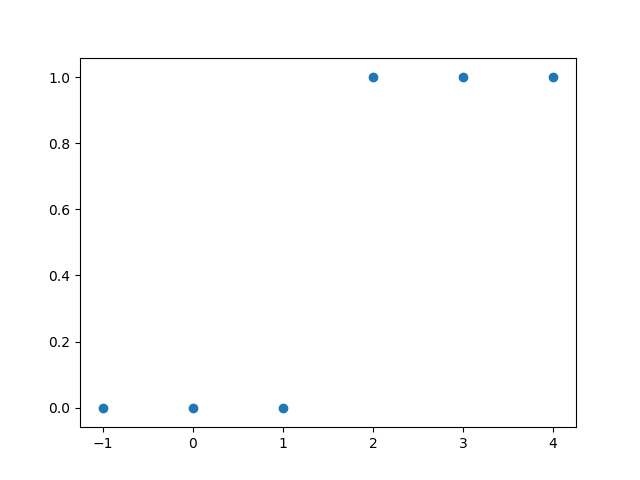

**实值指数序列**：

.. code-block:: python
    :linenos:

    import numpy as np
    import matplotlib.pyplot as plt

    n = np.arange(0,10)
    x = np.power(0.9,n)

    plt.scatter(n, x)
    plt.show()

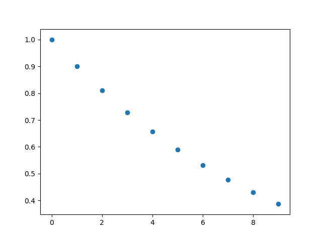

2.1.2 离散时间信号的运算
--------------------------------------

**信号相加**：

.. code-block:: python
    :linenos:

    import numpy as np
    import math
    import matplotlib.pyplot as plt

    def sigadd(n1,x1,n2,x2):
        n1Min = np.min(n1)
        n2Min = np.min(n2)
        n1Max = np.max(n1)
        n2Max = np.max(n2)
        nMin = min(n1Min,n2Min)
        nMax = max(n1Max,n2Max)
        n = np.arange(nMin,nMax+1)
        
        legth = nMax-nMin+1
        
        y1 = np.zeros(legth)
        y1Beg = n1Min-nMin
        y1End = legth-(nMax-n1Max)
        y1[y1Beg:y1End] = x1.tolist()
        
        y2 = np.zeros(legth)
        y2Beg = n2Min-nMin
        y2End = legth-(nMax-n2Max)
        y2[y2Beg:y2End] = x2.tolist()    
        
        y = y1+y2
        return n,y

    n1 = np.array([-3,-2,-1,0,1,2,3,4,5])
    x1 = np.array([0,1,2,3,4,5,6,7,8])

    n2 = np.array([1,2,3,4,5,6])
    x2 = np.array([1,2,3,4,5,6])

    n,y = sigadd(n1,x1,n2,x2)

    plt.subplot(311)
    plt.scatter(n1,x1)
    plt.xlim(-3, 6)
    plt.ylim(0,15)

    plt.subplot(312)
    plt.scatter(n2,x2)
    plt.xlim(-3, 6)
    plt.ylim(0,15)

    plt.subplot(313)
    plt.scatter(n,y)
    plt.xlim(-3, 6)
    plt.ylim(0,15)

    plt.show()

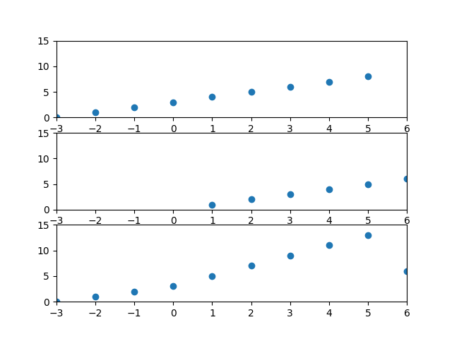

信号相乘和信号相加类似，只需将y=y1+y2修改成y=y1*y2即可。

**信号移位**：

.. code-block:: python
    :linenos:

    import numpy as np
    import math
    import matplotlib.pyplot as plt

    def sigshift(n,x,k):
        n = n+k
        return n,x

    n1 = np.array([-3,-2,-1,0,1,2,3,4,5])
    x1 = np.array([9,1,2,3,4,5,6,7,8])

    n,x = sigshift(n1,x1,1)

    plt.subplot(211)
    plt.scatter(n1,x1)
    plt.xlim(-4, 6)

    plt.subplot(212)
    plt.scatter(n,x)
    plt.xlim(-4, 6)

    plt.show()    

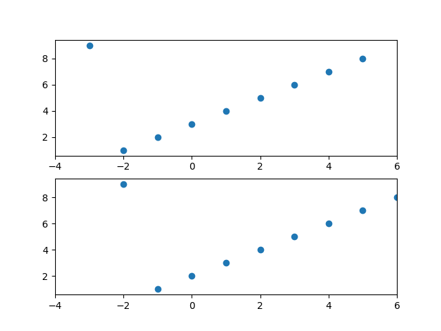

**信号反转**：y(n) = x(-n)

.. code-block:: python
    :linenos:

    import numpy as np
    import math
    import matplotlib.pyplot as plt

    def sigfold(n,x):
        x = x[: :-1]
        n = -n[: : -1]
        return n,x

    n1 = np.array([-1,0,1,2])
    x1 = np.array([1,2,3,4])
    n,x =  sigfold(n1,x1)

    plt.subplot(211)
    plt.scatter(n1,x1)
    plt.xlim(-4, 4)

    plt.subplot(212)
    plt.scatter(n,x)
    plt.xlim(-4, 4)

    plt.show()    

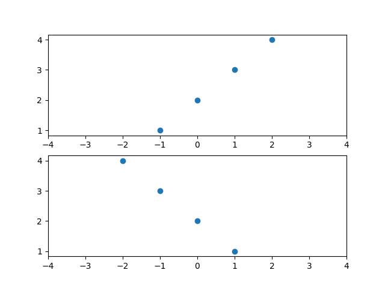

**信号能量**：

.. code-block:: python
    :linenos:

    import numpy as np
    import math
    import matplotlib.pyplot as plt

    x = np.array([1,1+1j,2+2j])
    Ex1 = np.sum(x*np.conj(x))              #method 1
    Ex2 = np.sum(np.power(np.abs(x),2))     #method 2
    print("signal power")
    print(Ex1)
    print(Ex2)

    signal power
    (11+0j)
    11.0    

**复杂信号的表示**：

.. math:: 
    x(n) = n[u(n)-u(n-10)] + 10e^{-0.3(n-10)}[u(n-10)-u(n-20)], 0 \leq n \leq 5

.. code-block:: python
    :linenos:

    import numpy as np
    import math
    import matplotlib.pyplot as plt

    def stepseq(n0,n1,n2):
        assert n0>=n1 and n0<=n2
        n = np.arange(n1,n2+1)
        x = n.copy()
        x1 = n.copy()
        x[x1-n0 >= 0] = 1
        x[x1-n0 < 0] = 0
        return n,x

    n = np.arange(0,21)

    x1 = n*(stepseq(0,0,20)[1]-stepseq(10,0,20)[1])
    x2 = 10*np.exp(-0.3*(n-10))*(stepseq(10,0,20)[1]-stepseq(20,0,20)[1])
    x = x1+x2

    plt.scatter(n,x)
    plt.show() 

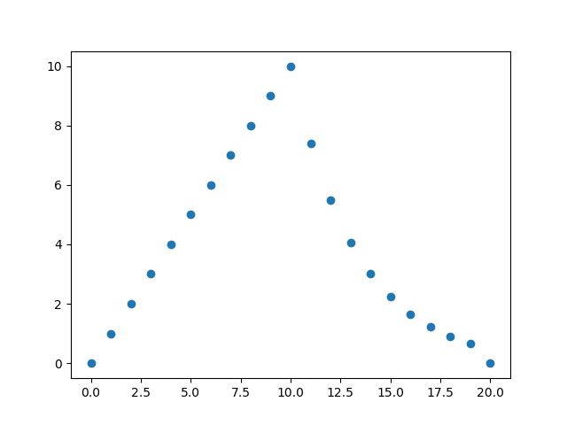
    
.. math:: 
    已知x(n) = [1,2,3,4,5,6,7,6,5,4,3,2,1] , -2 \leq n \leq 10，求x1(n) = 2x(n-5)-3x(n+4)

.. code-block:: python
    :linenos:

    n = np.arange(-2,11)
    x = np.array([1,2,3,4,5,6,7,6,5,4,3,2,1])

    n1,x1 = sigshift(n,x,5)
    n2,x2 = sigshift(n,x,-4)

    n3,y = sigadd(n1,2*x1,n2,-3*x2)

    plt.scatter(n3,y)
    plt.show()

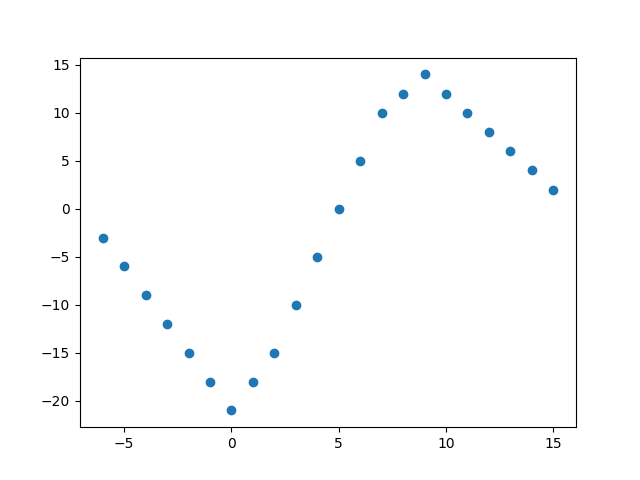

**复值序列**：

.. math:: 
    x(n) = e^{(-0.1+0.3j)n}, -10 \leq n \leq 10

.. code-block:: python
    :linenos:

    import numpy as np
    import math
    import matplotlib.pyplot as plt

    n = np.arange(-10,11)
    alpha = -0.1+0.3j
    x = np.exp(alpha*n)

    plt.subplot(221)
    plt.scatter(n,np.real(x))

    plt.subplot(222)
    plt.scatter(n,np.imag(x))

    plt.subplot(223)
    plt.scatter(n,np.abs(x))

    plt.subplot(224)
    plt.scatter(n,np.angle(x)*(180/np.pi))

    plt.show() 

    #幅值和相角：R=abs(Z); Theta=angle(Z);
    #用下式来转换回原来的复数：
    #Z=R.*exp(i*theta);
    #angle(z) = imag(log(z)) = atan2(imag(z),real(z))。

    #double atan2(double y,double x) 返回的是原点至点(x,y)的方位角，即与 x 轴的夹角。
    #也可以理解为复数 x+yi 的辐角。返回值的单位为弧度，取值范围为[-pi~pi]；

    #欧拉公式e^iθ=cosθ+isinθ    

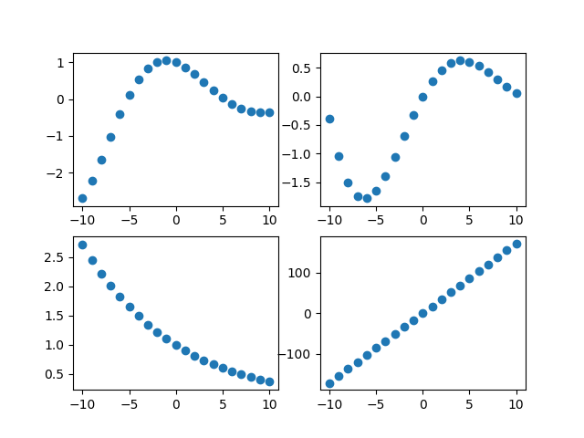

2.1.3 卷积
--------------------------------------

**卷积的计算**：

.. math:: 
    y(n) = \sum_{i \to-\infty}^{\infty}x(i)h(n-j)

用两张动图形象的表示卷积的意义。

.. image:: images/离散时间信号与系统/卷积表示01.gif

.. image:: images/离散时间信号与系统/卷积表示02.gif

数字滤波器可以用卷积进行表示，如下图：

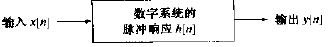

**卷积与FIR滤波器**：

FIR滤波器，用卷积的概念理解为有限长单位冲激响应滤波器。\
有限脉冲响应(infinite impulse response IIR)：对于非递归滤波器，\
因为新的输入仅取决于输入，因此当某个点以后没有输入，其脉冲响应会逐步下降到零。

假设FIR滤波器系数为h(0)=0.1 h(1)=0.2 h(2)=0.3，求输入为[1,2,3,4,5]时的输出。

.. code-block:: python
    :linenos:

    import numpy as np
    import math
    import matplotlib.pyplot as plt

    def conv_m(n1,x1,n2,x2):
        nBeg = n1[0]+n2[0]
        nEnd = n1[-1] + n2[-1]
        n = np.arange(nBeg,nEnd+1)
        y = np.convolve(x1,x2)
        return n,y

    n1 = np.array([0,1,2,3,4])
    x1 = [1,2,3,4,5]

    #FIR滤波器系数为h(0)=0.1 h(1)=0.2 h(2)=0.3
    n2 = np.array([0,1,2])
    x2 = [0.1,0.2,0.3]
    n,y = conv_m(n1,x1,n2,x2)

    plt.scatter(n,y)
    plt.show()

.. image:: images/离散时间信号与系统/FIR滤波器计算.png

注意：进行卷积后，输出的长度增加了，假设输入序列长度为L，FIR滤波器长度为M，卷积后的长度为L+M-1。

**卷积与IIR滤波器**：

IIR滤波器，用卷积的概念理解为无限长单位冲激响应滤波器。 \
无限脉冲响应(infinite impulse response IIR)：对于递归滤波器，\
因为新的输入取决于过去的输出和输入，因此即使某个点以后没有输入，其脉冲响应也仅会越来越小，绝不会下降到零。\
假设滤波器表示为：

.. math:: 
    h(n) = (0.9)^nu(n)

求输入为x(n) = [0,1,2,3,4,5,6,7,8,9]时的输出。\
由于IIR滤波器的长度为无限长，无法表示完全，所以这里取50个点来进行卷积运算。

.. code-block:: python
    :linenos:

    import numpy as np
    import math
    import matplotlib.pyplot as plt

    def conv_m(n1,x1,n2,x2):
        nBeg = n1[0]+n2[0]
        nEnd = n1[-1] + n2[-1]
        n = np.arange(nBeg,nEnd+1)
        y = np.convolve(x1,x2)
        return n,y

    n1 = np.array([0,1,2,3,4,5,6,7,8,9])
    x1 = [0,1,2,3,4,5,6,7,8,9]

    n2 = np.arange(0,51)
    x2 = np.power(0.9,n2)
    n,y = conv_m(n1,x1,n2,x2)

    print(y[0:10])
    plt.scatter(n,y)
    plt.show()

    # [  0.           1.           2.9          5.61         9.049       13.1441
    #   17.82969     23.046721    28.7420489   34.86784401]    

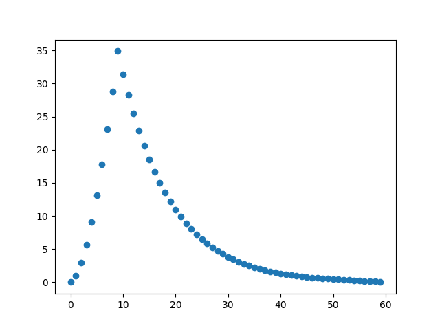

**长序列卷积**：

在前面的卷积计算中，输入作为一个单独的块传递到滤波器中，对于时间非常长的信号，这种方法是不行的，\
需要采用重叠相加法(Overlap-add)来进行计算，如下图：

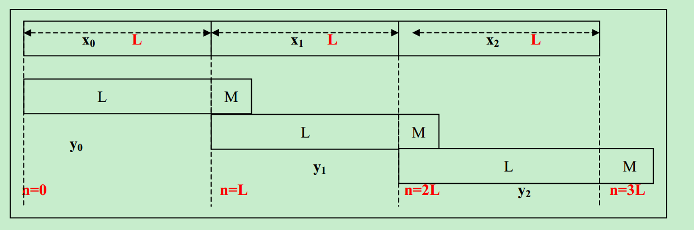

例如：输入为x=[1,1,2,1,2,2,1,1,0]，滤波器系数为h=[1,2,-1,1]，求滤波器输出。

.. code-block:: python
    :linenos:

    import numpy as np
    import math
    import matplotlib.pyplot as plt

    def conv_m(n1,x1,n2,x2):
        nBeg = n1[0]+n2[0]
        nEnd = n1[-1] + n2[-1]
        n = np.arange(nBeg,nEnd+1)
        y = np.convolve(x1,x2)
        return n,y

    n1 = np.array([0,1,2,3,4,5,6,7,8])
    x1 = [1,1,2,1,2,2,1,1,0]

    n2 = np.array([0,1,2,3])
    x2 = np.array([1,2,-1,1])
    n,y = conv_m(n1,x1,n2,x2)

    plt.scatter(n,y)
    plt.show()    

假设将输入分为三段，使用重叠相加法进行计算。

.. code-block:: python
    :linenos:

    import numpy as np
    import math
    import matplotlib.pyplot as plt

    def sigadd(n1,x1,n2,x2):
        n1Min = np.min(n1)
        n2Min = np.min(n2)
        n1Max = np.max(n1)
        n2Max = np.max(n2)
        nMin = min(n1Min,n2Min)
        nMax = max(n1Max,n2Max)
        n = np.arange(nMin,nMax+1)
        
        legth = nMax-nMin+1
        
        y1 = np.zeros(legth)
        y1Beg = n1Min-nMin
        y1End = legth-(nMax-n1Max)
        y1[y1Beg:y1End] = x1.tolist()
        
        y2 = np.zeros(legth)
        y2Beg = n2Min-nMin
        y2End = legth-(nMax-n2Max)
        y2[y2Beg:y2End] = x2.tolist()    
        
        y = y1+y2
        return n,y

    def conv_m(n1,x1,n2,x2):
        nBeg = n1[0]+n2[0]
        nEnd = n1[-1] + n2[-1]
        n = np.arange(nBeg,nEnd+1)
        y = np.convolve(x1,x2)
        return n,y

    n1 = np.array([0,1,2])
    x1 = [1,1,2]

    n2 = np.array([3,4,5])
    x2 = [1,2,2]

    n3 = np.array([6,7,8])
    x3 = [1,1,0]

    n4 = np.array([0,1,2,3])
    x4 = np.array([1,2,-1,1])

    s1,y1 = conv_m(n1,x1,n4,x4)
    s2,y2 = conv_m(n2,x2,n4,x4)   
    s3,y3 = conv_m(n3,x3,n4,x4)      

    sTmp,yTmp = sigadd(s1,y1,s2,y2)
    s,y = sigadd(sTmp,yTmp,s3,y3)

    plt.scatter(s,y)
    plt.show()

两种方法的输出结果都是一样的，如下图：

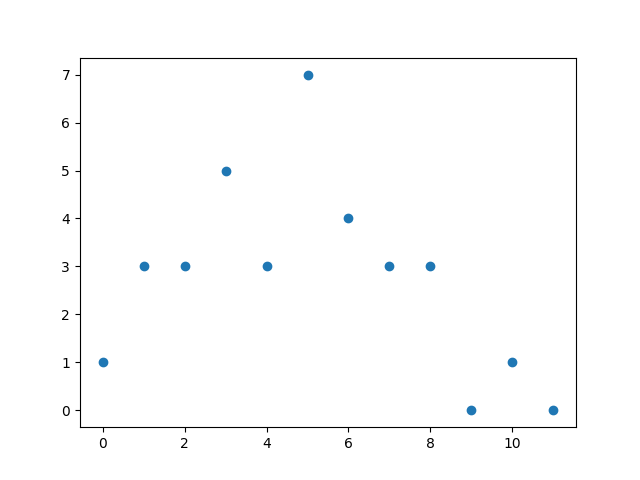

2.1.4 差分方程
--------------------------------------

数字滤波器也可以使用差分方程来表示。

**差分方程与FIR滤波器**：\
从差分方程的角度看，FIR滤波器又称为非递归滤波器（仅依赖输入）。 

已经如下差分方程，求输入为[1,2,3,4,5]的输出。

.. math:: 
    0.1x(n)+0.2x(n-1)+0.3x(n-2)=y(n)

.. code-block:: python
    :linenos:

    import numpy as np
    from scipy import signal
    import math
    import matplotlib.pyplot as plt

    #差分方程系数
    a = np.array([1])
    b = np.array([0.1,0.2,0.3])

    #输入序列
    x = np.array([1,2,3,4,5])

    #输出的长度和输入序列长度相等
    n = np.arange(0,x.shape[0])

    #滤波计算
    y = signal.lfilter(b,a,x)

    plt.scatter(n,y)
    plt.xlim(0,6)
    plt.show()

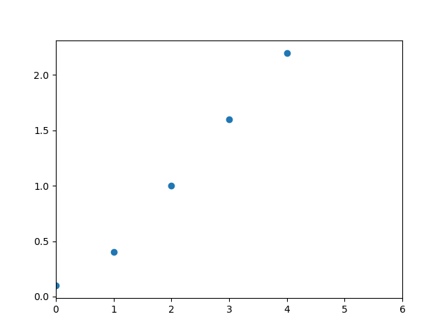

**差分方程与IIR滤波器**：\
IIR滤波器以差分方程的角度来分析又称为递归滤波器（依赖输入和过去的输出）。

已知下面的差分方程：

.. math::
    y(n)-0.9y(n-1)=x(n)

计算并画出x(n) = [0,1,2,3,4,5,6,7,8,9]的输出。  \
python中提供了scipy.signal.lfilter函数对差分方程进行求解，脉冲响应为输入为单位样本序列时候的输出。

.. code-block:: python
    :linenos:

    import numpy as np
    from scipy import signal
    import math
    import matplotlib.pyplot as plt

    #差分方程系数
    a = np.array([1,-0.9])
    b = np.array([1])

    #输入序列
    x = np.array([0,1,2,3,4,5,6,7,8,9])

    #滤波计算
    y = signal.lfilter(b,a,x)

    print(y)

    #  [  0.           1.           2.9          5.61         9.049       13.1441
    #     17.82969     23.046721    28.7420489   34.86784401]    

**长序列差分方程求解与lfilter**：

FIR滤波器计算公式：

.. math:: 
    y[m] = b[0]x[m] + b[1]x[m-1] + ... + b[P]x[n-P]

IIR滤波器计算公式：

.. math:: 
    y[m] = b[0]x[m] + b[1]x[m-1] + ... + b[P]x[n-P]  \\
          - a[1]y[m-1] - a[2]y[m-2] - ... - a[Q]y[m-Q]

根据FIR滤波器的计算公式我们可以知道，\
时刻m的输出y[m]由时刻m的输入x[m]以及之前的输入x[m-1] ... x[m-P]\
和滤波器的系数b[0] ... b[P]求乘积和而得。\
而IIR滤波器只不过是再减去之前的输出y[m-1] ... y[m-Q]和系数a[1] ... a[m-Q]的乘积和。\
总之，数字滤波器的计算方法并不复杂，仅仅是数组对应元素的乘积和求和而已。\
然而其计算量对于Python来说是相当大的：通常FIR滤波器的系数长度都上百，\
而CD音质的数字声音信号一秒钟有44100个取样值，假设滤波器的长度是100，\
那么一秒钟需要计算4百万次以上的乘积和加法。这对于Python这样的动态语言来说是很困难的。\
因此scipy的signal库中提供了lfilter函数完成数字滤波器的计算工作。由于它是在C语言级别实现的，因此处理速度相当快：


.. code-block:: python
    :linenos:

    signal.lfilter(b, a, x, axis=-1, zi=None)

其中的b和a是滤波器的系数，x是输入。\
lfilter函数并不是直接使用上面的IIR滤波器计算公式进行计算，而是对其进行了如下的变形：

.. code-block:: text
    :linenos:

    a[0]*y[n] = b[0]*x[n] + b[1]*x[n-1] + ... + b[M]*x[n-M] - a[1]*y[n-1] - ... - a[N]*y[n-N]
    假设 M = N
    a[0]*y[n] = b[0] * x[n]               + d[0][n-1]
    d[0][n] = b[1] * x[n] - a[1] * y[n] + d[1][n-1]
    d[1][n] = b[2] * x[n] - a[2] * y[n] + d[2][n-1]
    ...
    d[N-2][n] = b[N-1]*x[n] - a[N-1]*y[n] + d[N-1][n-1]
    d[N-1][n] = b[N] * x[n] - a[N] * y[n]    

这个计算公式被称为直接2型，可以看出直接2型保存的参数变少了。\
滤波器的初始状态通过关键字参数zi传到lfilter函数，当zi不是None时，\
lfilter将返回滤波器的最终状态zf，于是其返回值为(y, zf)，如果zi为None的话，那么只返回滤波器的输出y。
当使用lfilter对很长的输入进行滤波计算时，不能一次把数据都读入到数组x中，\
因此需要对数据进行分段滤波，这时就需要将上一次调用lfilter时返回的数组zf，\

传递到下一次lfilter函数调用。下面的程序演示了这种分段滤波的方法：

.. code-block:: python
    :linenos:

    # -*- coding: utf-8 -*-
    import scipy.signal as signal
    import numpy as np
    import pylab as pl

    # 某个均衡滤波器的参数
    a = np.array([1.0, -1.947463016918843, 0.9555873701383931])
    b = np.array([0.9833716591860479, -1.947463016918843, 0.9722157109523452])

    # 44.1kHz， 1秒的频率扫描波
    t = np.arange(0, 0.5, 1/44100.0)
    x= signal.chirp(t, f0=10, t1 = 0.5, f1=1000.0)

    # 直接一次计算滤波器的输出
    y = signal.lfilter(b, a, x)

    # 将输入信号分为50个数据一组
    x2 = x.reshape((-1,50))

    # 滤波器的初始状态为0， 长度是滤波器系数长度-1
    z = np.zeros(max(len(a),len(b))-1, dtype=np.float)
    y2 = [] # 保存输出的列表

    for tx in x2:
        # 对每段信号进行滤波，并更新滤波器的状态z
        ty, z = signal.lfilter(b, a, tx, zi=z)
        # 将输出添加到输出列表中
        y2.append(ty)
        
    # 将输出y2转换为一维数组
    y2 = np.array(y2)
    y2 = y2.reshape((-1,))

    # 输出y和y2之间的误差
    print np.sum((y-y2)**2)

    # 绘图
    pl.plot(t, y, t, y2)
    pl.show()    

程序所输出的误差为0。

2.1.5 卷积与差分方程
--------------------------------------

对于FIR滤波器，卷积和差分方程都可以描述；对于IIR滤波器，有无穷个h(n)，使用差分方程描述比较简单。 \
从第三节和第四节的例子，可以看出，卷积和差分方程之间存在转换关系。

**FIR滤波器**：

卷积：h(0)=0.1 h(1)=0.2 h(2)=0.3 

差分：0.1x(n)+0.2x(n-1)+0.3x(n-2)=y(n)

这两个表示是等效的。

**IIR滤波器**：

卷积：

.. math:: 
    h(n) = (0.9)^nu(n)

差分：y(n)-0.9y(n-1)=x(n)

这两个表示也是等效的。

