2.4 离散傅立叶变换和快速傅立叶变换
======================================

2.4.1 离散傅立叶变换和快速傅立叶变换的区分
----------------------------------------------

请注意:离散傅立叶变换DFT和离散时间傅立叶变换DTFT是两个不同的概念。\
DTFT是给人用的，DFT是给机器用的，DFT是对DTFT的频域采样。

机器的局限性在哪呢？机器不能表达一个无限长的序列，也不能表达连续的频域特征。\
对于一般的离散时间信号而言，直接用DTFT确实很好，非常便于我们分析信号的频域特征，但问题是这一套机器是用不了的。\
因此我们才需要DFT，也就是说DTFT是给人用的，而DFT是给机器用的。

所谓DFT的引入，我认为主要可以分为两点，一点是截断，另一点是(频域)采样。\
需要截断，是因为机器无法表示无限长的序列，只能处理有限长序列，这一点比较好理解。\
关于采样，是理解DFT的重点。我们前面提到离散非周期序列的傅里叶变换(DTFT)在频域上是连续的，\
这连续的频域特征机器是无法表达的，因此我们需要对它进行采样。又由于频域上具有周期性，只需要对2pi长度的区间采样即可。\
那么应该采多少个点呢？类似于Nyquist采样定理的做法，我们得出采样的点数M≥N即可(N表示该序列的长度)，\
为了方便起见只需取M=N。由此，DFT的两个引入动机就清楚了:它是对无限长序列截断成有限长序列，进行DTFT以后再在频域采样。

离散信号的DTFT（离散时间傅里叶变换）在频域上是连续且周期性的，omega的周期为2pi，\
但是连续信号在机器中并不好储存，DFT（离散傅里叶变换）最好理解的方法就是当作它是在频域上对DTFT的采样，\
每隔2pi/N的频率采样一次，这样把连续的频率变成了离散的频率。

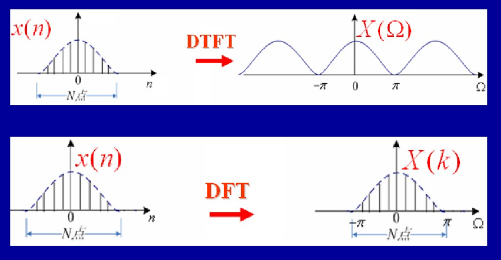

2.4.2 离散傅立叶变换DFT
--------------------------------------

离散傅里叶变换（DFT），是傅里叶变换在时域和频域上都呈现离散的形式，\
将时域信号的采样变换为在离散时间傅里叶变换（DTFT）频域的采样。\
在形式上，变换两端（时域和频域上）的序列是有限长的，而实际上这两组序列都应当被认为是离散周期信号的主值序列。\
即使对有限长的离散信号作DFT，也应当将其看作经过周期延拓成为周期信号再作变换。在实际应用中通常采用快速傅里叶变换以高效计算DFT。

DFT和IDFT公式如下：(要求N大于输入序列x(n)的长度)

.. math:: 
    & X(k) =\sum_{n=0}^{N-1}x(n)e^{-j2{\pi}kn/N},k=0,1,2,...,N-1 \\
    & x(n)=\frac{1}{N}\sum_{k=0}^{N-1}X(k)e^{j2{\pi}kn/N},n=0,1,2,...N-1

为了表达方便可以定义：

.. math:: 
    & W_N=e^{-j2{\pi}/N}\\
    & X(k)=\sum_{n=0}^{N-1}x(n)W_N^{kn} \\
    & x(n)=\frac{1}{N}\sum_{k=0}^{N-1}X(k)W_N^{-kn}

下面举个例子，求下面序列的DFT：

.. math:: 
    x(n)=1 ,0\leq n \leq 8

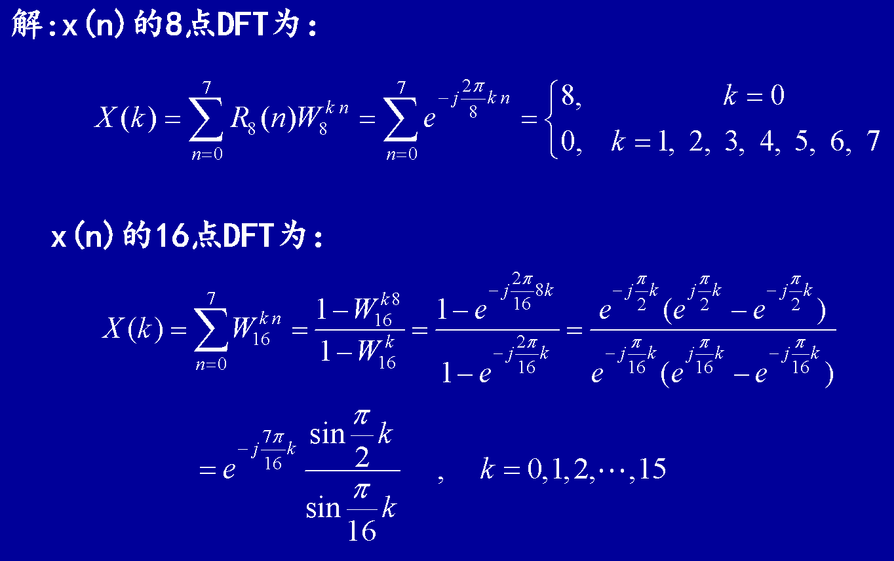

DFT也可以使用矩阵表示：

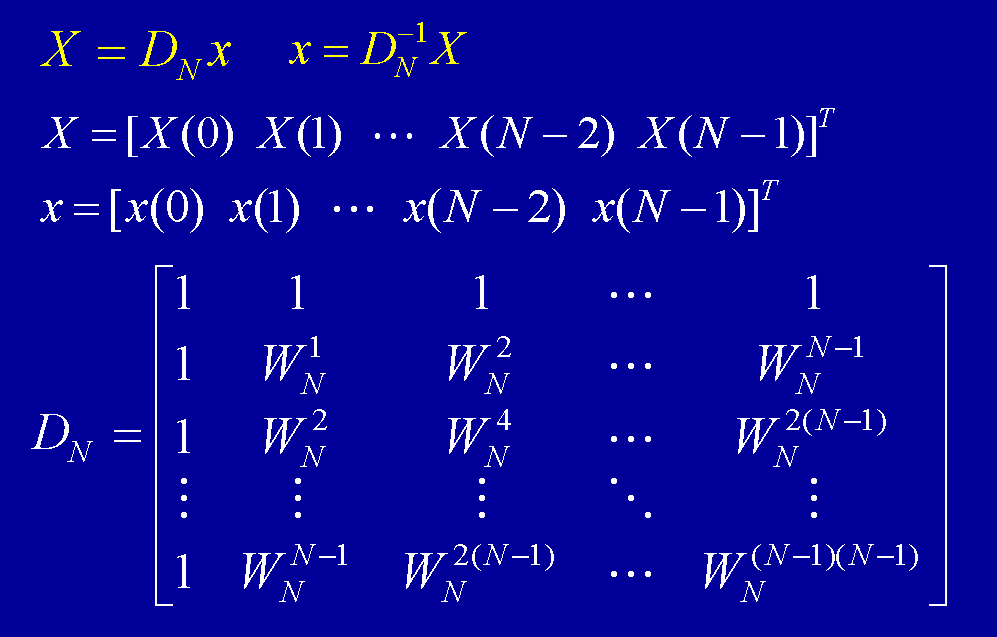

2.4.3 快速傅立叶变换
--------------------------------------

DFT使计算机在频域处理信号成为可能，但是当N很大时，直接计算N点DFT的计算量非常大。\
快速傅里叶变换（FFT，Fast Fourier Transform）可使实现DFT的运算量下降几个数量级，\
从而使数字信号处理的速度大大提高，工程应用成为可能。人们已经研究出多种FFT算法，它们的复杂度和运算效率各不相同。\
快速傅立叶变换只是离散傅立叶变换的一种计算方法，采用了分而治之的思想。\
下面简单的描述一下基2FFT的变换示意图。

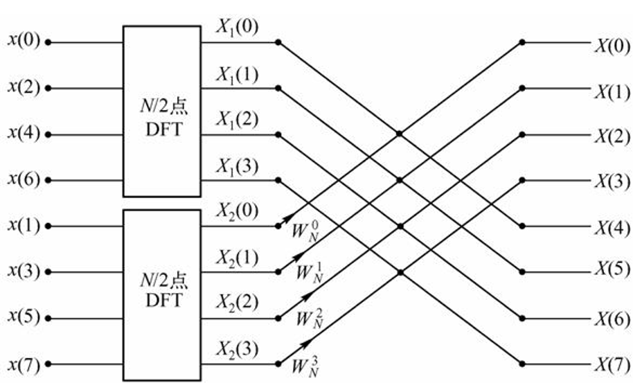

在python中计算fft和ifft的方法如下：

.. code-block:: python
    :linenos:

    import numpy as np
    import math
    import matplotlib.pyplot as plt

    x = np.random.rand(8)
    xf = np.fft.fft(x)
    print(x)
    print(xf)

    xBack = np.fft.ifft(xf)
    print(xBack)

    '''
    [ 0.19102247  0.17907609  0.47774068  0.87597191  0.4360055   0.07100535
    0.9243529   0.177301  ]
    [ 3.33247590+0.j         -0.66260041-0.12384028j -0.77506561+0.80319147j
    0.17263435-1.01706471j  0.72576720+0.j          0.17263435+1.01706471j
    -0.77506561-0.80319147j -0.66260041+0.12384028j]
    [ 0.19102247 +0.00000000e+00j  0.17907609 -1.38293433e-16j
    0.47774068 +1.94289029e-16j  0.87597191 +4.11489184e-17j
    0.43600550 +0.00000000e+00j  0.07100535 -1.93804584e-16j
    0.92435290 -1.94289029e-16j  0.17730100 +2.90949099e-16j]
    '''

注意ifft的运算结果实际上是和x相同的，由于浮点数的运算误差，出现了一些非常小的虚数部分。\
FFT变换和IFFT变换并没有增加或者减少信号的数量，如果你仔细数一下的话，x中有8个实数数值，而xf中其实也只有8个有效的值。

2.4.4 利用傅立叶变换进行频谱分析
--------------------------------------

2.4.4.1 频谱观察
```````````````````````````````````````

.. code-block:: python
    :linenos:

    import numpy as np
    import pylab as pl

    sampling_rate = 8000
    fft_size = 512

    t = np.arange(0, 1.0, 1.0/sampling_rate)     #1秒的时间分为8000个采样点
    x = np.sin(2*np.pi*156.25*t)  + 2*np.sin(2*np.pi*234.375*t) #156.25和234.375波形

    xs = x[:fft_size] #由于进行的是512点的fft，所以需要从8000个点中取512个数据
    fs = np.fft.fft(xs) #这里应该除以fft_size 由公式可知/fft_size为了正确显示波形能量

    freqs = np.linspace(0, sampling_rate, fft_size) 

    pl.subplot(211)
    pl.plot(t[:fft_size], xs)
    pl.title("156.25Hz and 234.375Hz")
    pl.xlabel("second")

    pl.subplot(212)
    pl.plot(freqs, np.abs(fs))
    pl.xlabel("Hz")

    pl.show()

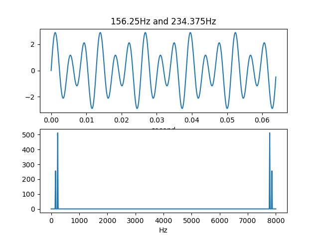

从图中可以看出频谱是对称的，一般分析左半边即可。

N点FFT能精确计算的频率？\
假设取样频率为fs, 取波形中的N个数据进行FFT变换。
那么这N点数据包含整数个周期的波形时，FFT所计算的结果是精确的。\
于是能精确计算的波形的周期是: n*fs/N。\
对于8kHz取样，512点FFT来说，8000/512.0 = 15.625Hz，前面的156.25Hz和234.375Hz正好是其10倍和15倍。

信号能量DB表示：\
最后我们计算每个频率分量的幅值，并通过 20*np.log10() 将其转换为以db单位的值。\
为了防止0幅值的成分造成log10无法计算，我们调用np.clip对xf的幅值进行上下限处理：

.. code-block:: python
    :linenos:

    xfp = 20*np.log10(np.clip(np.abs(xf), 1e-20, 1e100))

2.4.4.2 频谱泄漏
```````````````````````````````````````

如果用上面的方法来分析200HZ和300HZ的叠加波形呢？

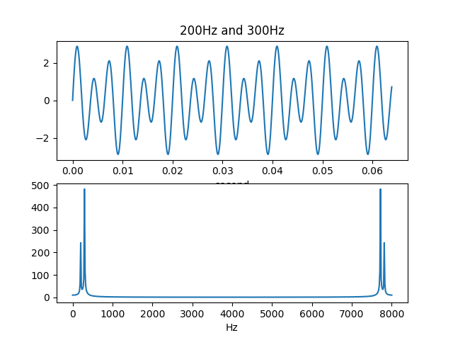

这次得到的频谱不再是两个完美的峰值，而是两个峰值频率周围的频率都有能量。\
这显然和两个正弦波的叠加波形的频谱有区别。\
本来应该属于200Hz和300Hz的能量分散到了周围的频率中，这个现象被称为频谱泄漏。\
出现频谱泄漏的原因在于fft_size个取样点无法放下整数个200Hz和300Hz的波形。

如何解决这个问题呢，可以将fft_size提高到8000,\
这样精度为8000/8000=1hz，可以用来表示200HZ和300HZ。

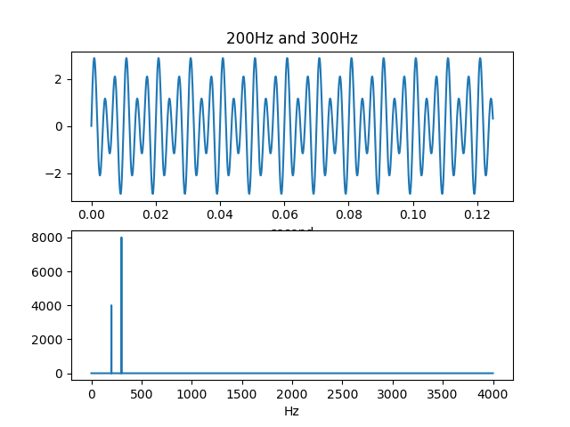

这样频谱就不会发生泄漏了。

2.4.4.3 窗函数
```````````````````````````````````````

为了减少FFT所截取的数据段前后的跳变，可以对数据先乘以一个窗函数，使得其前后数据能平滑过渡。\
例如常用的hann窗函数的定义如下：

.. math:: 
    \omega(n) = 0.5(1-cos(\frac{2\pi n}{N-1}))

其中N为窗函数的点数，下面是一个512点hann窗的曲线：

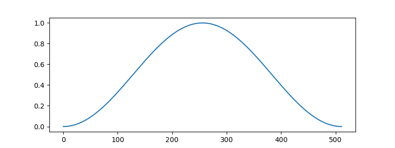

窗函数都在scipy.signal库中定义，它们的第一个参数为点数N。\
可以看出hann窗函数是完全对称的，也就是说第0点和第511点的值完全相同，都为0。\
在这样的函数和信号数据相乘的话，结果中会出现前后两个连续的0，\
这样FFT的结果所表示的周期信号中有两个连续的0值，会对信号的周期性有一定的影响。

为了解决连续0值的问题，hann函数提供了一个sym关键字参数，\
如果设置其为0的话，那么将产生一个N+1点的hann窗函数，然后取其前N个数，这样得到的窗函数适合于周期信号：

.. code-block:: python
    :linenos:

    >>> signal.hann(8)
    array([ 0.        ,  0.1882551 ,  0.61126047,  0.95048443,  0.95048443,
            0.61126047,  0.1882551 ,  0.        ])
    >>> signal.hann(8, sym=0)
    array([ 0.        ,  0.14644661,  0.5       ,  0.85355339,  1.        ,
            0.85355339,  0.5       ,  0.14644661])    

.. code-block:: python
    :linenos:

    import numpy as np
    import pylab as pl
    import scipy.signal as signal

    sampling_rate = 8000
    fft_size = 512

    t = np.arange(0, 1.0, 1.0/sampling_rate)     #1秒的时间分为8000个采样点
    x = np.sin(2*np.pi*200*t)  + 2*np.sin(2*np.pi*300*t) #200和300波形

    xs = x[:fft_size]*signal.hann(512) #由于进行的是512点的fft，所以需要从8000个点中取512个数据
    fs = np.fft.fft(xs)

    freqs = np.linspace(0, sampling_rate, fft_size) 

    pl.subplot(211)
    pl.plot(t[:fft_size], xs)
    pl.title("200Hz and 300Hz")
    pl.xlabel("second")

    pl.subplot(212)
    pl.plot(freqs, np.abs(fs))
    pl.xlabel("Hz")

    pl.show()    

再对200HZ和300HZ的叠加波形进行加窗然后分析，输出图为：

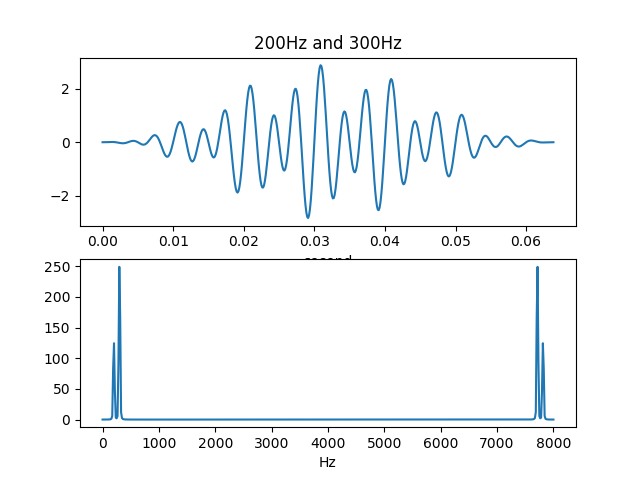

可以看出加窗之后频谱更加集中在200HZ和300HZ区间了。\
可以看到与hann窗乘积之后的信号的频谱能量更加集中于200Hz和300Hz，\
但是其能量有所降低。这是因为hann窗本身有一定的能量衰减：

.. code-block:: python
    :linenos:

    >>> np.sum(signal.hann(512, sym=0))/512
    0.5

因此如果需要严格保持信号的能量的话，还需要在乘以hann窗之后再乘以2。

2.4.4.4 短时傅立叶变换
```````````````````````````````````````

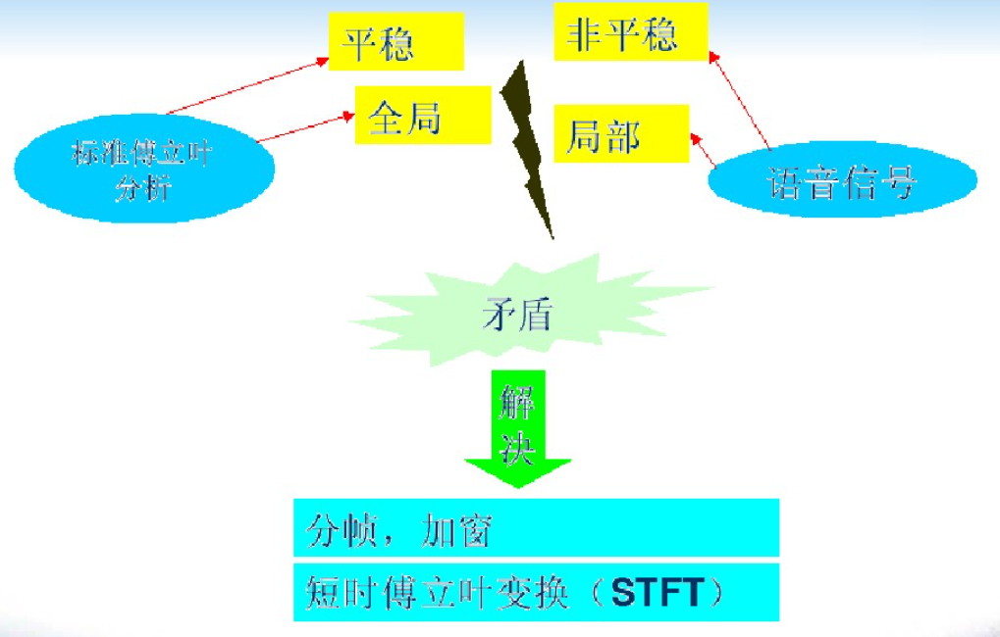

短时傅立叶变换也就是分帧加窗后再做傅立叶变换。

2.4.4.5 FFT与深度学习语音增强
```````````````````````````````````````

使用深度学习进行语音增强时，需要将数据先进行短时傅立叶变换，\
得到信号的强度，然后学习干净信号与噪音信号的信号强度之间的关系，进行处理后再做短时傅立叶逆变换恢复出增强后的信号。

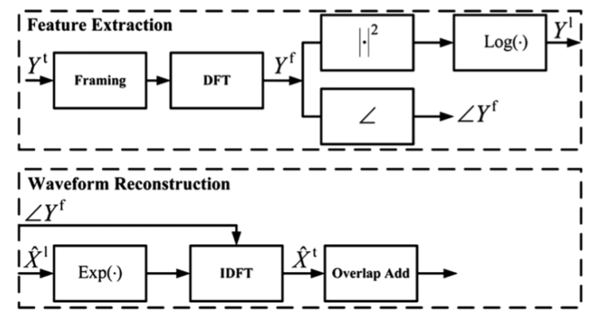

2.4.5 利用傅立叶变换进行滤波
--------------------------------------

2.4.5.1 快速卷积
```````````````````````````````````````

下面介绍一个DFT的重要性质：时域的圆周卷积等于DFT的乘积。

.. math::
    & x_1(n) \leftrightarrow X_1(k),N点DFT \\
    & x_2(n) \leftrightarrow X_2(k),N点DFT \\
    & x_1(n)\otimes x_2(n) \leftrightarrow X_1(k)X_2(k)

圆周卷积和普通卷积类似，包括相同的四个步骤，不同的是在反转和移位操作时，是在圆周上进行的，需要将序号对N求余。

那么如果通过DFT进行线性滤波呢？\
假如输入序列x(n)长度为L，FIR滤波器h(n)长度为M，\
将序列x(n)和h(n)的长度增加到L+M-1(补零)，再计算它们的圆周卷积，得到的结果和普通卷积相同。\
可以通过该方法利用DFT进行线性滤波。

下面将演示使用FFT进行滤波。\
已知FIR滤波器的冲激响应h(n)={1,2,3}，输入序列为x(n)={1,2,2,1}，求输出y(n)。\
使用卷积直接计算结果为：

.. code-block:: python
    :linenos:

    import numpy as np
    import pylab as pl
    import scipy.signal as signal

    a = np.array([1,2,3])
    b = np.array([1,2,2,1])
    c = np.convolve(a,b)

    '''
    [ 1  4  9 11  8  3]
    '''    

使用DFT进行计算，由于输入序列长度为4，冲激序列长度为3，所以DFT的计算长度至少为6，这里计算8个点的DFT。

.. code-block:: python
    :linenos:

    import numpy as np
    import pylab as pl
    import scipy.signal as signal

    a = np.array([1,2,3])
    b = np.array([1,2,2,1])

    L = a.shape[0]
    M = b.shape[0]
    N = L+M-1

    a0 = np.zeros(N-L)
    b0 = np.zeros(N-M)

    a = np.append(a,a0)
    b = np.append(b,b0)

    A = np.fft.fft(a)
    B = np.fft.fft(b)

    y = np.fft.ifft(A*B)
    print(np.real(y))

    '''
    [  1.   4.   9.  11.   8.   3.]
    '''    

两种方法的计算结果是一样的。

2.4.5.2 长序列滤波
```````````````````````````````````````

现在考虑对于输入信号x和系统响应h的卷积运算，通常x是非常长的，\
例如要对某段录音进行滤波处理，假设取样频率为8kHz，录音长度为1分钟的话，那么x的长度为480000。\
而且x的长度也可能不是固定的，例如我们可能需要对麦克风的连续输入信号进行滤波处理。\
而h的长度通常都是固定的，例如它是某个房间的冲击响应，或者是某种FIR滤波器。\
根据前面的介绍，为了有效地利用FFT计算卷积，我们希望它的两个输入长度相当，\
于是就需要对信号x进行分段处理。对卷积的分段运算被称作：overlap-add运算。

overlap-add的计算方法如下图所示：

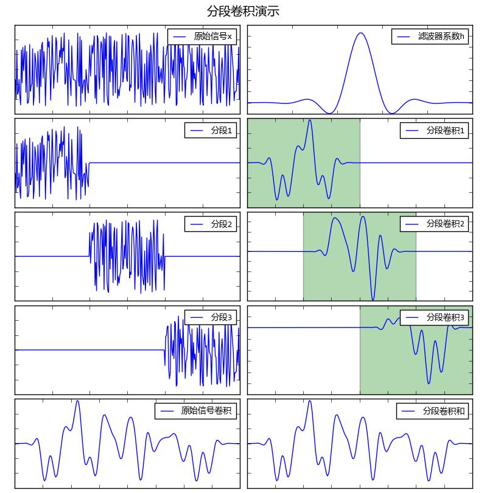

原始信号x长度为300，将它分为三段，分别与滤波器系数h进行卷积计算，h的长度为101，\
因此每段输出200个数据，图中用绿色标出每段输出的200个数据。\
这3段数据按照时间顺序进行求和之后得到结果和原始信号的卷积是相同的。

因此将持续的输入信号x和滤波器h进行卷积的运算可以按照如下步骤进行，假设h的长度为M：

* 建立一个缓存，其大小为N+M-1，初始值为0。
* 每次从x中读取N个数据，和h进行卷积，得到N+M-1个数据，和缓存中的数据进行求和，并放进缓存中，然后
* 输出缓存前N个数据
* 将缓存中的数据向左移动N个元素，也就是让缓存中的第N个元素成为第0个元素，后面的N个元素全部设置为0跳转到2重复运行。

.. code-block:: python
    :linenos:

    import numpy as np

    x = np.random.rand(1000)
    h = np.random.rand(101)
    y = np.convolve(x, h)

    N = 50 # 分段大小
    M = len(h) # 滤波器长度

    output = []

    #缓存初始化为0
    buffer = np.zeros(M+N-1,dtype = np.float64)

    for i in range(int(len(x)/N)):
        #从输入信号中读取N个数据
        xslice = x[i*N:(i+1)*N]
        #计算卷积
        yslice = np.convolve(xslice, h)
        #将卷积的结果加入到缓冲中
        buffer += yslice
        #输出缓存中的前N个数据，注意使用copy，否则输出的是buffer的一个视图
        output.append( buffer[:N].copy() )
        #缓存中的数据左移动N个元素
        buffer[0:M-1] = buffer[N:]
        #后面的补0
        buffer[M-1:] = 0

    #将输出的数据组合为数组
    y2 = np.hstack(output)
    #计算和直接卷积的结果之间的误差
    print(np.sum(np.abs( y2 - y[:len(x)] ) ))

将FFT快速卷积和overlap-add相结合，可以制作出一些快速的实时数据滤波算法。\
但是由于FFT卷积对于两个长度相当的数组时最为有效，\
因此在分段时也会有所限制：例如如果滤波器的长度为2048，那么理想的分段长度也为2048，\
如果将分段长度设置得过低，反而会增加运算量。因此在实时性要求很强的系统中，只能采用直接卷积。

