2.5 FIR滤波器
======================================

2.5.1 FIR滤波器与IIR滤波器比较
--------------------------------------

首先，从性能上说，IIR滤波器可以用较少的阶数获得很高的选择性，所用存储单元少，运算次数少，所以经济而效率高。\
但这个高效率的代价是相位的非线性，选择性越好，则相位非线性越严重。\
相反，FIR滤波器则可以得到严格的线性相位。\
但是，如果需要获得一定的选择性，则需要用较多的存储器和要进行较长的运算时间，成本比较高，信号延时也较大。\
然而，FIR滤波器这些缺点是相对于IIR滤波器而言的。\
如果按相同的选择性和相同的线性要求的话，那么IIR滤波器就必须加全通网络来进行相位校正，\
因此同样要大大增加滤波器的阶数和复杂性。\
如果相位特性要求严一点，那么FIR滤波器不仅在性能上而且在经济上都将更优于FIR滤波器。

从结构上看，IIR滤波器必须采用递归型结构，极点位置必须在单位圆内，\
否则系统将不稳定。另外，在这种结构中，由于运算过程中对序列的四舍五入处理，\
有时会引起微弱的寄生振荡。相反，FIR滤波器主要采用非递归结构，\
不论在理论上还是在实际的有限精度运算中都不会出现稳定性问题，运算误差也较小。\
此外，FIR滤波器可以采用快速傅立叶变换算法(FFT)在相同阶数的条件下，运算速度要快得多。

从设计角度看，IIR滤波器可以借助模拟滤波器的成果，因此一般都有有效的封闭函数的设计公式可供准确的计算。\
又有许多数据和表格可查，设计和计算的工作量比较小，对计算工具的要求不高。\
FIR滤波器设计则一般没有封闭函数的设计公式。\
窗口法虽然仅仅对窗口函数可以给出计算公式，但计算通阻带衰减等仍无法显示表达式。\
一般，FIR滤波器的设计只有计算程序可循，因此对计算工具要求较高。\
然而，这个特点又带来相反的一面，即IIR滤波器虽然设计简单，但主要是用于设计具有片段常数特性的滤波器，\
如低、高、带通及带阻等，往往脱离不了模拟滤波器的格局。\
而FIR滤波器则要灵活得多，尤其是频率采样设计法更容易适应各种幅度特性和相位特性的要求，\
可以设计出理想的正交变换，理想微分，线性调频等各种重要网络。因而，有更大适应性和更广阔天地。

从以上简单比较我们可以看到IIR滤波器和FIR滤波器各有所长，所以在实际应用时应该综合各方面考虑来加以选择。\
例如，从使用要求来看在对相位要求不敏感的场合，如语言通讯等，选用IIR滤波器较合适，\
可以充分发挥其经济高效的特点。而对于图像信号处理，数据传输等以波形携带信息的系统，\
则对线性相位要求较高，如有条件，采用FIR滤波器较好。\
当然实际设计中经济上的要求及计算工具的条件等多方面的因素还是要加以考虑的。

2.5.2 FIR滤波器结构
--------------------------------------

FIR滤波器的单位脉冲响应h(n)是一个有限长序列，其传递函数一般为：

.. math:: 
    H(z)=\sum_{n=0}^{N-1}h(n)z^{-n}

对应的差分方程为：

.. math:: 
    y(n)=\sum_{i=0}^{N-1}b_ix(n-i)  ,n \geq0

滤波器输出为：

.. math:: 
    y(n)=x(n)*h(n)=\sum_{i=0}^{N-1}h(i)x(n-i)

可以看出，系统的输出只是输入的函数，与过去的输出没有直接关系，它的网络结构不含反馈支路。\
FIR滤波器的阶数为序列长度-1。

下面为FIR滤波器的几种基本结构形式。

2.5.2.1 直接型结构
```````````````````````````````````````

这种结构的输出和输入直接存在卷积关系，也称为卷积型或横截型结构。

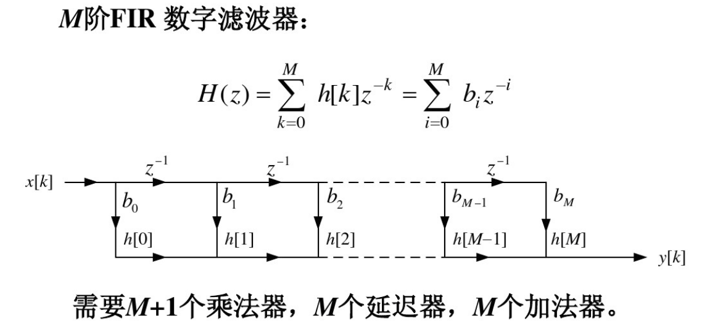

2.5.2.2 级联型结构
```````````````````````````````````````

级联型系统可以分别控制每个子系统的零点。

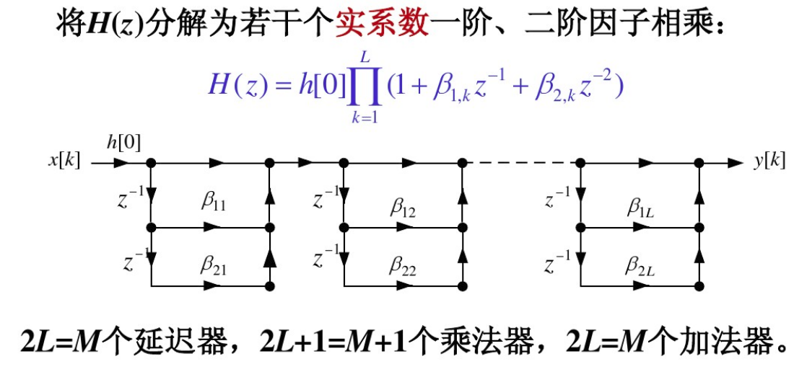

2.5.2.3 线性相位性
```````````````````````````````````````

一个正弦信号通过一个系统落后的相位等于它的w*t；\
反过来说，如果一个频率为w的正弦信号通过系统后，它的相位落后delta，则该信号被延迟了delta/w的时间。

在实际系统中，一个输入信号可以分解为多个正弦信号的叠加，为了使得输出信号不会产生相位失真，\
必须要求它所包含的这些正弦信号通过系统的时间是一样的。\
因此每一个正弦信号的相位分别落后，w1*t，w2*t，w3*t。\
因此，落后的相位正比于频率w，如果超前，超前相位的大小也是正比于频率w。\
从系统的频率响应来看，就是要求它的相频特性是一条直线。

以方波为例，经过滤波以后，如果各次谐波的相位关系能尽量保持，\
那波形基本不失真，如果是非线性相位滤波器各谐波的相位关系是很难保持的，波形失真就严重。

线性相位特性是指滤波器对不同频率的正弦波所产生的相移和正弦波的频率成直线关系。\
在滤波器通带内的信号通过滤波器后，除了由相频特性的斜率决定的延迟外，可以不失真地保留通带以内的全部信号。\
线性相位是FIR的一个重要特点。

线性相位的因果的FIR系统的单位取样响应具有如下特性：

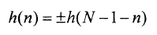

当N为偶数的时候，上式变为：

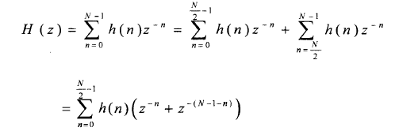

当N为奇数时，此式为：

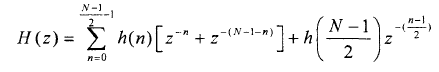

上面两个式子可知：实现直接型结构的网络结构只需要（N为偶数）或次乘法（N为奇数），利用的对称比直接卷积形式少用一半的乘法器。

N为偶数，线性相位结构：

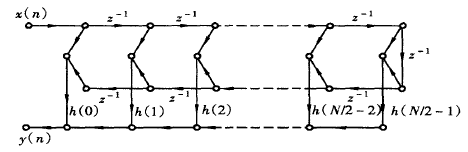

N为奇数，线性相位结构：

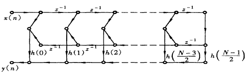

例1：偶数线性相位结构，已知一个四阶线性相位FIR数字滤波器的单位脉冲响应h(k)满足：\
h[0]=h[4]=4，h[1]=h[3]=-3，h[2] = 2，试画出该滤波器的线性相位结构。

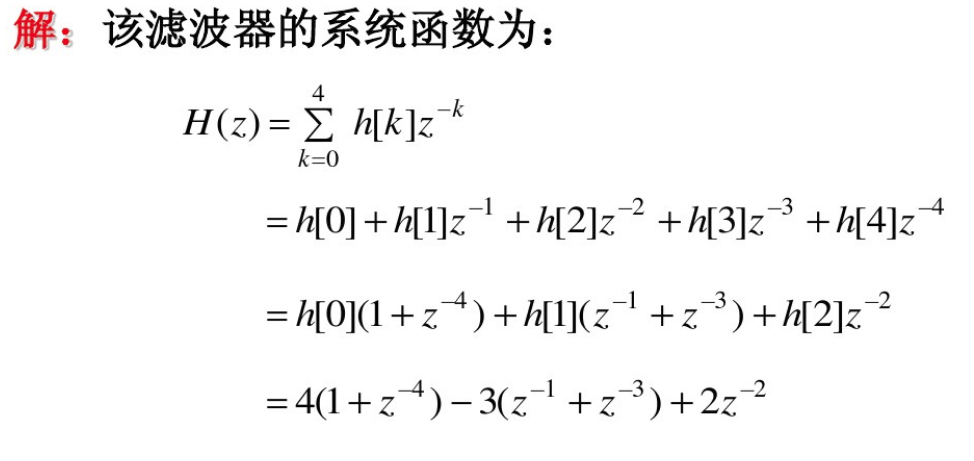

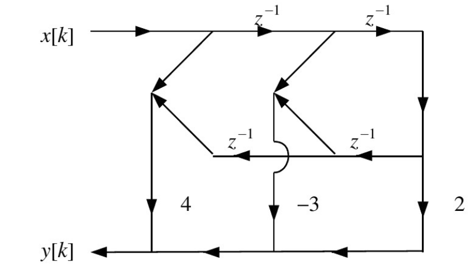

例2：奇数线性相位结构，已知一个五阶线性相位FIR数字滤波器的单位脉冲响应h(k)满足：\
h[0]=-h[5]=3，h[1]=-h[4]=2，h[2]=-h[3]=4，试画出该滤波器的线性相位结构。

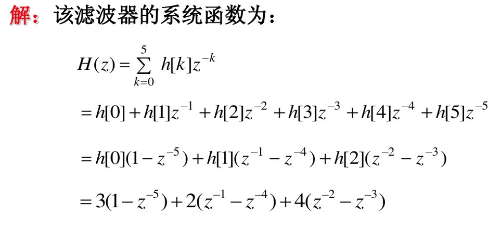

.. image:: images/FIR滤波器/线性相位09.png
    :scale: 60 %

2.5.2.4 频率采样型
```````````````````````````````````````

系统函数H(z)在单位圆上作N等分取样的值得到h(n)的离散傅立叶变换值：

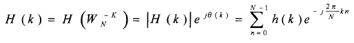

根据内插公式，得：

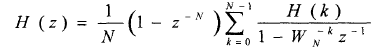

上式即为频率取样结构的系统函数，其中：

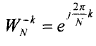

可见，该系统是由一个子FIR系统

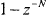

和一个子IIR系统

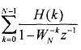

级联组成的。

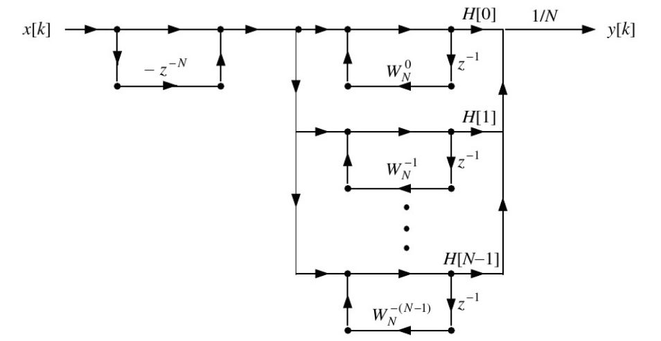

该结构在频率采样点的响应为H(k)，调整比较方便，也便于标准化、模块化。\
但也存在问题：系统稳定靠单位圆上的零点相消，但实际软件或硬件处理时，字长有限，\
会有系统量化和运算误差，极点会发生移动，使零极点不能相消而使系统不稳定;\
另一个是和都是复数，都是复数乘，计算量大，且硬件也不易实现。

例：设计一个M阶实系数FIR滤波器，已知H[0]=1，H[1]=1，H[N-1]=1，其他H[m]=0，画出其频率取样型结构。

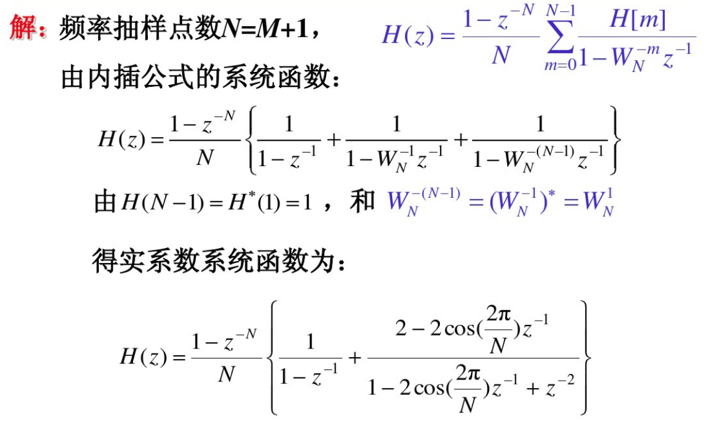

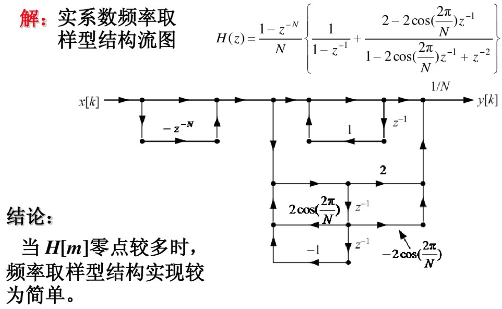

2.5.3 FIR滤波器设计
--------------------------------------

目前 FIR 滤波器的设计方法主要有三种：窗函数法、频率抽样法和优化设计(切比雪夫逼近)方法。

滤波器设计指标：

.. image:: images/FIR滤波器/滤波器设计指标.png

2.5.3.1 窗函数法
``````````````````````````````````````

**设计步骤**：

窗函数设计法又称为傅里叶级数法。这种方法首先给出 H(jΩ)， \
H(jΩ) 表示要逼近的理想滤波器的频率响应，则由 IDTFT 可得出滤波器的单位脉冲响应为：

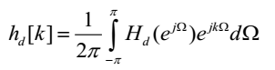

由于是理想滤波器，故hd[k]是无限长序列。但是我们所要设计的 FIR 滤波器，其 h[k]是有限长的。\
为了能用 FIR 滤波器近似理想滤波器，需将理想滤波器的无限长单位脉冲响应 hd[k]分别从左右进行截断。\
当截断后的单位脉冲响应hd[k]不是因果系统的时候，可将其右移从而获得因果的 FIR 滤波器。\
(核心:理想滤波器频率设计->反变换时域无限长信号->信号截断->右移变因果系统)

用窗函数法设计FIR滤波器的步骤如下：

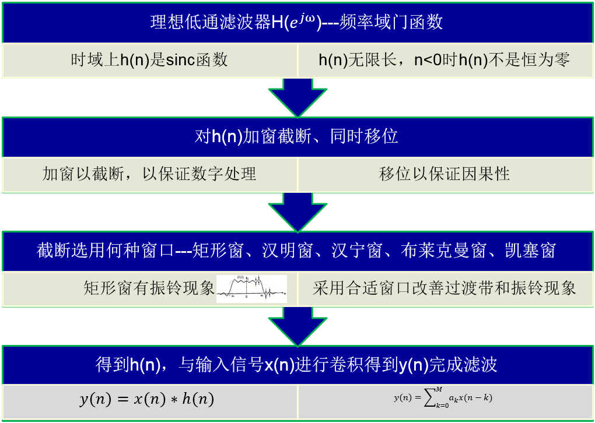

**吉布斯现象与窗函数**：

Gibbs 现象就是理想滤波器的单位脉冲响应hd[k]截断获得的 FIR 滤波器的幅度函数 A(Ω) 在通带和阻带都呈现出振荡现象。\
随着滤波器阶数的增加，幅度函数在通带和阻带振荡的波纹数量也随之增加，波纹的宽度随之减小，\
然而通带和阻带最大波纹的幅度与滤波器的阶数 M 无关。\
窗函数的主瓣宽度决定了Hd (jΩ)过渡带的宽度，窗函数长度 N 增大，过渡带减小。

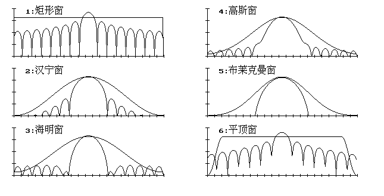

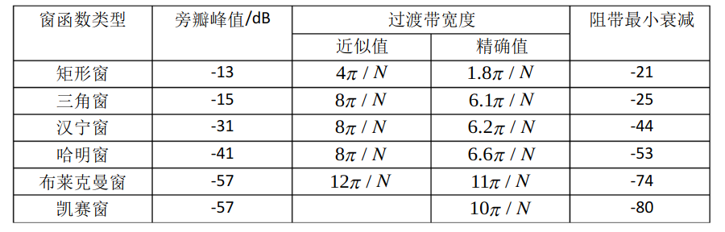

窗函数的选择原则是：

* 具有较低的旁瓣幅度，尤其是第一旁瓣的幅度；
* 旁瓣的幅度下降的速率要快，以利于增加阻带的衰减；
* 主瓣的宽度要窄，这样可以得到比较窄的过渡带。

**使用窗函数法设计FIR低通滤波器**：

理想的低通滤波器如下图：

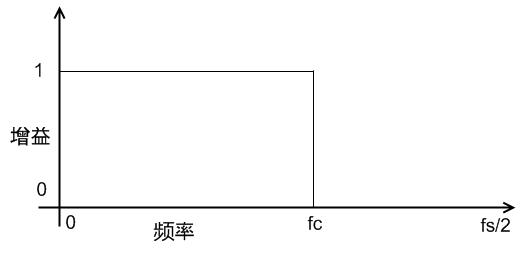

其中f_s为取样频率，f_c为阻带频率。通常为了计算方便，将取样频率正规化为1。

归一化频率：就是把频率归到[0,1]的区间，比如说最高频率是500Hz，\
归一化后，400Hz变成4/5=0.8, 300Hz，3/5=0.6,等， 500Hz，5/5=1，\
如果要将归一化频率转换为角频率，则将归一化频率乘以pi；\
如果将归一化频率转换成Hz，则将归一化频率乘以采样频率的一半。

根据离散傅立叶变换的公式可以求出此理想低通滤波器的脉冲响应为：

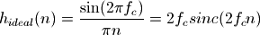

其中n为负无穷到正无穷的整数。显然此脉冲响应不但无限长，\
而且不满足因果律，因为输入信号在0时刻出现的脉冲，而输出信号却在0时刻之前就有值了。

这样的脉冲响应当然无法用FIR滤波器实现，\
一个最直观的近似方法就是取 h_ideal 中 0<=n<L 的L个值当作低通FIR滤波器的系数。\
下面的程序计算此低通滤波器的频率响应：

.. code-block:: python
    :linenos:

    import scipy.signal as signal
    import numpy as np
    import pylab as pl

    #n为窗大小,fc为截止频率
    def h_ideal(n, fc):
        return 2*fc*np.sinc(2*fc*np.arange(0, n, 1.0))

    b = h_ideal(30, 0.25)

    #freqz是求系统的频率响应
    w, h = signal.freqz(b)

    pl.figure(figsize=(8,4))
    pl.plot(w/2/np.pi, 20*np.log10(np.abs(h)))
    pl.xlabel("freq")
    pl.ylabel("dB")
    pl.show() 

截取sinc函数正时间部分作为脉冲响应的低通滤波器：

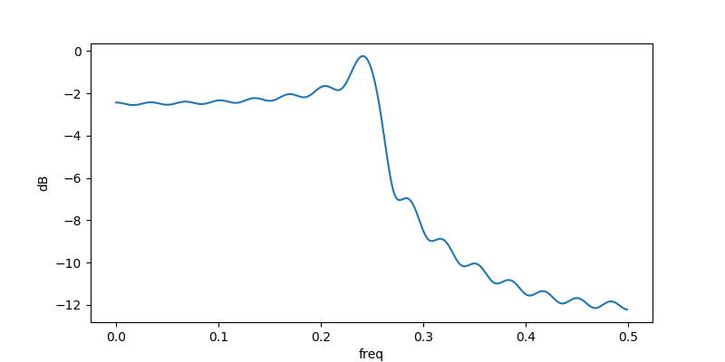

freqz用于计算数字滤波器的频率响应，它的调用方式如下：

.. code-block:: python
    :linenos:

    freqz(b, a=1, worN=None, whole=0, plot=None)
    #其中b和a是滤波器的系数，worN为所计算的频率点数，whole为0表示计算频率的上限为pi，whole为1表示计算频率的上限为2*pi。
    #它返回一个组元 (w,h) ，其中w为所有计算了响应的频率数组，其值为正规化的圆频率，
    #因此通过w/(2*pi)可以计算出对应的正规化频率。
    #h是一个复数数组，它表示滤波器系统在每个对应的频率点的响应。复数的幅值表示滤波器的增益特性，相角表示滤波器的相位特性。

显然此频率响应和理想的低通滤波器相差甚远，并且即使增加FIR滤波器的系数也没有作用。\
因为我们舍弃了n<0的那一半系数，而这些系数有着相当大的影响，因此只截取n>=0的部分是不够的，\
如果我们将n<0的那一半系数也添加进滤波器的话，得到的频率响应将会有很大的改善。\
如下重新定义h_ideal函数，它返回h_ideal中-n到n之间的系数：

.. code-block:: python
    :linenos:

    def h_ideal(n, fc):
        return 2*fc*np.sinc(2*fc*np.arange(-n, n, 1.0))

不加窗(矩形窗)效果：

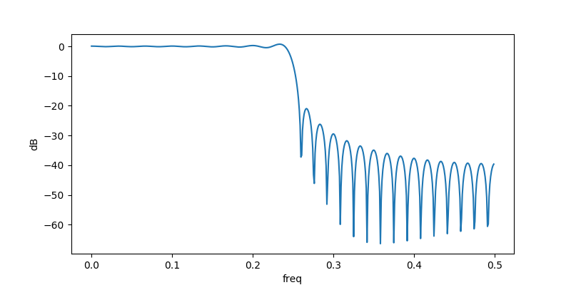

下面看下加窗后的效果：

.. code-block:: python
    :linenos:

    import scipy.signal as signal
    import numpy as np
    import pylab as pl

    #n为窗大小,fc为截止频率 加了hanning窗
    def h_ideal(n, fc):
        return 2*fc*np.sinc(2*fc*np.arange(-n, n, 1.0))*signal.hann(2*n) #or blackman

    b = h_ideal(30, 0.25)

    #freqz是求系统的频率响应
    w, h = signal.freqz(b)

    pl.figure(figsize=(8,4))
    pl.plot(w/2/np.pi, 20*np.log10(np.abs(h)))
    pl.xlabel("freq")
    pl.ylabel("dB")
    pl.show()

加hanning窗效果：

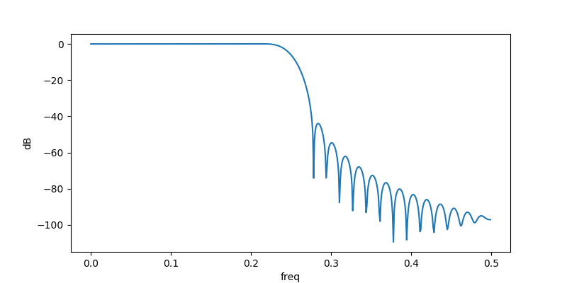

加blackman窗效果：

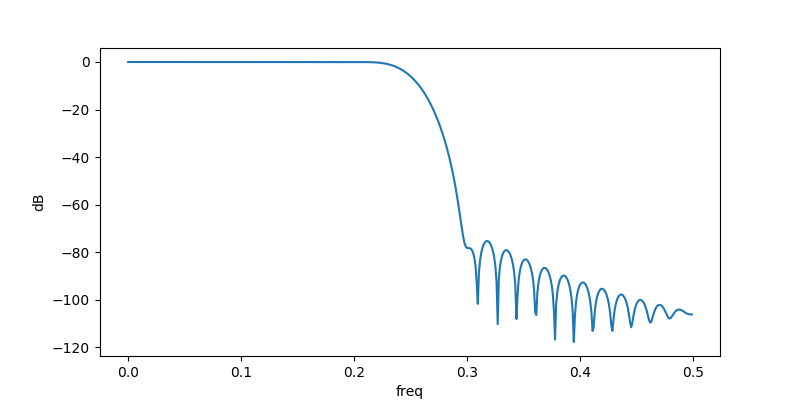

**使用窗函数设计FIR高通滤波器**：

和FIR低通滤波器设计类似，求出高通滤波器理想的响应函数，再乘以窗函数。

.. code-block:: python
    :linenos:

    import scipy.signal as signal
    import numpy as np
    import pylab as pl

    #n为窗大小,fc为截止频率
    def h_ideah(n, fc):
        t = np.arange(-n, n, 1.0)+np.spacing(np.float64(1))
        return (np.sin(np.pi*t)-np.sin(2*np.pi*fc*t))/(np.pi*t)

    b = h_ideah(30, 0.25)

    #freqz是求系统的频率响应
    w, h = signal.freqz(b)

    pl.figure(figsize=(8,4))
    pl.plot(w/2/np.pi, 20*np.log10(np.abs(h)))
    pl.xlabel("freq")
    pl.ylabel("dB")
    pl.show() 

下面为未加窗效果：

.. image:: images/FIR滤波器/未加窗高通滤波器.png

下面为加窗代码：

.. code-block:: python
    :linenos:

    import scipy.signal as signal
    import numpy as np
    import pylab as pl

    #n为窗大小,fc为截止频率
    def h_ideal(n, fc):
        t = np.arange(-n, n, 1.0)+np.spacing(np.float64(1))
        return (np.sin(np.pi*t)-np.sin(2*np.pi*fc*t))/(np.pi*t)

    b = h_ideal(30, 0.25)
    b = b*signal.hann(60)

    #freqz是求系统的频率响应
    w, h = signal.freqz(b)

    pl.figure(figsize=(8,4))
    pl.plot(w/2/np.pi, 20*np.log10(np.abs(h)))
    pl.xlabel("freq")
    pl.ylabel("dB")
    pl.show()

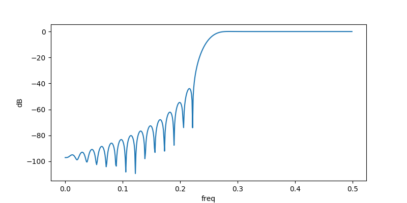

采用窗函数法设计简单、方便、实用。但用计算机不易控制边界频率。

**根据指标利用窗函数法设计滤波器**：

设计一线性相位低通FIR数字滤波器，通带截止频率wp=0.2π ，通带最大衰减0.25dB，阻带起始频率ws=0.3π ，\
阻带最小衰减50dB。请给出N和所选窗函数，求出h(n)，并绘制相应的幅频特性（dB）曲线，\
根据该图给出实际的阻带衰减，绘制窗函数的时域频域特性曲线。

阻带最小衰减为50dB，对于各种窗函数的基本参数，不能用矩形窗和汉宁窗函数，\
因为它们的阻带最小衰减不能满足设计的要求，因此可以选用汉明和布莱克曼窗进行FIR数字滤波器的设计。

根据通带截止频率和阻带起始频率得到过渡带的带宽，汉明窗对应的数字滤波器的过渡带宽为8π/N，\
推出用汉明窗设计时的数字滤波器的至少N=80，N为奇数，取用N=81，\
对于用布莱克曼窗对应的数字滤波器的过渡带宽为12π/N，推出N=120，取N=121。

汉明窗：

.. code-block:: python
    :linenos:

    import scipy.signal as signal
    import numpy as np
    import pylab as pl

    #n为窗大小,fc为截止频率 加了hanning窗
    def h_ideal(n, fc):
        return 2*fc*np.sinc(2*fc*np.arange(-n, n, 1.0))*signal.hamming(2*n)

    b = h_ideal(40, 0.1)

    #freqz是求系统的频率响应
    w, h = signal.freqz(b)

    pl.figure(figsize=(8,4))
    pl.plot(w/2/np.pi, 20*np.log10(np.abs(h)))
    pl.xlabel("freq")
    pl.ylabel("dB")
    pl.show()    

效果如下：

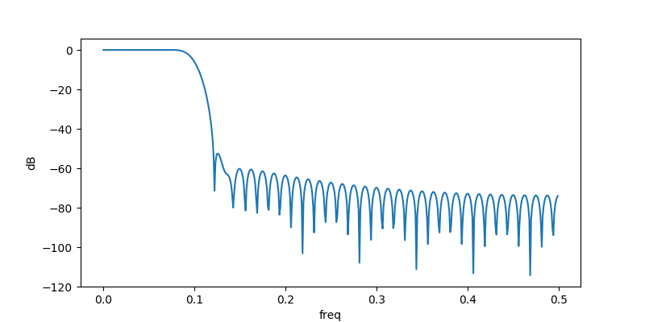

布莱克曼窗：

.. code-block:: python
    :linenos:

    import scipy.signal as signal
    import numpy as np
    import pylab as pl

    #n为窗大小,fc为截止频率 加了hanning窗
    def h_ideal(n, fc):
        return 2*fc*np.sinc(2*fc*np.arange(-n, n, 1.0))*signal.blackman(2*n)

    b = h_ideal(60, 0.1)

    #freqz是求系统的频率响应
    w, h = signal.freqz(b)

    pl.figure(figsize=(8,4))
    pl.plot(w/2/np.pi, 20*np.log10(np.abs(h)))
    pl.xlabel("freq")
    pl.ylabel("dB")
    pl.show()    

效果如下：

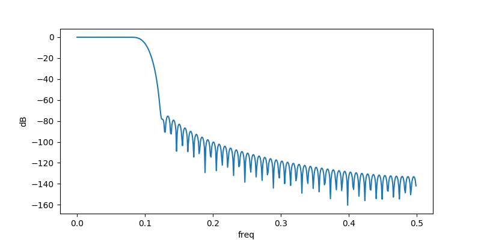

**检验窗函数法设计的滤波器效果**：

输入为200HZ和500HZ的混合波形，采样率8K，设计滤波器过滤掉500HZ的波形 。

.. code-block:: python
    :linenos:

    import scipy.signal as signal
    import numpy as np
    import pylab as pl

    sampling_rate = 8000
    fft_size = 400    #8000/400=20hz

    def h_ideal(n, fc):
        return 2*fc*np.sinc(2*fc*np.arange(-n, n, 1.0))#*signal.blackman(2*n)

    t = np.arange(0, 1.0, 1.0/sampling_rate)     #1秒的时间分为8000个采样点
    x = np.sin(2*np.pi*200*t)  + 2*np.sin(2*np.pi*500*t) #200hz和500hz波形
    x1 = np.sin(2*np.pi*200*t) #200hz波形

    h = h_ideal(50, 0.05) #滤波器长度为100

    #滤波后的结果
    y = np.convolve(x[:fft_size],h)

    freqs = np.linspace(0, sampling_rate, fft_size)
    
    #为了正确显示波形能量，还需要将fft函数的结果除以fft_size
    xfs = np.fft.fft(x[:fft_size])/fft_size
    yfs = np.fft.fft(y[:fft_size])/fft_size

    #最后我们计算每个频率分量的幅值，并通过 20*np.log10() 将其转换为以db单位的值。为了防止0幅值的成分造成log10无法计算，我们调用np.clip对xf的幅值进行上下限处理
    xfp = 20*np.log10(np.clip(np.abs(xfs), 1e-20, 1e100))
    yfp = 20*np.log10(np.clip(np.abs(yfs), 1e-20, 1e100))

    pl.figure(figsize=(8,12))

    pl.subplot(511)
    pl.plot(t[:fft_size], x[:fft_size])
    pl.ylim(-3,3)
    pl.text(0,2,"200hz and 500hz")

    pl.subplot(512)
    pl.plot(t[:fft_size], x1[:fft_size])
    pl.ylim(-3,3)
    pl.text(0,2,"200hz")

    pl.subplot(513)
    pl.plot(t[:fft_size], y[:fft_size])
    pl.title("")
    pl.ylim(-3,3)
    pl.text(0,2,"fir")

    pl.subplot(514)
    pl.plot(freqs, xfp)

    pl.subplot(515)
    pl.plot(freqs, yfp)

    pl.show()    

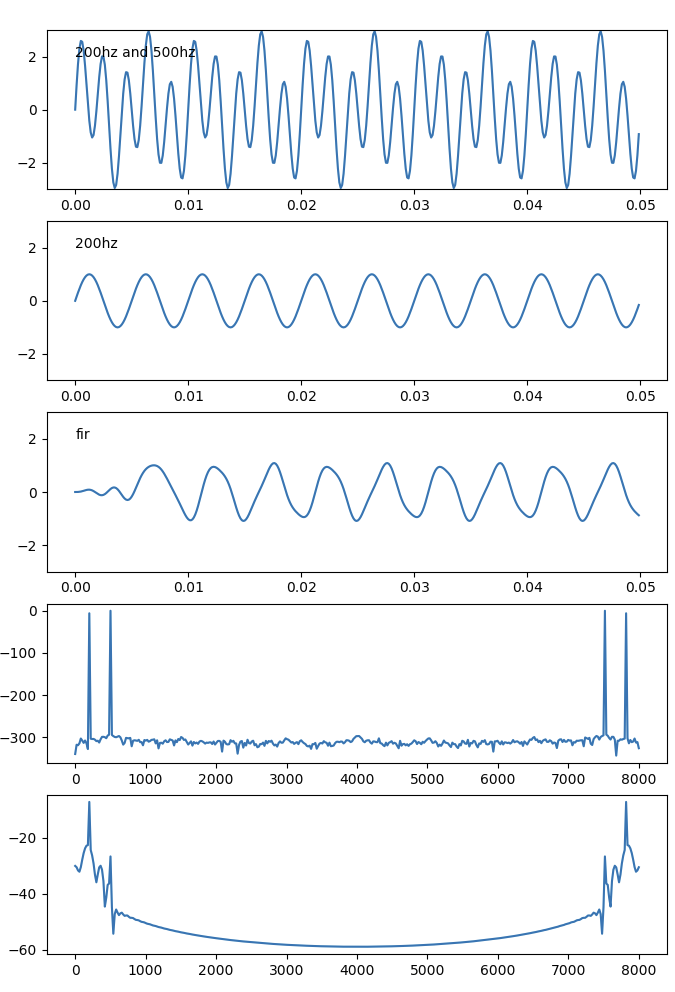

**频率响应函数实现**：

在前面的例子中，我们使用了w, h = signal.freqz(b)函数求频率响应，那么该函数大概是如何实现的呢?

由FFT的性质：\
假如输入序列x(n)长度为L，FIR滤波器h(n)长度为M，将序列x(n)和h(n)的长度增加到L+M-1(补零)，\
再计算它们的圆周卷积，得到的结果和普通卷积相同。可以通过该方法利用DFT进行线性滤波。\
也就是说滤波器序列可以使用FFT进行分析。

.. code-block:: python
    :linenos:

    import scipy.signal as signal
    import numpy as np
    import pylab as pl

    def h_ideal(n, fc):
        return 2*fc*np.sinc(2*fc*np.arange(-n, n, 1.0))*signal.blackman(2*n)

    #120个点
    b = h_ideal(60, 0.2)
    #补120个0 时域卷积转换为频域fft乘积需要补0 假设输入也为120个点
    c = np.zeros(512-60)
    b = np.append(b,c)

    #512个点做fft
    fs = np.fft.fft(b)
    xfp = 20*np.log10(np.clip(np.abs(fs), 1e-20, 1e100))

    #归一化频率分为512等份
    freqs = np.linspace(0, 1, 512) 

    #幅度
    pl.subplot(211)
    pl.plot(freqs[0:256], np.abs(fs[0:256]))
    pl.ylabel('Amplitude')

    #db
    pl.subplot(212)
    pl.plot(freqs[0:256], xfp[0:256])
    pl.ylabel('db')

    pl.show()    

结果如下，和freqz的结果是一样的，freqz默认512个点进行采样。

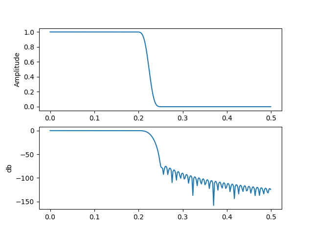

从图中可以知道用上面的窗函数法设计的滤波器幅度是不增加的。

2.5.3.2 频率采样设计法
``````````````````````````````````````

**设计原理**：

频率采样法是从频域出发，对给定的理想滤波器的频响：

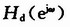

进行N点等间隔采样，即

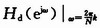

然后以此Hd(k)作为实际FIR滤波器的频率特性采样值H(k)，即令：

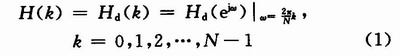

由DFT定义，可以用这N个频域的采样值H(k)来惟一确定FIR的单位脉冲响应h(n)，即：

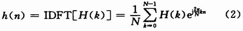

FIR滤波器的最大优点是严格的线性相位特性。\
下面讨论为实现线性相位，在频域内采样得到的Hd(k)应满足什么条件。FIR滤波器具有线性相位的条件是：h(n)，

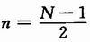

是实序列。且满足h(n)=±h(N-1-n)，即h(n)关于对称，其中N为滤波器的长度。\
以第一类线性相位条件h(n)=h(N-1-n)(偶对称)为基础来推导频域采样Hd(k)满足的条件。

理想滤波器的频率响应可以表示为：

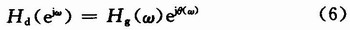

为实现第一类线性相位条件，相位函数θ(ω)和幅度函数Hg(ω)应分别满足：

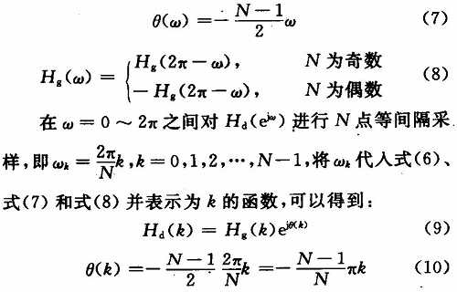

**使用频率采样设计法进行低通滤波器设计**：

现以低通滤波器为例，说明用频率采样法设计FIR线性滤波器的一般步骤及设计中应注意的问题。\
要求截止频率ωc=0．2π rad／s，采样点数为N=20。设计步骤如下：

(1)确定希望逼近的理想滤波器的频率响应：

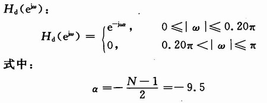

(2)在频域内对上式进行N点间隔采样，利用频率采样设计公式求频率采样值Hd(k)，采样间隔△ω=2π／N=0.1 π，\
这样在通带内共有3个采样点，分别是k=0，1，2。

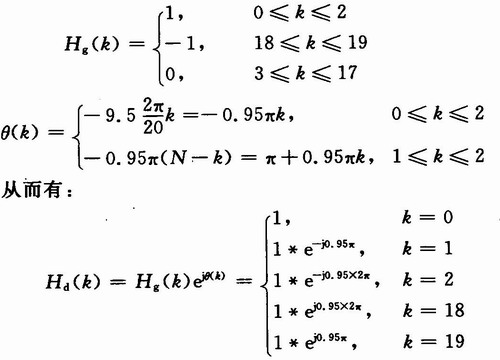

(3)用离散傅里叶逆变换求得要设计的实际滤波器的单位脉冲响应h(n)：

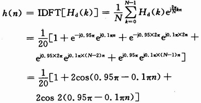

(4)根据傅里叶变换的定义求得实际滤波器的频率响应，验证是否满足滤波器技术指标的要求，\
主要验证滤波器的阻带衰减是否能够满足阻带的要求。\
借助于Matlab软件，按照以上4个步骤设计出低通滤波器的仿真结果如图2所示。

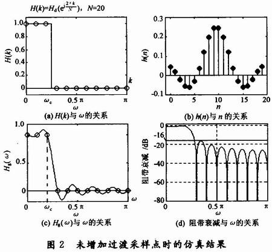

由仿真结果图2可以看出其衰减比较小，约为-17 dB。在通常情况下，这个阻带衰减不能满足阻带技术指标的要求，\
可以通过在通带和阻带之间的边界频率处增加过渡采样点来增大阻带衰减。

为改进阻带衰减，在边界频率处增加一个过渡点；为保证过渡带宽不变，将采样点数增加一倍，\
变为N=40，并将过渡点的采样值进行优化，取H1=0.3904，其仿真结果如图3所示。由图3可见，这时阻带衰减达到了-43 dB。

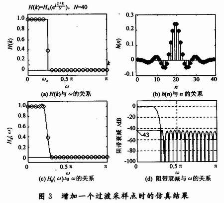

为进一步增加阻带衰减，可再增加一个过渡采样点，并将采样点数增加到60。\
两个过渡样点值经优化分别为H1=0.5925和H2=0.1099，其仿真结果如图4所示。\
由图4(d)可见，这时阻带衰减达到-73 dB。\
还可以通过进一步增加过渡样点来增加阻带衰减，一般情况下，最多增加3个过渡采样点即能满足阻带衰减的要求。\
显然，在保证过渡带宽不变的情况下，相应的采样点数也成倍增加，这样将使滤波器的复杂度大大增加，在实现滤波时计算量也随之增加。

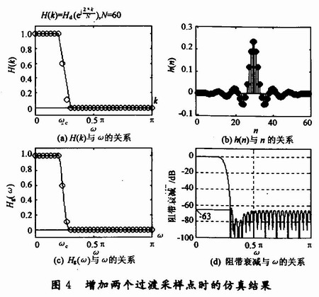

频率采样法的优点是可以在频域直接设计，并且适合最优化设计; \
缺点是采样频率只能等于2π/N的整数倍，因而不能确保截止频率ωc的自由取值，要想实现自由地选择截止频率，\
必须增加采样点数N，但这又使计算量加大。

2.5.3.3 用remez设计滤波器(Chebyshev最佳一致逼近法)
````````````````````````````````````````````````````````````````````````````

remez函数能够帮助我们找到更优的滤波器系数。remez的调用形式如下：

.. code-block:: text
    :linenos:

    remez(numtaps, bands, desired,
        weight=None, Hz=1, type='bandpass', maxiter=25, grid_density=16)
    其中：
    numtaps : 所设计的FIR滤波器的长度
    bands ： 一个递增序列，它包括频率响应中的所有频带的边界，其值在0到Hz/2之间，如果参数Hz为缺省值1的话，那么可以把它当作是以取样频率正规化的频率
    desired : 长度为bands的一半的增益序列，它给出频率响应在bands中的每个频带的增益值
    weight : 长度和desired一样的权重序列，它给出desired中的每个增益所占的权重，即给出desired中的每个增益的重要性，值越大表示其越重要
    type : 'bandpass'或者'differentiator'，本书只介绍type为'bandpass'的情况    

remez是一种迭代算法，它能够找到一个n阶多项式，使得在指定的区间中此多项式和指定函数之间的最大误差最小化。\
由于FIR滤波器的频率响应实际上是一个多项式函数，因此可以用remez算法进行FIR滤波器系数设计。

remez返回经过remez算法最优化之后的FIR滤波器的系数。\
此系数和用firwin所设计的结果一样是对称的。\
当numtaps为偶数时，所设计的滤波器对于取样频率/2的响应为0，因此无法设计出长度为偶数的高通滤波器。

**使用remez设计高通滤波器**：

.. code-block:: python
    :linenos:

    import scipy.signal as signal
    import numpy as np
    import pylab as pl

    pl.figure(figsize=(8,4))

    for length in [31, 101, 201]:
        b = signal.remez(length, (0, 0.18,  0.2,  0.50), (0.01, 1))
        w, h = signal.freqz(b, 1)
        pl.plot(w/2/np.pi, 20*np.log10(np.abs(h)), label=str(length))

    pl.legend()
    pl.xlabel("hz")
    pl.ylabel("dB")
    pl.title("remez")
    pl.show()    

程序中，remez函数的bands参数给出两个频带(以取样频率正规化)：0到0.18和0.2到0.5，\
而desired给出两个频带的增益分别为0.01和1，因此它所设计的是一个通带频率为0.2、阻带增益为-40dB的高通滤波器。

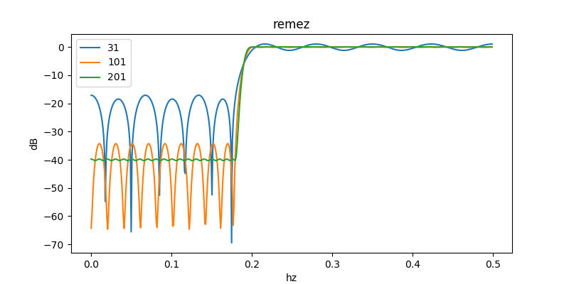

可以看出滤波器越长，频率响应越接近设计值。

**使用remez设计低通滤波器**：

只需调整两个频段的增益，可以变成低通滤波器。

.. code-block:: python
    :linenos:

    b = signal.remez(length, (0, 0.18,  0.2,  0.50), (1, 0.01))

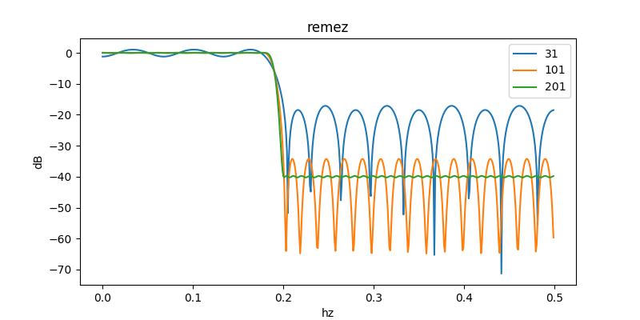

**使用remez设计带通滤波器**：

使用滤波器进行级联可以用来设计带通滤波器。

.. code-block:: python
    :linenos:

    import scipy.signal as signal
    import numpy as np
    import pylab as pl

    h1 = signal.remez(201, (0, 0.18,  0.2,  0.50), (0.01, 1))
    h2 = signal.remez(201, (0, 0.38,  0.4,  0.50), (1, 0.01))
    h3 = np.convolve(h1, h2)

    w, h = signal.freqz(h3, 1)
    pl.plot(w/2/np.pi, 20*np.log10(np.abs(h)))

    pl.legend()
    pl.xlabel("hz")
    pl.ylabel("db")
    pl.show()    

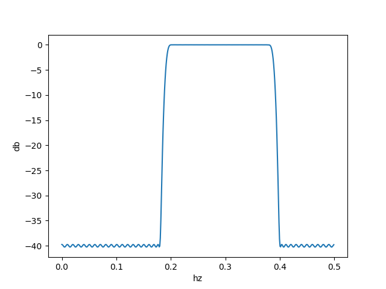

当然也可以直接利用remez函数设计带通滤波器。

.. code-block:: python
    :linenos:

    h4 = signal.remez(201, (0, 0.18, 0.2, 0.38, 0.4, 0.50), (0.01, 1, 0.01))    

2.5.3.4 线性相位型频率响应分析
````````````````````````````````````````

.. code-block:: python
    :linenos:

    import scipy.signal as signal
    import numpy as np
    import pylab as pl

    pl.figure(figsize=(8,6))

    b = np.array([-0.5,-0.5,2,-0.5,-0.5])

    #方法1
    w, h = signal.freqz(b)

    pl.subplot(411)
    pl.plot(w/2/np.pi, np.abs(h))
    pl.xlabel("freq")
    pl.ylabel("freqz Amplitude")

    pl.subplot(412)
    pl.plot(w/2/np.pi, np.angle(h))
    pl.ylabel('freqz phase')

    #方法2
    c = np.zeros(512-len(b))
    b = np.append(b,c)

    fs = np.fft.fft(b)
    amp = np.abs(fs)
    pha = np.angle(fs)
    freqs = np.linspace(0, 1, len(b))

    #幅度
    pl.subplot(413)
    pl.plot(freqs[0:256], amp[0:256])
    pl.ylabel('fft Amplitude')

    pl.subplot(414)
    pl.plot(freqs[0:256], pha[0:256])
    pl.ylabel('fft phase')

    pl.show()    

.. image:: images/FIR滤波器/线性相位型频率响应分析.png

这个线性相位叫分段线性，因为H(w)有可能为正，也有可能为负。


