2.6 IIR滤波器
======================================

2.6.1 IIR滤波器简介
--------------------------------------

**特点**：

* IIR数字滤波器采用递归型结构：IIR数字滤波器采用递归型结构，即结构上带有反馈环路。\
  IIR滤波器运算结构通常由延时、乘以系数和相加等基本运算组成，可以组合成直接型、正准型、级联型、并联型四种结构形式，\
  都具有反馈回路。由于运算中的舍入处理，使误差不断累积，有时会产生微弱的寄生振荡。
* 借助成熟的模拟滤波器的成果：IIR数字滤波器在设计上可以借助成熟的模拟滤波器的成果，\
  如巴特沃斯、契比雪夫和椭圆滤波器等，有现成的设计数据或图表可查，其设计工作量比较小，\
  对计算工具的要求不高。在设计一个IIR数字滤波器时，我们根据指标先写出模拟滤波器的公式，\
  然后通过一定的变换，将模拟滤波器的公式转换成数字滤波器的公式。
* 需加相位校准网络：IIR数字滤波器的相位特性不好控制，对相位要求较高时，需加相位校准网络。

**区别**：

* 单位响应：IIR滤波器的单位脉冲响应为无限长，网络中有反馈回路。\
  FIR（Finite Impulse Response）滤波器的单位脉冲响应是有限长的，一般网络中没有反馈回路。
* 幅频特性：IIR数字滤波器幅频特性精度很高，不是线性相位的，可以应用于对相位信息不敏感的音频信号上；\
  FIR数字滤波器的幅频特性精度较之于IIR数字滤波器低，\
  但是线性相位，就是不同频率分量的信号经过fir滤波器后他们的时间差不变，这是很好的性质。
* 实时信号处理：FIR数字滤波器是有限的单位响应也有利于对数字信号的处理，便于编程，用于计算的时延也小，这对实时的信号处理很重要。
* 复杂程度：在相同技术指标下，IIR滤波器由于存在着输出对输入的反馈，\
  因而可用比FIR滤波器较少的阶数来满足指标的要求，这样一来所用的存储单元少，\
  运算次数少，较为经济。例如用频率抽样法设计阻带衰减为-20db的FIR滤波器，\
  其阶数要33阶才能达到，而如果用双线性变换法设计只需4-5阶的切贝雪夫滤波器，\
  即可达到指标要求，所以FIR滤波器的阶数要高5-10倍左右。

2.6.2 IIR滤波器结构
--------------------------------------

IIR数字滤波器是一类递归型的线性时不变因果系统，其差分方程可以写为：

.. math:: 
    y(n)=\sum_{i=0}^{M}a_ix(n-i)+\sum_{i=1}^{N}b_iy(n-i)

进行Z变换，可得：

.. math:: 
    Y(z)=\sum_{i=0}^{M}a_iz^{-i}X(z)+\sum_{i=1}^{N}b_iz^{-i}Y(z)

于是得到IIR数字滤波器的系统函数：

.. math:: 
    H(z)=\frac{Y(z)}{X(z)}=\frac{\sum_{i=0}^{M}a_iz^{-i}}{1-\sum_{i=1}^{N}b_iz^{-i}}=a_0\frac{\prod_{i=1}^{M}(1-c_iz^{-1})}{\prod_{i=1}^{N}(1-d_iz^{-1})}

其中ci为零点而di为极点。H(z)的设计就是要确定系数、或者零极点，以使滤波器满足给定的性能指标。

2.6.2.1 直接I型
``````````````````````````````````````

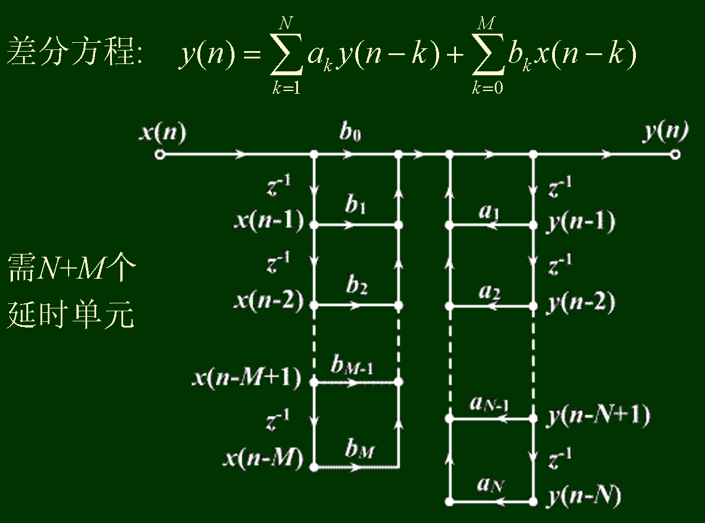

2.6.2.2 直接II型
``````````````````````````````````````

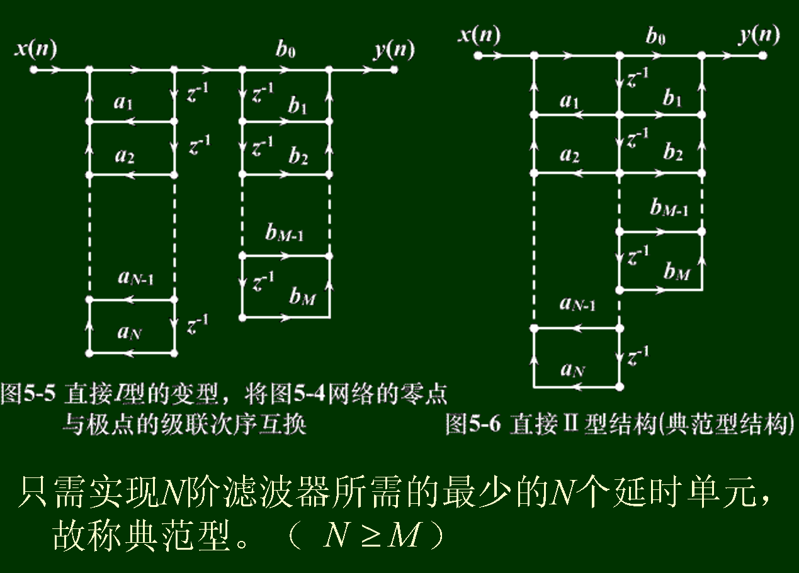

直接型的共同缺点：

* 系数 ak，bK对滤波器的性能控制作用不明显。
* 极点对系数的变化过于灵敏，易出现不稳定或较大误差。
* 运算的累积误差较大

2.6.2.3 级联型
``````````````````````````````````````

不失一般性，假设N>=M，IIR系统可以被分解成二阶子系统的级联形式，长度为(N+1)/2的整数部分。

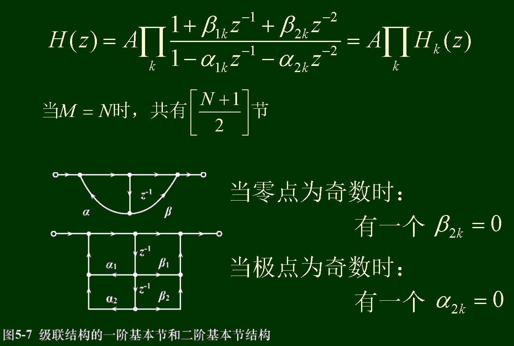

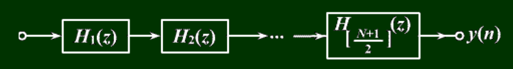

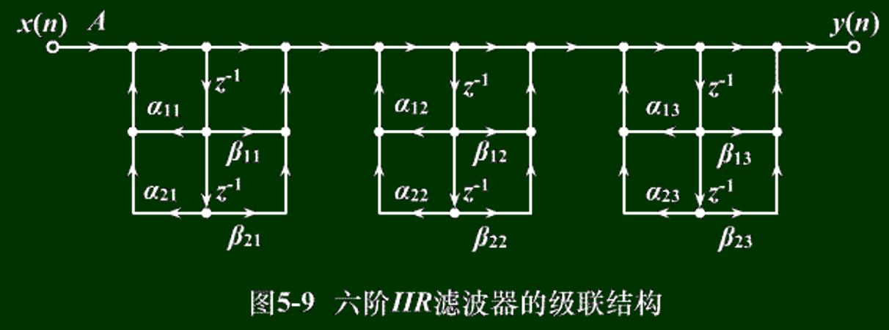

级联型的特点：

(1)调整系数

.. math:: 
    \beta_{1k},\beta_{2k}

能单独调整滤波器的第k对零点，而不影响其它零极点。

调整系数

.. math:: 
    \alpha_{1k},\alpha_{2k}

能单独调整滤波器的第k对极点，而不影响其它零极点。\
便于调整滤波器频率响应性能。

(2)运算的累积误差较小。

(3)具有最少的存储器。

2.6.2.4 并联型：
``````````````````````````````````````

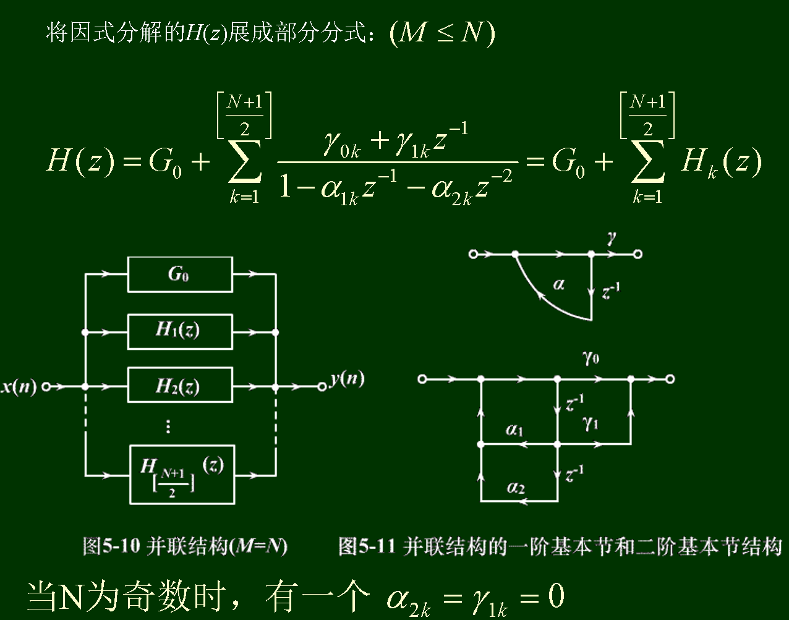

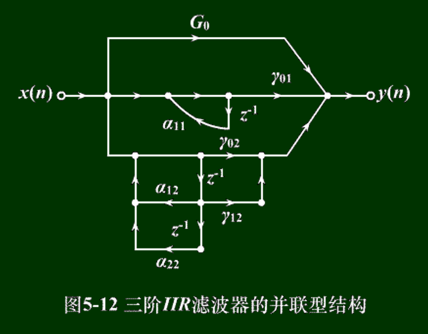

并联型的特点：

(1)通过调整系数

.. math:: 
    \alpha_{1k},\alpha_{2k}

可单独调整一对极点位置，但不能单独调整零点位置。

(2)各并联基本节的误差互相不影响，故运算误差最小。

(3)可同时对输入信号进行运算，故运算速度最高。

2.6.2.5 转置定理
``````````````````````````````````````

原网络中所有支路方向倒转，并将输入x(n)和输出y(n)相互交换，则其系统函数H(z)不改变。

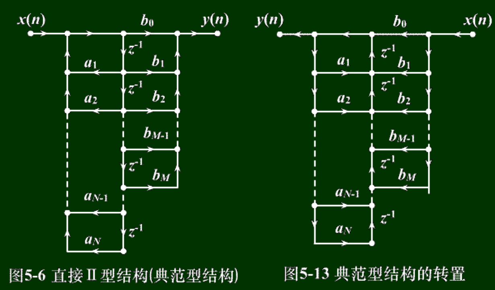

**例子**：

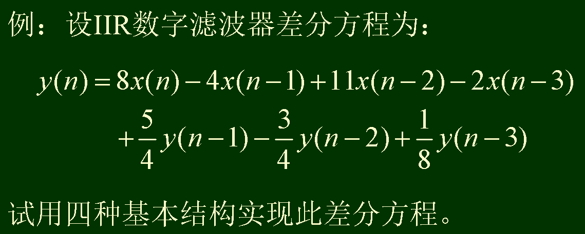

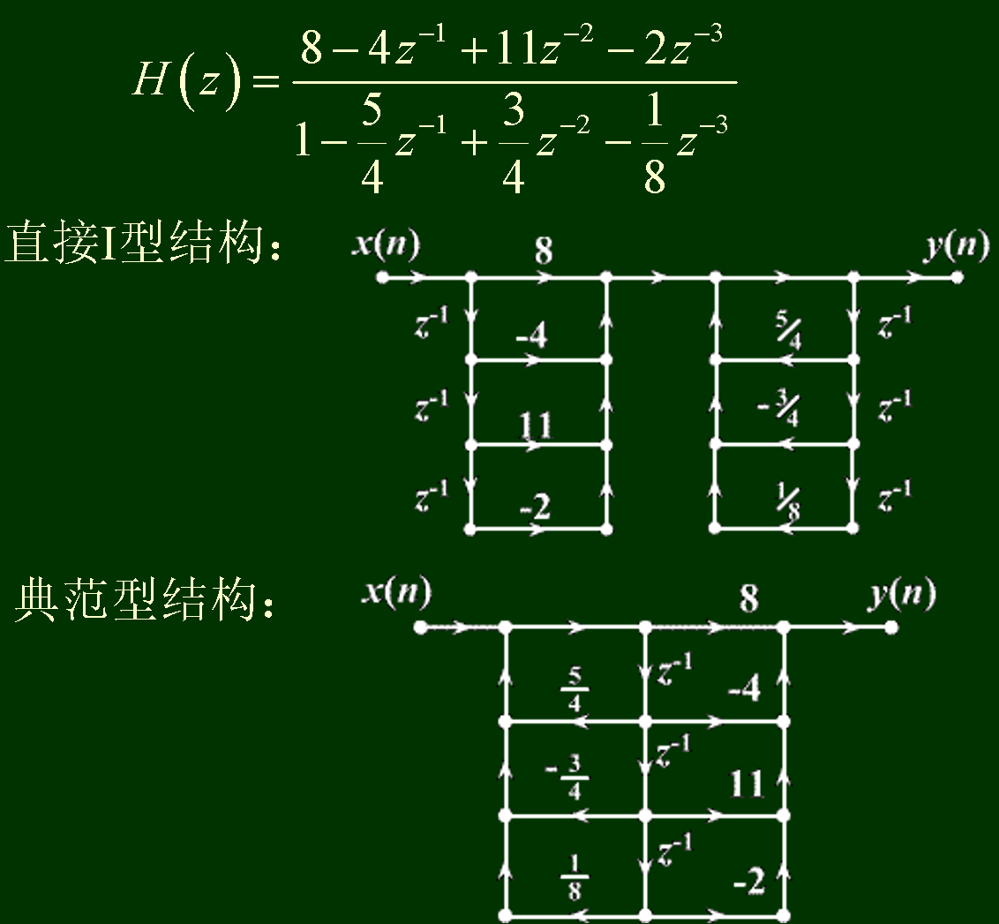

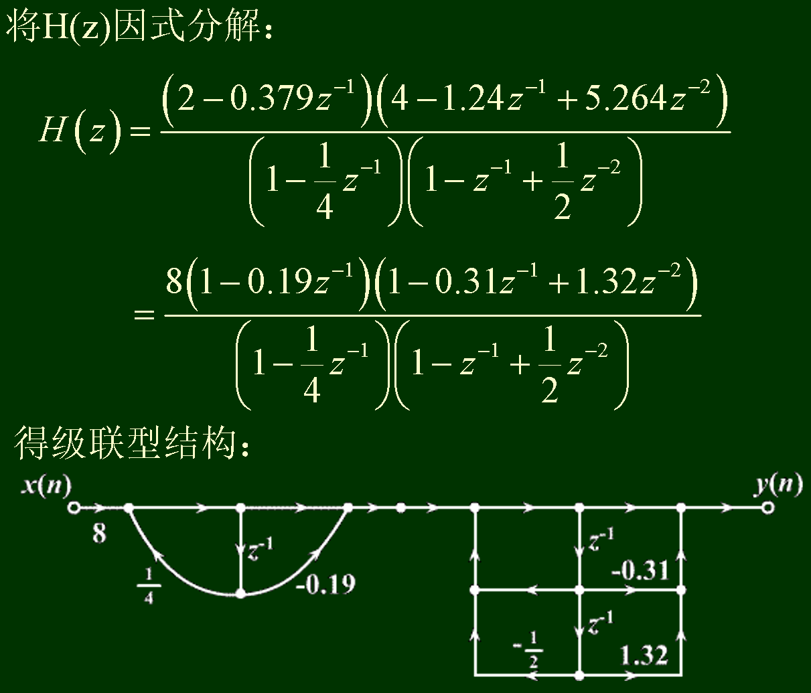

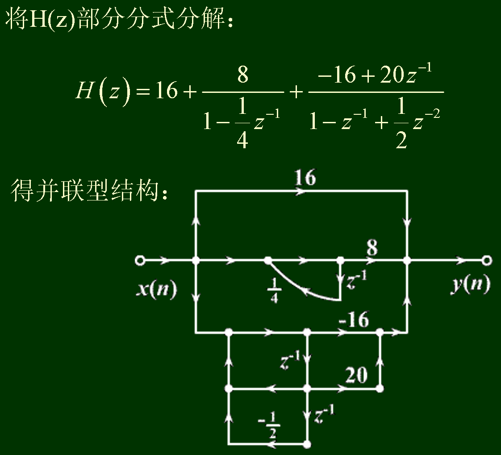

2.6.3 IIR滤波器设计
--------------------------------------

IIR数字滤波器的最通用的方法是借助于模拟滤波器的设计方法。\
模拟滤波器设计已经有了相当成熟的技术和方法，有完整的设计公式，\
还有比较完整的图表可以查询，因此设计数字滤波器可以充分利用这些丰富的资源来进行。

对于IIR数字滤波器的设计具体步骤如下:

* 按照一定的规则将给出的数字滤波器的技术指标转换为模拟低通滤波器的技术指标。
* 根据转换后的技术指标设计模拟低通滤波器G(s)(G(s)是低通滤波器的传递函数)。
* 再按照一定的规则将G(s)转换成H(z)(H(z)是数字滤波器的传递函数)。
  若设计的数字滤波器是低通的，上述的过程可以结束，若设计的是高通、带通或者是带阻滤波器，那么还需要下面的步骤。
* 将高通、带通或带阻数字滤波器的技术指标转换为低通模拟滤波器的技术指标，然后设计出低通G(s)，再将G(s)转换为H(z)。

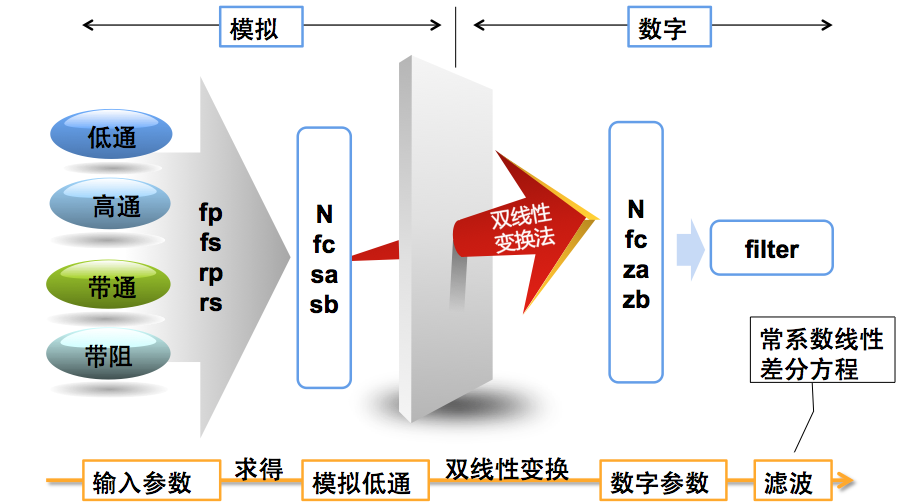

参数说明：fp——通带截止频率，fs——阻带截止频率，rp通带最大衰减，rs阻带最小衰减，N——滤波器阶数，\
fc——3dB截止频率，sa——原型滤波器分母多项式的系数，sb原型滤波器分子多项式的系数，\
za——数字滤波器系统函数分母多项式的系数，zb——数字滤波器系统函数分子多项式的系数，\
filter——滤波方法（将信号代入，返回滤波后的信号）。

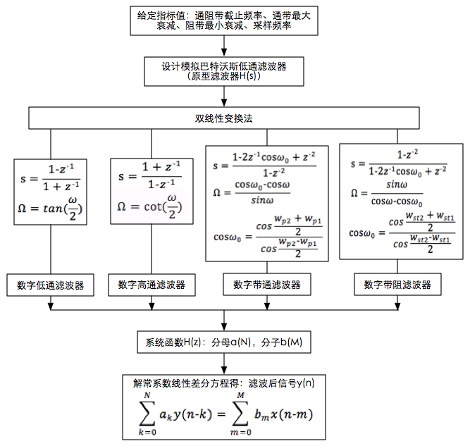

下面将描述如何使用该方法进行IIR滤波器的设计：

2.6.3.1 巴特沃斯低通滤波器
``````````````````````````````````````

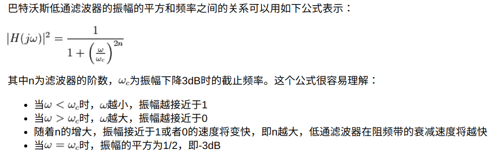

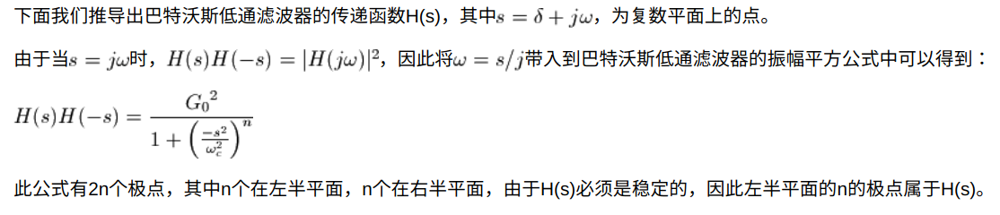

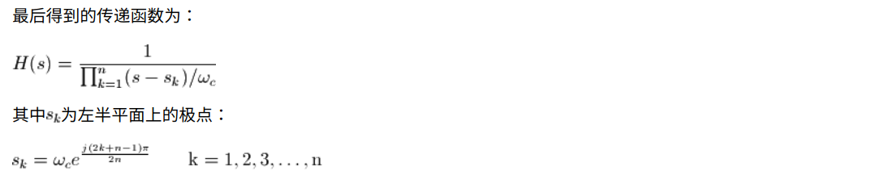

根据巴特沃斯滤波器的幅频响应得到了对应的传递函数。

拉普拉斯变换和连续时间傅立叶变换的关系：\
拉普拉斯变换将频率从实数推广为复数，因而傅里叶变换变成了拉普拉斯变换的一个特例。\
当s为纯虚数时，x(t)的拉普拉斯变换，即为x(t)的傅里叶变换。

2.6.3.2 归一化巴特沃斯低通滤波器
``````````````````````````````````````

下面将展示归一化巴特沃斯低通滤波器的传递函数是如何推导出来的。

归一化的低通滤波器（截止频率是1），其幅度公式如下：

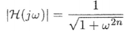

当n->∞时，得到一个理想的低通滤波反馈: ω＜1时，增益为1；ω＞1时，增益为1；ω=1时，增益为0.707。如下图所示：

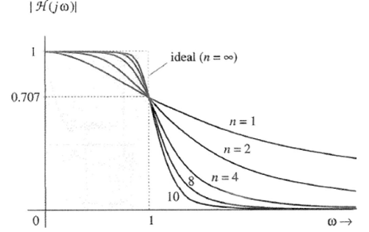

根据以下三个公式：

(1)

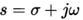

这里取σ=0

(2)

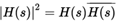

(3)拉普拉斯变换在虚轴s=jω上的性质：

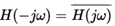

可以得到：

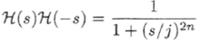

因此极点（分母为0的解）为：

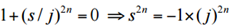

根据

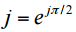

得到：

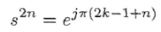

因此可以求得极点在单位圆上：

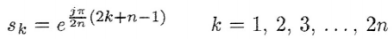

如果k从0开始的话，上式括号里可以写作2k+n+1：

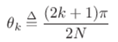

由于我们只对H(s)感兴趣，而不考虑H(-s)。因此低通滤波器的极点全部在负实半平面单位圆上：

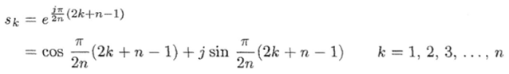

该滤波器的传递函数为：

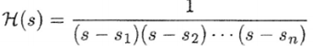

下面是n=1到4阶的极点位置：

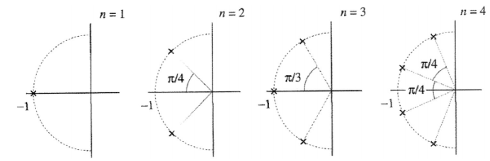

例如四阶Butterworth低通滤波器的极点所在角度为：5π/8, 7π/8, 9π/8, 11π/8，极点位置在：

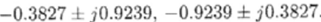

因此传递函数为：

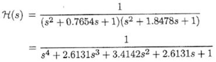

1到10阶的Butterworth多项式因子表格如下：

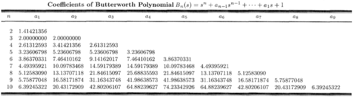

从上面的表可以得知如果要设计频率为1的巴特沃斯低通滤波器，直接使用上面表格的参数可以得到巴特沃斯滤波器的传递函数。

以上我们考虑的是幅度-3分贝时的截止频率为1时的情况：

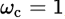

其它截止频率可将传递函数中的s替换为：

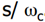

例如二阶截止频率为100的传递函数为：

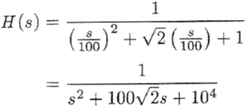

2.6.3.3 根据滤波器指标设计巴特沃斯低通滤波器
````````````````````````````````````````````````````````````````````````````

以数字低通滤波器为例（见下图），指标包括：通带截止频率wp，阻带截止频率wst，通带波纹δ1（Rp(dB)）， 阻带波纹δ2（As(dB)） 。

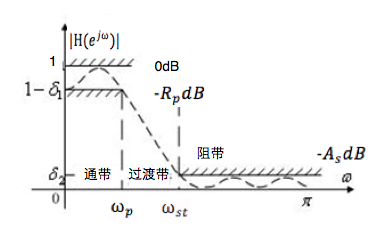

通带允许的最大衰减Rp(dB)以及阻带应达到的最小衰减As(dB)范围如下（已归一化为H(e^(jw))=1）：

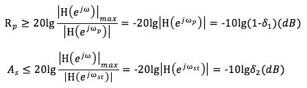

* 高通与低通的指标一致；
* 带通的技术指标通带截止频率分通带上截止频率wp2和通带下截止频率wp1，阻带截止频率分上阻带截止频率wst2和下阻带截止频率wst1；
* 带阻的技术指标通带截止频率分为上通带截止频率wp2和下通带截止频率wp1，阻带截止频率分阻带上截止频率wst2和阻带下截止频率wst1。

巴特沃斯模拟低通滤波器的设计步骤为：

* 给定模拟滤波器技术指标wp，wst，(1-δ1)（或Rp dB），δ2（或As dB）；
* 计算滤波器所需阶数N；\
  注：该滤波器阶数N不能大于10，因为阶数越高计算出的值越不准确。
* 查表确定归一化低通滤波器系统函数Has(s)；
* 将Has(s)转换为所需类型的低通滤波器系统函数Ha(s)。

具体实现：

(1)定滤波器的阶数N，公式如下所示，计算得到的结果向上取整。注意此处的Ωst和Ωp为预畸后的值。

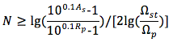

预畸的计算方法如下：

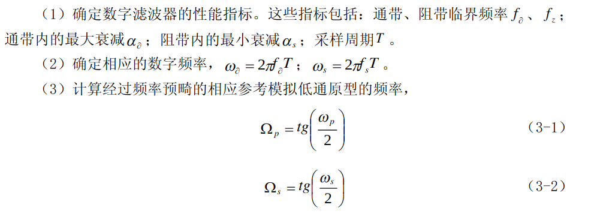

(2)确定3dB频率，公式如下，当选Ωc=(Ωcp+Ωcs)/2时通带阻带衰减皆可超过要求（查看matlab源码发现采用Ω=Ωcs，因此本文采取Ω=Ωcs）

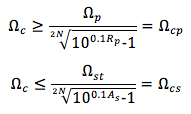

(3)根据N的值，查表得归一化低通滤波器系统函数Has(s)的分母多项式系数，公式如下：

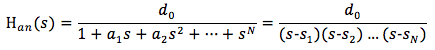

d0为1。

(4)转换成所需类型的低通滤波器系统函数Ha(s)，去归一化另s=s/Ωc。

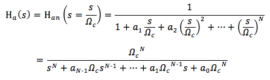

2.6.3.4 频带变换
````````````````````````````````````

只要知道了低通滤波器的传递函数H(s)，就很容易利用变量替换设计出同样阶数的高通、带通或者其它通带频率的低通滤波器。\
让我们来看看低通滤波器的变换。

(1)低通滤波器设计

假设我们使用巴特沃斯低通滤波器设计公式，设计出通带频率为1弧度/秒的标准低通滤波器：

.. code-block:: python
    :linenos:

    >>> b, a = signal.butter(2, 1.0, analog=1)
    >>> np.real(b)
    array([ 1.])
    >>> np.real(a)
    array([ 1.        ,  1.41421356,  1.        ])

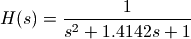

为了让它变为通带频率为w_c的低通滤波器，只需要进行如下替换：

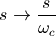

注意关键字参数analog=1，表示设计连续时间传递函数H(s)的系数。

下面是通带频率为2弧度/秒的2阶低通滤波器的系数：

.. code-block:: python
    :linenos:

    >>> b2, a2 = signal.butter(2, 2.0, analog=1)
    >>> np.real(b2)
    array([ 4.])
    >>> np.real(a2)
    array([ 1.        ,  2.82842712,  4.        ])    

可以看出将

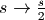

代入到前面的H(s)中即可得到这些系数。

(2)高通滤波器设计

低通滤波器转高通滤波器的替代公式为：

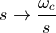

此替代公式很容易理解：\
若w为0，则替代之后的频率为无穷大，而低通滤波器无穷大处的频率响应为0，即转换之后的滤波器在0处的频率响应为0；\
若w为无穷大，则替代之后的频率为0，因此转换之后的滤波器在无穷大处频率响应为1。

下面设计通带频率为1弧度/秒的高通滤波器：

.. code-block:: python
    :linenos:

    >>> b3,a3 = signal.butter(2,1.0,btype="high",analog=1)
    >>> np.real(b3)
    array([ 1.,  0.,  0.])
    >>> np.real(a3)
    array([ 1.        ,  1.41421356,  1.        ])    

可以看出这些系数是将

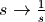

代入到H(s)中之后，上下分母乘以IIR滤波器-054.png之后得到的。

(3)带通滤波器设计

低通滤波器还可以转换为带通滤波器，这可能有点难以理解，让我们先来看看替代公式，假设带通滤波器的高低通带频率为w_2和w_1：

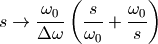

其中

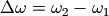

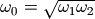

通带带宽


通带的中心频率

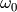

.. code-block:: python
    :linenos:

    import scipy.signal as signal

    b4, a4 = signal.butter(2, [1,2], btype='bandpass', analog=1)
    print(b4,a4)
    #[ 1.  0.  0.] [ 1.          1.41421356  5.          2.82842712  4.        ]

(4)带阻滤波器设计

.. code-block:: python
    :linenos:

    import scipy.signal as signal

    b4, a4 = signal.butter(2, [1,2], btype='bandstop', analog=1)
    print(b4,a4)
    [ 1.  0.  4.  0.  4.] [ 1.          1.41421356  5.          2.82842712  4.        ]    

2.6.3.5 双线性变换
````````````````````````````````````

模拟滤波器的数字化方法有很多种，包括冲激响应不变法（脉冲响应不变法）、阶跃响应不变法和双线性变换法等。\
本文采用双线性变换法实现。

双线性变换法是使数字滤波器的频率响应与模拟滤波器的频率响应相似的一种变换，\
它使得Ω和ω之间是单值映射关系可以避免频率响应的混叠失真。

下图表示了变换思路，即将s平面整个变换到一个中介s1平面的一个窄带Ω：-π/T→π/T之中，\
然后经过z=e^(s1*T)的变换，将s1平面映射到z平面。从s1到z平面的变换是单值变换，从而使整个变换过程（s到z）成为单值的变换。

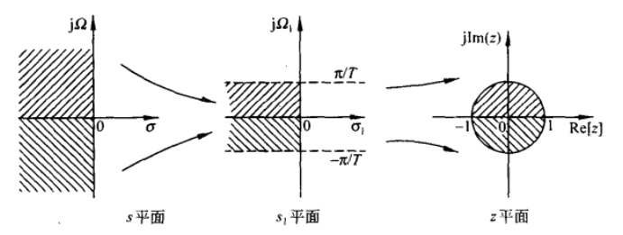

双线性变换的公式为：

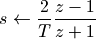

其中T为离散时间的取样周期。

双线性变换实际上是s复平面和z复平面上的点的映射变换，他将s复平面上的竖线变换成z复平面上的圆，\
而s复平面上的Y轴对应于z复平面上的单位圆。\
python提供了signal.bilinear函数用来做双线性变换。

定义离散时间的取样频率fs为8kHz，设计的巴特沃斯低通滤波器通带截至频率为1kHz。

.. code-block:: python
    :linenos:

    from scipy import signal
    import numpy as np
    import pylab as pl

    fs = 8000.0
    f = 1000.0

    #使用butter函数设计一个3阶的巴特沃斯滤波器，注意关键字参数analog=1，表示设计连续时间传递函数H(s)的系数，由于通带频率参数为圆频率，因此需要乘以2*pi
    b, a = signal.butter(3, 2*np.pi*f, analog=1)
    print(b,a)

    b2, a2 = signal.bilinear(b,a,fs=fs)
    print(b2,a2)

    #然后调用双线性变换函数bilinear，将系数转换为离散时间的传递函数系数，通过关键字参数fs指定取样频率
    w2, h2 = signal.freqz(b2,a2,worN=1000)

    pl.figure(figsize=(8,4))
    pl.plot(w2/2/np.pi*8000, 20*np.log10(np.abs(h2)))
    pl.show()

    #H(s)参数
    #[  2.48050213e+11] [  1.00000000e+00   1.25663706e+04   7.89568352e+07   2.48050213e+11]

    #H(z)参数
    #[ 0.02810974  0.08432923  0.08432923  0.02810974] [ 1. -1.52957784  0.96911953 -0.21466376]

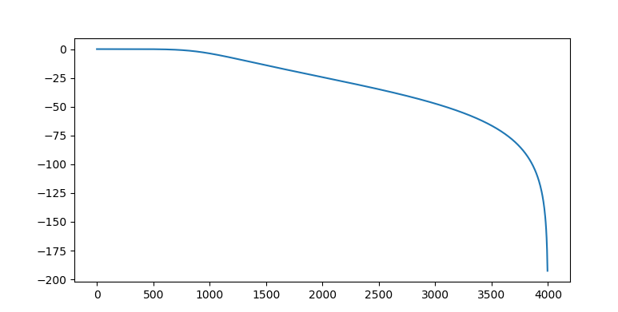

可以看出频率1000hz这个点大概下降3db。\
双线性变换后得到了差分方程的系数，利用如下函数便可进行滤波操作了。

.. code-block:: python
    :linenos:

    signal.lfilter(b, a, x, axis=-1, zi=None)

2.6.3.6 用python实现IIR滤波器设计
````````````````````````````````````

(1)低通滤波器

低通滤波器参数：Fs=8000，fp=2500，fs=3500，Rp=1dB，As=30dB。

.. code-block:: python
    :linenos:

    from scipy import signal
    import numpy as np
    import pylab as pl

    fs = 8000.0
    wp = 2*np.pi*2500
    ws = 2*np.pi*3500
    Rp = 1
    As = 30

    #计算率波器的阶数和3dB截止频率
    N,wc = signal.buttord(wp,ws,Rp,As,analog=1)

    #使用butter函数设计一个N阶的巴特沃斯滤波器，注意关键字参数analog=1，表示设计连续时间传递函数H(s)的系数，由于通带频率参数为圆频率，因此需要乘以2*pi
    b, a = signal.butter(N, 2*np.pi*wc, analog=1)

    b2, a2 = signal.bilinear(b,a,fs=fs)

    #然后调用双线性变换函数bilinear，将系数转换为离散时间的传递函数系数，通过关键字参数fs指定取样频率
    w2, h2 = signal.freqz(b2,a2,worN=1000)

    pl.figure(figsize=(8,4))
    pl.plot(w2/2/np.pi*8000, 20*np.log10(np.abs(h2)))
    pl.show()    

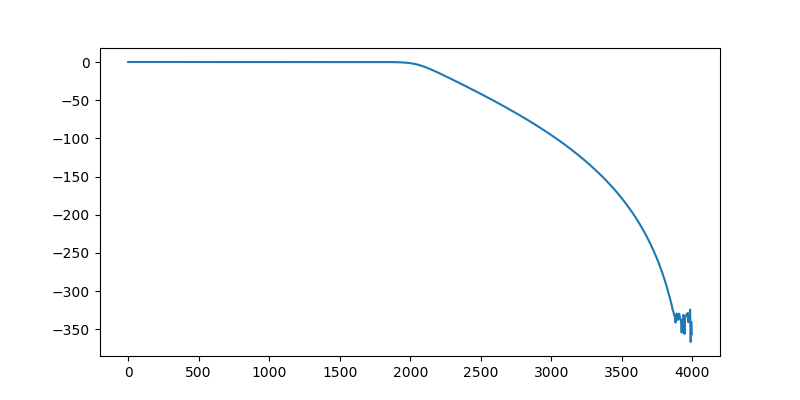

(2)带通滤波器

带通滤波器参数：Fs=8000，fp1=1000，fs1=800，fp2 = 2000，fs2=2300，Rp=1dB，As=30dB。

.. code-block:: python
    :linenos:

    from scipy import signal
    import numpy as np
    import pylab as pl

    fs = 8000.0
    wp = [2*np.pi*1000,2*np.pi*2000]
    ws = [2*np.pi*800, 2*np.pi*2300]
    Rp = 1
    As = 30

    #计算率波器的阶数和3dB截止频率
    N,wc = signal.buttord(wp,ws,Rp,As,analog=1)

    #使用butter函数设计一个N阶的巴特沃斯滤波器，注意关键字参数analog=1，表示设计连续时间传递函数H(s)的系数，由于通带频率参数为圆频率，因此需要乘以2*pi
    b, a = signal.butter(N, wc, analog=1,btype='bandpass')

    b2, a2 = signal.bilinear(b,a,fs=fs)

    #然后调用双线性变换函数bilinear，将系数转换为离散时间的传递函数系数，通过关键字参数fs指定取样频率
    w2, h2 = signal.freqz(b2,a2,worN=1000)

    pl.figure(figsize=(8,4))
    pl.plot(w2/2/np.pi*8000, 20*np.log10(np.abs(h2)))
    pl.show()

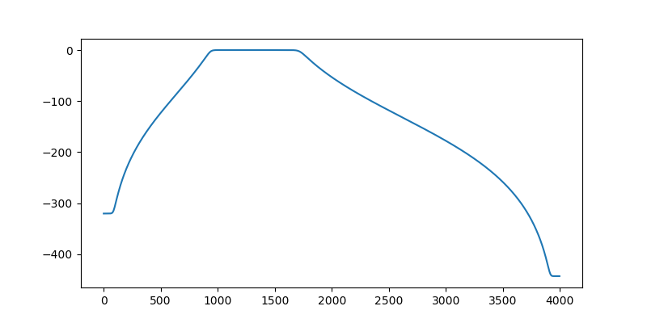

(3)带阻滤波器

带通滤波器参数：Fs=8000，fp1=1000，fs1=1500，fp2 = 3000，fs2=2500，Rp=1dB，As=40dB。

.. code-block:: python
    :linenos:

    from scipy import signal
    import numpy as np
    import pylab as pl

    fs = 8000
    wp = [2*np.pi*1000,2*np.pi*3000]
    ws = [2*np.pi*1500, 2*np.pi*2500]
    Rp = 1
    As = 40

    #计算率波器的阶数和3dB截止频率
    N,wc = signal.buttord(wp,ws,Rp,As,analog=1)

    #使用butter函数设计一个N阶的巴特沃斯滤波器，注意关键字参数analog=1，表示设计连续时间传递函数H(s)的系数，由于通带频率参数为圆频率，因此需要乘以2*pi
    b, a = signal.butter(N, wc, analog=1,btype='bandstop')

    b2, a2 = signal.bilinear(b,a,fs=fs)

    #然后调用双线性变换函数bilinear，将系数转换为离散时间的传递函数系数，通过关键字参数fs指定取样频率
    w2, h2 = signal.freqz(b2,a2,worN=1000)

    pl.figure(figsize=(8,4))
    pl.plot(w2/2/np.pi*8000, 20*np.log10(np.abs(h2)))
    pl.show()    

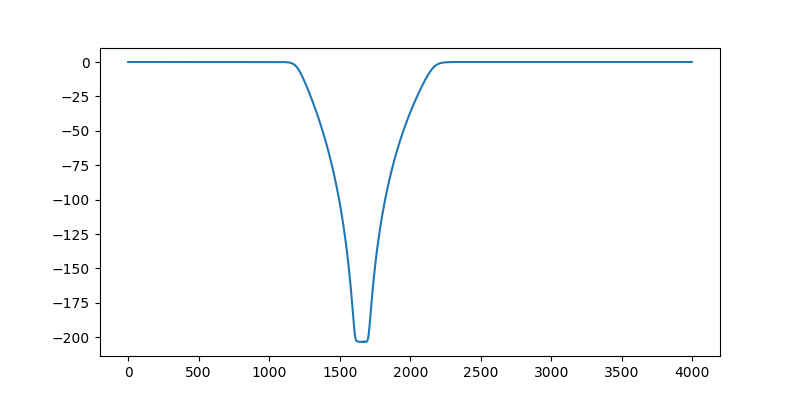

2.6.4 均衡器
--------------------------------------

2.6.4.1 双二阶滤波器biquad
````````````````````````````````````

双二阶滤波器传递函数：

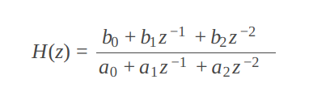

经常a0设置为1：

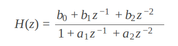

差分方程表示：

(1)直接I型

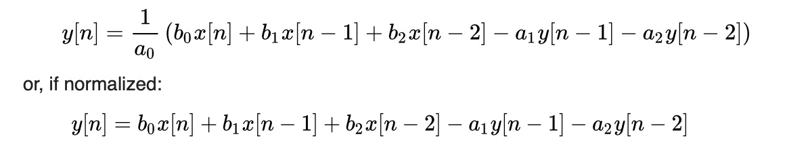

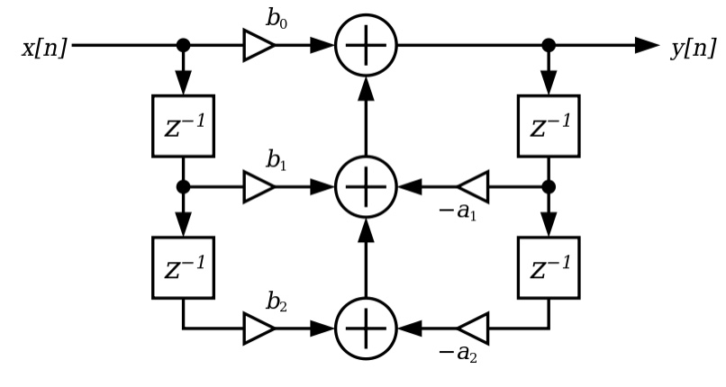

(2)直接II型

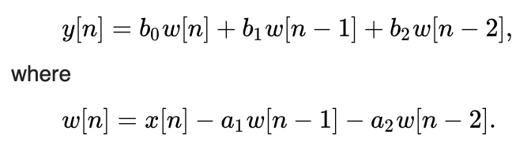

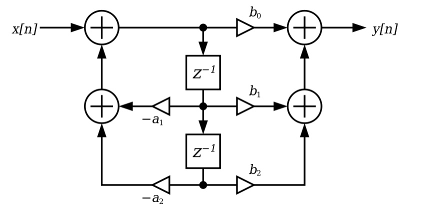

(3)直接II型转置型

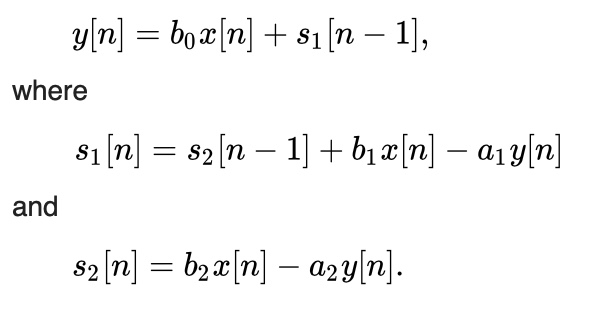

2.6.4.2 EQ均衡器
````````````````````````````````````

Q值：频率线弯曲的幅度，Q 越大所选的频率范围越集中，Q 越小所选的范围越广泛。

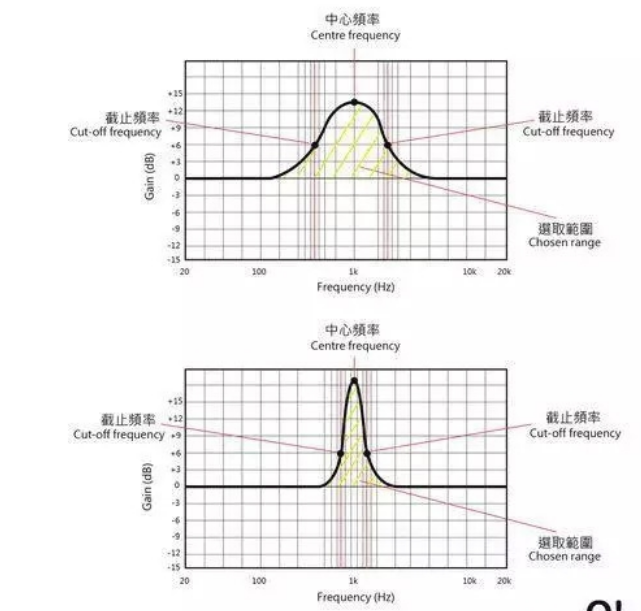

* Shelving filters 搁架式滤波器： \
  Shelvingfilter 的调整方式除了在声音工程的生活之外，在实际生活中也会常出现的 EQ 调整模式；\
  举例来说，所有家庭 Hi-Fi 音响或者是好一点的计算机声卡都可以另外处理低音与高音的调整功能。

* Low - shelf：\
  选取了截止频率的位置之后，Low-shelf 的用意是透过于 Gain 来增加或减少频率变化。

* High - shelf：\
  选取了截止频率的位置之前，High-shelf 的用意是透过于 Gain 来增加或减少频率变化。

Low - shelf 和 High- shelf 与 Low pass filter 和 Highpass filter 看起来很像，\
但完全不一样，Shelfving 是可以让频率产生变化，而 Passfilter 是砍掉，这点可要多注意。

2.6.4.3 均衡器设计原理
````````````````````````````````````

也许很少有人知道，无论是古老的盒式录音机还是现代的流行数码音响设备，以及众多的音乐播放软件，\
其中绝大多数的均衡器都只是一系列简单的二次IIR滤波器组合而成。

.. code-block:: text
    :linenos:

    二次IIR滤波器的传递函数如下：

    b0 + b1*z^-1 + b2*z^-2
    H(z) = ------------------------ (Eq 1)
    a0 + a1*z^-1 + a2*z^-2

    有6个系数，而不是5个。可以把a0归一化，则公式可以变为：

    (b0/a0) + (b1/a0)*z^-1 + (b2/a0)*z^-2
    H(z) = --------------------------------------- (Eq 2)
    1 + (a1/a0)*z^-1 + (a2/a0)*z^-2

    或者
    1 + (b1/b0)*z^-1 + (b2/b0)*z^-2
    H(z) = (b0/a0) * --------------------------------- (Eq 3)
    1 + (a1/a0)*z^-1 + (a2/a0)*z^-2

    这个滤波器的最直接实现方式叫 “Direct Form I” :
    y[n] = (b0/a0)*x[n] + (b1/a0)*x[n-1] + (b2/a0)*x[n-2]
    - (a1/a0)*y[n-1] - (a2/a0)*y[n-2] (Eq 4)

    用户先给出参数（期望的效果）:

    Fs (the sampling frequency) 采样率

    f0 ("wherever it's happenin', man." Center Frequency or
    Corner Frequency, or shelf midpoint frequency, depending
    on which filter type. The "significant frequency".) 中心频率

    dBgain (used only for peaking and shelving filters) 增益

    Q (the EE kind of definition, except for peakingEQ in which A*Q is
    the classic EE Q. That adjustment in definition was made so that
    a boost of N dB followed by a cut of N dB for identical Q and
    f0/Fs results in a precisely flat unity gain filter or "wire".)

    _or_ BW, the bandwidth in octaves (between -3 dB frequencies for BPF
    and notch or between midpoint (dBgain/2) gain frequencies for
    peaking EQ)

    _or_ S, a "shelf slope" parameter (for shelving EQ only). When S = 1,
    the shelf slope is as steep as it can be and remain monotonically
    increasing or decreasing gain with frequency. The shelf slope, in
    dB/octave, remains proportional to S for all other values for a
    fixed f0/Fs and dBgain. Q值

    然后，计算几个中间变量：

    A = sqrt( 10^(dBgain/20) )
    = 10^(dBgain/40) (for peaking and shelving EQ filters only)

    w0 = 2*pi*f0/Fs

    cos(w0)
    sin(w0)

    alpha = sin(w0)/(2*Q) (case: Q)
    = sin(w0)*sinh( ln(2)/2 * BW * w0/sin(w0) ) (case: BW)
    = sin(w0)/2 * sqrt( (A + 1/A)*(1/S - 1) + 2 ) (case: S)

    FYI: The relationship between bandwidth and Q is
    1/Q = 2*sinh(ln(2)/2*BW*w0/sin(w0)) (digital filter w BLT)
    or 1/Q = 2*sinh(ln(2)/2*BW) (analog filter prototype)

    The relationship between shelf slope and Q is
    1/Q = sqrt((A + 1/A)*(1/S - 1) + 2)

    2*sqrt(A)*alpha = sin(w0) * sqrt( (A^2 + 1)*(1/S - 1) + 2*A )
    is a handy intermediate variable for shelving EQ filters.

    最后，计算每种滤波器的系数：

    低通 Low Pass Filter
    LPF: H(s) = 1 / (s^2 + s/Q + 1)

    b0 = (1 - cos(w0))/2
    b1 = 1 - cos(w0)
    b2 = (1 - cos(w0))/2
    a0 = 1 + alpha
    a1 = -2*cos(w0)
    a2 = 1 - alpha

    高通 High Pass Filter
    HPF: H(s) = s^2 / (s^2 + s/Q + 1)

    b0 = (1 + cos(w0))/2
    b1 = -(1 + cos(w0))
    b2 = (1 + cos(w0))/2
    a0 = 1 + alpha
    a1 = -2*cos(w0)
    a2 = 1 - alpha

    带通 Band Pass Filter（增益 = Q ）
    BPF: H(s) = s / (s^2 + s/Q + 1) (constant skirt gain, peak gain = Q)

    b0 = sin(w0)/2 = Q*alpha
    b1 = 0
    b2 = -sin(w0)/2 = -Q*alpha
    a0 = 1 + alpha
    a1 = -2*cos(w0)
    a2 = 1 - alpha

    带通 Band Pass Filter( 0 db增益）
    BPF: H(s) = (s/Q) / (s^2 + s/Q + 1) (constant 0 dB peak gain)

    b0 = alpha
    b1 = 0
    b2 = -alpha
    a0 = 1 + alpha
    a1 = -2*cos(w0)
    a2 = 1 - alpha

    Notch滤波器
    notch: H(s) = (s^2 + 1) / (s^2 + s/Q + 1)

    b0 = 1
    b1 = -2*cos(w0)
    b2 = 1
    a0 = 1 + alpha
    a1 = -2*cos(w0)
    a2 = 1 - alpha

    全通 All Pass Filter
    APF: H(s) = (s^2 - s/Q + 1) / (s^2 + s/Q + 1)

    b0 = 1 - alpha
    b1 = -2*cos(w0)
    b2 = 1 + alpha
    a0 = 1 + alpha
    a1 = -2*cos(w0)
    a2 = 1 - alpha

    尖峰EQ
    peakingEQ: H(s) = (s^2 + s*(A/Q) + 1) / (s^2 + s/(A*Q) + 1)

    b0 = 1 + alpha*A
    b1 = -2*cos(w0)
    b2 = 1 - alpha*A
    a0 = 1 + alpha/A
    a1 = -2*cos(w0)
    a2 = 1 - alpha/A

    lowShelf: H(s) = A * (s^2 + (sqrt(A)/Q)*s + A)/(A*s^2 + (sqrt(A)/Q)*s + 1)

    b0 = A*( (A+1) - (A-1)*cos(w0) + 2*sqrt(A)*alpha )
    b1 = 2*A*( (A-1) - (A+1)*cos(w0) )
    b2 = A*( (A+1) - (A-1)*cos(w0) - 2*sqrt(A)*alpha )
    a0 = (A+1) + (A-1)*cos(w0) + 2*sqrt(A)*alpha
    a1 = -2*( (A-1) + (A+1)*cos(w0) )
    a2 = (A+1) + (A-1)*cos(w0) - 2*sqrt(A)*alpha

    highShelf: H(s) = A * (A*s^2 + (sqrt(A)/Q)*s + 1)/(s^2 + (sqrt(A)/Q)*s + A)

    b0 = A*( (A+1) + (A-1)*cos(w0) + 2*sqrt(A)*alpha )
    b1 = -2*A*( (A-1) + (A+1)*cos(w0) )
    b2 = A*( (A+1) + (A-1)*cos(w0) - 2*sqrt(A)*alpha )
    a0 = (A+1) - (A-1)*cos(w0) + 2*sqrt(A)*alpha
    a1 = 2*( (A-1) - (A+1)*cos(w0) )
    a2 = (A+1) - (A-1)*cos(w0) - 2*sqrt(A)*alpha

2.6.4.4 二阶滤波器的频率响应
````````````````````````````````````    

(1)二阶低通滤波器

.. code-block:: python
    :linenos:

    import scipy.signal as signal
    import pylab as pl
    import math
    import numpy as np

    def lpf_equalizer(freq, Q, gain, Fs):
        A = 10**(gain/20.0)
        w0 = 2*math.pi*freq/Fs
        alpha = math.sin(w0) / 2 / Q

        b0 = (1-math.cos(w0))/2
        b1 = 1-math.cos(w0)
        b2 = (1-math.cos(w0))/2
        a0 = 1 + alpha
        a1 = -2*math.cos(w0)
        a2 = 1 - alpha

        return [b0/a0,b1/a0,b2/a0], [1.0, a1/a0, a2/a0]    


    pl.figure(figsize=(8,4))

    for q in [1.0,5.0]:
        for p in [5, 10]:
            b,a = lpf_equalizer(1000, q, p, 8000)
            #print(b,a)
            w, h = signal.freqz(b,a)
            pl.plot(w/2/np.pi*8000, 20*np.log10(np.abs(h)),label=(p,q))
    pl.legend()
    pl.xlabel("freq")
    pl.ylabel("dB")
    pl.show()  

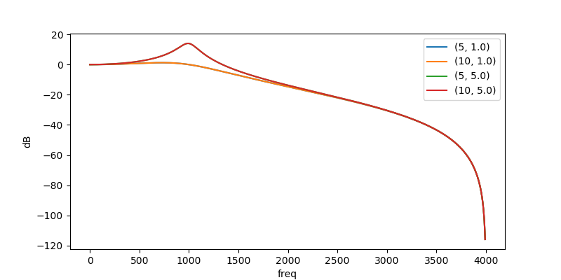

从图中可以看出增益在这里无作用。


(2)二阶高通滤波器

.. code-block:: python
    :linenos:

    import scipy.signal as signal
    import pylab as pl
    import math
    import numpy as np

    def hpf_equalizer(freq, Q, gain, Fs):
        A = 10**(gain/20.0)
        w0 = 2*math.pi*freq/Fs
        alpha = math.sin(w0) / 2 / Q

        b0 = (1+math.cos(w0))/2
        b1 = -(1+math.cos(w0))
        b2 = (1+math.cos(w0))/2
        a0 = 1 + alpha
        a1 = -2*math.cos(w0)
        a2 = 1 - alpha

        return [b0/a0,b1/a0,b2/a0], [1.0, a1/a0, a2/a0]    


    pl.figure(figsize=(8,4))

    for q in [1.0,5.0]:
        for p in [5, 10]:
            b,a = hpf_equalizer(1000, q, p, 8000)
            #print(b,a)
            w, h = signal.freqz(b,a)
            pl.plot(w/2/np.pi*8000, 20*np.log10(np.abs(h)),label=(p,q))
    pl.legend()
    pl.xlabel("freq")
    pl.ylabel("dB")
    pl.show()    

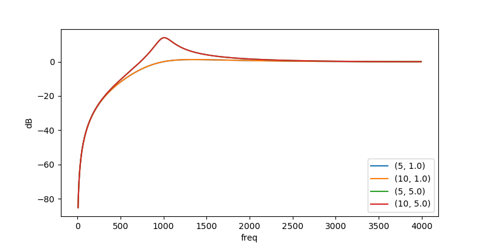

(3)highshelf

.. code-block:: python
    :linenos:

    import scipy.signal as signal
    import pylab as pl
    import math
    import numpy as np

    def highshelf_equalizer(freq, Q, gain, Fs):
        A = 10**(gain/40.0)
        w0 = 2*math.pi*freq/Fs
        alpha = math.sin(w0) / 2 / Q

        b0 = A*((A+1)+(A-1)*math.cos(w0)+2*math.sqrt(A)*alpha)
        b1 = -2*A*((A-1)+(A+1)*math.cos(w0))
        b2 = A*((A+1)+(A-1)*math.cos(w0)-2*math.sqrt(A)*alpha)
        a0 = (A+1)-(A-1)*math.cos(w0)+2*math.sqrt(A)*alpha
        a1 = 2*((A-1)-(A+1)*math.cos(w0))
        a2 = (A+1)-(A-1)*math.cos(w0)-2*math.sqrt(A)*alpha

        return [b0/a0,b1/a0,b2/a0], [1.0, a1/a0, a2/a0]    


    pl.figure(figsize=(8,4))

    for q in [1.0,5.0]:
        for p in [5, 10]:
            b,a = highshelf_equalizer(1000, q, p, 8000)
            #print(b,a)
            w, h = signal.freqz(b,a)
            pl.plot(w/2/np.pi*8000, 20*np.log10(np.abs(h)),label=(p,q))
    pl.legend()
    pl.xlabel("freq")
    pl.ylabel("dB")
    pl.show()

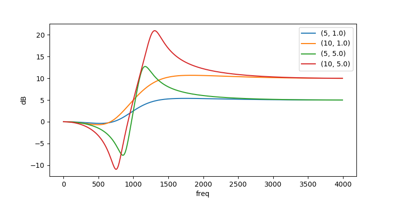

(3)lowshelf

.. code-block:: python
    :linenos:

    import scipy.signal as signal
    import pylab as pl
    import math
    import numpy as np

    def lowshelf_equalizer(freq, Q, gain, Fs):
        A = 10**(gain/40.0)
        w0 = 2*math.pi*freq/Fs
        alpha = math.sin(w0) / 2 / Q

        b0 = A*((A+1)-(A-1)*math.cos(w0)+2*math.sqrt(A)*alpha)
        b1 = 2*A*((A-1)-(A+1)*math.cos(w0))
        b2 = A*((A+1)-(A-1)*math.cos(w0)-2*math.sqrt(A)*alpha)
        a0 = (A+1)+(A-1)*math.cos(w0)+2*math.sqrt(A)*alpha
        a1 = -2*((A-1)+(A+1)*math.cos(w0))
        a2 = (A+1)+(A-1)*math.cos(w0)-2*math.sqrt(A)*alpha

        return [b0/a0,b1/a0,b2/a0], [1.0, a1/a0, a2/a0]    


    pl.figure(figsize=(8,4))

    for q in [1.0,5.0]:
        for p in [5, 10]:
            b,a = lowshelf_equalizer(1000, q, p, 8000)
            #print(b,a)
            w, h = signal.freqz(b,a)
            pl.plot(w/2/np.pi*8000, 20*np.log10(np.abs(h)),label=(p,q))
    pl.legend()
    pl.xlabel("freq")
    pl.ylabel("dB")
    pl.show()

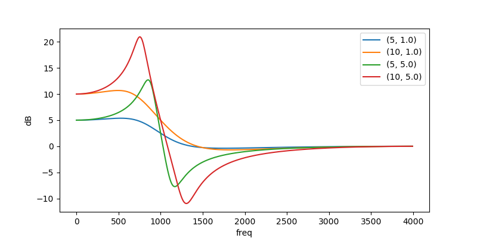

(5)peaking EQ

.. code-block:: python
    :linenos:

    import scipy.signal as signal
    import pylab as pl
    import math
    import numpy as np

    def peakingEQ_equalizer(freq, Q, gain, Fs):
        A = 10**(gain/40.0)
        w0 = 2*math.pi*freq/Fs
        alpha = math.sin(w0) / 2 / Q

        b0 = 1+alpha*A
        b1 = -2*math.cos(w0)
        b2 = 1-alpha*A
        a0 = 1 + alpha/A
        a1 = -2*math.cos(w0)
        a2 = 1 - alpha/A

        return [b0/a0,b1/a0,b2/a0], [1.0, a1/a0, a2/a0]    


    pl.figure(figsize=(8,4))

    for q in [1.0,5.0]:
        for p in [5, 10]:
            b,a = peakingEQ_equalizer(1000, q, p, 8000)
            #print(b,a)
            w, h = signal.freqz(b,a)
            pl.plot(w/2/np.pi*8000, 20*np.log10(np.abs(h)),label=(p,q))
    pl.legend()
    pl.xlabel("freq")
    pl.ylabel("dB")
    pl.show() 

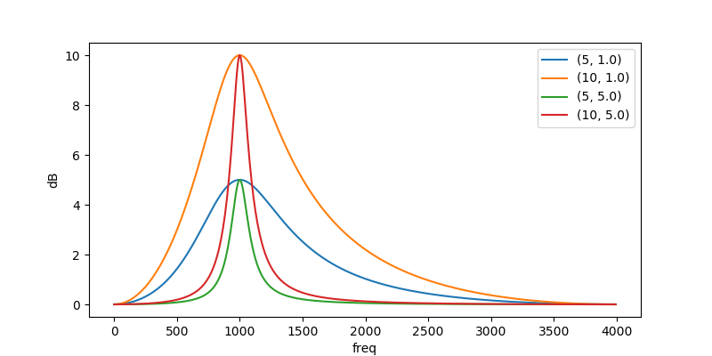

将上述种类的滤波器进行级联，就可以实现多段的EQ功能了。

2.6.4.5 实例
````````````````````````````````````

在M1项目中，麦克风拾音需要做特殊的EQ处理，EQ曲线如下：

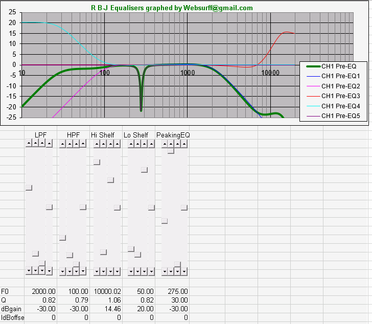

现在用前面学到的知识用python实现该EQ曲线。

.. code-block:: python
    :linenos:

    import scipy.signal as signal
    import pylab as pl
    import math
    import numpy as np

    def peakingEQ_equalizer(freq, Q, gain, Fs):
        A = 10**(gain/40.0)
        w0 = 2*math.pi*freq/Fs
        alpha = math.sin(w0) / 2 / Q

        b0 = 1+alpha*A
        b1 = -2*math.cos(w0)
        b2 = 1-alpha*A
        a0 = 1 + alpha/A
        a1 = -2*math.cos(w0)
        a2 = 1 - alpha/A

        return [b0/a0,b1/a0,b2/a0], [1.0, a1/a0, a2/a0]    

    def lowshelf_equalizer(freq, Q, gain, Fs):
        A = 10**(gain/40.0)
        w0 = 2*math.pi*freq/Fs
        alpha = math.sin(w0) / 2 / Q

        b0 = A*((A+1)-(A-1)*math.cos(w0)+2*math.sqrt(A)*alpha)
        b1 = 2*A*((A-1)-(A+1)*math.cos(w0))
        b2 = A*((A+1)-(A-1)*math.cos(w0)-2*math.sqrt(A)*alpha)
        a0 = (A+1)+(A-1)*math.cos(w0)+2*math.sqrt(A)*alpha
        a1 = -2*((A-1)+(A+1)*math.cos(w0))
        a2 = (A+1)+(A-1)*math.cos(w0)-2*math.sqrt(A)*alpha

        return [b0/a0,b1/a0,b2/a0], [1.0, a1/a0, a2/a0]  

    def highshelf_equalizer(freq, Q, gain, Fs):
        A = 10**(gain/40.0)
        w0 = 2*math.pi*freq/Fs
        alpha = math.sin(w0) / 2 / Q

        b0 = A*((A+1)+(A-1)*math.cos(w0)+2*math.sqrt(A)*alpha)
        b1 = -2*A*((A-1)+(A+1)*math.cos(w0))
        b2 = A*((A+1)+(A-1)*math.cos(w0)-2*math.sqrt(A)*alpha)
        a0 = (A+1)-(A-1)*math.cos(w0)+2*math.sqrt(A)*alpha
        a1 = 2*((A-1)-(A+1)*math.cos(w0))
        a2 = (A+1)-(A-1)*math.cos(w0)-2*math.sqrt(A)*alpha

        return [b0/a0,b1/a0,b2/a0], [1.0, a1/a0, a2/a0]  

    def hpf_equalizer(freq, Q, gain, Fs):
        A = 10**(gain/20.0)
        w0 = 2*math.pi*freq/Fs
        alpha = math.sin(w0) / 2 / Q

        b0 = (1+math.cos(w0))/2
        b1 = -(1+math.cos(w0))
        b2 = (1+math.cos(w0))/2
        a0 = 1 + alpha
        a1 = -2*math.cos(w0)
        a2 = 1 - alpha

        return [b0/a0,b1/a0,b2/a0], [1.0, a1/a0, a2/a0] 

    def lpf_equalizer(freq, Q, gain, Fs):
        A = 10**(gain/20.0)
        w0 = 2*math.pi*freq/Fs
        alpha = math.sin(w0) / 2 / Q

        b0 = (1-math.cos(w0))/2
        b1 = 1-math.cos(w0)
        b2 = (1-math.cos(w0))/2
        a0 = 1 + alpha
        a1 = -2*math.cos(w0)
        a2 = 1 - alpha

        return [b0/a0,b1/a0,b2/a0], [1.0, a1/a0, a2/a0]


    b1,a1 = lpf_equalizer(2000, 0.82, -30, 48000)
    w1,h1 = signal.freqz(b1,a1,worN=48000)

    b2,a2 = hpf_equalizer(100, 0.79, -30, 48000)
    w2,h2 = signal.freqz(b2,a2,worN=48000)

    b3,a3 = highshelf_equalizer(10000.02, 1.06, 14.46, 48000)
    w3,h3 = signal.freqz(b3,a3,worN=48000)

    b4,a4 = lowshelf_equalizer(50, 0.82, 20, 48000)
    w4,h4 = signal.freqz(b4,a4,worN=48000)

    b5,a5 = peakingEQ_equalizer(275, 30, -30, 48000)
    w5,h5 = signal.freqz(b5,a5,worN=48000)

    w = w1

    h = h1*h2*h3*h4*h5


    fig = pl.figure(figsize=(16,6))

    pl.plot(w/2/np.pi*48000, 20*np.log10(np.clip(np.abs(h), 1e-20, 1e100)))

    pl.minorticks_on()
    pl.xlabel("freq")
    pl.ylabel("dB")
    pl.xlim(20,12000)
    pl.ylim(-40,20)
    pl.show()    

.. image:: images/IIR滤波器/实例02.png

因为50HZ，275HZ较小频率的存在，在分析频率响应时，将worN设置为48000，\
也就是可以精确到1HZ进行分析，如果wornN采用默认值512，那么精确到93.75，50HZ,275HZ这两个频率就分析不准了。
