2.7 自适应滤波器
======================================

2.7.1 自适应滤波器分类
--------------------------------------

近年来，随着数字信号处理器的功能的不断增强，\
自适应信号处理 (adaptive signal process)活跃在噪声消除、回声控制、信号预测、声音定位等众多信号处理领域。\
尽管其应用领域十分广泛，但基本的系统构造大致只有如下几种分类。

**系统辨识**：

所谓系统辨识(system identification)，就是通过对未知系统的输入输出进行观测，\
构造一个滤波器使得它在同样的输入的情况下，输出信号和未知系统相同。\
简而言之，就是通过观测未知系统对输入的反应，探知其内部情况。为了探知内情而使用的输入信号我们称之为参照信号。

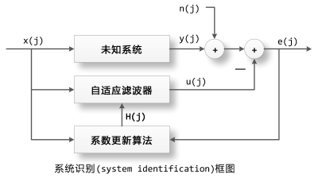

如上图所示参照信号 x(j)同时输入到未知系统和自适应滤波器H中，未知系统的输出为y(j)， \
自适应滤波器的输出为u(j)，由于观测误差或者外部噪声的干扰，\
实际观测到的未知系统的输出为d(j)=y(j)+n(j)，n(j)被称为外部干扰。\
通过求的d(j)和u(j)之间的误差e(j)=d(j)-u(j)，我们可以知道自适应滤波器H和未知系统还有多少差别，\
通过这个误差我们更新H的内部参数，使得它更加靠近未知系统。

**信号预测**：

所谓信号预测就是通过信号过去的值预测（计算）现在的值，下面是信号预测的系统框图。

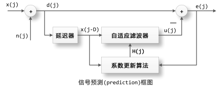

x(j)是待预测的信号，假设我们无法完美地观测此信号，因此导入一个外部干扰n(j)，\
这样d(j)=x(j)+n(j)就是我们观测到的待预测信号。

通过延迟器将d(j)进行延时得到d(j-D)，并把d(j-D)输入到自适应滤波器H中，\
得到其输出为u(j)，u(j)就是自适应滤波器通过待预测信号过去的值预测出的现在的值，\
计算观测值d(j)和预测值u(j)之间的误差e(j)=d(j)-u(j)，\
通过e(j)更新自适应滤波器H的内部系数使得其输出更加接近d(j)。

如果x(j)存在白色噪声的成分和周期信号的成分，由于白色噪声是完全不自相关，无法预测的信号，\
因此通过过去的值x(j-D)所能预测的只能是其中的周期信号的成分。\
这样自适应滤波器H的输出信号u(j)就会与周期信号成分渐渐逼近，\
而e(j)则是剩下的不可预测的白色噪声的成分。因此自适应滤波器也可以运用于噪声消除。

**信号均衡**：

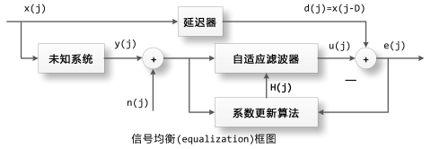

当信号x(j)通过未知系统之后变成y(j)，未知系统对信号x(j)进行了某种改变，使得其波形产生歪曲。\
我们希望均衡器矫正这种歪曲，也就是通过y(j)重建原始信号x(j)，\
由于因果律还原原始信号x(j)是不可能的，我们只能还原其延时了的信号x(j-D)，也就是过去的信号。

这里我们将观测到的未知系统的输出y(j)+n(j)输入到自适应滤波器H中，\
通过H的系数更新使得其输出u(j)逐渐逼近原始信号的延时x(j-D)。\
这样我们就构建了一个滤波器H使得它与未知系统的卷积正好等于一个脉冲传递函数。\
也就是说H的频域特性恰好能抵消未知系统的所带来的改变。

2.7.2 NLMS
--------------------------------------

自适应滤波器中最重要的一个环节就是其系数的更新算法，如果不对自适应滤波器的系数更新的话，\
那么它就只是一个普通的FIR滤波器了。系数更新算法有很多种类，最基本、常用、简单的一种方法叫做NLMS(归一化最小均方)，\

2.7.2.1 NLMS计算公式
```````````````````````````````````````

让我们先来看看它的数学公式表达：\
设置自适应滤波器系数h的所有初始值为0, h的长度为I。\
对每个取样值进行如下计算，其中n=0, 1, 2, …

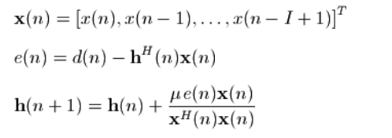

自适应滤波器系数h是一个长度为I的矢量，也就是一个长度为I的FIR滤波器。\
在时刻n，滤波器的每个系数对应的输入信号为x(n)，它也是一个长度为I的矢量。\
这两个矢量的点乘即为滤波器的输出，和目标信号d(n)之间的差为e(n)，\
然后根据e(n)和 x(n)，更新滤波器的系数。\
其中h(n)是权向量过去的值，h(n+1)是更新值。

数学公式总是令人难以理解的，下面我们以图示为例进行说明：

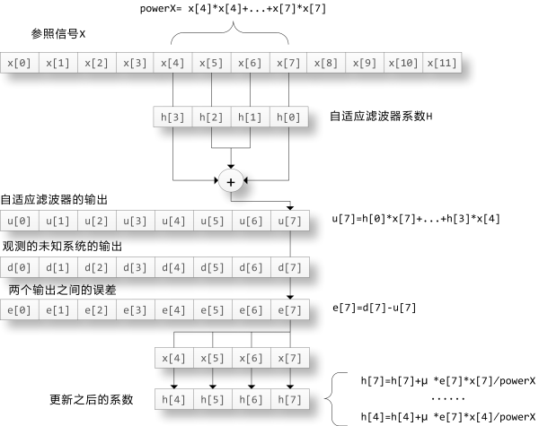

图中假设自适应滤波器h的长度为4，在时刻7滤波器的输出为

.. code-block:: python
    :linenos:

    u[7] = h[0]*x[7] + h[1]*x[6] + h[2]*x[5] + h[3]*x[4]

滤波器的输入信号的平方和powerX为：

.. code-block:: python
    :linenos:

    powerX = x[4]*x[4] + x[5]*x[5] + x[6]*x[6] + x[7]*x[7]

未知系统的输出d[7]和滤波器的输出u[7]之间的差为：

.. code-block:: python
    :linenos:

    e[7] = d[7] - u[7]

滤波器系数更新：

.. code-block:: python
    :linenos:

    h[4] = h[4] + u * e[7]*x[4]/powerX
    h[5] = h[5] + u * e[7]*x[5]/powerX
    h[6] = h[6] + u * e[7]*x[6]/powerX
    h[7] = h[7] + u * e[7]*x[7]/powerX    

其中参数u成为更新系数，为0到1之间的一个实数，此值越大系数更新的速度越快。\
对于每个时刻i都需要进行上述的计算，因此滤波器的系数对于每个参照信号x的取样都更新一次。

2.7.2.2 用python实现NLMS
```````````````````````````````````````

.. code-block:: python
    :linenos:

    import numpy as np

    # 用Numpy实现的NLMS算法
    # x为参照信号，d为目标信号(未知系统输出)，h为自适应滤波器的初值
    # step_size为更新系数
    def nlms(x, d, h, step_size=0.5):
    i = len(h)  #滤波器长度
    size = len(x) #参照信号长度
    # 计算输入到h中的参照信号的乘方和
    power = np.sum( x[i:i-len(h):-1] * x[i:i-len(h):-1] )
    u = np.zeros(size, dtype=np.float64) #自适应滤波器的输出

    while True:
        x_input = x[i:i-len(h):-1] #卷积要倒过来
        u[i] = np.dot(x_input , h)
        e = d[i] - u[i]
        h += step_size * e / power * x_input #更新系数

        power -= x_input[-1] * x_input[-1] # 减去最早的取样
        i+=1
        if i >= size: 
            return u
        power += x[i] * x[i] # 增加最新的取样  

为了节省计算时间，我们用一个临时变量power保存输入到滤波器h中的参照信号x的能量。\
在对于x中的每个取样的循环中，power减去x中最早的一个取样值的乘方，增加最新的一个取样值的乘方。\
这样为了计算参照信号的能量，每次循环只需要计算两次乘法和两次加法即可。

nlms函数的输入为参照信号x、目标信号d和自适应滤波器的系数h。\
因为在后面的模拟计算中，d是x和未知系统的脉冲响应的卷积而计算的来，它的长度会大于x的参数，\
因此循环体的循环次数以参照信号的长度为基准。

为了对自适应滤波器的各种应用进行模拟，我们还需要如下的几个辅助函数：

传递路径产生：

.. code-block:: python
    :linenos:

    def make_path(delay, length):
        path_length = length - delay
        h = np.zeros(length, np.float64)
        h[delay:] = np.random.standard_normal(path_length) * np.exp( np.linspace(0, -4, path_length) )
        h /= np.sqrt(np.sum(h*h))
        return h    

make_path产生一个长度为length，最小延时为delay的指数衰减的波形。\
这种波形和封闭空间的声音的传递函数有些类似之处，因此在计算机上进行声音的算法模拟时经常用这种波形作为系统的传递函数。

收敛绘制

.. code-block:: python
    :linenos:

    def plot_converge(y, u, label=""):
        size = len(u)
        avg_number = 200
        e = np.power(y[:size] - u, 2)
        tmp = e[:int(size/avg_number)*avg_number]
        tmp.shape = -1, avg_number
        avg = np.average( tmp, axis=1 )
        pl.plot(np.linspace(0, size, len(avg)), 10*np.log10(avg), linewidth=2.0, label=label)

    def diff_db(h0, h):
    return 10*np.log10(np.sum((h0-h)*(h0-h)) / np.sum(h0*h0))    

plot_converge绘制信号y和信号u之间的误差，每avg_number个取样点就上一次误差的乘方的平均值。\
我们将用plot_converge函数绘制未知系统的输出y和自适应滤波器的输出u之间的误差。\
观察自适应滤波器是如何收敛的，以评价自适应滤波器的收敛特性。\
diff_db函数同样是用来评价自适应滤波器的收敛特性，不过他是直接计算未知系统的传递函数h0和自适应滤波器的传递函数h之间的误差。\
下面我们会看到这两个函数得到的收敛值是相同的。

2.7.2.3 NLMS与LMS
```````````````````````````````````````

LMS算法步骤：

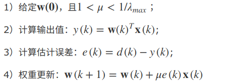

NLMS算法步骤：

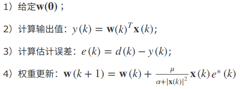

从算法步骤上看，NLMS和LMS的差距在于权重更新的方法不一样。

2.7.3 使用python实现系统辨识
--------------------------------------

我们用下面的函数调用nlms算法对系统辨识应用进行模拟：

.. code-block:: python
    :linenos:

    def sim_system_identify(nlms, x, h0, step_size, noise_scale):
        y = np.convolve(x, h0)
        d = y + np.random.standard_normal(len(y)) * noise_scale # 添加白色噪声的外部干扰
        h = np.zeros(len(h0), np.float64) # 自适应滤波器的长度和未知系统长度相同，初始值为0
        u = nlms( x, d, h, step_size )
        return y, u, h

    '''
    此函数的参数分别为：
    nlms : nlms算法的实现函数
    x : 参照信号
    h0 : 未知系统的传递函数，虽然是未知系统，但是计算机模拟时它是已知的
    step_size : nlms算法的更新系数
    noise_scale : 外部干扰的系数，此系数决定外部干扰的大小，0表示没有外部干扰 
        
    函数的返回值分别为：
    y : 未知系统的输出，不包括外部干扰
    u : 自适应滤波器的输出
    h : 自适应滤波器的最终的系数  
    '''   

.. code-block:: python
    :linenos:

    # -*- coding: utf-8 -*-
    import numpy as np
    import pylab as pl
    import time

    # 用Numpy实现的NLMS算法
    # x为参照信号，d为目标信号，h为自适应滤波器的初值
    # step_size为更新系数
    def nlms(x, d, h, step_size=0.5):
        i = len(h)    #256 
        size = len(x) #10000
        # 计算输入到h中的参照信号的乘方和
        power = np.sum( x[i:i-len(h):-1] * x[i:i-len(h):-1] )
        #x[255]...x[0]的乘方和
        u = np.zeros(size, dtype=np.float64)  
        #自适应滤波器输出
        while True:
            x_input = x[i:i-len(h):-1]  #x[255]...x[0]
            u[i] = np.dot(x_input , h)  #u[256] = x[255]*h[0]+x[254]*h[1]...x[0]*h[255]
                                        #u[257] = x[256]*h[0]+x[255]*h[1]...x[1]*h[255] 
            e = d[i] - u[i] #d[256]-u[256]
            h += step_size * e / power * x_input #nlms更新自使用滤波器参数

            power -= x_input[-1] * x_input[-1] # 减去最早的取样 
            i+=1
            if i >= size:
                return u
            power += x[i] * x[i] # 增加最新的取样

    #make_path产生一个长度为length，最小延时为delay的指数衰减的波形。这种波形和封闭空间的声音的传递函数有些类似之处，因此在计算机上进行声音的算法模拟时经常用这种波形作为系统的传递函数。
    def make_path(delay, length):
        path_length = length - delay
        h = np.zeros(length, np.float64)
        h[delay:] = np.random.standard_normal(path_length) * np.exp( np.linspace(0, -4, path_length) )
        h /= np.sqrt(np.sum(h*h))
        return h

    def plot_converge(y, u, label=""):
        size = len(u)
        avg_number = 200
        e = np.power(y[:size] - u, 2)
        tmp = e[:int(size/avg_number)*avg_number]
        tmp.shape = -1, avg_number
        avg = np.average( tmp, axis=1 )
        pl.plot(np.linspace(0, size, len(avg)), 10*np.log10(avg), linewidth=2.0, label=label)

    def diff_db(h0, h):
        return 10*np.log10(np.sum((h0-h)*(h0-h)) / np.sum(h0*h0))

    def sim_system_identify(nlms, x, h0, step_size, noise_scale):
        y = np.convolve(x, h0)
        d = y + np.random.standard_normal(len(y)) * noise_scale # 添加白色噪声的外部干扰
        h = np.zeros(len(h0), np.float64) # 自适应滤波器的长度和未知系统长度相同，初始值为0
        u = nlms(x, d, h, step_size)
        return y, u, h

    def system_identify_test1():
        h0 = make_path(32, 256) # 随机产生一个未知系统的传递函数
        x = np.random.standard_normal(10000)  # 参照信号为白噪声
        y, u, h = sim_system_identify(nlms, x, h0, 0.5, 0.1)
        print(diff_db(h0, h))
        
        pl.figure( figsize=(8, 8) ) 
        
        pl.subplot(311)
        pl.subplots_adjust(hspace=0.4)
        pl.plot(h0, c="r")
        pl.plot(h, c="b")
        pl.title("H compare")
        pl.subplot(312)
        pl.plot(y[0:10000])
        pl.plot(u)
        pl.title("output compare")
        pl.subplot(313)
        plot_converge(y, u)
        pl.title("Converge")
        pl.xlabel("Iterations (samples)")
        pl.ylabel("Converge Level (dB)")
        
        pl.show()

    system_identify_test1()        

生成的结果如下图：

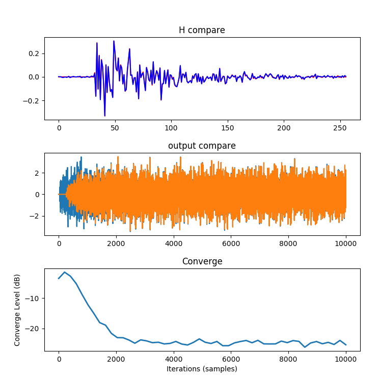

下面来分析下结果：

* 第一个图显示的是未知系统(红色)和自适应滤波器(蓝色)的传递函数的值，\
  我们看到自适应滤波器已经十分接近未知系统了。diff_db(h0, h)的输出为-25.35dB。

* 第二个图显示的实际输出(蓝色)和自适应滤波器输出(橙色)的值。

* 第三个图通过绘制y和u之间的误差，显示了自适应滤波器的收敛过程。\
  我们看到经过约3000点的计算之后，收敛过程已经饱和，最终的误差为-25dB左右，和diff_db计算的结果一致。

从图中可以看到收敛过程的两个重要特性：收敛时间和收敛精度。\
参照信号的特性、外部干扰的大小和更新系数都会影响这两个特性。\
下面让我们看看参照信号为白色噪声、外部干扰的能量固定时，更新系数对它们影响：  

.. code-block:: python
    :linenos:

    def system_identify_test2():
        h0 = make_path(32, 256) # 随机产生一个未知系统的传递函数
        x = np.random.standard_normal(20000)  # 参照信号为白噪声
        pl.figure(figsize=(8,4))
        for step_size in np.arange(0.1, 1.0, 0.2):
            y, u, h = sim_system_identify(nlms, x, h0, step_size, 0.1)
            plot_converge(y, u, label=u"μ=%s" % step_size)
        pl.xlabel("Iterations (samples)")
        pl.ylabel("Converge Level (dB)")
        pl.legend()
        pl.show()

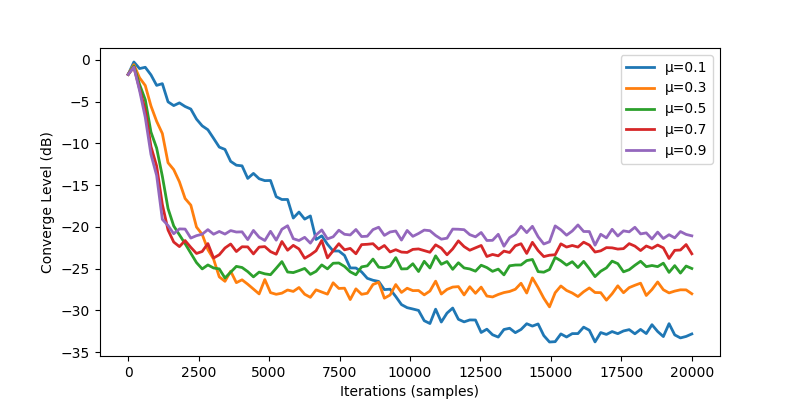

2.7.4 使用python进行噪声消除
--------------------------------------

.. code-block:: python
    :linenos:

    # -*- coding: utf-8 -*-
    import scipy.signal as signal
    import numpy as np
    import pylab as pl
    import time

    # 用Numpy实现的NLMS算法
    # x为参照信号，d为目标信号，h为自适应滤波器的初值
    # step_size为更新系数
    def nlms(x, d, h, step_size=0.5):
        i = len(h)    
        size = len(x) 
        # 计算输入到h中的参照信号的乘方和
        power = np.sum( x[i:i-len(h):-1] * x[i:i-len(h):-1] )
        u = np.zeros(size, dtype=np.float64)  
        #自适应滤波器输出
        while True:
            x_input = x[i:i-len(h):-1]  
            u[i] = np.dot(x_input , h)  
            e = d[i] - u[i] 
            h += step_size * e / power * x_input #nlms更新自使用滤波器参数 每计算一个点就进行更新
            power -= x_input[-1] * x_input[-1] # 减去最早的取样 
            i+=1
            if i >= size:
                return u
            power += x[i] * x[i] # 增加最新的取样

    def sim_signal_noiseReduce(nlms, x, D, step_size, noise_scale):
        x += np.random.standard_normal(len(x)) * noise_scale
        d  = x[D:]
        d_ = x[:-D]
        h = np.zeros(2*D, np.float64) #自适应滤波器系数
        u = nlms(d_, d, h, step_size)   #未知系统的输出通过一个自适应滤波器和d逼近
        return h,u  #返回自适应滤波器系数

    def signal_noiseReduce_test1():
        t = np.arange(0, 1.0, 1.0/8000) 
        data = np.sin(2*np.pi*200*t)+np.random.standard_normal(8000)

        h,u = sim_signal_noiseReduce(nlms, data, 128, 0.5, 0)

        pl.figure(figsize=(12,10))

        pl.subplot(211)
        pl.plot(data, label=u"orgin")
        pl.plot(u, label=u"noiseReduce")
        pl.xlim(0,1000)
        pl.title(u"signal equation")
        pl.legend()
        
        pl.subplot(212)
        fft_size = 400
        fs = 8000
        freqs = np.linspace(0, fs, fft_size) 
        dataX = data[fft_size:fft_size+fft_size]
        dataFs = np.fft.fft(dataX)
        uX = u[fft_size:fft_size+fft_size]
        uFs = np.fft.fft(uX)
        pl.plot(freqs, np.abs(dataFs))
        pl.plot(freqs, np.abs(uFs))
        pl.xlim(0,4000)

        pl.show()

        
    signal_noiseReduce_test1()    

生成的结果如下：

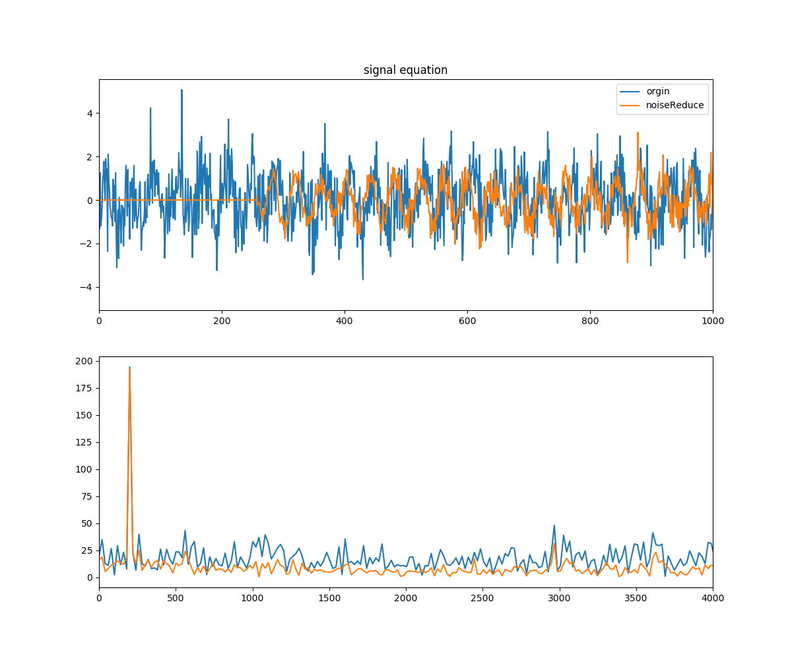

第一个图显示的是原始信号（蓝色）和去噪信号（橙色），可以发现正弦波变的更清晰了。     \
第二个显示的原始信号（蓝色）和去噪信号（橙色）的频率响应，可以发现其他频率的响应变小了。

2.7.5 使用python进行信号均衡
--------------------------------------

未知系统在信号均衡中可以理解为信道，信号在传输过程中会发生变形。\
对于信号均衡的应用我们用如下的程序进行模拟：

.. code-block:: text
    :linenos:
    
    def sim_signal_equation(nlms, x, h0, D, step_size, noise_scale):
        d = x[:-D]
        x = x[D:]
        y = np.convolve(x, h0)[:len(x)]
        h = np.zeros(2*len(h0)+2*D, np.float64)
        y += np.random.standard_normal(len(y)) * noise_scale
        u = nlms(y, d, h, step_size)
        return u，h

    '''
    sim_signal_equation函数的参数：
    nlms : nlms算法的实现函数
    x : 未知系统的输入信号
    h0 : 未知系统的传递函数
    D : 延迟器的延时参数
    step_size : nlms算法的更新系数
    noise_scale : 外部干扰的系数，此系数决定外部干扰的大小，0表示没有外部干扰
        
    在函数中的各个局部变量：
    d : 输入信号经过延迟器之后的信号
    y : 未知系统的输出
    h : 自适应滤波器的系数，它的长度要足够长，程序中使用 2倍延时 + 2倍未知系统的传递函数的长度
    u : 自适应滤波器输出
    '''    

.. code-block:: python
    :linenos:

    # -*- coding: utf-8 -*-
    import scipy.signal as signal
    import numpy as np
    import pylab as pl
    import time

    # 用Numpy实现的NLMS算法
    # x为参照信号，d为目标信号，h为自适应滤波器的初值
    # step_size为更新系数
    def nlms(x, d, h, step_size=0.5):
        i = len(h)    
        size = len(x) 
        # 计算输入到h中的参照信号的乘方和
        power = np.sum( x[i:i-len(h):-1] * x[i:i-len(h):-1] )
        u = np.zeros(size, dtype=np.float64)  
        #自适应滤波器输出
        while True:
            x_input = x[i:i-len(h):-1]  
            u[i] = np.dot(x_input , h)  
            e = d[i] - u[i] 
            h += step_size * e / power * x_input #nlms更新自使用滤波器参数 每计算一个点就进行更新
            power -= x_input[-1] * x_input[-1] # 减去最早的取样 
            i+=1
            if i >= size:
                return u
            power += x[i] * x[i] # 增加最新的取样

    #make_path产生一个长度为length，最小延时为delay的指数衰减的波形。这种波形和封闭空间的声音的传递函数有些类似之处，因此在计算机上进行声音的算法模拟时经常用这种波形作为系统的传递函数。
    def make_path(delay, length):
        path_length = length - delay
        h = np.zeros(length, np.float64)
        h[delay:] = np.random.standard_normal(path_length) * np.exp( np.linspace(0, -4, path_length) )
        h /= np.sqrt(np.sum(h*h))
        return h

    def sim_signal_equation(nlms, x, h0, D, step_size, noise_scale):
        #输入x的长度20128
        d = x[:-D]   #x[0]~x[20000]
        x = x[D:]    #x[128]~x[20128]
        #d和x长度一样，d向前平移了128
        y = np.convolve(x, h0)[:len(x)]  #x通过未知系统的输出
        h = np.zeros(2*len(h0)+2*D, np.float64) #自适应滤波器系数
        y += np.random.standard_normal(len(y)) * noise_scale #添加干扰信号
        u = nlms(y, d, h, step_size)   #未知系统的输出通过一个自适应滤波器和d逼近
        return h,u  #返回自适应滤波器系数

    def signal_equation_test1():
        h0 = make_path(5, 64)      #未知系统的传递函数  h0长度64
        D = 128                    #延时
        length = 20000
        data = np.random.standard_normal(length+D)  #输入数据 长度20128
        
        h,u = sim_signal_equation(nlms, data, h0, D, 0.5, 0.1)

        pl.figure(figsize=(12,10))

        pl.subplot(211)
        pl.plot(data, label=u"orgin")
        pl.plot(u, label=u"equation")
        pl.title(u"signal equation")
        pl.xlim(500,700)
        pl.legend()
        
        pl.subplot(212)
        w0, H0 = signal.freqz(h0, worN = 1000)
        w, H = signal.freqz(h, worN = 1000)
        pl.plot(w0, 20*np.log10(np.abs(H0)), w, 20*np.log10(np.abs(H)))
        pl.title(u"freqz")
        pl.xlabel(u"圆频率")
        pl.ylabel(u"振幅(dB)")
        pl.show()

    signal_equation_test1()        

生成的结果如下：

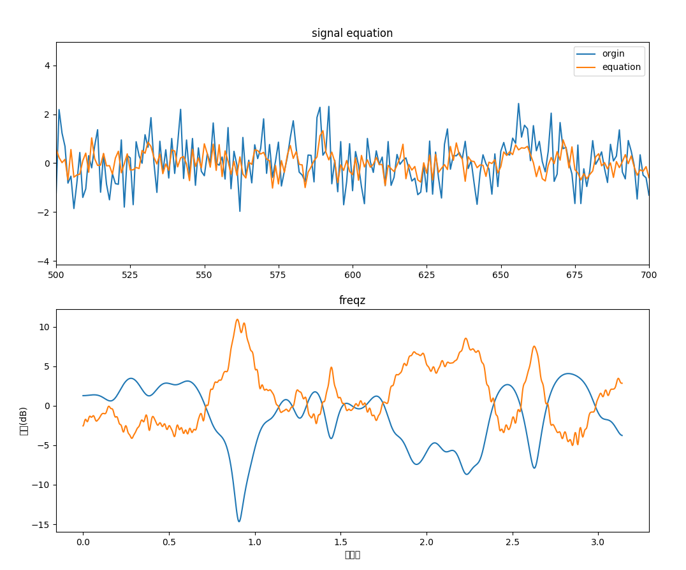

输入的数据为20128个，那么经过信号均衡，由于延时的存在，输出为20000个。而且滤波计算要从输入数据的第128个开始。 \
图1表示输入数据（蓝色）和均衡后的数据（橙色）。\
图2表示两个系统（未知系统和自适应滤波器）的频率响应，我们看到二者正好相反，也就是说自适应滤波器均衡了未知系统对信号的影响。
