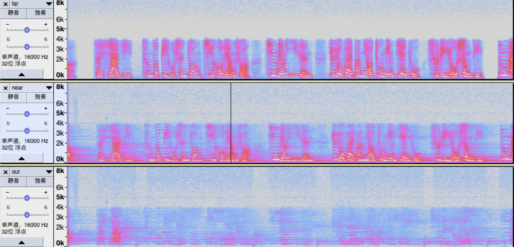
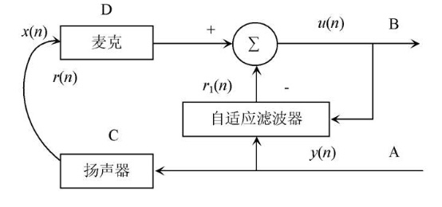
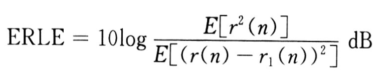
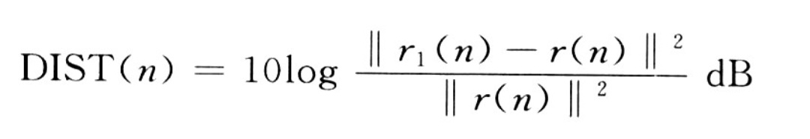

3.1 简易的C语言框架
======================================

3.1.1 AEC框架图
--------------------------------------

.. code-block:: text
    :linenos:

            +--+         +            +---+
    Sin -->---|HP|--+------->(+)----+-->|NLP|--->-- Sout
            +--+  |        /|\    |   +---+
                    |        -|     |
                    \|/        |     |
                +---+     +----+  |
                |DTD|---->|NLMS|<-+
                +---+     +----+
                    /|\       /|\
                    |         |
                    |         |
    Rout -<---------+---------+-----------------<-- Rin

    AEC block diagram. 
    Sin is the microphone signal, 
    Rout and Rin is the loudspeaker signal. 
    Sout is the echo-cancelled microphone signal.

3.1.2 High Pass Filter高通滤波器
--------------------------------------

3.1.2.1 高通滤波器实现
```````````````````````````````````````

IIR低通滤波器可以通过指数平滑法（exponential smoothing）来实现，指数平滑法的方程式如下：  

.. code-block:: text
    :linenos:

    y[n+1] = (1-alpha) * y[n] + alpha * x[n+1]

    with x[n+1] is the actual measurement value,
    y[n] is the previous smoothed or lowpass-filtered value,
    y[n+1] is the actual smoothed value,
    alpha is the smoothing constant or slowly changeing variable, determining the transfer frequency.    

这个方程做一些变形，和下面的方程等效。

.. code-block:: text
    :linenos:

    y[n+1] += alpha*(x[n+1] - y[n])    

如果想要将低通滤波器转换为高通滤波器，假设

.. code-block:: text
    :linenos:

    highpass = signal - lowpass    

低通滤波器的表达式为：

.. code-block:: text
    :linenos:

    lowpassf[i+1] += AlphaHp*(in[i+1] - lowpassf[i])

那么高通滤波器的表达式则为：

.. code-block:: text
    :linenos:

    highpassf[i+1] = in[i+1] - lowpassf[i+1]    

这种方法只能在当前频率下获得3dB的衰减，如果想获得更好的效果，需要进行多次滤波操作。

3.1.2.2 直流分量滤波器实现
```````````````````````````````````````

.. code-block:: c
    :linenos:

    /* Exponential Smoothing or IIR Infinite Impulse Response Filter */
    class IIR_HP {
    float lowpassf;
    float alphaTF;  /* controls Transfer Frequency */

    public:
    IIR_HP() {
        lowpassf = 0.0f;
        alphaTF = 0.0f;
    }

    void init(float alphaTF_) {
        alphaTF = alphaTF_;
    }

    float highpass(float in) {
        /* Highpass = Signal - Lowpass. Lowpass = Exponential Smoothing */
        lowpassf += alphaTF*(in - lowpassf);
        return in - lowpassf;
    }
    };

    /* alphaTF为0.01时，10hz直流分量滤波器*/

3.1.2.3 300HZ高通滤波器实现
```````````````````````````````````````

.. code-block:: python
    :linenos:

    #define POL       6           /* -6dB attenuation per octave per Pol */

    class IIR_HP6 {
    float lowpassf[2*POL+1];
    float highpassf[2*POL+1];

    public:
    IIR_HP6();
    float highpass(float in) {
        const float AlphaHp6 = 0.075; /* controls Transfer Frequency */
        const float Gain6   = 1.45f;  /* gain to undo filter attenuation */

        highpassf[0] = in;
        int i;
        for (i = 0; i < 2*POL; ++i) {
        /* Highpass = Signal - Lowpass. Lowpass = Exponential Smoothing */
        lowpassf[i+1] += AlphaHp6*(highpassf[i] - lowpassf[i+1]);
        highpassf[i+1] = highpassf[i] - lowpassf[i+1];
        }
        return Gain6*highpassf[2*POL];
    }
    };

    /*The above two formulas give an attenuation of 3dB below the transfer
    frequency. To get steeper filters, we use 12 stages. The signal
    to be "highpassed" is feed in as highpassf[0]. The result is in
    highpassf[12]. Because the filter attenuates the signal above transfer
    frequency, a amplification constant of 1.45 or 3.2dB is used.
    The value for AlphaHp for a 300Hz highpass filter was found empirically.
    */

3.1.3 双讲判断Geigel Double Talk Detector
----------------------------------------------------------------------------

依靠麦克风信号和扬声器信号的幅度可以进行双讲判断，尽管不是很准确。

.. code-block:: text
    :linenos:
    
    The last L levels (index 0 for now and index L-1 for L samples ago) 
    from loudspeaker signal are compared to the actual microphone signal. 
    To avoid problems with phase, the absolute values are used.
    Double talk is declared if:

    |d| >= c * max(|x[0]|, |x[1]|, .., |x[L-1]|)

    with |d| is the absolute level of actual microphone signal,
    c is a threshold value (typical value 0.5 for -6dB or 0.71 for -3dB),
    |x[0]| is the absolute level of actual loudspeaker signel,
    |x[L-1]| is the absolute level of loudspeaker signal L samples ago.

    See references 3, 7, 9. 

对应的代码如下：

.. code-block:: c
    :linenos:

    #define NLMS_LEN  (240*8)   /* maximum NLMS filter length in taps */
    #define DTD_LEN 16          // block size in taps to optimize DTD calculation

    float max_x[NLMS_LEN/DTD_LEN];  // optimize: less calculations for max() 120个段

    //d 麦克风信号
    //x 参考信号
    int AEC::dtd(float d, float x)
    {
        // optimized implementation of max(|x[0]|, |x[1]|, .., |x[L-1]|):
        // calculate max of block (DTD_LEN values)
        //分成128组 每组存储最近的16个值的最大值
        x = fabsf(x);
        if (x > max_x[dtdNdx]) {
            max_x[dtdNdx] = x;
            if (x > max_max_x) {
            max_max_x = x;
            }
        }
        //每统计完16个数据，比较128个组中的最大值
        if (++dtdCnt >= DTD_LEN) {
            dtdCnt = 0;
            // calculate max of max
            max_max_x = 0.0f;
            for (int i = 0; i < NLMS_LEN/DTD_LEN; ++i) {
            if (max_x[i] > max_max_x) {
                max_max_x = max_x[i];
            }
            }
            // rotate Ndx
            if (++dtdNdx >= NLMS_LEN/DTD_LEN) 
            dtdNdx = 0;
            max_x[dtdNdx] = 0.0f;
        }

        // The Geigel DTD algorithm with Hangover timer Thold
        // 双讲判定
        if (fabsf(d) >= GeigelThreshold * max_max_x) {
            hangover = Thold;  //当发现有双讲时，应该保持一会这个双讲状态
        }

        if (hangover) --hangover;

        if (max_max_x < UpdateThreshold) {
            // avoid update with silence or noise
            // 当麦克风信号没有大于一定值时，认为不需要更新滤波器
            return 1;
        } 
        else {
            return (hangover > 0);
        }
    }    

3.1.4  NLMS Pre-Whitening Filter
----------------------------------------------------------------------------

NLMS-pw, NLMS and LMS都属于基于梯度下降的算法，这种算法的好处是简单并且鲁棒性好。
首先，我们来看下回声消除的公式：

.. code-block:: text
    :linenos:

    e = d - X' * W
    This formula is used to subtract the (from the loudspeaker signal) 
    estimated microphone signal from the real microphone signal.
    with e is the linear error signal or echo-cancelled microphone signal,
    d is the desired signal or the microphone signal with echo,
    X' is the transpose of the loudspeaker signals vector,
    W is the adaptive weights vector.

如果能寻找到一个合适的W，回声消除的效果就能很好，但是由于各种原因，\
W并不能很好的被学习到。例如：周围存在的声音和噪声，系统内部信号的放大带来的噪声，\
扬声器带来的非线性，麦克风在学习的时候存在一些负面的影响。

LMS的计算公式如下：

.. code-block:: text
    :linenos:

    W[n+1] = W[n] + 2*mikro*e*X[n]
    
    with W[n+1] is the new adaptive weights vector,
    W[n] is the previous adaptive weights vector,
    mikro is the step size constant or variable,
    e is the error signal
    X[n] is the loudspeaker signals vector.

LMS的计算非常简单，W的更新依赖mikro * e。这种固定变化的方法常常不能获得一个很好的学习速率。\
NLMS改进了LMS的缺点，采用了一个可变的学习速率。

.. code-block:: text
    :linenos:

              1
    mikro = ------
            X' * X

    with X' is the transpose of the loudspeaker signals vector,
    X is the loudspeaker signals vector.
    Note: The vector dot product is a scalar. It is the sum of the element-wise
    multiplication of both vectors.
    
    The constant value 2 in the LMS formula changes into a stability "tuneing"
    constant. For stable adaptation this constant should be between 0 and 2,
    this NLMS-pw uses a value of 0.5.

NLMS-pw的计算公式如下：

.. code-block:: text
    :linenos:

    ef = highpass(e)
    Xf = highpass(X)
    
              0.5
    mikro = --------
            Xf' * Xf
            
    W[n+1] = W[n] + mikro*ef*Xf[n]
    
    with ef is the highpass-filtered value of e,
    Xf is the highpass-filtered value of X,
    and the other values are as above.
    Both filters are 1. order FIR with a transfer frequency of 4000Hz.
    
    For other pre-whitening algorithms see references 6, 8, 9. For non-LMS
    echo cancellation algorithms see references 6 and 9.

由NLMS-pw的计算公式可以看出改动主要对e和X进行了高通滤波，原因如下：

.. code-block:: text
    :linenos:

    The filtered values are used because
    the NLMS converges best with white noise signals, 
    and human voice is not white noise.

NLMS-pw的代码如下：

.. code-block:: c
    :linenos:
      
    #define NLMS_LEN  (240*8)   /* maximum NLMS filter length in taps */
    #define NLMS_EXT  (10*8)    // Extention in taps to reduce mem copies

    float x[NLMS_LEN+NLMS_EXT];       // tap delayed loudspeaker signal
    float xf[NLMS_LEN+NLMS_EXT];      // pre-whitening tap delayed signal
    float w[NLMS_LEN];                // tap weights 滤波器长度1920

    j = NLMS_EXT;

    /* Vector Dot Product */
    float dotp(float a[], float b[]) {
        float sum0 = 0.0, sum1 = 0.0;
        int j;

        for (j = 0; j < NLMS_LEN; j+= 2) {
            // optimize: partial loop unrolling
            sum0 += a[j] * b[j];
            sum1 += a[j+1] * b[j+1];
        }
        return sum0+sum1;
    }

    float AEC::nlms_pw(float mic, float spk, int update)
    {
        float d = mic;                // desired signal
        x[j] = spk;
        xf[j] = Fx.highpass(spk);     // pre-whitening of x

        // calculate error value (mic signal - estimated mic signal from spk signal)
        // w[0]  w[1]  w[2]  w[3]  ... w[1919]
        // x[80] x[81] x[82] x[83] ... x[1919+80]
        float e = d - dotp(w, x + j);
        float ef = Fe.highpass(e);    // pre-whitening of e
        if (update) {
            if (lastupdate) {
                // 如果上一次更新了，求和不用每次都全部计算
                // 将这次新增的加上，上次最后一个减去
                // optimize: iterative dotp(xf, xf)
                dotp_xf_xf += (xf[j]*xf[j] - xf[j+NLMS_LEN-1]*xf[j+NLMS_LEN-1]);
            } else {
                dotp_xf_xf = dotp(xf+j, xf+j);
            }

            // calculate variable step size
            float mikro_ef = 0.5f * ef / dotp_xf_xf;

            // update tap weights (filter learning)
            int i;
            for (i = 0; i < NLMS_LEN; i += 2) {
                // optimize: partial loop unrolling
                w[i] += mikro_ef*xf[i+j];
                w[i+1] += mikro_ef*xf[i+j+1];
            }
        }
        lastupdate = update;

        //x存储的值往左存储
        if (--j < 0) {
            // 当x的index到最左边时，重新拷贝x[0]...x[1918]到x[81]...x[81+1919]
            // x[80]重新存储输入信号
            // 这里做nlms会将之前的信号也参与到计算过程中，好处是减轻参考信号和麦克风信号不对齐的现象
            // optimize: decrease number of memory copies
            j = NLMS_EXT;
            memmove(x+j+1, x, (NLMS_LEN-1)*sizeof(float));
            memmove(xf+j+1, xf, (NLMS_LEN-1)*sizeof(float));
        }

        return e;
    }

其中NLMS-pw中的FIR滤波器实现如下：

.. code-block:: c
    :linenos:

    void FIR1::init(float preWhiteTransferAlpha)
    {
        float x = exp(-2.0 * M_PI * preWhiteTransferAlpha);

        a0 = (1.0f + x) / 2.0f;
        a1 = -(1.0f + x) / 2.0f;
        b1 = x;
        last_in = 0.0f;
        last_out = 0.0f;
    }

    class FIR1 {
        float a0, a1, b1;
        float last_in, last_out;

        public:
        FIR1();
            void init(float preWhiteTransferAlpha);
        float highpass(float in)  {
            float out = a0 * in + a1 * last_in + b1 * last_out;
            last_in = in;
            last_out = out;

            return out;
        }
    };

    const float PreWhiteAlphaTF = (4000.0f/8000.0f);   /* FIR controls Transfer */
    FIR1 Fx, Fe;              // pre-whitening Highpass for x, e

    Fx.init(PreWhiteAlphaTF);
    Fe.init(PreWhiteAlphaTF);

3.1.5 简易的AEC C语言整体实现如下
--------------------------------------    

.. code-block:: c
    :linenos:

    int AEC::doAEC(int d, int x)
    {
        //d 麦克风信号
        //x 参考信号
        float s0 = (float)d;
        float s1 = (float)x;

        // Mic Highpass Filter - telephone users are used to 300Hz cut-off
        s0 = hp0.highpass(s0);

        // Spk Highpass Filter - to remove DC
        s1 = hp1.highpass(s1);

        // Double Talk Detector
        int update = !dtd(s0, s1);

        // Acoustic Echo Cancellation
        s0 = nlms_pw(s0, s1, update);

        // Acoustic Echo Suppression
        if (update) {
            // Non Linear Processor (NLP): attenuate low volumes
            s0 *= NLPAttenuation;
        }

        // Saturation
        if (s0 > MAXPCM) {
            return (int)MAXPCM;
        } else if (s0 < -MAXPCM) {
            return (int)-MAXPCM;
        } else {
            return (int)roundf(s0);
        }
    }

实际结果如下：



可以看出回声消除后还是存在残留回声，并不是很干净。

3.1.6 回声消除测试指标
--------------------------------------    



.. code-block:: text
    :linenos:

    y(n)参考信号
    r1(n)自适应滤波器输出信号
    r(n)扬声器播出的被麦克风采集到的声音
    x(n)近端语音信号
    μ(n)=x(n)+r(n)-r1(n) 近端送出去的信号
    e(n)=r(n)-r1(n)残留的回声误差

回声抵消效果一般还采用回声返回衰减增益(ERLE)来评价，其定义如下：



ERLE值越大，则表明回声抵消效果越好，一般要求ERLE≥6 dB。

失调也称为系统距离(DIST)，反映的是回声消除器中自适应FIR滤波器r1(n)对真实回声路径r(n)的逼近程度。其定义如下：



DIST值越低，表明自适应滤波器收敛性能越好。

3.1.7 回声消除测试指标
--------------------------------------

.. code-block:: text
    :linenos:

    [1] B. Widrow, M. E. Hoff Jr., "Adaptive switching circuits", Western
        Electric Show and Convention Record, Part 4, pages 96-104, Aug. 1960

    [2] B. Widrow, et al, "Stationary and Nonstationary Learning
        Characteristics of the LMS Adaptive Filter", Proc. of the IEEE, vol.64
        No. 8, pp. 1151-1162, Aug. 1976

    [3] D.L. Duttweiler, "A twelve-channel digital echo canceller", IEEE
        Trans. Commun., Vol. 26, pp. 647-653, May 1978

    [4] B. Widrow, S.D. Stearns, Adaptive Signal Processing, Prentice-Hall,1985

    [5] D. Messerschmitt, D. Hedberg, C. Cole, A. Haoui, P. Winship, "Digital
        Voice Echo Canceller with a TMS32020", Application report SPRA129,
        Texas Instruments, 1989

    [6] R. Storn, "Echo Cancellation Techniques for Multimedia Applications
        - a Survey", TR-96-046, International Computer Science Institute, 
        Berkeley, Nov. 1996

    [7] J. Nikolic, "Implementing a Line Echo Canceller using the block update
        and NLMS algorithms on the TMS320C54x DSP", Application report SPRA188,
        Texas Instruments, Apr. 1997

    [8] M. G. Siqueira, "Adaptive Filtering Algorithms in Acoustic Echo
        Cancellation and Feedback Reduction", Ph.D. thesis, University of
        California, Los Angeles, 1998

    [9] T. Gaensler, S. L. Gay, M. M. Sondhi, J. Benesty, "Double-Talk robust
        fast converging algorithms for network echo cancellation", IEEE trans.
        on speech and audio processing, vol. 8, No. 6, Nov. 2000

    [10] M. Hutson, "Acoustic Echo Cancellation using Digital Signal
        Processing", Bachelor of Engineering (Honours) thesis, The School of
        Information Technology and Electrical Engineering, The University of
        Queensland, Nov 2003

    [11] A. Adrian, "Audio Echo Cancellation", Free Software/Open Source
        Telephony Summit 2004, German Unix User Group, Geilenkirchen, Germany,
        Jan. 16-20, 2004