3.2 speex matlab代码分析
======================================

.. code-block:: text
    :linenos:

    对每个元素取复共轭, 
    符号：*
    对矩阵转置,
    符号：T 
    先对矩阵转置,再对每个元素取复共轭
    符号：H 

3.2.1 分段块频域自适应滤波器
--------------------------------------

经典的归一化最小均方算法(NLMS)，其计算复杂度随滤波器阶数线性增长 , \
在滤波器阶数很多时不适合于片上实时应用 ,并且对于语音这样的非平稳信号 , \
它没有稳定的收敛性。将计算变换到频域进行，引入快速傅里叶变换(FFT)和块处理 , \
将获得可观的计算量简化和更好的收敛性。这就是块频域自适应滤波器(BFDAF)。\
在处理长回声时 ,为了收集足够的处理数据 , BFDAF要带来巨大的处理延迟 , \
不适用于要求实时处理的场合。为了获得较小的延迟 , 在BFDAF基础上改进 , 得到了分段块频域自适应滤波器(PBFDAF)。

频域的NLMS的滤波操作是乘法，而时域的NLMS滤波操作是卷积。

3.2.1.1 频域自适应滤波器
```````````````````````````````````````

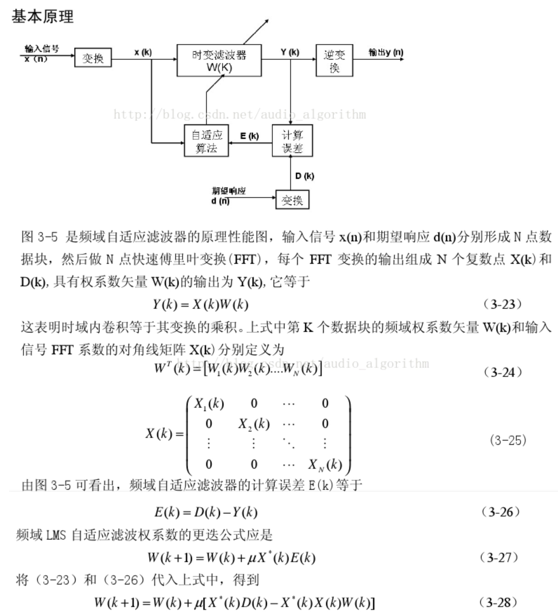

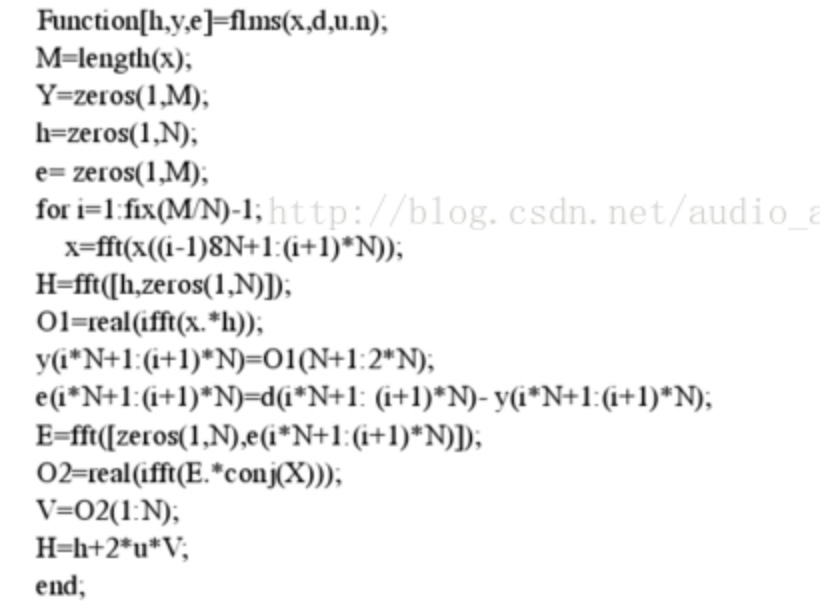

3.2.1.2 块自适应滤波器
```````````````````````````````````````

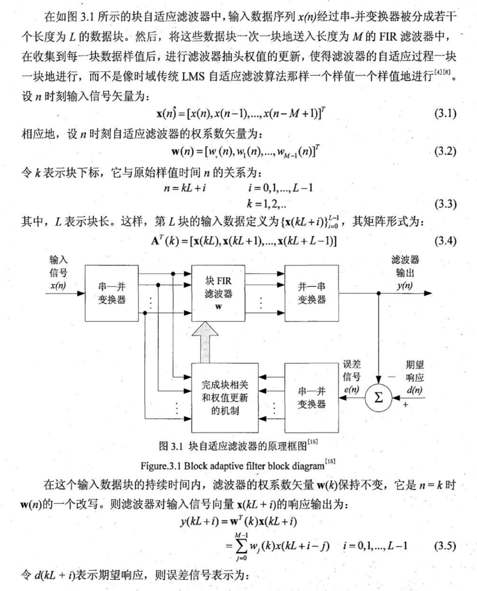

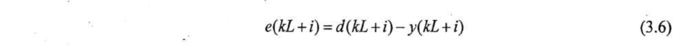

块长度的选择：

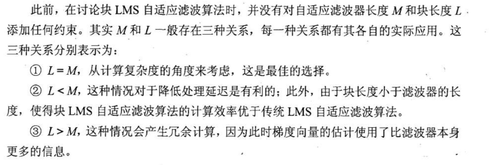

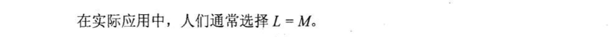

3.2.1.3 块频域自适应滤波器
```````````````````````````````````````

BFDAF block frequency domain adaptive filter

数字信号处理中，需要使用重叠相加法或重叠存储法在频域上进行长序列的计算。

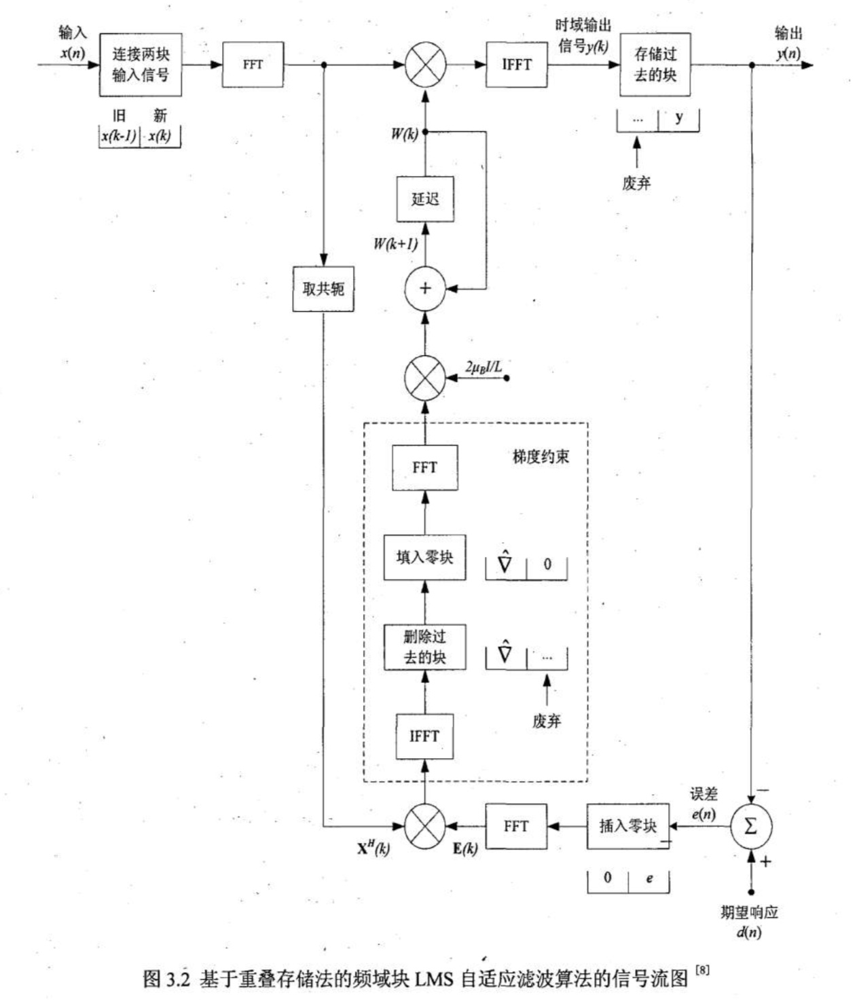

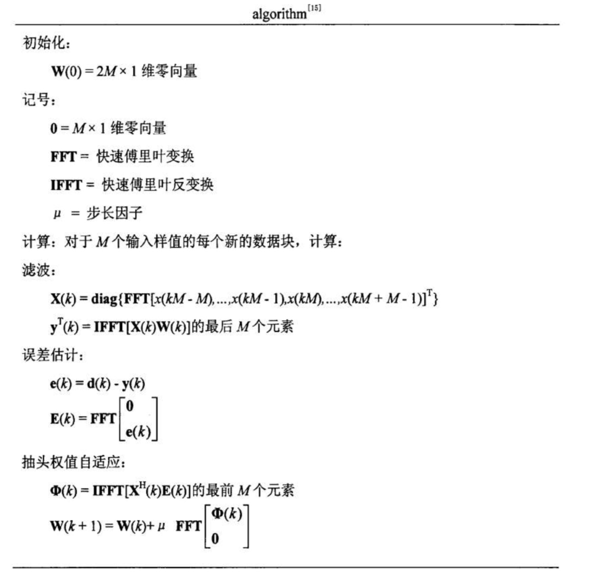

3.2.1.4 分段块频域自适应滤波器
```````````````````````````````````````

PBFDAF partitioned block frequency domain adaptive filter

将计算变换到频域中进行，由于傅里叶变换具有快速性, 如将其结合块进行处理，将大大简化计算量、复杂度、以及获得更好的收敛性能。

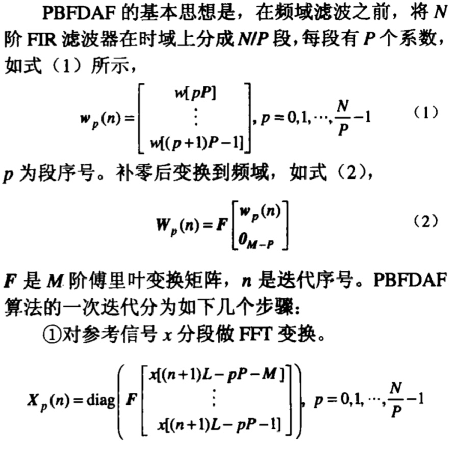

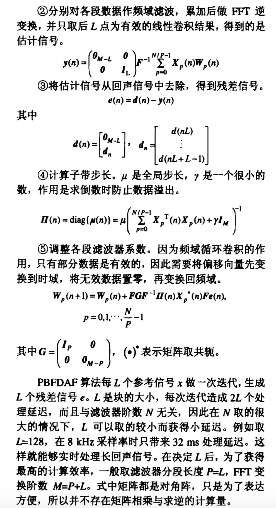

3.2.2 使用MDF进行回声消除
--------------------------------------

MDF全称Multidelay Block Frequency Domain Adaptive Filter ，是频域块滤波器的一种，不同的部分是MultiDelay部分。

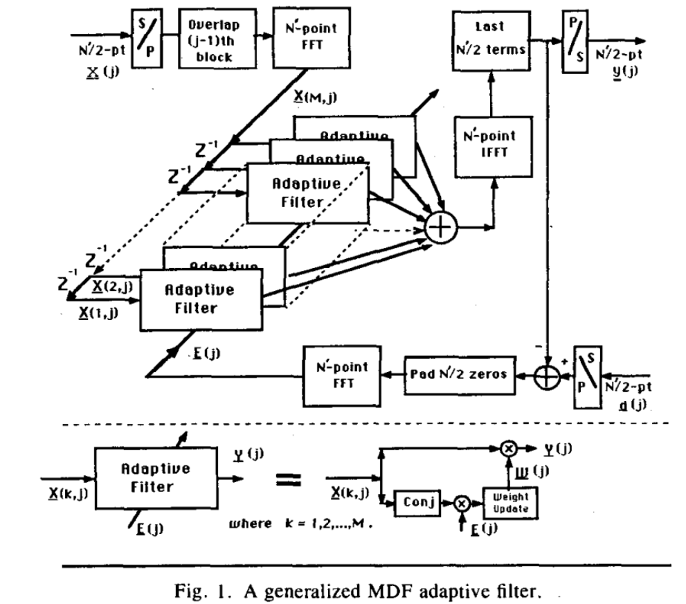

下面对MDF的matlab代码进行分析，了解使用MDF进行回声消除的基本原理。

假设滤波器块数量为32，长度为128，输入信号长度为128。

3.2.2.1 预处理
```````````````````````````````````````

对输入信号进行直流干扰去除和预加重。

(1)直流干扰滤除，speex中采用陷波处理，滤波系统函数：

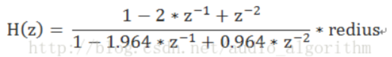

其中redius根据采样率的不同，取值有所不同。

.. code-block:: matlab
    :linenos:

    if (st.sampling_rate<12000)
        st.notch_radius = .9;
    elseif (st.sampling_rate<24000)
        st.notch_radius = .982;
    else
        st.notch_radius = .992;
    end

采样率为48KHz时，系统频响曲线为：

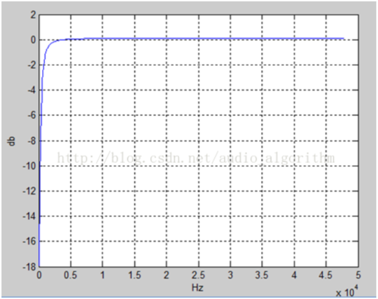

(2)预加重与去加重

设第n时刻的语音采样值为x(n)，经过预加重处理后的结果是 y(n)=x(n)-ax(n-1)。

去加重处理与预加重处理相反：y(n) = x(n) + ax(n-1)，其中a为加重系数，一般是0.9~1.0之间，speex取0.98。

.. code-block:: matlab
    :linenos:

    for chan = 1:C
        % Apply a notch filter to make sure DC doesn't end up causing problems
        % 麦克风录到的信号直流干扰去除 去掉直流干扰作用
        [st.input(:, chan), st.notch_mem(:, chan)] = filter_dc_notch16(in(:, chan), st.notch_radius, st.frame_size, st.notch_mem(:, chan));
        % Copy input data to buffer and apply pre-emphasis
        % 麦克风录到的信号预加重
        for i=1:st.frame_size
            tmp32 = st.input(i, chan)- (st.preemph* st.memD(chan));
            st.memD(chan) = st.input(i, chan);   % memD保存上一次的近端数据
            st.input(i, chan) = tmp32;
        end
    end

    % 远端信号 预加重 并进行overlap save操作组成256个字节
    for speak = 1:K
        for i =1:st.frame_size   %i=1~128
            % 上一个信号的后128个字节保存到当前信号的前128个字节中
            st.x(i, speak) = st.x(i+st.frame_size, speak);
            % 预加重
            tmp32 = far_end(i, speak) - st.preemph * st.memX(speak);
            % 这次的近端信号放在256个字节的后128个字节中
            st.x(i+st.frame_size, speak) = tmp32;
            st.memX(speak) = far_end(i, speak); %memX保存上一次的远端数据
        end
    end

3.2.2.2 multidelay block
```````````````````````````````````````

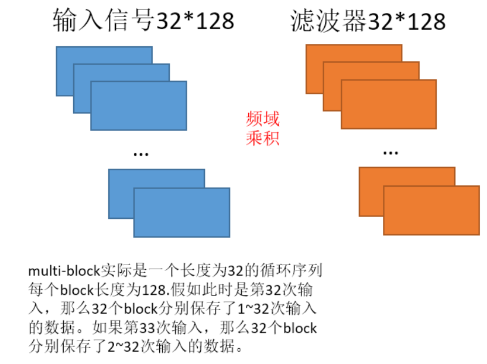

为什么需要这么设计，因为在回声消除中，播放信号和拾取信号存在一定的延时，不可能做到数据之间的对应，\
所以进行滤波器操作时就将最近的32个输入数据进行滤波器求解。另外语音属于非平稳信号，\
如果不选取附近的信号直接进行滤波器系数更新，很容易造成系数突变。

.. code-block:: matlab
    :linenos:

    st.X = circshift(st.X, [0, 0, 1]);

3.2.2.3 前景滤波器的频域滤波
```````````````````````````````````````

将远端信号进行FFT操作转换到频域，再乘以前景滤波器系数，得出前景滤波器输出和前景滤波器回声消除结果。

.. code-block:: matlab
    :linenos:

    for speak = 1:K
        %  Convert x (echo input) to frequency domain
        % MATLAB_MATCH: we divide by N to get values as in speex
        % 远端信号fft 256个点
        st.X(:, speak, 1) = fft(st.x(:, speak)) /N;
    end
    
    Sxx = 0;
    for speak = 1:K
        % Sxx 远端信号的能量和 因为需要支持立体声aec 所以需要将所有的能量和进行叠加
        % 256个字节的后128个字节
        Sxx = Sxx + sum(st.x(st.frame_size+1:end, speak).^2);
         % 傅里叶变换的前129个复数的模的平方 129*1 傅里叶变换的结果是对称的 所以只需129个复数就可以表示
        st.Xf = abs(st.X(1:st.frame_size+1, speak, 1)).^2;           
    end
    
    Sff = 0;
    % 每个麦克风做一次AEC计算 前景滤波器
    for chan = 1:C
        %  Compute foreground filter
        st.Y(:, chan) = 0;
        for speak=1:K
            for j=1:M
                % 假如播放是立体声的 那么对于麦克风而言 需要将多个参考信号进行计算并叠加
                % 32个滤波器  前景自适应滤波器  Y = Y+X*W
                st.Y(:, chan) = st.Y(:, chan) + st.X(:, speak, j) .* st.foreground(:, speak, j, chan);
            end
        end
        % MATLAB_MATCH: we multiply by N to get values as in speex
        % 傅里叶逆变换
        st.e(:, chan) = ifft(st.Y(:, chan)) * N;
        % 回声消除后的信号 期望信号-自适应滤波器生成信号
        st.e(1:st.frame_size, chan) = st.input(:, chan) - st.e(st.frame_size+1:end, chan);
        % st.e : [foreground回声消除后的信号 | foreground滤波器输出]
        % st.e : [out foreground | leak foreground ]
        % 回声消除后的信号的能量和
        Sff = Sff + sum(abs(st.e(1:st.frame_size, chan)).^2);

    end    

3.2.2.4 mdf_adjust_prop
```````````````````````````````````````    

.. code-block:: matlab
    :linenos:

    % Adjust proportional adaption rate */
    % 假如此时是收敛的
    % 使用mdf_adjust_prop计算背景滤波器各段的系数幅度之和，存放在prop( 这里进行了归一化处理）
    % st.prop 32*1矩阵
    if (st.adapted)
        st.prop = mdf_adjust_prop (st.W, N, M, C, K);
    end

3.2.2.5 后景滤波器参数更新
```````````````````````````````````````        

根据LMS算法更新后景滤波器参数。

.. code-block:: matlab
    :linenos:

    % Compute weight gradient */
    % 当不处于饱和状态时 进行滤波器系数更新
    % power_1 最优步长因子，具体可以参考Mader算法,与prop相乘得到最化步长 129*1
    % prop   为归一化后的背景滤波器各频率的系数幅度。与power_1相乘
    % X 为转换到频域后的远端信号
    % E 为转换到频域后的误差信号
    % PHI 输出结果：背景滤波器频域系数需要调整的量
    % LMS算法
    if (st.saturated == 0)
        for chan = 1:C
            for speak = 1:K
                for j=M:-1:1
                    st.PHI = [st.power_1; st.power_1(end-1:-1:2)] .* st.prop(j) .* conj(st.X(:, speak, (j+1))) .* st.E(:, chan);
                    st.W(:, j) = st.W(:, j) + st.PHI;
                end
            end
        end
    else
        st.saturated = st.saturated -1;
    end
    
    %FIXME: MC conversion required */
    % Update weight to prevent circular convolution (MDF / AUMDF)
    for chan = 1:C
        for speak = 1:K
            for j = 1:M
                % 每次只更新两个滤波器参数
                % This is a variant of the Alternatively Updated MDF (AUMDF) */
                % Remove the "if" to make this an MDF filter */
                % AUMDF处理白噪声不理想 但是语音信号差不多
                if (j==1 || mod(2+st.cancel_count,(M-1)) == j)  
                    % 防止循环卷积处理（重叠保留法变循环卷积为线性卷积，把相关块的FFT系数中的后半部分置为零）
                    st.wtmp = ifft(st.W(:, speak, j, chan));
                    st.wtmp(st.frame_size+1:N) = 0;
                    st.W(:, speak, j, chan) = fft(st.wtmp);
                end
            end
        end
    end    

3.2.2.6 后景滤波器频域滤波
``````````````````````````````````````` 

使用调整过的背景滤波器进行滤波，得到滤波后的输出。

.. code-block:: matlab
    :linenos:

    % 根据调整后的背景滤波器对远端信号再进行频域滤波处理
    for chan = 1:C
        st.Y(:, chan) = 0;
        for speak=1:K
            for j=1:M
                st.Y(:, chan) = st.Y(:, chan) + st.X(:, speak, j) .* st.W(:, speak, j, chan);
            end
        end
        % 滤波后的输出进行反变换，存到y
        % MATLAB_MATCH: we multiply by N to get values as in speex
        st.y(:,chan) = ifft(st.Y(:,chan)) * N;
        % st.y : [ ~ | leak background ]
    end

3.2.2.7 是否需要更新前景滤波器
``````````````````````````````````````` 

当前景滤波与背景滤波之间的误差较大时，需要更新前景滤波器。

.. code-block:: matlab
    :linenos:

    Dbf = 0;  % 前景滤波与背景滤波之间的误差
    See = 0;  % 后景滤波器误差的能量和 
    
    % Difference in response, this is used to estimate the variance of our residual power estimate */
    for chan = 1:C
        % 在时域计算两次滤波之间的误差及两次滤波之间误差的功率Dbf
        % st.e 后半部存储的是前景滤波的结果
        st.e(1:st.frame_size, chan) = st.e(st.frame_size+1:N, chan) - st.y(st.frame_size+1:N, chan);
        Dbf = Dbf + 10 + sum(abs(st.e(1:st.frame_size, chan)).^2);
        st.e(1:st.frame_size, chan) = st.input(:, chan) - st.y(st.frame_size+1:N, chan);
        % st.e : [ out background | leak foreground ]
        % 时域计算后景滤波器误差的能量和 也就是残余回声的能量和
       See = See + sum(abs(st.e(1:st.frame_size, chan)).^2);
    end
    
    % 利用Sff、See、Dbf来计算是否需要更新前景滤波器（总的来说，当Dbf值比较大时需要更新前景滤波器系数）
    % Logic for updating the foreground filter */
    
    % For two time windows, compute the mean of the energy difference, as well as the variance */
    VAR1_UPDATE = .5;
    VAR2_UPDATE = .25;
    VAR_BACKTRACK = 4;
    MIN_LEAK = .005;
    
    st.Davg1 = .6*st.Davg1 + .4*(Sff-See);
    st.Davg2 = .85*st.Davg2 + .15*(Sff-See);
    st.Dvar1 = .36*st.Dvar1 + .16*Sff*Dbf;
    st.Dvar2 = .7225*st.Dvar2 + .0225*Sff*Dbf;
    
    update_foreground = 0;
    
    % Check if we have a statistically significant reduction in the residual echo */
    % Note that this is *not* Gaussian, so we need to be careful about the longer tail */
    if (Sff-See)*abs(Sff-See) > (Sff*Dbf)
        update_foreground = 1;
    elseif (st.Davg1* abs(st.Davg1) > (VAR1_UPDATE*st.Dvar1))
        update_foreground = 1;
    elseif (st.Davg2* abs(st.Davg2) > (VAR2_UPDATE*(st.Dvar2)))
        update_foreground = 1;
    end

如果需要更新前景滤波器，则需要平滑前景和后景滤波器的输出结果，否则已前景滤波器为准。

.. code-block:: matlab
    :linenos:

    if (update_foreground)
                
        st.Davg1 = 0;
        st.Davg2 = 0;
        st.Dvar1 = 0;
        st.Dvar2 = 0;
        % 如果需要更新前景滤波器系数则把背景滤波器系数给前景滤波器
        st.foreground = st.W;
        % Apply a smooth transition so as to not introduce blocking artifacts */
        for chan = 1:C
            % st.y : [ ~ | leak background ]
            % st.e : [ out background | leak foreground ]
            % 平滑两个滤波器的输出 前景滤波器输出+后景滤波器输出 得到总的输出
            % 处理完 st.e [背景滤波器回声消除结果|总的滤波器输出]
            st.e(st.frame_size+1:N, chan) = (st.window(st.frame_size+1:N) .* st.e(st.frame_size+1:N, chan)) + (st.window(1:st.frame_size) .* st.y(st.frame_size+1:N, chan));
        
        end
    ...

3.2.2.8 最终回声结果
``````````````````````````````````````` 

麦克风录到的信号-总的滤波器输出 = 最终回声消除后的信号。

.. code-block:: matlab
    :linenos:

	for chan = 1:C
            
        % Compute error signal (for the output with de-emphasis) */
        for i=1:st.frame_size
            % 麦克风录到的信号-总的滤波器输出 = 最终回声消除后的信号
            tmp_out = st.input(i, chan)- st.e(i+st.frame_size, chan);
            % 去加重处理
            tmp_out = tmp_out + st.preemph * st.memE(chan);
            %  This is an arbitrary test for saturation in the microphone signal */
            if (in(i,chan) <= -32000 || in(i,chan) >= 32000)
                if (st.saturated == 0)
                    st.saturated = 1;
                end
            end
            % 最终输出保存到out
            out(i, chan) = tmp_out;
            st.memE(chan) = tmp_out;
        end
     ...    

3.2.2.9 最优步长因子
``````````````````````````````````````` 

speex的AEC是以NLMS为基础，用MDF频域实现，最终推导出最优步长估计：残余回声与误差之比。\
最优步长等于残余回声方差与误差信号方差之比。\
残余回声为没有消除干净的回声。也就是残余回声越大，收敛速度需要更快。\
这个最优步长因子其实兼顾了双讲的一些处理。\
对于长度为N的NLMS滤波器，误差信号定义为期望信号与估计信号之差，表示如下：

.. math:: 
    e(n) = d(n) - \hat y(n) = d(n) - \sum\limits_{k = 0}^{N - 1} {{{\hat w}_k}(n)x(n - k)}

则滤波器的系数更新方程为：

.. math:: 
    {\hat w_k}(n + 1) = {\hat w_k}(n) + \mu \frac{{e(n){x^*}(n - k)}}{{\sum\nolimits_{i = 0}^{N - 1} {|x(n - i){|^2}} }} = {\hat w_k}(n) + \mu \frac{{(d(n) - \sum\nolimits_i {{{\hat w}_i}(n)x(n - i)} ){x^*}(n - k)}}{{\sum\nolimits_{i = 0}^{N - 1} {|x(n - i){|^2}} }}

设滤波器的系数误差为：

.. math:: 
    {\delta _k}(n) = {\hat w_k}(n) - {w_k}(n)

且期望信号为本地（近端）语音+残余回声

.. math:: 
    d(n) = v(n) + \sum\nolimits_k {{w_k}(n)x(n - k)}

则滤波器的系数更新方程可以重写为:

.. math:: 
    {\delta _k}(n + 1) = {\delta _k}(n) + \mu \frac{{(v(n) - \sum\nolimits_i {{\delta _i}(n)x(n - i)} ){x^*}(n - k)}}{{\sum\nolimits_{i = 0}^{N - 1} {|x(n - i){|^2}} }}

如果每个时刻的失调定义为：

.. math:: 
    \Lambda (n) = \sum\nolimits_k {\delta _k^*(n){\delta _k}(n)}

那么，在每一步的迭代中，滤波器的失调可表示如下：

.. math:: 
    \Lambda (n + 1) = \sum\limits_{k = 0}^{N - 1} {|{\delta _k}(n) + \mu \frac{{(v(n) - \sum\nolimits_i {{\delta _i}(n)x(n - i)} ){x^*}(n - k)}}{{\sum\nolimits_{i = 0}^{N - 1} {|x(n - i){|^2}} }}{|^2}}

假设远端信号与近端信号为白噪声，且不相关。

.. math:: 
    \sigma _v^2 = E\{ |v(n){|^2}\}

为近端语音信号的方差，则失调的更新方程为：

.. math:: 
    E\{ \Lambda (n + 1)|\Lambda (n),x(n)\}  = \Lambda (n)\left[ {1 - \frac{{2\mu }}{N} + \frac{{{\mu ^2}}}{N} + \frac{{2{\mu ^2}\sigma _v^2}}{{\Lambda (n)\sum\nolimits_{i = 0}^{N - 1} {|x(n - i){|^2}} }}} \right]

这里失调函数

.. math:: 
    E\{ \Lambda (n + 1)|\Lambda (n),x(n)\}

为凸函数，对它关于步长求导，并置导数为0，可得：

.. math:: 
    \frac{{\partial E\{ \Lambda (n + 1)\} }}{{\partial \mu }} = \frac{{ - 2}}{N} + \frac{{2\mu }}{N} + \frac{{2\mu \sigma _v^2}}{{\Lambda (n)\sum\nolimits_{i = 0}^{N - 1} {|x(n - i){|^2}} }} = 0

最终推出最优步长为：

.. math:: 
    {\mu _{opt}}(n) = \frac{1}{{1 + \frac{{\sigma _v^2}}{{\Lambda (n)/N\sum\nolimits_{i = 0}^{N - 1} {|x(n - i){|^2}} }}}}

大家先看最下面的那个分母:

.. math:: 
    \Lambda (n)/N\sum\nolimits_{i = 0}^{N - 1} {|x(n - i){|^2}}

式子挺长，其实意义很明确，可以近似理解为残余回声的方差，于是输出信号的方差为：近端语音的方差+残余回声的方差，用式子表示如下:

.. math:: 
    \sigma _e^2(n) = \sigma _v^2(n) + \sigma _r^2(n)

最终，导出最优步长：

.. math:: 
    {\mu _{opt}}(n) = \frac{1}{{1 + \frac{{\sigma _v^2}}{{\sigma _r^2(n)}}}} = \frac{1}{{\frac{{\sigma _r^2(n) + \sigma _v^2}}{{\sigma _r^2(n)}}}} \approx \frac{{\sigma _r^2(n)}}{{\sigma _e^2(n)}}

.. math:: 
    {\mu _{opt}}(n) = \min \left( {\frac{{\hat \sigma _r^2(n)}}{{\hat \sigma _e^2(n)}},1} \right)

上面的分析是在时域，基于NLMS，可以看到：最优步长等于残余回声方差与误差信号方差之比。\
其中误差的方差比较好求，残余回声的方差比较难求。\
下面我们看下上面的结论在频域中如何解决，\
Speex中在频域的自适应算法为：MDF（multidelay block frequency domain）自适应滤波。

在频域中，设k为频率索引，字母（ell）为帧索引，上面的结论转换到频域，结果如下：

.. math:: 
    {\mu _{opt}}(k,\ell ) \approx \frac{{\sigma _r^2(k,\ell )}}{{\sigma _e^2(k,\ell )}}

那么，在频域如何求残余回声的方差呢，我们可以定义一个泄露系数，表示回声相对于远端信号的泄露程度，这时残余回声表示为

.. math:: 
    \sigma _r^2(k,\ell ){\rm{ = }}\hat \eta (\ell )\hat \sigma _{\hat Y}^2(k,\ell )

根据泄露系数求出残余回声，就可以得到最优步长

.. math:: 
    {\mu _{opt}}(n) = \min \left( {\hat \eta (\ell )\frac{{|\hat Y(k,\ell ){|^2}}}{{|E(k,\ell ){|^2}}},{\mu _{\max }}} \right)

也就是说，根据泄露系数，可以估计出远端信号的残余回声，进而可以得到最优步长，\
那么，带来另一个问题，这里的泄露系数如何估计呢？确定泄露系数的过程，\
其实就是一元线性回归分析中确定回归系数的过程，具体可以看下回归分析的内容。  

.. math:: 
    \hat \eta (\ell ) = \frac{{\sum\nolimits_k {{R_{EY}}(k,\ell )} }}{{\sum\nolimits_k {{R_{YY}}(k,\ell )} }}

.. math:: 
    {R_{EY}}(k,\ell ) = (1 - \beta (\ell )){R_{EY}}(k,\ell ) + \beta (\ell ){P_Y}(k){P_E}(k)

.. math:: 
    {R_{YY}}(k,\ell ) = (1 - \beta (\ell )){R_{YY}}(k,\ell ) + \beta (\ell ){P_Y}(k){({P_Y}(k))^2}

.. math:: 
    \beta (\ell ) = {\beta _0}\min (\frac{{\hat \sigma _Y^2(\ell )}}{{\hat \sigma _e^2(\ell )}},1)

这里， 是通过递归平均处理方法得到每个频点的自相关、输入信号与误差信号的互相关。\
最终得到泄露系数，具体实现可以参考speex  的代码实现，相关参数可以参考后面给出来参考论文。

代码中先计算各种能量值和功率谱。

.. code-block:: matlab
    :linenos:

    for chan = 1:C
        % ...
        % Compute error signal (filter update version) */
        st.e(st.frame_size+1:N, chan) = st.e(1:st.frame_size, chan);
        st.e(1:st.frame_size, chan) = 0;
        % st.e : [ zeros | 背景滤波器回声消除结果]
        % st.e : [ zeros | out background ]

        % Compute a bunch of correlations */
        % FIXME: bad merge */ 
        % 背景滤波器回声消除结果*背景滤波器输出
        Sey = Sey + sum(st.e(st.frame_size+1:N, chan) .* st.y(st.frame_size+1:N, chan));
        % 背景滤波器输出的能量和
        Syy = Syy + sum(st.y(st.frame_size+1:N, chan).^2);
        % 麦克风输入信号能量和
        Sdd = Sdd + sum(st.input.^2);
        
        % Convert error to frequency domain */
        % MATLAB_MATCH: we divide by N to get values as in speex
        % 背景滤波器回声消除结果转换到频域
        st.E = fft(st.e) / N;
        
        %  st.y : [ ~ | leak background ]
        % 后置滤波器输出转换到频域
        st.y(1:st.frame_size, chan) = 0;
        % MATLAB_MATCH: we divide by N to get values as in speex
        st.Y = fft(st.y) / N;
        
        % Compute power spectrum of echo (X), error (E) and filter response (Y) */
        % E的功率谱
        st.Rf = abs(st.E(1:st.frame_size+1,chan)).^2;
        % Y的功率谱
        st.Yf = abs(st.Y(1:st.frame_size+1,chan)).^2;
    end

    % 错误检查
    % Do some sanity check */
    if (~(Syy>=0 && Sxx>=0 && See >= 0))
        % Things have gone really bad */
        st.screwed_up = st.screwed_up + 50;
        out = out*0;
    elseif Sff > Sdd+ N*10000
        % AEC seems to add lots of echo instead of removing it, let's see if it will improve */
        st.screwed_up = st.screwed_up + 1;
    else
        % Everything's fine */
        st.screwed_up=0;
    end

    if (st.screwed_up>=50)
        disp('Screwed up, full reset');
        st = speex_echo_state_reset_mdf(st);
    end

泄露系数的计算，泄露系数越大意味着回声消除的效果不好，需要加速收敛。

.. code-block:: matlab
    :linenos:

    See = max(See, N* 100);
        
    for speak = 1:K
        % st.x后半部分为参考信号
        % 参考信号的能量和
        Sxx = Sxx + sum(st.x(st.frame_size+1:end, speak).^2);
        % 参考信号功率谱 远端信号功率谱
        st.Xf = abs(st.X(1:st.frame_size+1, speak, 1)).^2;
    end
    
    % Smooth far end energy estimate over time */
    % 通过Xf平滑得到远端信号功率谱power
    st.power = ss_1*st.power+ 1 + ss*st.Xf;
    
    % Compute filtered spectra and (cross-)correlations */
    % st.Rf  背景滤波器回声消除结果功率谱
    % st.Yf  背景滤波器输出功率谱
    Eh_cur = st.Rf - st.Eh;
    Yh_cur = st.Yf - st.Yh;
    % 背景滤波器输出*背景滤波器回声消除结果 功率和
    Pey_cur = Pey_cur + sum(Eh_cur.*Yh_cur) ;
    % 背景滤波器输出功率和
    Pyy_cur = Pyy_cur + sum(Yh_cur.^2);
    st.Eh = (1-st.spec_average)*st.Eh + st.spec_average*st.Rf;
    st.Yh = (1-st.spec_average)*st.Yh + st.spec_average*st.Yf;
    
    Pyy = sqrt(Pyy_cur);
    Pey = Pey_cur/Pyy;
    
    % Compute correlation updatete rate */
    % alpha = beta0*Syy/See; 这里beta0为泄露估计的学习速率
    tmp32 = st.beta0*Syy;
    if (tmp32 > st.beta_max*See)
        tmp32 = st.beta_max*See;
    end
    alpha = tmp32/ See;
    alpha_1 = 1- alpha;
    
    % Update correlations (recursive average) */
    st.Pey = alpha_1*st.Pey + alpha*Pey;
    st.Pyy = alpha_1*st.Pyy + alpha*Pyy;
    
    if st.Pyy<1
        st.Pyy =1;
    end
    
    % We don't really hope to get better than 33 dB (MIN_LEAK-3dB) attenuation anyway */
    if st.Pey< MIN_LEAK * st.Pyy
        st.Pey = MIN_LEAK * st.Pyy;
    end
    
    if (st.Pey> st.Pyy)
        st.Pey = st.Pyy;
    end
    
    % leak_estimate is the linear regression result */
    % 泄露系数：
    st.leak_estimate = st.Pey/st.Pyy;
    
    % This looks like a stupid bug, but it's right (because we convert from Q14 to Q15) */
    if (st.leak_estimate > 16383)
        st.leak_estimate = 32767;
    end

有了泄露因子，就可以计算最优步长因子。

.. code-block:: matlab
    :linenos:

    % Compute Residual to Error Ratio */
    RER = (.0001*Sxx + 3.*st.leak_estimate*Syy) / See;
    % Check for y in e (lower bound on RER) */
    if (RER < Sey*Sey/(1+See*Syy))
        RER = Sey*Sey/(1+See*Syy);
    end
    if (RER > .5)
        RER = .5;
    end
    
    % 判断收敛条件
    % We consider that the filter has had minimal adaptation if the following is true*/
    if (~st.adapted && st.sum_adapt > M && st.leak_estimate*Syy > .03*Syy)
        st.adapted = 1;
    end
    
    % 如果滤波器收敛
    if (st.adapted)
        % Normal learning rate calculation once we're past the minimal adaptation phase */
        for i=1:st.frame_size+1
            % r = 0.7*leak_estimate*Yf + 0.3*RER*(RF+1) // 计算残余回声的功率
            % Compute frequency-domain adaptation mask */
            r = st.leak_estimate*st.Yf(i);
            e = st.Rf(i)+1;
            if (r>.5*e)
                r = .5*e;
            end
            r = 0.7*r + 0.3*(RER*e);
            %st.power_1[i] = adapt_rate*r/(e*(1+st.power[i]));*/
            % 计算最优步长因子
            st.power_1(i) = (r/(e*st.power(i)+10));
        end
    else
        % 如果没有收敛
        % Temporary adaption rate if filter is not yet adapted enough */
        adapt_rate=0;
        % 当Sxx > N*1000时，按如下计算adapt，否则adapt_rate值为0
        % adapt_rate = 0.25f*Sxx/See;
        % sum_adapt += adapt_rate
        if (Sxx > N* 1000)
            
            tmp32 = 0.25* Sxx;
            if (tmp32 > .25*See)
                tmp32 = .25*See;
            end
            adapt_rate = tmp32/ See;
        end
        st.power_1 = adapt_rate./(st.power+10);
                    
        % How much have we adapted so far? */
        st.sum_adapt = st.sum_adapt+adapt_rate;
    end    

3.2.3 仿真结果
--------------------------------------

从结果看，发现speex mdf aec的收敛速度慢，效果不理想。speex后面会借用降噪手段对aec效果进行增强。\
收敛因子考虑了双讲判断，导致收敛性不好。\
好的地方是采用了multi-delay的设计，将之前的信号参与了回声消除的运算，防止参考信号和麦克风信号不对齐引起的问题。

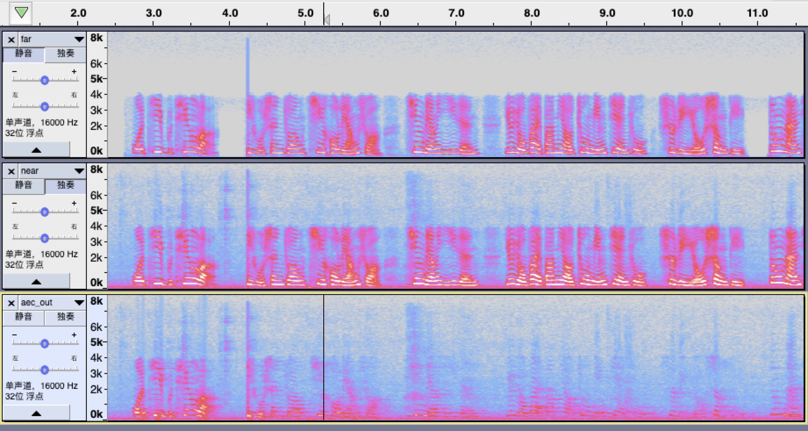

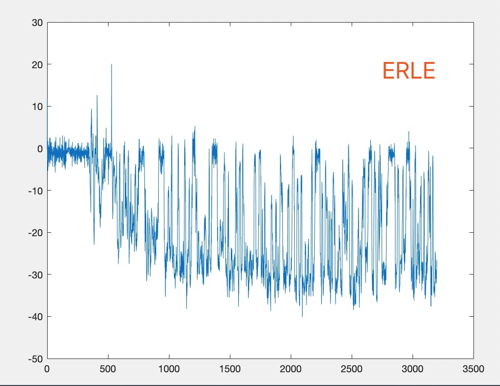


