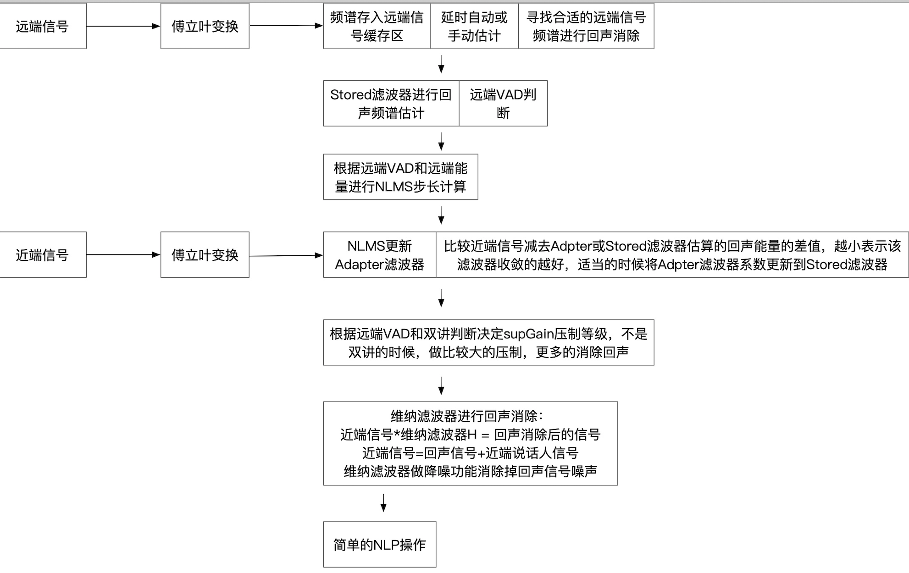
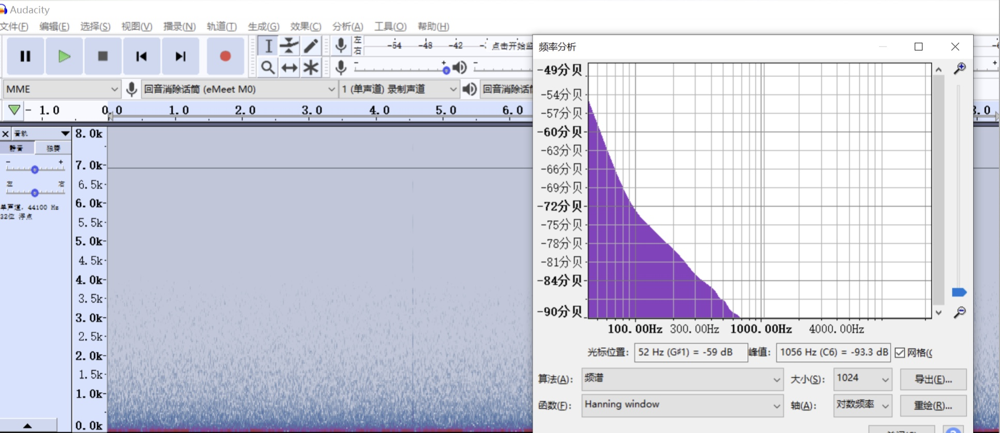
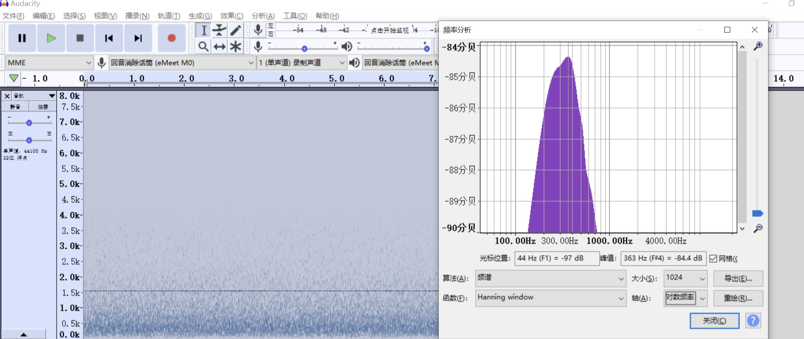
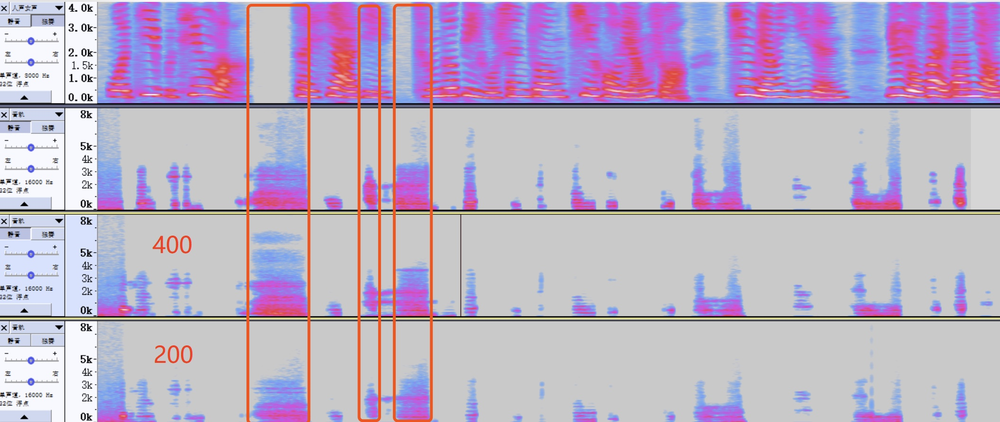
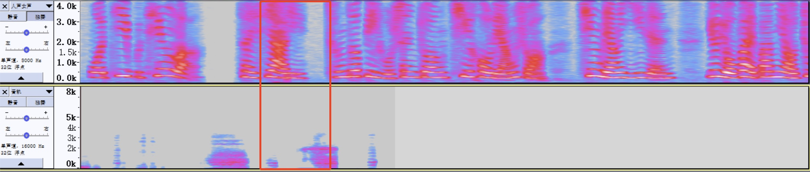

3.3 webrtc aecm代码分析与改善
======================================

AECM(Acoustic Echo Control for Mobile)是WebRTC专为Android系统设计的低运算量的回声消除模块。 \
iOS系统自带的回声消除模块一般性能优良，不需要使用应用层的；Windows由于运算量充足，一般使用AEC/AEC3模块。

AECM算法的核心是Adaptive Filter，运用的是NLMS(Normalized Least Mean Square) + Wiener Filter结合的方法。 \
NLMS主要用于估算回声能量谱，Wiener主要根据回声能量谱计算最终结果。

3.3.1 播放器缓存预处理操作
--------------------------------------

在aecm中，远端信号和近端信号的延时来自于播放器的缓冲区。\
aec接口中的msInSndCardBuf表示的就是播放缓冲区的当前缓存大小。

.. code-block:: c
    :linenos:

    int32_t WebRtcAecm_Process(void* aecmInst, const int16_t* nearendNoisy, const int16_t* nearendClean,
                            int16_t* out, size_t nrOfSamples, int16_t msInSndCardBuf)    

aecm在做真正的回声消除操作前，对播放器缓存进行大量的预处理操作。

.. code-block:: text
    :linenos:

    远端信号处理流程
    WebRtcAecm_BufferFarend
    -->  
    WebRtcAecm_DelayComp
    检查远端buffer和播放器播放缓冲buffer 当两者差距较大时，需要补充远端buffer
    -->  
    WebRtc_WriteBuffer
    将远端数据写入远端缓冲区
    
    近端信号处理流程
    WebRtcAecm_Process
    -->
    开始的60ms不进行aec操作等待播放缓冲稳定并将远端信号缓存进行对齐操作
    -->
    WebRtcAecm_ProcessFrame
    对齐远端信号和近端信号
    远端信号缓存读取80Sample的数据，近端信号80sample数据
    -->
    WebRtcAecm_ProcessBlock
    从缓冲区每次取64Sample进行真正的回声消除操作

3.3.2 aecm回声消除流程
--------------------------------------    

.. code-block:: text
    :linenos:

    WebRtcAecm_ProcessBlock

    近端信号 上一帧64字节|当前帧64字节
    远端信号 上一帧64字节|当前帧64字节

    TimeToFrequencyDomain
    近端信号傅立叶变换转换到频域65个段
    远端信号傅立叶变换转换到频域65个段
    IFFT的时候只需要65个段就能还原信号，因为FFT的结果是对称的

    WebRtcAecm_UpdateFarHistory
    保存远端信号各频段的复数模 默认设置为最多保存100个帧

    WebRtc_AddFarSpectrumFix
    保留远端信号的binary_spectrum 最多为100个

    WebRtc_DelayEstimatorProcessFix
    根据近端信号的binary_spectrum寻找远端信号最相似的binary_spectrum，计算两者的延时

    WebRtcAecm_AlignedFarend
    估计完延时后，从缓存中找到对应的远端信号能量谱

    WebRtcAecm_CalcEnergies
    根据远端能量谱计算store和adapter两组滤波器的估算的回声能量谱，并结合近端能量判断远端信号vad

    WebRtcAecm_CalcStepSize
    计算NLMS的步长，策略是远端信号能量越大，收敛的越快
    没有vad时，不更新滤波器

    WebRtcAecm_UpdateChannel
    根据远端能量谱和近端能量谱更新store和adapter的滤波器系数

    WebRtcAecm_CalcSuppressionGain
    当远端vad为0时，不做回声消除，否则进入双讲或完全回声消除
    根据farendVAD和DT结果，决定Winer滤波”置信度“(suppressGain).
    AECM会在echoEnergy前乘以一个”置信度” suppressGain，表示的是回声估计越准确，“置信度”越高。

    维纳滤波器求解
    H = Syx/Sxx = Ss(s+d)/S(s+d)(s+d) = Sss/(Sss+Sdd) = 1 – Sdd/(Sss+Sdd) = 1 – echoEnergy/nearendEnergy
    X*H=Y（近端信号x = 回声信号d+ 近端说话人信号s）* H = （近端说话人信号s）
    也就是从近端信号中分离出回声信号，只保留近端说话人信号

    NLP操作
    当某些维纳滤波器系数比较小的时候，干脆置0

    ComfortNoise
    舒适噪声

    InverseFFTAndWindow
    overlap add傅立叶逆变换    

如果只利用NLMS求解，回声是不能完全消除干净的，这里巧妙的利用了suppressGain这个概念，\
当远端能量比较大时suppressGain也会比较大，这样1 – suppressGain*echoEnergy/nearendEnergy就会趋近于0，\
这样就可以最大限度的消除完回声。



当远端VAD未检测到时，这个时候Adpter滤波器不更新，不进行双讲判断，直接将近端信号输出。

3.3.3 AECM改进
--------------------------------------

3.3.3.1 参考信号电路
```````````````````````````````````````

因为播放器缓冲大小有时候不好获取和操作系统线程调度等关系，远端信号和近端信号的delay变的不太稳定，影响回声消除的最终效果。\
所以要在硬件上设计参考信号电路，参考信号从喇叭输出前端抓取并转换成数字信号，这种方法绕过了播放器，所以延时稳定并十分的小。\

当引入参考信号电路后，播放器缓存预处理操作便可以去除掉。\
所以aecm的第一步改进就是只保留WebRtcAecm_ProcessBlock代码，直接进行回声消除计算。

3.3.3.2 Skype for business通话底噪
```````````````````````````````````````

skype for business在通话的过程中软件本身会自己产生一个类似舒适噪声的底噪，\
导致通话过程中远端VAD频繁触发进入回声消除状态，通话处于打断状态。\
所以解决这个问题的根本方法是skype for business产生的这个底噪不要触发到VAD，\
或者在supgain处仅仅做一个非常细小的压制。

**VAD**：

aecm的vad策略主要依赖如下5个参数：

.. code-block:: text
    :linenos:

    farEnergyMax    一段时间内能量的最大值 但是下降速度比较慢 上升速度快
    farEnergyMin    一段时间内能量的最小值 但是上升速度比较慢 下降速度快
    farEnergyMaxMin 一段时间内能量最大最小值差
    farEnergyVAD    VAD能量的阈值
    farLogEnergy    当前能量的转换值    

farEnergyMin和farEnergyMax根据当前能量farLogEnergy进行平滑操作，平滑的函数和速度控制因子如下：\
根据控制因子能量的最大值下降速度慢，上升速度快；能量的最小值上升速度慢，下降速度快。    

.. code-block:: c
    :linenos:

    int16_t increase_max_shifts = 4;
    int16_t decrease_max_shifts = 11; //farEnergyMax最大值下降的比较慢
    int16_t increase_min_shifts = 11; //farEnergyMin最小值上升的比较慢
    int16_t decrease_min_shifts = 3;

    aecv1->farEnergyMin = AsymFilt(aecv1->farEnergyMin, aecv1->farLogEnergy, increase_min_shifts, decrease_min_shifts);
    aecv1->farEnergyMax = AsymFilt(aecv1->farEnergyMax, aecv1->farLogEnergy, increase_max_shifts, decrease_max_shifts);

    int16_t AsymFilt(const int16_t filtOld, const int16_t inVal, const int16_t stepSizePos, const int16_t stepSizeNeg){
        int16_t retVal;

        if ((filtOld == SPL_WORD16_MAX) | (filtOld == SPL_WORD16_MIN)){
            return inVal;
        }
        retVal = filtOld;
        // 上一次值 > 当前值
        if (filtOld > inVal){
            retVal -= (filtOld - inVal) >> stepSizeNeg; //下降
        }
        else{
            retVal += (inVal - filtOld) >> stepSizePos; //上升
        }

        return retVal;
    }

使用skype for business通话刚开始时，能量值大约如下，这个时候远端能量不触发vad。

.. code-block:: text
    :linenos:

    farLogEnergy farEnergyVAD farEnergyMin  farEnergyMax
        896         1962          1058          3448    

但是当skype for business远端开始说话时，由于通话软件会产生一个能量比较大而且能量变化范围较大的底噪。

.. code-block:: text
    :linenos:

    farLogEnergy farEnergyVAD farEnergyMin  farEnergyMax
        1911         1986         1101          3371
        1980         1986         1101          3371
        2006         1986         1101          3371
        2030         1986         1101          3371    

这个时候，由于farEnergyMin的最小值上升的比较慢，VAD阈值farEnergyVAD也不怎么变化，\
导致skype for business的底噪正好处于VAD阈值附近，处于大量的VAD状态，影响到了近端拾音，这个时候拾音会出现断续。

如果将VAD的阈值放大的话，又可能出现细小回声漏音的情况。

**能量的描述**：

在3.3.3.2中，所有的能量计算都是频域能量和和Q值使用如下函数转换而来：

.. code-block:: c
    :linenos:

    LogOfEnergyInQ8(tmpFar, far_q);

    static int16_t LogOfEnergyInQ8(uint32_t energy, int q_domain) {
        //kLogLowValue 896
        static const int16_t kLogLowValue = PART_LEN_SHIFT << 7;
        int16_t log_energy_q8 = kLogLowValue;

        if (energy > 0){
            // 无符号数最大左移的位数
            int zeros = Spl_NormU32(energy);
            // |energy最大限度左移| Q8表示
            int16_t frac = ExtractFractionPart(energy, zeros);
            // log2 of |energy| in Q8.
            // q_domain越大同等情况下值越小
            // zeros越大同等情况下值越小 31 - zeros越大
            log_energy_q8 += ((31 - zeros) << 8) + frac - (q_domain << 8);
        }
        return log_energy_q8;
    }        

下面是实际的远端信号能量和转换后的能量的对应关系：

.. code-block:: text
    :linenos:

    tmpFar     far_q        tmpFar>>far_q    LogOfEnergyInQ8
    12285        11              5                1535
    20511        12              5                1472
    13214        11              6                1564
    14998        11              7                1620
    16915        11              8                1672
    12851        10              12               1809
    13198        8               51               2332
    23956        7               187              2806
    19728        5               616              3252
    28709        3               3588             3904
    32536        2               8134             4220

    tmpFar>>far_q越小 LogOfEnergyInQ8变化越快
    tmpFar>>far_q越大 LogOfEnergyInQ8变换越慢
    符合log的特性

下面是skype底噪能量和转换能量的对应关系：

.. code-block:: text
    :linenos:

    tmpFar     far_q        tmpFar>>far_q    LogOfEnergyInQ8
    10404       10               10               1733
    17961       10               17               1944
    11704       9                22               2029
    21039       9                41               2248
    24964       8                97               2566
    15156       7                118              2649
    17148       7                133              2699
    18060       7                141              2714
    20588       7                160              2753

    tmpFar>>far_q大于100的时候,远端信号在喇叭放出来的声音就很大了    

skype底噪不仅能量大而且跨度范围非常的大，下面来看下频谱：



**改进方法：高通滤波**：

从skype for business底噪频谱可以看到能量集中在低频，远端信号也就是需要播出的信号做了高通滤波后，\
skype for business底噪的影响会变的恒定。



skype for business底噪在高通滤波后的能量输出值：

.. code-block:: text
    :linenos:

    tmpFar>>far_q    LogOfEnergyInQ8
        8                  1673
        9                  1715
        10                 1715
        11                 1780

    能量在8～11之间变化,比较稳定。

改进点：skype for business底噪不触发VAD，所以会造成底噪的泄漏，所以需要将近端降噪做好。

**嘈杂办公室环境下的打断**：

远端设备是手机，将手机放在一个嘈杂的办公室环境下，将远端参考信号保存起来进行分析。 \
当没有人大声说话或者没有发出很大声音时，大部分时候不会触发远端VAD，这样近端拾音的打断感不会很强烈。\
但是远端信号很多都是杂声，感觉像是手机端降噪算法引起的。\

改进点：远端信号是否也需要做降噪或者VAD，噪声信号不放出来。

如果远端设备也是通话设备，也放在嘈杂的办公室环境下，远端信号经过agc后，信号的幅度会增大，很容易触发远端VAD。\
这样通话的打断感会变的很强烈。\

改进点：远端设备的麦克风信号需要做降噪或者VAD，让杂声不能传递过去。

3.3.3.3 回声
```````````````````````````````````````

机器放在一个空旷的比较大的屋子里。
上面是参考信号，下面是回声消除后的信号，发现消的并不是很干净。造成的原因主要有：



(1)混响
当远端信号播放出来的时候，空旷的环境会有一个1秒延时的混响声，这个时候回声消除对混响声就无能为力了。\
当远端信号非常低未触发VAD，这个时候不做AEC，混响声就能完整的拾取回来。\
当远端信号比较低但是触发了VAD，维纳滤波器的公式为：1-supGain*W*farEngery/nearEnergy。\
如果远端信号比较小的时候，即使supGain比较大（没有到极限），维纳滤波器依旧比较靠近1，所以混响声也还是会被大部分拾取回来。\
播放连续的音乐信号回声消除效果很好，可以看出混响在远端信号没有声音的时候会被拾取回来。

(2)非线性失真
声音比较大的时候，由于喇叭失真和震动等因素，导致回声路径的变化，滤波器收敛不及时导致回声出现。\
但是因为supgain的存在，这个因素的影响并不是太大。

可以做一个实验，证明回声是由于混响声导致的，对远端语音信号做了一些修改，将出现回声的那一段远端信号的中间空隙删除掉。\
可以发现以前出现回声的那段声纹现在没有了回声。



所以为了最大限度的做好回声消除直接修改维纳滤波器系数来的更直接一些。\
当维纳滤波器系数hnl越小，回声消除的力度越大，\
可以对hnl的增大做平滑，在一定时间内hnl缓慢增大，这样回声消除后的混响声可以多抑制一些，坏处就是aec回复速度变慢。

.. code-block:: c
    :linenos:

    #define NLP_HNL_LIMIT 400 //200

    if((hnl[i] - aecv1->hnl_old[i]) > NLP_HNL_LIMIT){
    hnl[i] = aecv1->hnl_old[i] + NLP_HNL_LIMIT;
    if(hnl[i] > ONE_Q14){
        hnl[i] = ONE_Q14;
    }
    }
    aecv1->hnl_old[i] = hnl[i];

    //从上图可以看出NLP_HNL_LIMIT越小AEC后的回复速度越慢，抗混响效果越好。
    //NLP_HNL_LIMIT为400的时候，回复时间计算如下：
    //64Sample在采样率为16000时，对应到时间为64/16000 = 0.004s
    //hnl最大值为16384，从0回复到16384需要经过16384/400 = 40.96Step
    //所以回复速度会变慢40.86*0.004=0.16s    

3.3.3.4 双讲
```````````````````````````````````````

双讲判断是NLMS滤波器依靠远端信号对回声信号的估算，和近端信号的能量差值来进行双讲判断。

.. code-block:: c
    :linenos:

    // Adjust for possible double talk. If we have large variations in
    // estimation error we likely have double talk (or poor channel).
    // 双讲判定
    // 可能的近端说话人信号能量 = 近段信号能量-估算的回声信号能量
    tmp16no1 = (aecv1->nearLogEnergy[0] - aecv1->echoStoredLogEnergy[0] - ENERGY_DEV_OFFSET);
    dE = SPL_ABS_W16(tmp16no1);

    // ENERGY_DEV_TOL 400
    // 当近端说话人能量比较小的时候，双讲的可能性比较小
    if (dE < ENERGY_DEV_TOL){
        // 回声消除状态
        // Likely no double talk. The better estimation, the more we can suppress
        // signal. Update counters
        // 回声消除状态也分两个分支
        // SUPGAIN_EPC_DT 200
        if (dE < SUPGAIN_EPC_DT){
            // 近端说话人能量真的很小的时候 supgain大一些 压制的多一些
            tmp32no1 = aecv1->supGainErrParamDiffAB * dE; //3072-1536 = 1536
            tmp32no1 += (SUPGAIN_EPC_DT >> 1); // +=100
            tmp16no1 = (int16_t)Spl_DivW32W16(tmp32no1, SUPGAIN_EPC_DT); // (1536 * dE + 100)/200
            supGain = aecv1->supGainErrParamA - tmp16no1; //3072-tmp16no1 tmp16no1在这里会小于1536 supGain > 1536
        }
        else{
            // 回声泄漏的多些
            tmp32no1 = aecv1->supGainErrParamDiffBD * (ENERGY_DEV_TOL - dE); //1536-256 = 1280  1280*(400-dE)
            tmp32no1 += ((ENERGY_DEV_TOL - SUPGAIN_EPC_DT) >> 1); // (1280*(400-dE) + 100)
            tmp16no1 = (int16_t)Spl_DivW32W16(tmp32no1, (ENERGY_DEV_TOL - SUPGAIN_EPC_DT)); // (1280*(400-dE) + 100)/(400-200)
            supGain = aecv1->supGainErrParamD + tmp16no1; // 256+tmp16no1 压制的比上面小些 tmp16no1最大值1280 supGain < 1536
        }
    }
    else{
        // 双讲
        // Likely in double talk. Use default value
        supGain = aecv1->supGainErrParamD; //256
    }    

所以调整双讲有两个参数可以设置：\
ENERGY_DEV_TOL 能量差值，越大越不容易触发双讲。\
双讲时候的supGain，越小双讲效果越好。\
但是supGain在这里是做了平滑的，调整这两个参数并不能将双讲做的很好。    

.. code-block:: c
    :linenos:

    //tmp16no1当前和上一次supgain的较大值
    if (supGain > aecv1->supGainOld){
        tmp16no1 = supGain;
    }
    else{
        tmp16no1 = aecv1->supGainOld;
    }
    aecv1->supGainOld = supGain;

    //平滑操作 让supgain平缓的变化
    //如果supgain会突变，那么通话的打断感会变强
    //平滑的supgain只要小于当前和上一次supgain的较大值
    //那么认为需要增加
    if (tmp16no1 < aecv1->supGain){
        aecv1->supGain += (int16_t)((tmp16no1 - aecv1->supGain) >> 4);
    }
    else{
        aecv1->supGain += (int16_t)((tmp16no1 - aecv1->supGain) >> 4);
    }    

3.3.3.5 对打
```````````````````````````````````````

对打的难度：\
混响或细小声音的来回传递引起的自激。\
agc放大细小的杂音误触发AEC。\

3.3.4 webrtc中的傅立叶变换
--------------------------------------

.. code-block:: c
    :linenos:

    aecv1->real_fft = Spl_CreateRealFFT(3);
    if (aecv1->real_fft == NULL) {
        AECV1_Free(aecv1);
        return NULL;
    }
    
    int16_t time_signal[8] = {128,129,130,131,132,133,134,135};
    ComplexInt16 freq_signal[8];
    Spl_RealForwardFFT(aecv1->real_fft, time_signal, (int16_t *)freq_signal);
    Spl_RealInverseFFT(aecv1->real_fft,freq_signal,time_signal);
    int i = 0;
    for(i = 0; i < 8; i++)
    {
        printf("%d\n",time_signal[i]);
    }
        
    //输出结果：
    //131 128 129 132 131 130 133 134
    //定点的傅立叶变换还原回来有一些损失    

3.3.4 结论
--------------------------------------    

使用aecm进行回声消除的缺陷：

* 抗混响能力差，因为只有一组滤波器组，无法对混响声做一些回声消除。
* 容易被小信号打断，连续性差，aecm中采用了一个整体的supgain进行NLP压制，为了不让回声泄漏，\
  这个值通常设计的很大，这样就导致细小的声音触发回声消除。
* 双讲效果差，因为仅仅依赖近端和远端信号的能量作为双讲的判断依据，而不是信号直接的相似度。