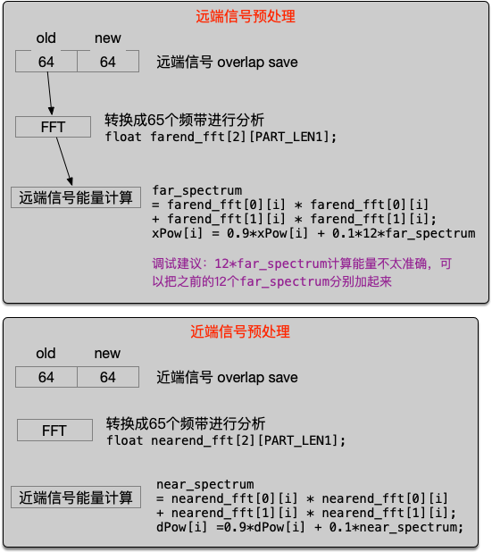
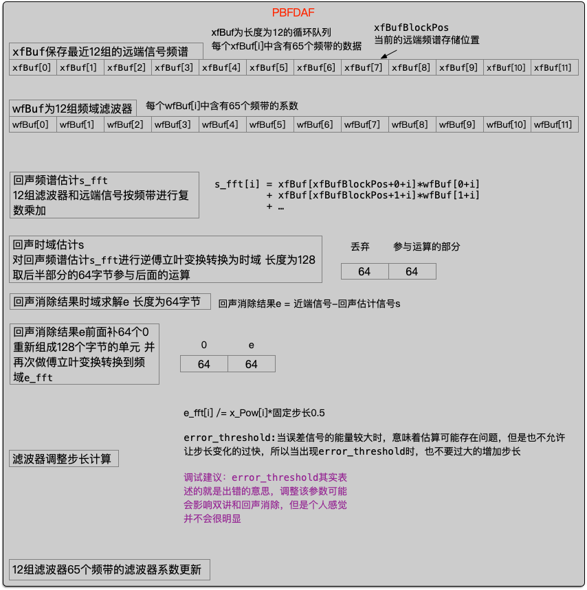
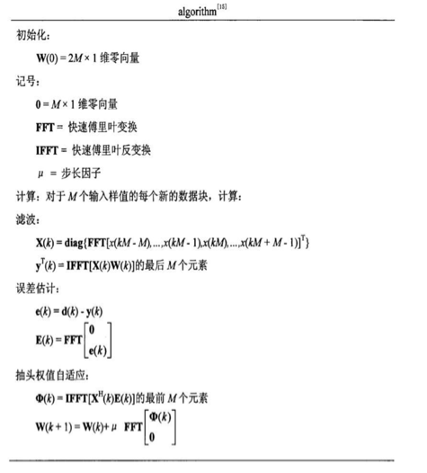
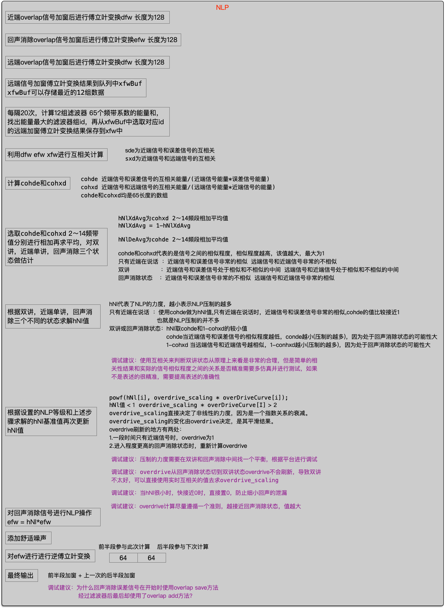

3.4 webrtc aec流程分析
======================================

3.4.1 远端信号与近端信号预处理
--------------------------------------

3.4.2 舒适噪声能量估计
--------------------------------------

3.4.3 PBFDAF
--------------------------------------

3.4.4 NLP
--------------------------------------

3.4.5 调试技巧
--------------------------------------
在实际的硬件产品中，由于结构的影响，导致参考信号和近端信号的不一致，\
或者扬声器和麦克风离的太近，导致近端信号失真，也会造成参考信号和近端信号的不一致。\
在实际的调试过程中，可以使用扫频信号播放，查看参考信号和近端信号的相似度，检查失真。\
失真越好，非线性做的越少越好，某些频段如果失真的比较厉害，这部分就需要做特殊处理，\
例如增加非线性的力度或者调整该频段的放音大小。
