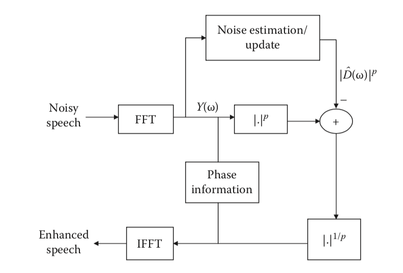

4.1 谱减法
======================================

4.1.1 基本谱减法
--------------------------------------

谱减法，就是用带噪信号的频谱减去噪声信号的频谱。\
谱减法基于一个简单的假设：假设语音中的噪声只有加性噪声，只要将带噪语音谱减去噪声谱，就可以得到纯净语音。\
这么做的前提是噪声信号是平稳的或者缓慢变化的。\
提出这个假设就是基于短时谱（25ms），就是频谱在短时间内是平稳不变的。

假设y(n)是带噪信号，由纯净语音信号x(n)和加性噪声d(n)组成。

.. math:: 
    y(n) = x(n) + d(n)

两边同时做傅立叶变换

.. math:: 
    Y(\omega) = X(\omega) + D(\omega)
    
通用的谱减法公式

.. math:: 
    |\hat{X}(\omega)|^p = |Y(\omega)|^p - |\hat{D}(\omega)|^p

其中p = 1表示幅度谱减法，p = 2表示功率谱减法。

当信号当幅度谱或功率谱相减时可能是负值，需要进行半波整流。

.. math:: 
    |\hat{X}(\omega)|^p = 
    \begin{cases}
    |Y(\omega)|^p - |\hat{D}(\omega)|^p \quad 当|Y(\omega)|^p > |\hat{D}(\omega)|^p \\
    0 \quad 其他
    \end{cases}

那噪音是怎么估计出来的呢？文献中一般都假设输入的一段语音中前n帧作为silence时间，\
也就是说这段时间没有语音输入，只有噪音，可以称之为底噪，将这5帧中的噪音强度取平均值，作为估计出来的噪音。

音乐噪声(music noise),经过半波整流后，负值重设为0，导致信号谱上出现随机的、小的、独立的峰值。\
这种音乐噪声比本来的干扰噪声带来的失真更加恼人。

.. image:: images/谱减法/谱减法的缺点.png

4.1.2 非线性谱减法(Berouti)
--------------------------------------

上个世纪的论文了Enhencement OF Speech Corrupted by Aconstic Noise。
该方法将上面的公式进行了如下修改：

.. math::
    |\hat{X}(\omega)|^2 = 
    \begin{cases}
    |Y(\omega)|^2 - \alpha|\hat{D}(\omega)|^2 \quad 当|Y(\omega)|^2 > (\alpha + \beta)|\hat{D}(\omega)|^2 \\
    \beta|\hat{D}(\omega)|^2 \quad 其他
    \end{cases}

**β 谱下限参数** (0 < β <=1)：控制残留噪声的多少以及音乐噪声的大小。\
beta太大，则可能听到残留噪声但是感觉不到音乐噪声。beta太小，则可能带来讨厌的音乐噪声，但是本来噪声就可以被极大的抑制。

.. image:: images/谱减法/谱下限参数影响.png

**α 过减因子** (α >= 1)：影响谱减过程的语音失真程度。\
alpha过大，处理后的语音信号会严重失真导致语音的可懂度受到影响。

.. image:: images/谱减法/过减因子影响.png

Berouti建议α应该随每一帧而变化。

.. math::
    \alpha = \alpha_0 - \frac{3}{20}SNR \quad -5dB \le SNR \le20dB

α₀是在0dB信号比时期望的α值，SNR为每一帧的短时信噪比估计。\
这个不是真正意义上的信噪比，因为我们无法得到纯净信号，它是基于带噪信号功率与估计的噪声功率的比率，是一种后验估计。\

Berouti等人做了大量等实验，当α₀处于3～6时，被证明具有良好的性能。\
对于高噪声级(SNR=-5dB)，β取值范围为0.02～0.06。\
对于低噪声级(SNR>=0dB)，β取值范围为0.005~0.02。

4.1.3 使用matlab实现非线性谱减法(Berouti)
----------------------------------------------------------------------------

音频文件读取

.. code-block:: matlab
    :linenos:

    [x,Srate]=audioread(filename);
    info = audioinfo(filename);
    nbits = info.BitsPerSample;

参数初始化

.. code-block:: matlab
    :linenos:

    %Overlap长度
    len=floor(20*Srate/1000);          % 8000HZ->160
    if rem(len,2)==1, len=len+1; end;
    PERC=50;                           % Overlap百分比
    len1=floor(len*PERC/100);
    len2=len-len1;                     % len 160 len1 80 len2 80

    Thres=3;     % VAD SNR阈值
    alpha=2.0;   % 功率谱谱减法
    FLOOR=0.002; % 谱下限参数
    G=0.9;       % 噪声估计平滑系数

    win=hanning(len);      % 生成汉宁窗 160点
    winGain=len2/sum(win); % normalization gain for overlap+add with 50% overlap 
                           % sum(win) 80.5 winGain 0.9938

初始化噪声估计

.. code-block:: matlab
    :linenos:

    nFFT=2*2^nextpow2(len);  % 最靠近的二次幂 nFFT 512
    noise_mean=zeros(nFFT,1); % 512*1

    % 前5组160字节后面补0做512点fft变换 再求均值 获取估算的初始化噪声幅度谱
    j=1;
    for k=1:5
    noise_mean=noise_mean+abs(fft(win.*x(j:j+len-1),nFFT)); % fft会在160个数据后自动补0
    j=j+len;
    end

    noise_mu=noise_mean/5;

数据处理前的参数初始化

.. code-block:: matlab
    :linenos:
    
    k=1;
    img=sqrt(-1);  % 0.0+1.0i
    x_old=zeros(len1,1);             % 重叠相加法 保留上一次的IFFT的后半段数据
    Nframes=floor(length(x)/len2)-1; % 每帧80个数据
    xfinal=zeros(Nframes*len2,1);    % 实际处理的数据个数

过减因子更新函数

.. code-block:: matlab
    :linenos:
    
    function a=berouti1(SNR)

    if SNR>=-5.0 & SNR<=20
    a=3-SNR*2/20;
    else
    
    if SNR<-5.0
    a=4;
    end

    if SNR>20
        a=1;
    end
    
    end

    function a=berouti(SNR)

    if SNR>=-5.0 & SNR<=20
    a=4-SNR*3/20; 
    else
    
    if SNR<-5.0
    a=5;
    end

    if SNR>20
        a=1;
    end
    
    end

处理流程

.. code-block:: matlab
    :linenos:

    for n=1:Nframes
        
        insign=win.*x(k:k+len-1);     % 160点数据加窗
        spec=fft(insign,nFFT);        % 160点个做512点fft
        sig=abs(spec);                % 512点fft求复数模
        theta=angle(spec);            % 512点fft点的相位信息

        % 信噪比计算 norm 平方和开根号 (512点复数模平方相加) 
        % 信号功率与噪声功率的比值
        SNRseg=10*log10(norm(sig,2)^2/norm(noise_mu,2)^2);

        % 根据SNR更新过减因子
        if alpha==1.0
            beta=berouti1(SNRseg);
        else
            beta=berouti(SNRseg);
        end

        % 功率谱减法
        sub_speech=sig.^alpha - beta*noise_mu.^alpha;        
        diffw = sub_speech-FLOOR*noise_mu.^alpha;

        % 判断是否过减了
        z=find(diffw <0);        % 寻找diffw数组中 <0的索引 保存在z中
        if~isempty(z)            % 确认数组是否为空
            sub_speech(z)=FLOOR*noise_mu(z).^alpha;
        end

        % 当信噪比很低时，更新噪声
        if (SNRseg < Thres)
            noise_temp = G*noise_mu.^alpha+(1-G)*sig.^alpha;          % 噪声平滑
            noise_mu=noise_temp.^(1/alpha);                           % 新的噪声幅度估计
        end
        
        % 把前半频谱镜像到后半段 因为频谱是对称的
        % flipud矩阵的上下翻转    258～512  2～256
        sub_speech(nFFT/2+2:nFFT)=flipud(sub_speech(2:nFFT/2));  % to ensure conjugate symmetry for real reconstruction

        % 欧拉公式
        % alpha在这里表示的是功率，sub_speech.^(1/alpha)表示的是信号的幅度
        x_phase=(sub_speech.^(1/alpha)).*(cos(theta)+img*(sin(theta)));
        
        % 傅立叶逆变换 转换到时域
        xi=real(ifft(x_phase));

        % 重叠相加法 输入数据后半段补0 输出结果上次结果的后半段+这次结果的上半段
        % x_old保存上一次结果的后半段
        xfinal(k:k+len2-1)=x_old+xi(1:len1);
        x_old=xi(1+len1:len);

        % 继续处理剩余的数据
        k=k+len2;
    end

    % 处理后的数据写入到文件中
    audiowrite(outfile,winGain*xfinal,Srate);

4.1.4 结果分析
--------------------------------------

.. image:: images/谱减法/谱减法输出结果时域.jpg

.. image:: images/谱减法/谱减法输出结果频域.jpg

用眼睛看，似乎效果还不错，但是实际听起来并不是太好，存在噪声没有消除干净带来的杂音。
