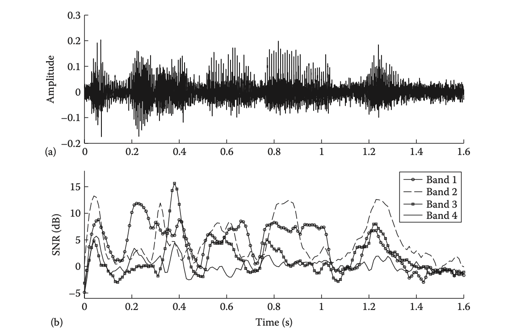
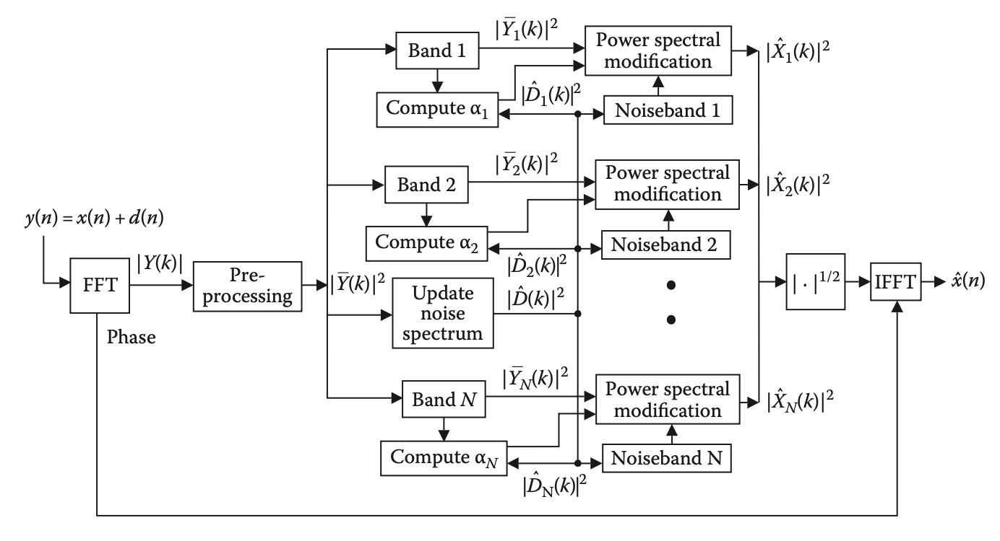
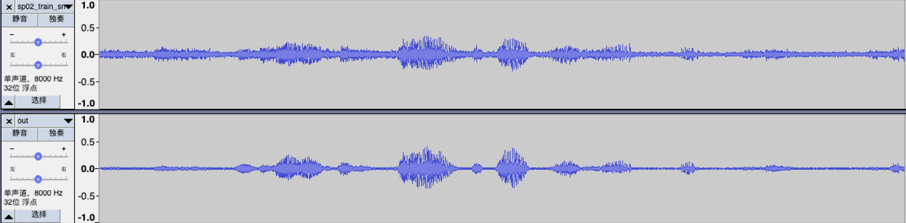
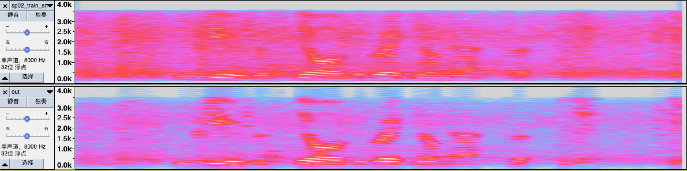

4.2 多带谱减法
======================================

4.2.1 基础原理
--------------------------------------

通常情况下，噪声不会对语音的整个频域都具有同等的影响。 \
多带与非线性谱减法的主要区别在于过减因子的估计。 \
多带算法针对频带估计过减因子，而非线性谱减法是针对每一个频点。 \
非线性谱减法的缺点是每个频点上的信噪比可能帧与帧之间有很大的变化，这种剧烈的变化是谱减法语音失真(音乐噪声)的原因之一。 \
但是子带信噪比的变化则不会特别剧烈，如下图所示。 \
所以利用多带谱减法可以减小语音失真。

**多带谱减法流程图**：

**预处理**：减少谱估计的波动，进而减少残留噪声。\
当前帧该频点的幅度需要和前几帧/后几帧该频点的幅度进行平滑求和计算。

.. math::
    \begin{align} 
    & |\overline{Y_j}(\omega_k)| = \sum_{i=-M}^{M} W_i|Y_{j-i}(\omega_k)| \\
    & \scriptsize |\overline{Y_j}(\omega_k)| 经过预处理后第j帧带噪信号幅度谱; \\
    & \scriptsize |Y_{j-i}(\omega_k)| 带噪信号幅度谱; \\
    & \scriptsize W_i (0 < W < 1)分配给每一帧的权重，M的限制为2，推荐值[0.09,0.25,0.32,0.25,0.09]; \\
    \end{align}

**子带谱减**：
整个语音频带按照线性/对数/梅尔进行子带划分，对每个子带分别进行谱减法。

.. math::
    \begin{align} 
    & |\hat{X_i}(\omega_k)|^2 = |\overline{Y_i}(\omega_k)|^2 - \alpha_i \cdot \delta_i \cdot |\hat{D_i}(\omega_k)|^2  \quad b_i \leq w_k \leq e_i \\
    & \scriptsize |\hat{X_i}(\omega_k)|^2 估计的噪声功率谱; \\
    & \scriptsize b_i和e_i是子带的起始频带和结束频带; \\
    & \scriptsize \alpha_i是第i个子带的过减因子，\delta_i为子带减法因子; \\
    \end{align}    

子带过减因子计算公式：

.. math::
    \alpha_i=\left\{
    \begin{aligned}
    & 4.75 && SNR_i < -5  \\
    & 4-\frac{3}{20}(SNR_i) && -5 \leq SNR_i \leq 20   \\
    & 1 && SNR_i > 20 \\
    \end{aligned}
    \right.

子带信噪比的计算公式：

.. math::
    SNR_i(dB) = 10 log_{10}(\frac{\sum_{\omega_k=b_i}^{e_i}|\overline{Y_i}(\omega_k)|^2}{\sum_{\omega_k=b_i}^{e_i}|\hat{D_i}(\omega_k)|^2})

使用过减因子可以控制每个子带的降噪程度，结合子带减法因子可以提供更大的灵活性。\
语音段在低频比较丰富，所以低频的减法因子会小一些。
子带减法因子计算公式：

.. math::
    \delta_i=\left\{
    \begin{aligned}
    & 1   && f_i \leq  1 kHz  \\
    & 2.5 &&  1kHz < f_i \leq \frac{F_s}{2}-2 kHz \\
    & 1.5 && f_i > \frac{F_s}{2}-2 kHz  \\
    \end{aligned}
    \right.

**功率谱调整**：
      
.. math::
    |\hat{X_i}(\omega_k)|^2=\left\{
    \begin{aligned}
    & |\hat{X_i}(\omega_k)|^2    && |\hat{X_i}(\omega_k)|^2 > \beta |\overline{Y_i}(\omega_k)|^2 \\
    & \beta |\overline{Y_i}(\omega_k)|^2 && other \\
    \end{aligned}
    \right.    

β这里设置为0.002，为了进一步掩盖剩下的音乐噪声，少量的带噪信号会被重新引入增强后的信号谱。重新增强后的频谱如下：

.. math::
    |\tilde{X_i}(\omega_k)|^2 = |\hat{X_i}(\omega_k)|^2 + 0.05 |\overline{Y_i}(\omega_k)|^2 \\

4.2.2 使用matlab实现多带谱减法
--------------------------------------

音频文件读取并获取overlap和fft的参数

.. code-block:: matlab
    :linenos:

    AVRGING=1; FRMSZ=20; OVLP=50; Noisefr=6; FLOOR=0.002; VAD=1;

    [in,fs]=audioread(infile);

    frmelen=floor(FRMSZ*fs/1000);           % Frame size in samples 160
    ovlplen=floor(frmelen*OVLP/100);        % Number of overlap samples 80
    cmmnlen = frmelen-ovlplen;              % Number of common samples between adjacent frames 80
    fftl = 2;
    while fftl<frmelen
        fftl=fftl*2;
    end
    % fftl 256

频带划分的方式，这里暂先用线性的方式按6个频带进行划分进行分析

.. code-block:: matlab
    :linenos:

    switch Freq_spacing
    case {'linear','LINEAR'}
        bandsz(1) = floor(fftl/(2*Nband));  % 256个频带 分多少份 2表示频带对称
        for i=1:Nband
            lobin(i)=(i-1)*bandsz(1)+1;     %  1 22 43 64  85 106
            hibin(i)=lobin(i)+bandsz(1)-1;  % 21 42 63 84 105 126
            bandsz(i)=bandsz(1);            % 21 21 21 21  21  21
        end
    case {'log','LOG'}
        [lof,midf,hif]=estfilt1(Nband,fs);
        lobin = round(lof*fftl/fs)+1;
        hibin = round(hif*fftl/fs)+1;
        bandsz = hibin-lobin+1;
    case {'mel','MEL'}
        [lof,midf,hif]=mel(Nband,0,fs/2);
        lobin = round(lof*fftl/fs)+1;
        hibin = round(hif*fftl/fs)+1;
        lobin(1)=1;
        hibin(end)=fftl/2+1;
        bandsz = hibin-lobin+1;
    otherwise
        fprintf('Error in selecting frequency spacing, type "help mbss" for help.\n');
        return;
    end

利用前6帧进行初始噪声估计

.. code-block:: matlab
    :linenos:

    img=sqrt(-1); % 复数i的表示
    % Calculate Hamming window
    win=sqrt(hamming(frmelen)); % 160 窗函数

    % Estimate noise magnitude for first 'Noisefr' frames
    % Estimated noise spectrum is stored in noise_spect
    noise_pow=zeros(fftl,1); % 256
    j=1;
    for k=1:Noisefr % 前6帧 用于噪声频谱估算
        n_fft = fft(in(j:j+frmelen-1).* win, fftl); % 160个数据256点fft
        n_mag = abs(n_fft); % 幅度
        n_ph = angle(n_fft);% 相位
        n_magsq = n_mag.^2; % 功率
        noise_pow = noise_pow + n_magsq; % 功率叠加
        j = j + frmelen;
    end
    n_spect = sqrt(noise_pow/Noisefr); % 功率平均再开方 256*1

输入数据进行overlap save操作并进行加窗

.. code-block:: matlab
    :linenos:

    % input to noise reduction part
    x = in;

    % Framing the signal with Window = 20ms and overlap = 10ms, 
    % the output is a matrix with each column representing a frame
    framed_x = frame(x,win,ovlplen,0,0); % overlap save并加窗 160*351
    [tmp, nframes] = size(framed_x); % tmp:160 nframes:351

输入数据进行256点fft变换

.. code-block:: matlab
    :linenos:

    %====Start Processing====
    x_win = framed_x;

    x_fft = fft(x_win,fftl); % 所有的数据256点fft 256*351
    x_mag = abs(x_fft);
    x_ph = angle(x_fft);

输入频谱预处理

.. code-block:: matlab
    :linenos:

    if AVRGING
        % 输入频谱各频点间进行平滑
        filtb = [0.9 0.1];
        x_magsm(:,1) = filter(filtb, 1, x_mag(:,1)); % 第一列 也就是时间序列的1 所有频谱进行0.9x(n)+0.1x(n-1)计算
        for i=2:nframes % 对其他时间序列做操作
            x_tmp1 = [x_mag(frmelen-ovlplen,i-1); x_mag(:,i)]; % x_mag(80,i-1) 该时间段第80个频段的值得 和 其他频段的256个值组成257长度的数据
            x_tmp2 = filter(filtb, 1, x_tmp1); % 当前时间序列的其他频段做0.9x(n)+0.1x(n-1)计算
            x_magsm(:,i) = x_tmp2(2:end); % 去掉第一个
        end
            
        % weighted spectral estimate
        Wn2=0.09; Wn1=0.25; W0=0.32; W1=0.25; W2=0.09;
        % 前两个时间序列频谱预处理
        x_magsm(:,1) = (W0*x_magsm(:,1)+W1*x_magsm(:,2)+W2*x_magsm(:,3));
        x_magsm(:,2) = (Wn1*x_magsm(:,1)+W0*x_magsm(:,2)+W1*x_magsm(:,3)+W2*x_magsm(:,4));
        for i=3:nframes-2
            x_magsm(:,i) = (Wn2*x_magsm(:,i-2)+Wn1*x_magsm(:,i-1)+W0*x_magsm(:,i)+W1*x_magsm(:,i+1)+W2*x_magsm(:,i+2));
        end
        % 最后两帧频谱预处理
        x_magsm(:,nframes-1) = (Wn2*x_magsm(:,nframes-1-2)+Wn1*x_magsm(:,nframes-1-1)+W0*x_magsm(:,nframes-1)+W1*x_magsm(:,nframes));
        x_magsm(:,nframes) = (Wn2*x_magsm(:,nframes-2)+Wn1*x_magsm(:,nframes-1)+W0*x_magsm(:,nframes));
    else
        x_magsm = x_mag;
    end

估计噪声更新

.. code-block:: matlab
    :linenos:

    %NOISE UPDATE DURING SILENCE FRAMES
    if VAD
        [n_spect,state]=noiseupdt(x_magsm,n_spect,cmmnlen,nframes); % 噪声更新 n_spect 256*351
    else
        for i=2:nframes
            n_spect(:,i)=n_spect(:,1);
        end
    end

    function [n_spect,state]=noiseupdt(x_magsm,n_spect,cmmnlen,nframes)
    SPEECH=1;
    SILENCE=0;
    i=1; % 时间序列1
    x_var= x_magsm(:,i).^ 2; % 当前时间序列的各频点功率 256*1
    n_var= n_spect(:,i).^ 2; % 估计噪声各频点功率 256*1
    rti= x_var./n_var - log10(x_var./n_var)-1; %  噪声更新判断条件 256*1
    judgevalue= mean(rti,1); % 求均值
    judgevalue1((i-1)*cmmnlen+1 : i*cmmnlen)= judgevalue;
    if (judgevalue> 0.4)
        state((i-1)*cmmnlen+1 : i*cmmnlen)= SPEECH;
    else
        state((i-1)*cmmnlen+1 : i*cmmnlen)= SILENCE;
        n_spect(:,i)= sqrt(0.9*n_spect(:,i).^2 + (1-0.9)*x_magsm(:,i).^ 2); % 利用当前声音更新噪声
    end
    % 其他时间序列
    for i=2:nframes;
        x_var= x_magsm(:,i).^ 2;    % 当前时间序列的各频点功率 256*1
        n_var= n_spect(:,i-1).^ 2;  % 估计噪声各频点功率 256*1
        rti= x_var./n_var - log10(x_var./n_var)-1; %  噪声更新判断条件 256*1
        judgevalue= mean(rti,1);
        judgevalue1((i-1)*cmmnlen+1 : i*cmmnlen)= judgevalue;
        if (judgevalue> 0.45)
            state((i-1)*cmmnlen+1 : i*cmmnlen)= SPEECH;
            n_spect(:,i)=n_spect(:,i-1);
        else
            state((i-1)*cmmnlen+1 : i*cmmnlen)= SILENCE;
            n_spect(:,i)= sqrt(0.9*n_spect(:,i-1).^2 + (1-0.9)*x_magsm(:,i).^ 2);
        end
    end    

子带信噪比计算

.. code-block:: matlab
    :linenos:

    % Calculte the segmental SNR in each band -------------
    %  1 22 43 64  85 106
    % 21 42 63 84 105 126
    start = lobin(1); % 1
    stop = hibin(1);  % 21
    k=0;
    for i=1:Nband-1
        for j=1:nframes
            SNR_x(i,j) = 10*log10(norm(x_magsm(start:stop,j),2)^2/norm(n_spect(start:stop,j),2)^2);
        end
        start = lobin(i+1);
        stop = hibin(i+1);
        k=k+1;
    end

    % 这里的start为106 fftl/2+1为129
    for j=1:nframes
        SNR_x(k+1,j) = 10*log10(norm(x_magsm(start:fftl/2+1,j),2)^2/norm(n_spect(start:fftl/2+1,j),2)^2);
    end

    % SNR_x 6*351 每个时间段对应6个子带的SNR

子带过减因子计算

.. code-block:: matlab
    :linenos:

    beta_x = berouti(SNR_x); % 6*351

    function a=berouti(SNR)
    [nbands,nframes]=size(SNR);
    for i=1:nbands
        for j=1:nframes
            if SNR(i,j)>=-5.0 & SNR(i,j)<=20
                a(i,j)=4-SNR(i,j)*3/20; 
            elseif SNR(i,j)<-5.0
                a(i,j)=4.75;
            else
                a(i,j)=1;
            end  
        end
    end

子带谱减计算

.. code-block:: matlab
    :linenos:

    sub_speech_x = zeros(fftl/2+1,nframes); % 129*351
    k=0;
    for i=1:Nband-1   % channels 1 to Nband-1
        sub_speech=zeros(bandsz(i),1); % bandsz(i) 每个子带拥有的频带数量 这里是21(21*1)
        start = lobin(i);
        stop = hibin(i);
        switch i
        case 1,
            for j=1:nframes
                n_spec_sq = n_spect(start:stop,j).^2; % 21*1
                sub_speech(:,j) = x_magsm(start:stop,j).^2 - beta_x(i,j)*n_spec_sq; % 信号谱-噪声谱
            end
        otherwise
            for j=1:nframes
                n_spec_sq = n_spect(start:stop,j).^2;
                sub_speech(:,j) = x_magsm(start:stop,j).^2 - beta_x(i,j)*n_spec_sq*2.5; %信号谱-噪声谱
            end
            k=k+1;
        end
        z=find(sub_speech <0);  % 寻找谱减后为0的
        x_tmp = x_magsm(start:stop,:); % 21*351
        if~isempty(z)
            sub_speech(z) = FLOOR*x_tmp(z).^2; % 21*351
        end
        sub_speech = sub_speech+0.05*x_magsm(start:stop,:).^2; % 重新增强的功率谱
        sub_speech_x(lobin(i):hibin(i),:) = sub_speech_x(lobin(i):hibin(i),:)+ sub_speech; %保存处理好的频谱
        
    end

    % ----- now process last band ---------------------------
    %
    start = lobin(Nband);
    stop = fftl/2+1;
    clear FLOOR_n_matrix;
    clear sub_speech;
    for j=1:nframes
        n_spec_sq = n_spect(start:stop,j).^2;
        sub_speech(:,j) = x_magsm(start:stop,j).^2 - beta_x(Nband,j)*n_spec_sq*1.5;
    end

    z=find(sub_speech <0);
    x_tmp = x_magsm(start:stop,:);
    if~isempty(z)
        sub_speech(z) = FLOOR*x_tmp(z).^2;
    end

    sub_speech = sub_speech+0.01*x_magsm(start:stop,:).^2;
    sub_speech_x(start:stop,:) = sub_speech_x(start:stop,:)+ sub_speech;

信号从频域还原到时域

.. code-block:: matlab
    :linenos:

    % Reconstruct whole spectrum
    sub_speech_x(fftl/2+2:fftl,:)=flipud(sub_speech_x(2:fftl/2,:));

    % multiply the whole frame fft with the phase information
    y1_fft = sub_speech_x.^(1/2).*(cos(x_ph) + img*sin(x_ph));

    % to ensure a real signal 0和129的虚部为0
    y1_fft(1,:) = real(y1_fft(1,:));
    y1_fft(fftl/2+1,:) = real(y1_fft(fftl/2+1,:));

    % take the IFFT 
    y1_ifft = ifft(y1_fft);
    y1_r = real(y1_ifft);  % 256*351

    % overlap and add
    y1(1:frmelen)=y1_r(1:frmelen,1);  % 第一帧前160个数据直接保存 y1
    start=frmelen-ovlplen+1; % 81
    mid=start+ovlplen-1;     % 160
    stop=start+frmelen-1;    % 240
    for i=2:nframes % 从第二帧开始需要做overlap add 上一次后80个数据 + 当前的前80个数据
        y1(start:mid) = y1(start:mid)+y1_r(1:ovlplen,i)';   % y1(81:160)  = y1(81:160) + y1_r(1:80,i) 
        y1(mid+1:stop) = y1_r(ovlplen+1:frmelen,i);         % y1(161:240) = y1_r(81:160,i)
        start = mid+1;                                      % start = 161 241 321 ...
        mid=start+ovlplen-1;                                % mid =   240 320 400 ...
        stop=start+frmelen-1;                               % stop =  320 400 480 ...
    end
    out=y1;

    audiowrite(outfile,out(1:length(x)),fs);

4.2.3 结果分析
--------------------------------------

多带谱减法相比谱减法表现的更加稳定，虽然噪声看起来压制的没有那么多。